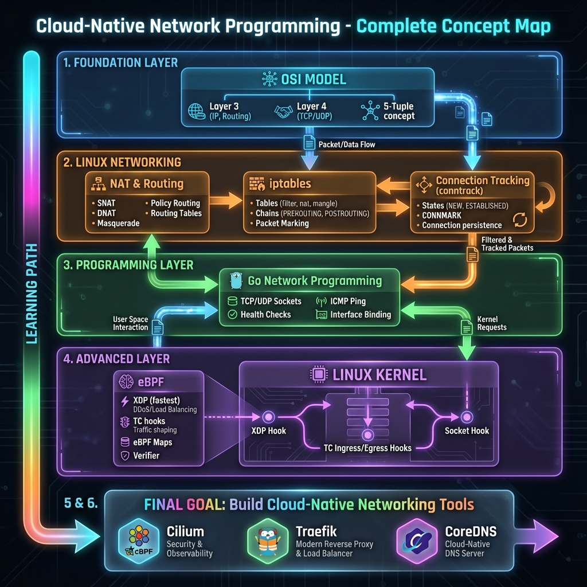

# Cloud-Native Network Programming

A comprehensive learning path for mastering cloud-native networking with **eBPF, XDP, and Kubernetes networking**.

## 📊 Concept Overview

## 🎯 Goal

Build production-ready cloud networking tools like **Cilium**, **Traefik**, or **CoreDNS**.

## 📚 Primary Resource

> **"Learning eBPF" by Liz Rice** → `Learning eBPF New Version.pdf`

## 📖 Learning Modules

### Core Networking (Modules 0-7)

| # | Module | Description |
|---|--------|-------------|
| 0 | [Roadmap Validation](./teaching/00-roadmap-validation.md) | Assessment & learning path |
| 1 | [OSI Model Deep Dive](./teaching/01-osi-model-deep-dive.md) | Layers 3-4, TCP/UDP, 5-tuple |
| 2 | [NAT & Routing](./teaching/02-nat-and-routing.md) | SNAT, DNAT, policy routing |
| 3 | [Connection Tracking](./teaching/03-connection-tracking.md) | conntrack, CONNMARK |
| 4 | [iptables Mastery](./teaching/04-iptables-mastery.md) | Tables, chains, packet marking |
| 5 | [Go Networking](./teaching/05-go-networking.md) | TCP/UDP, ICMP, health checks |
| 6 | [eBPF Fundamentals](./teaching/06-ebpf-fundamentals.md) | XDP, TC, maps, verifier |
| 7 | [Quick Reference](./teaching/07-quick-reference.md) | Commands & code snippets |

### Advanced eBPF (Modules 8-14)

| # | Module | Description |
|---|--------|-------------|
| 8 | [eBPF VM Deep Dive](./teaching/08-ebpf-vm-deep-dive.md) | Registers, instructions, JIT, verifier |
| 9 | [eBPF Maps Mastery](./teaching/09-ebpf-maps-mastery.md) | All map types, ring buffer, rate limiter |
| 10 | [CO-RE & BTF](./teaching/10-core-btf-portability.md) | Portable programs, vmlinux.h, BPF_CORE_READ |
| 11 | [eBPF Networking Guide](./teaching/11-ebpf-networking-guide.md) | Complete packet flow, XDP vs TC, load balancer |
| 12 | [eBPF Security](./teaching/12-ebpf-security.md) | LSM BPF, seccomp, observability, Tetragon |
| 13 | [Socket Programming](./teaching/13-socket-programming.md) | Socket filters, sockops, sk_msg, SOCKMAP, cgroup BPF |
| 14 | [Go Development](./teaching/14-go-development.md) | cilium/ebpf, bpf2go, debugging, testing, IDE setup |

### Kubernetes & Production Networking (Modules 15-20) 🆕

| # | Module | Description |
|---|--------|-------------|
| 15 | [Network Namespaces & Virtual Devices](./teaching/15-network-namespaces-and-virtual-devices.md) | netns, veth, bridges, VXLAN — **the lab the eBPF modules run in** |
| 16 | [Kubernetes Networking](./teaching/16-kubernetes-networking.md) | Pod network model, ClusterIP, kube-proxy (iptables/IPVS/nftables/eBPF), CoreDNS |
| 17 | [CNI Plugin Development](./teaching/17-cni-plugin-development.md) | CNI spec, veth plumbing in Go, IPAM, MTU, eBPF datapath, kind |
| 18 | [Network Policy Enforcement](./teaching/18-network-policy-enforcement.md) | NetworkPolicy semantics, security identity, policy maps, TC + cgroup hooks |
| 19 | [Control Plane Agent Patterns](./teaching/19-control-plane-agent-patterns.md) | client-go informers, reconciliation, map lifecycle, DaemonSet packaging |
| 20 | [Production Load Balancer Datapath](./teaching/20-production-load-balancer-datapath.md) | Maglev hashing, DSR/IPIP/GUE, health checking, conntrack at scale, AF_XDP |

## 💻 Hands-On Exercises

Runnable Go programs that accompany Module 5 — see [exercises/README.md](./exercises/README.md). `exercises/` is its own Go module, so run them from that directory.

| # | Exercise | Run |
|---|----------|-----|
| 01 | [TCP Echo Server](./exercises/01-tcp-echo) | `cd exercises && go run ./01-tcp-echo` |
| 02 | [UDP Server](./exercises/02-udp-server) | `cd exercises && go run ./02-udp-server` |
| 03 | [Port Scanner](./exercises/03-port-scanner) | `cd exercises && go run ./03-port-scanner -host localhost` |
| 04 | [ICMP Ping](./exercises/04-icmp-ping) | `cd exercises && sudo go run ./04-icmp-ping -host 8.8.8.8` |
| 05 | [Health Checker](./exercises/05-health-checker) | `cd exercises && go run ./05-health-checker -config 05-health-checker/endpoints.json` |

## 🗺️ Complete Roadmap

See [network-roadmap.md](./network-roadmap.md) for the full 6-8 month learning roadmap.

## 🚀 Quick Start

Modules are numbered by topic, not strictly by reading order — **read Module 15 before Module 6**, even though it is numbered later:

1. Start with **Module 0** to assess your current knowledge
2. Work through modules **1-4** for Linux networking fundamentals
3. Do **Module 5** plus the [hands-on Go exercises](./exercises/)
4. **Read [Module 15 (Network Namespaces & Virtual Devices)](./teaching/15-network-namespaces-and-virtual-devices.md) now, out of numeric order.** It is a *prerequisite* for the eBPF labs, not a follow-up: namespaces, veth pairs and bridges are the throwaway lab you attach XDP and TC programs to, and a pod is just a network namespace. Modules 6 and 11 stay theoretical without it.
5. Read the **Learning eBPF** book alongside **Module 6**, running the examples in the Module 15 lab
6. Continue with **Modules 8-14** for advanced eBPF (VM, maps, CO-RE, networking, security, sockets, Go tooling)
7. Move to **Modules 16-18** for Kubernetes networking, CNI plugins and network policy
8. Finish with **Modules 19-20** — the control-plane agent and the production load balancer datapath you build with it
9. Keep **Module 7 (Quick Reference)** open while practicing

## 💼 Career Outcomes

- Cloud Network Engineer
- eBPF Engineer ($150K-$300K+)
- Kubernetes Networking Specialist
- Open Source Contributor (Cilium, Calico, Falco)

---

*Happy learning! 🎓*
