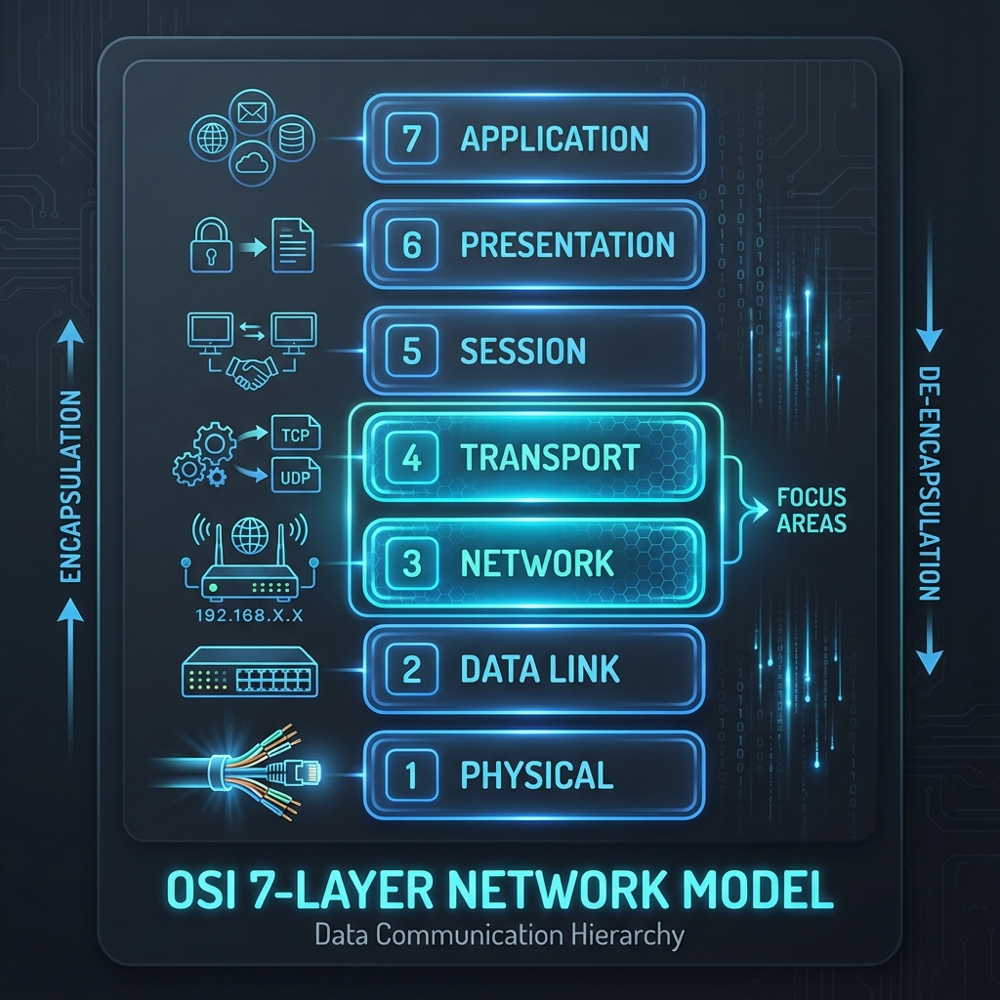
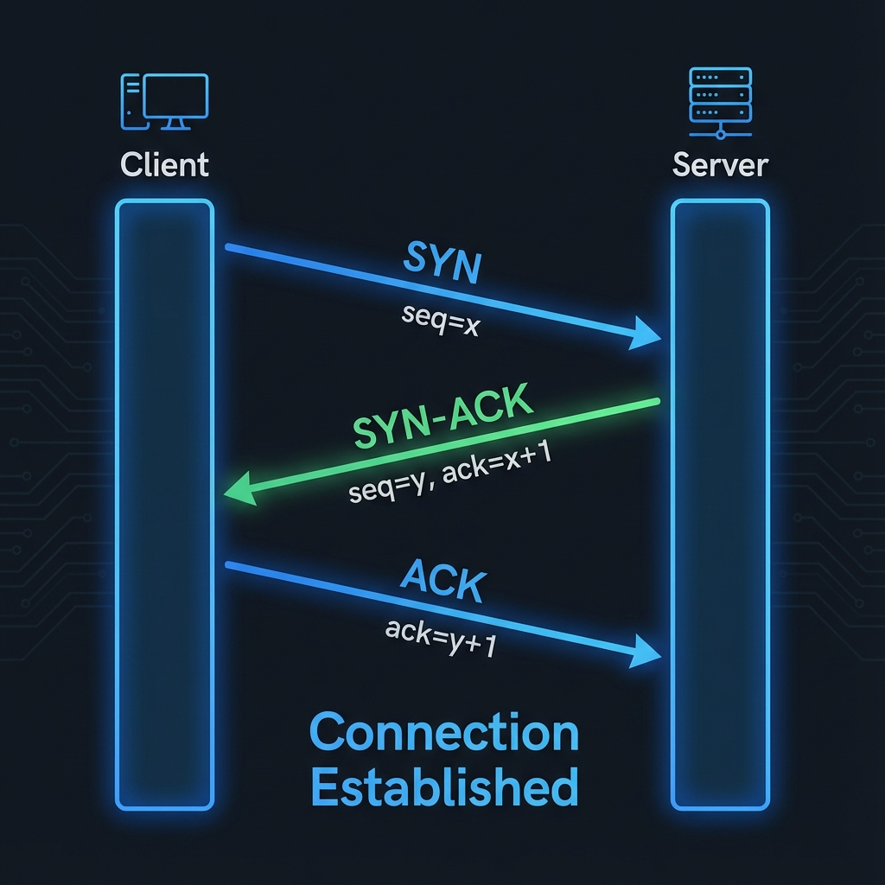
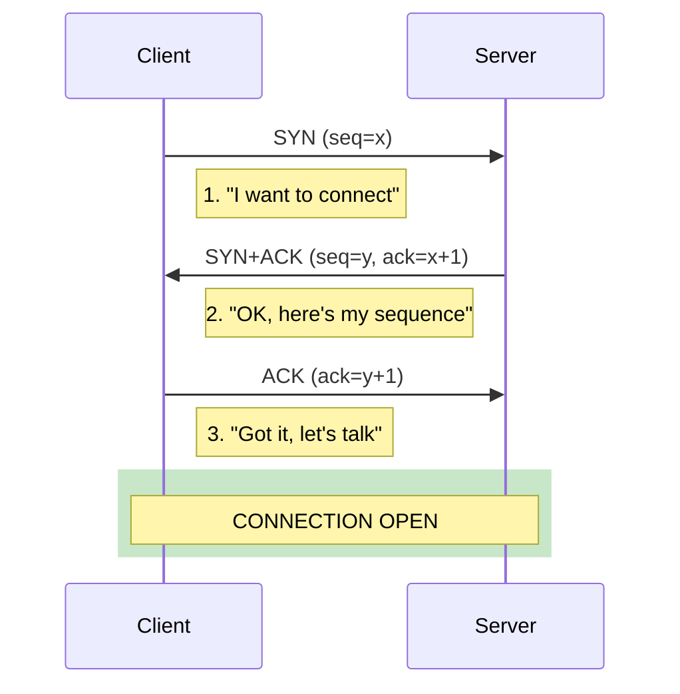
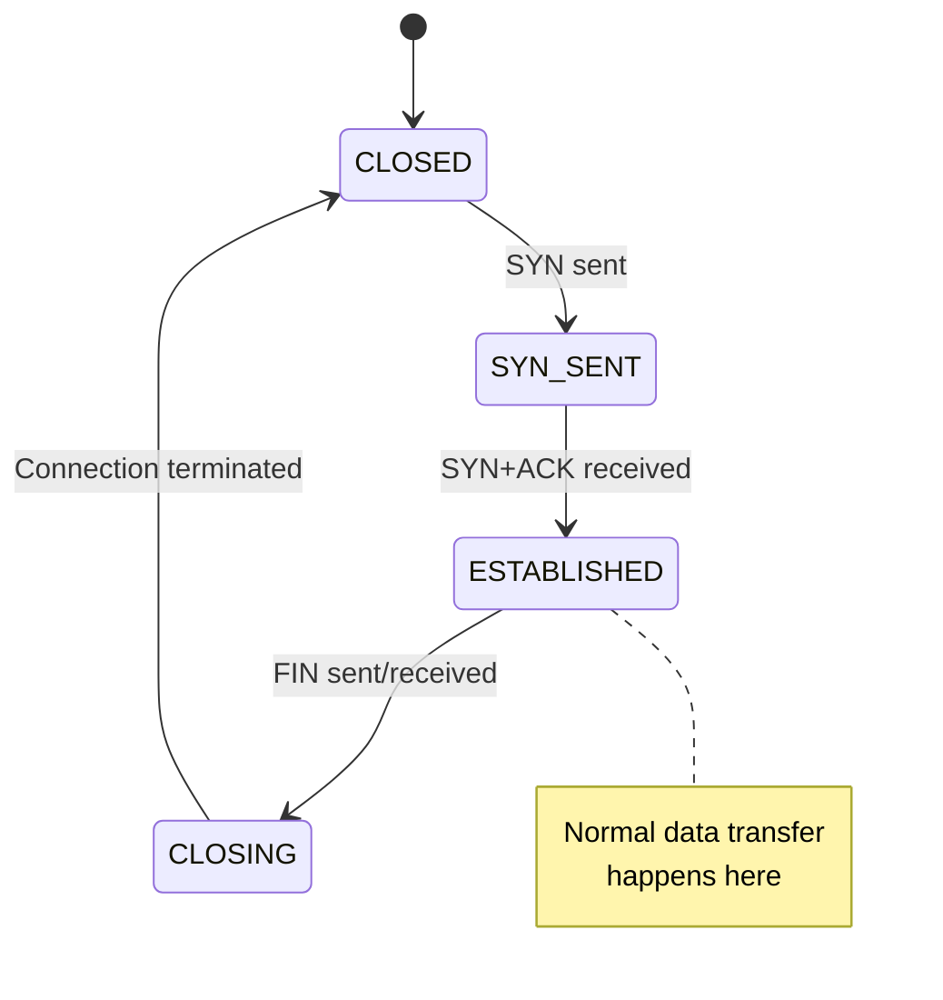
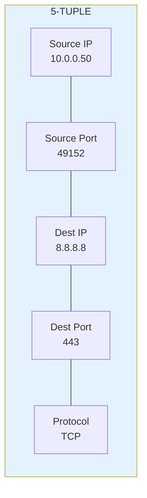

# Module 1: OSI Model Deep Dive (Layers 3-4 Focus)

## Why This Matters for Your Load Balancer

Your multi-WAN load balancer operates primarily at:
- **Layer 3 (Network)**: IP routing decisions
- **Layer 4 (Transport)**: TCP/UDP connection tracking

Understanding these layers is **essential** for packet manipulation.

## 📊 Visual Learning





---

## The OSI Model Quick Reference

```
Layer 7: Application   → HTTP, DNS, FTP
Layer 6: Presentation  → SSL/TLS, encryption
Layer 5: Session       → Session management
Layer 4: Transport     → TCP, UDP ⭐ YOU ARE HERE
Layer 3: Network       → IP, ICMP, routing ⭐ YOU ARE HERE
Layer 2: Data Link     → MAC addresses, switches
Layer 1: Physical      → Cables, signals
```

---

## Layer 3: Network Layer - IP Addressing & Routing

### Your Foundation (What You Know)
You already understand:
- IPv4 = 32 bits = 4 octets
- Binary ↔ Decimal conversion
- Subnet masks divide network/host portions
- CIDR notation (/24, /25, /26)

### What You Need to Add

#### 1. IP Header Structure (20 bytes minimum)

```
 0                   1                   2                   3
 0 1 2 3 4 5 6 7 8 9 0 1 2 3 4 5 6 7 8 9 0 1 2 3 4 5 6 7 8 9 0 1
+-+-+-+-+-+-+-+-+-+-+-+-+-+-+-+-+-+-+-+-+-+-+-+-+-+-+-+-+-+-+-+-+
|Version|  IHL  |    DSCP   |ECN|         Total Length          |
+-+-+-+-+-+-+-+-+-+-+-+-+-+-+-+-+-+-+-+-+-+-+-+-+-+-+-+-+-+-+-+-+
|         Identification        |Flags|     Fragment Offset     |
+-+-+-+-+-+-+-+-+-+-+-+-+-+-+-+-+-+-+-+-+-+-+-+-+-+-+-+-+-+-+-+-+
|  Time to Live |    Protocol   |        Header Checksum        |
+-+-+-+-+-+-+-+-+-+-+-+-+-+-+-+-+-+-+-+-+-+-+-+-+-+-+-+-+-+-+-+-+
|                         Source IP Address                     |
+-+-+-+-+-+-+-+-+-+-+-+-+-+-+-+-+-+-+-+-+-+-+-+-+-+-+-+-+-+-+-+-+
|                      Destination IP Address                   |
+-+-+-+-+-+-+-+-+-+-+-+-+-+-+-+-+-+-+-+-+-+-+-+-+-+-+-+-+-+-+-+-+
```

**Key fields for your load balancer:**
- **Source IP**: Where packet came from (your LAN device)
- **Destination IP**: Where packet is going (internet server)
- **TTL**: Decremented at each hop (prevents infinite loops)
- **Protocol**: 6=TCP, 17=UDP, 1=ICMP

#### 2. How Routing Decisions Work

```
Packet arrives → Check destination IP → Consult routing table → Forward to next hop
```

**Routing table example:**
```bash
$ ip route show
default via 192.168.1.1 dev eth0        # Default gateway
192.168.1.0/24 dev eth0 scope link      # Local network
10.0.0.0/24 dev eth1 scope link         # Another network
```

**Longest prefix match rule:**
```
Destination: 10.0.0.50
Routes available:
  10.0.0.0/24  → WINS (24 bits match)
  10.0.0.0/16  → less specific
  default      → fallback
```

#### 3. Private IP Ranges (RFC 1918)

| Range | CIDR | Purpose |
|-------|------|---------|
| 10.0.0.0 - 10.255.255.255 | 10.0.0.0/8 | Large private networks |
| 172.16.0.0 - 172.31.255.255 | 172.16.0.0/12 | Medium networks |
| 192.168.0.0 - 192.168.255.255 | 192.168.0.0/16 | Home/small office |

---

## Layer 4: Transport Layer - TCP & UDP

### TCP: Transmission Control Protocol

#### The 3-Way Handshake (Connection Establishment)



**Why this matters for your load balancer:**
Once SYN is sent through ISP1, ALL packets in that connection MUST use ISP1. 
Switching ISPs mid-connection breaks the TCP state!

#### TCP State Machine



**Connection tracking states:**
- `NEW`: First packet of connection (SYN)
- `ESTABLISHED`: Bidirectional traffic seen
- `RELATED`: Related to existing connection (ICMP error, FTP data)
- `INVALID`: Doesn't match any pattern

#### TCP Header Structure

```
 0                   1                   2                   3
 0 1 2 3 4 5 6 7 8 9 0 1 2 3 4 5 6 7 8 9 0 1 2 3 4 5 6 7 8 9 0 1
+-+-+-+-+-+-+-+-+-+-+-+-+-+-+-+-+-+-+-+-+-+-+-+-+-+-+-+-+-+-+-+-+
|          Source Port          |       Destination Port        |
+-+-+-+-+-+-+-+-+-+-+-+-+-+-+-+-+-+-+-+-+-+-+-+-+-+-+-+-+-+-+-+-+
|                        Sequence Number                        |
+-+-+-+-+-+-+-+-+-+-+-+-+-+-+-+-+-+-+-+-+-+-+-+-+-+-+-+-+-+-+-+-+
|                    Acknowledgment Number                      |
+-+-+-+-+-+-+-+-+-+-+-+-+-+-+-+-+-+-+-+-+-+-+-+-+-+-+-+-+-+-+-+-+
|  Data |       |U|A|P|R|S|F|                                   |
| Offset|       |R|C|S|S|Y|I|            Window Size            |
|       |       |G|K|H|T|N|N|                                   |
+-+-+-+-+-+-+-+-+-+-+-+-+-+-+-+-+-+-+-+-+-+-+-+-+-+-+-+-+-+-+-+-+
```

**Key fields:**
- **Source/Dest Port**: Identifies applications (0-65535)
- **Sequence Number**: Order of data bytes
- **Flags**: SYN, ACK, FIN, RST, PSH, URG

### UDP: User Datagram Protocol

```
+-+-+-+-+-+-+-+-+-+-+-+-+-+-+-+-+-+-+-+-+-+-+-+-+-+-+-+-+-+-+-+-+
|          Source Port          |       Destination Port        |
+-+-+-+-+-+-+-+-+-+-+-+-+-+-+-+-+-+-+-+-+-+-+-+-+-+-+-+-+-+-+-+-+
|            Length             |           Checksum            |
+-+-+-+-+-+-+-+-+-+-+-+-+-+-+-+-+-+-+-+-+-+-+-+-+-+-+-+-+-+-+-+-+
|                             Data                              |
+-+-+-+-+-+-+-+-+-+-+-+-+-+-+-+-+-+-+-+-+-+-+-+-+-+-+-+-+-+-+-+-+
```

**TCP vs UDP:**

| Feature | TCP | UDP |
|---------|-----|-----|
| Connection | Connection-oriented | Connectionless |
| Reliability | Guaranteed delivery | Best effort |
| Ordering | In-order delivery | No ordering |
| Speed | Slower (overhead) | Faster |
| Use cases | HTTP, SSH, Email | DNS, Gaming, Streaming |

---

## The 5-Tuple: Foundation of Connection Tracking

**Every connection is uniquely identified by:**



**Your load balancer will:**
1. See a NEW connection (first packet)
2. Extract the 5-tuple
3. Make routing decision (ISP1 or ISP2)
4. Store: 5-tuple → ISP mapping
5. All future packets with same 5-tuple → same ISP

---

## Practical Exercise 1: Capture and Analyze

```bash
# 1. Start Wireshark or tcpdump
sudo tcpdump -i any -nn 'tcp and port 443'

# 2. In another terminal, make an HTTPS request
curl https://google.com

# 3. Observe the 3-way handshake:
#    - SYN (your machine → google)
#    - SYN+ACK (google → your machine)
#    - ACK (your machine → google)
#    - Data transfer (GET request, response)
#    - FIN sequence
```

## Practical Exercise 2: Examine Routing Table

```bash
# View routing table
ip route show

# View policy rules
ip rule list

# Test route to specific IP
ip route get 8.8.8.8

# Trace the path
traceroute 8.8.8.8
```

---

## Key Takeaways

1. **Layer 3** handles WHERE to send packets (IP addressing/routing)
2. **Layer 4** handles HOW to send them (TCP reliability, UDP speed)
3. **5-tuple** uniquely identifies every connection
4. **TCP state** must be maintained across same path
5. **Routing tables** determine next hop for each packet

---

## Next Module
→ [02-nat-and-routing.md](./02-nat-and-routing.md): NAT, SNAT, DNAT, and Masquerading
