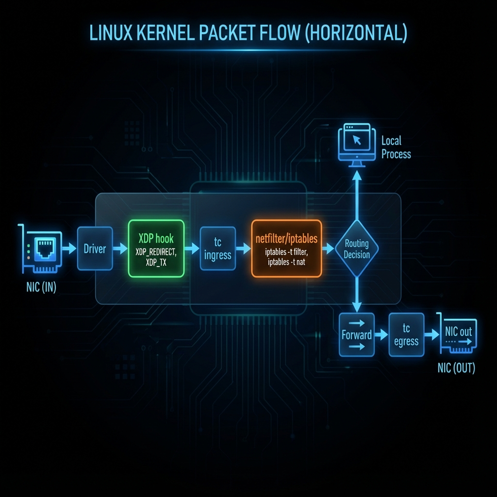
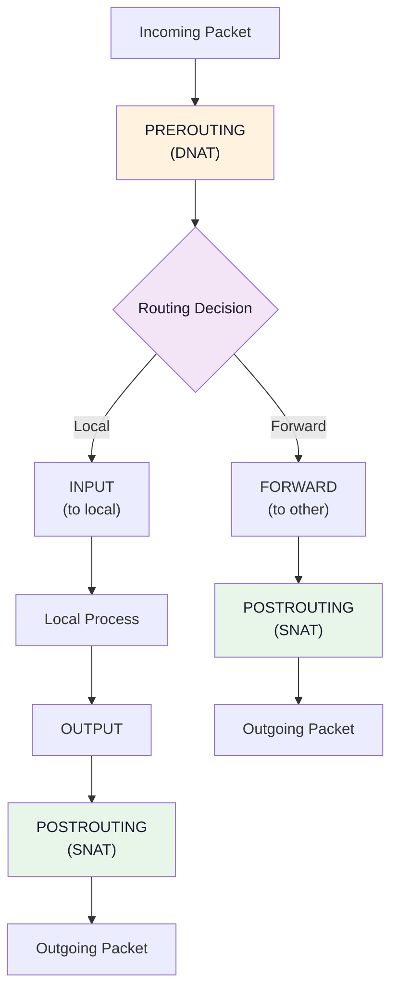

# Module 2: NAT, Routing Tables & Policy Routing

## Why NAT is Critical for Your Load Balancer

Your home network uses **private IPs** (e.g., 10.0.0.0/24).
The internet uses **public IPs**.

**NAT** (Network Address Translation) bridges this gap.

Your multi-WAN load balancer **must** handle NAT correctly on both ISP connections!

## 📊 Visual Learning




---

## Types of NAT

### 1. SNAT (Source NAT)

Changes the **source IP** of outgoing packets.

```
LAN Device        →   NAT Gateway    →   Internet
10.0.0.50:49152       203.0.113.1:49152    8.8.8.8:443
     ↑                      ↑
  Private IP            Public IP (from ISP)
```

**Use case:** All your home devices share one public IP.

### 2. DNAT (Destination NAT)

Changes the **destination IP** of incoming packets.

```
Internet          →   NAT Gateway    →   Internal Server
Any:*:443             203.0.113.1:443     10.0.0.100:443
                           ↓
                    Port forwarding!
```

**Use case:** Hosting a web server behind NAT.

### 3. Masquerading (Dynamic SNAT)

Like SNAT, but **automatically uses the outgoing interface's IP**.
Perfect when your ISP assigns dynamic IPs (most home connections).

```bash
# This:
iptables -t nat -A POSTROUTING -o eth0 -j MASQUERADE

# Is equivalent to (but dynamic):
iptables -t nat -A POSTROUTING -o eth0 -j SNAT --to-source <interface-ip>
```

---

## How Packets Flow Through Linux NAT



**For your load balancer:**
- **PREROUTING**: Where you'll MARK packets for routing decisions
- **POSTROUTING**: Where you'll MASQUERADE for each ISP

---

## Routing Tables Explained

Linux supports **multiple routing tables**. This is the foundation of multi-WAN!

### Default Tables

```bash
$ cat /etc/iproute2/rt_tables
255     local      # Reserved
254     main       # Default table
253     default    # Fallback
0       unspec     # Special
```

### Creating Custom Tables for Multi-WAN

```bash
# Add to /etc/iproute2/rt_tables:
100     isp1
200     isp2

# Now you can create separate routing worlds!
```

### Configuring Each Table

```bash
# ISP1 table: all traffic goes through ISP1's gateway
ip route add default via 192.168.1.1 dev eth0 table isp1
ip route add 192.168.1.0/24 dev eth0 table isp1

# ISP2 table: all traffic goes through ISP2's gateway
ip route add default via 192.168.2.1 dev eth1 table isp2
ip route add 192.168.2.0/24 dev eth1 table isp2

# Verify:
ip route show table isp1
ip route show table isp2
```

---

## Policy Routing: The Magic of `ip rule`

Policy routing lets you choose WHICH routing table to use based on criteria.

### How Rules Work

```bash
$ ip rule list
0:      from all lookup local        # Always first
32766:  from all lookup main         # Normal routing
32767:  from all lookup default      # Fallback
```

**Rules are evaluated in order by priority (lower = first).**

### Adding Rules for Multi-WAN

```bash
# Method 1: Route by source IP
ip rule add from 10.0.0.50 table isp1 priority 100
# All traffic FROM 10.0.0.50 → use isp1 table

# Method 2: Route by firewall mark (BEST for load balancing)
ip rule add fwmark 1 table isp1 priority 100
ip rule add fwmark 2 table isp2 priority 100
# Packets marked with 1 → isp1 table
# Packets marked with 2 → isp2 table
```

### The Firewall Mark Method (Recommended)

This is how your load balancer will work:

```
1. Packet arrives from LAN
2. iptables examines packet in PREROUTING
3. If ESTABLISHED/RELATED: restore the mark saved on the connection (first!)
4. If NEW connection: mark with 1 or 2 (routing decision), then save that mark
5. ip rule matches mark → selects routing table
6. Packet goes out correct ISP
7. POSTROUTING applies MASQUERADE
```

---

## Complete Multi-WAN Setup Example

### Step 1: Enable IP Forwarding

```bash
# Temporary:
echo 1 > /proc/sys/net/ipv4/ip_forward

# Multi-WAN requires loose (not strict) reverse-path filtering. With
# rp_filter=1 the kernel validates a packet's source against the MAIN table
# only, so replies arriving on the non-default ISP are silently dropped.
# Check first:  sysctl net.ipv4.conf.all.rp_filter net.ipv4.conf.eth1.rp_filter
sysctl -w net.ipv4.conf.all.rp_filter=2
sysctl -w net.ipv4.conf.default.rp_filter=2
sysctl -w net.ipv4.conf.eth0.rp_filter=2
sysctl -w net.ipv4.conf.eth1.rp_filter=2

# Permanent (add to /etc/sysctl.conf):
net.ipv4.ip_forward = 1
net.ipv4.conf.all.rp_filter = 2
net.ipv4.conf.default.rp_filter = 2
```

### Step 2: Define Routing Tables

```bash
# /etc/iproute2/rt_tables
100 isp1
200 isp2
```

### Step 3: Configure Routes

```bash
# Default route (primary ISP)
ip route add default via 192.168.1.1 dev eth0

# ISP1 specific table
ip route add default via 192.168.1.1 dev eth0 table isp1
ip route add 192.168.1.0/24 dev eth0 table isp1

# ISP2 specific table
ip route add default via 192.168.2.1 dev eth1 table isp2
ip route add 192.168.2.0/24 dev eth1 table isp2
```

### Step 4: Add Policy Rules

```bash
# Route marked packets to correct table
ip rule add fwmark 1 table isp1 priority 100
ip rule add fwmark 2 table isp2 priority 100
```

### Step 5: Setup NAT (Masquerading)

```bash
# Masquerade on both ISP interfaces
iptables -t nat -A POSTROUTING -o eth0 -j MASQUERADE
iptables -t nat -A POSTROUTING -o eth1 -j MASQUERADE
```

### Step 6: Mark Packets (Basic Example)

```bash
# eth2 = LAN-facing interface (eth0/eth1 are the two ISP uplinks)

# 1. Restore the mark for packets of already-tracked connections.
#    This MUST come first, before anything writes to the connmark.
iptables -t mangle -A PREROUTING -m conntrack --ctstate ESTABLISHED,RELATED \
    -j CONNMARK --restore-mark

# 2. Mark new connections randomly 70/30 (LAN-facing interface only)
iptables -t mangle -A PREROUTING -i eth2 -m conntrack --ctstate NEW \
    -m statistic --mode random --probability 0.70 \
    -j MARK --set-mark 1

iptables -t mangle -A PREROUTING -i eth2 -m conntrack --ctstate NEW \
    -m mark --mark 0 \
    -j MARK --set-mark 2

# 3. Save the mark into the conntrack entry so later packets can restore it
iptables -t mangle -A PREROUTING -m conntrack --ctstate NEW \
    -j CONNMARK --save-mark
```

---

## Practical Exercises

### Exercise 1: Examine Your Current NAT

```bash
# View NAT rules
sudo iptables -t nat -L -v -n

# Watch connection translations
sudo conntrack -L
```

### Exercise 2: Create a Test Routing Table

```bash
# Add custom table (as root)
echo "150 test_table" >> /etc/iproute2/rt_tables

# Add a route to it
ip route add default via $(ip route | grep default | awk '{print $3}') table test_table

# Add a rule
ip rule add from 10.0.0.99 table test_table priority 50

# Verify
ip rule list
ip route show table test_table

# Clean up
ip rule del from 10.0.0.99
```

### Exercise 3: Trace Packet Path

```bash
# See which route a packet would take
ip route get 8.8.8.8
ip route get 8.8.8.8 mark 1
ip route get 8.8.8.8 mark 2
```

---

## Key Takeaways

1. **SNAT/Masquerade**: Changes source IP for outbound traffic
2. **DNAT**: Changes destination IP for inbound traffic  
3. **Multiple routing tables**: Each ISP gets its own "routing world"
4. **Policy routing (ip rule)**: Selects which table to use
5. **Firewall marks**: Bridge iptables decisions to routing decisions
6. **CONNMARK**: Persists marks across all packets in a connection

---

## Next Module
→ [03-connection-tracking.md](./03-connection-tracking.md): How conntrack works and why it's essential
