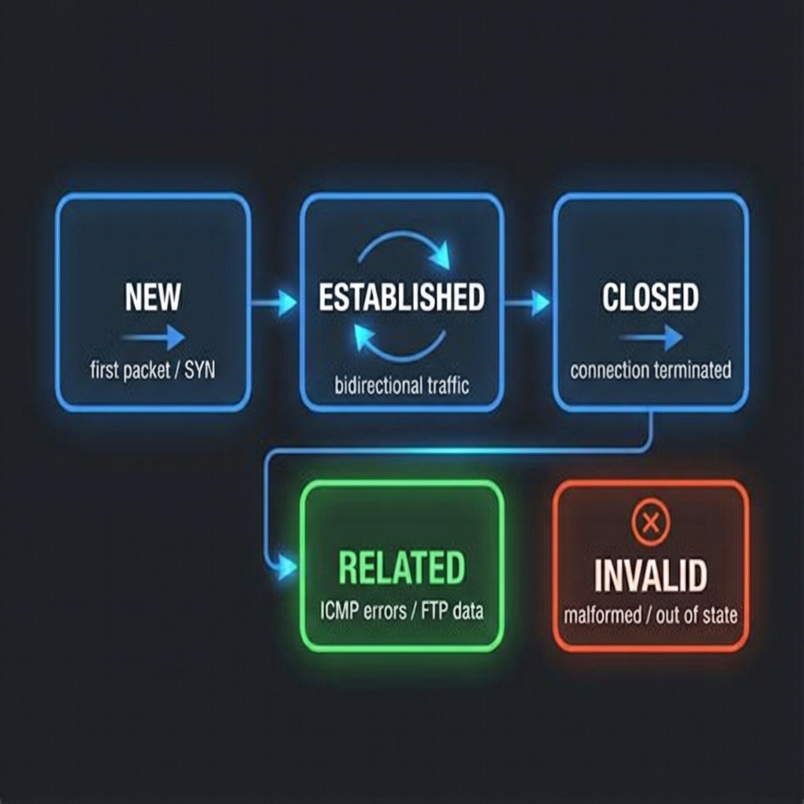
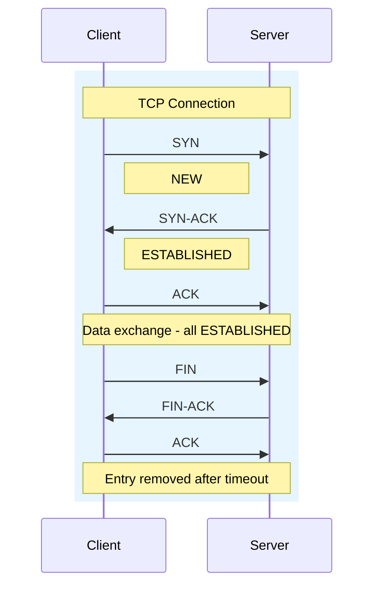
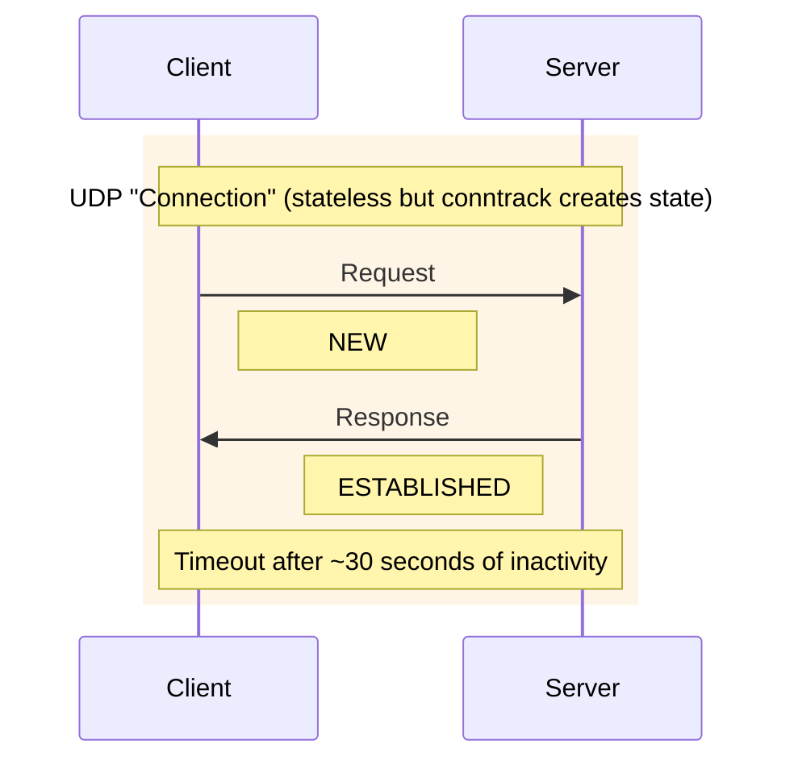

# Module 3: Connection Tracking (conntrack)

## Why Connection Tracking is Critical

Your load balancer's #1 rule:
> **Once a connection starts on an ISP, it MUST stay on that ISP.**

Without connection tracking:
- TCP connections break (new packet → different route → server confused)
- HTTPS/SSL fails (session tied to IP)
- Downloads restart constantly

**Connection tracking (conntrack)** is Linux's solution.

## 📊 Visual Learning



---

## What is conntrack?

Conntrack is a kernel module that:
1. Tracks all network connections passing through
2. Remembers connection state (NEW, ESTABLISHED, RELATED)
3. Associates related packets (like ICMP errors)
4. Enables stateful firewalling

```
Every packet is matched to a connection entry in the conntrack table.
```

---

## The conntrack Table

### Viewing Active Connections

```bash
# List all tracked connections
sudo conntrack -L

# Sample output:
tcp   6 431990 ESTABLISHED src=10.0.0.50 dst=142.250.185.206 sport=55432 dport=443 \
      src=142.250.185.206 dst=203.0.113.1 sport=443 dport=55432 [ASSURED] mark=1 use=1

# Let's break this down:
#   tcp 6              → Protocol (6 = TCP)
#   431990             → Seconds until entry expires
#   ESTABLISHED        → Connection state
#   src=10.0.0.50      → Original source (LAN device)
#   dst=142.250.185.206 → Original destination (google.com)
#   sport=55432        → Source port
#   dport=443          → Destination port (HTTPS)
#   [second set]       → Reply direction (after NAT)
#   mark=1             → Our routing mark!
#   [ASSURED]          → Traffic seen in both directions
```

### Filtering conntrack Output

```bash
# Filter by protocol
conntrack -L -p tcp
conntrack -L -p udp

# Filter by source IP
conntrack -L -s 10.0.0.50

# Filter by destination
conntrack -L -d 8.8.8.8

# Filter by state
conntrack -L -p tcp --state ESTABLISHED

# Count connections per ISP (using marks)
conntrack -L | grep "mark=1" | wc -l
conntrack -L | grep "mark=2" | wc -l
```

---

## Connection States

### Primary States

| State | Meaning | Example |
|-------|---------|---------|
| `NEW` | First packet of connection | TCP SYN, first UDP packet |
| `ESTABLISHED` | Traffic seen both ways | After SYN-ACK exchange |
| `RELATED` | Related to existing | ICMP error, FTP data |
| `INVALID` | Doesn't match pattern | Malformed packets |
| `UNTRACKED` | Explicitly not tracked | Bypassed tracking |

### State Transitions





---

## CONNMARK: Marking Connections

### The Problem
Regular **MARK** only marks individual packets.
When a new packet arrives, the mark is gone.

### The Solution
**CONNMARK** saves and restores marks to/from the connection entry.

```bash
# Step 1: Mark NEW connections
iptables -t mangle -A PREROUTING \
    -m conntrack --ctstate NEW \
    -j MARK --set-mark 1

# Step 2: SAVE the mark to the connection
iptables -t mangle -A PREROUTING \
    -j CONNMARK --save-mark

# Step 3: For ESTABLISHED packets, RESTORE the mark
iptables -t mangle -A PREROUTING \
    -m conntrack --ctstate ESTABLISHED,RELATED \
    -j CONNMARK --restore-mark
```

### How It Works

```
Packet 1 (SYN - NEW):
  1. Match: ctstate NEW ✓
  2. MARK packet with 1
  3. CONNMARK --save-mark → saves "1" to conntrack entry
  4. ip rule fwmark 1 → routes via isp1 table

Packet 2 (ACK - ESTABLISHED):
  1. Match: ctstate ESTABLISHED ✓
  2. CONNMARK --restore-mark → loads "1" from conntrack entry
  3. Packet now has mark 1
  4. ip rule fwmark 1 → routes via isp1 table (SAME PATH!)

All subsequent packets: same flow
```

---

## Working with conntrack in Go

For your load balancer, you'll interact with conntrack via netlink.

### Using go-conntrack Library

```go
package main

import (
    "fmt"
    "github.com/florianl/go-conntrack"
)

func main() {
    cfg := conntrack.Config{}
    ct, err := conntrack.Open(&cfg)
    if err != nil {
        panic(err)
    }
    defer ct.Close()

    // Dump all connections
    sessions, err := ct.Dump(conntrack.Conntrack, conntrack.IPv4)
    if err != nil {
        panic(err)
    }

    for _, session := range sessions {
        fmt.Printf("%s:%d -> %s:%d [mark=%d]\n",
            session.Origin.Src,
            *session.Origin.Proto.SrcPort,
            session.Origin.Dst,
            *session.Origin.Proto.DstPort,
            session.Mark,
        )
    }
}
```

### Counting Connections Per ISP

```go
func countConnectionsPerISP(ct *conntrack.Ct) map[uint32]int {
    counts := make(map[uint32]int)
    
    sessions, _ := ct.Dump(conntrack.Conntrack, conntrack.IPv4)
    
    for _, session := range sessions {
        if session.Mark != nil {
            counts[*session.Mark]++
        }
    }
    
    return counts  // {1: 847, 2: 353} = ISP1 has 847, ISP2 has 353
}
```

---

## Connection Tracking Tuning

### View Current Settings

```bash
# Max connections tracked
cat /proc/sys/net/netfilter/nf_conntrack_max
# Default: 65536 (may need increase for busy gateway)

# Current count
cat /proc/sys/net/netfilter/nf_conntrack_count

# TCP timeout for established connections
cat /proc/sys/net/netfilter/nf_conntrack_tcp_timeout_established
# Default: 432000 seconds (5 days!)
```

### Recommended Tuning for Gateway

```bash
# Increase max connections for gateway use
echo 262144 > /proc/sys/net/netfilter/nf_conntrack_max

# Reduce timeouts for faster cleanup
echo 3600 > /proc/sys/net/netfilter/nf_conntrack_tcp_timeout_established
echo 60 > /proc/sys/net/netfilter/nf_conntrack_udp_timeout_stream

# Permanent (add to /etc/sysctl.conf):
net.netfilter.nf_conntrack_max = 262144
net.netfilter.nf_conntrack_tcp_timeout_established = 3600
```

---

## Practical Exercises

### Exercise 1: Watch Connections in Real-Time

```bash
# Terminal 1: Watch conntrack events
sudo conntrack -E

# Terminal 2: Generate traffic
curl https://google.com
ping 8.8.8.8

# Watch NEW, UPDATE, DESTROY events appear
```

### Exercise 2: Find Connections by Mark

```bash
# After setting up marked routing:
conntrack -L | grep "mark=1" | head -5
conntrack -L | grep "mark=2" | head -5

# Count distribution
echo "ISP1: $(conntrack -L 2>/dev/null | grep 'mark=1' | wc -l)"
echo "ISP2: $(conntrack -L 2>/dev/null | grep 'mark=2' | wc -l)"
```

### Exercise 3: Clear Specific Connections

```bash
# Delete all connections to specific IP
conntrack -D -d 8.8.8.8

# Delete all UDP connections
conntrack -D -p udp

# Flush everything (careful!)
conntrack -F
```

---

## Key Takeaways

1. **Conntrack** tracks all connections through your gateway
2. **States**: NEW → ESTABLISHED → destroyed
3. **CONNMARK** saves routing decisions to connection entries
4. **--restore-mark** ensures all packets follow same path
5. **Tuning**: Increase max for busy gateways
6. **Go integration**: Use go-conntrack or netlink for programmatic access

---

## Next Module
→ [04-iptables-mastery.md](./04-iptables-mastery.md): Complete iptables guide for load balancing
