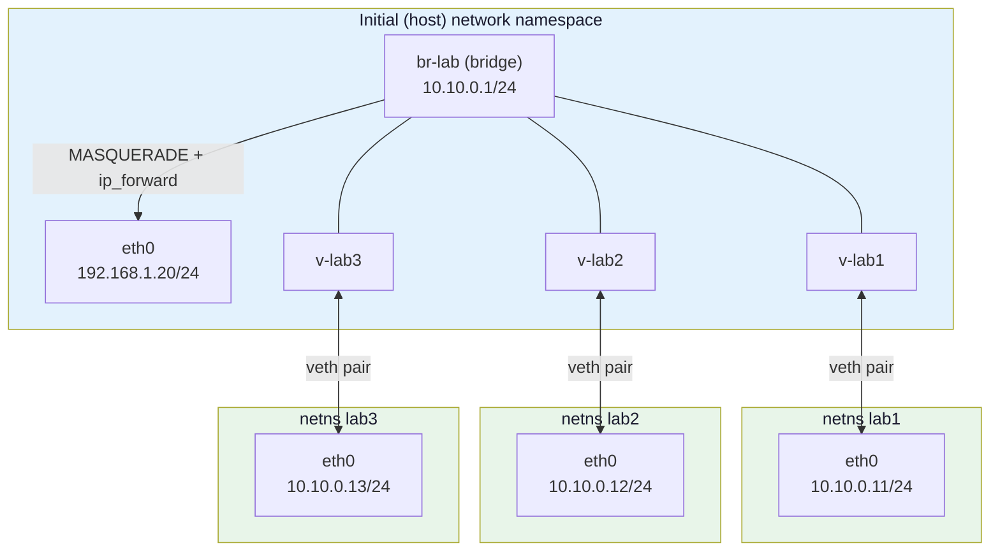
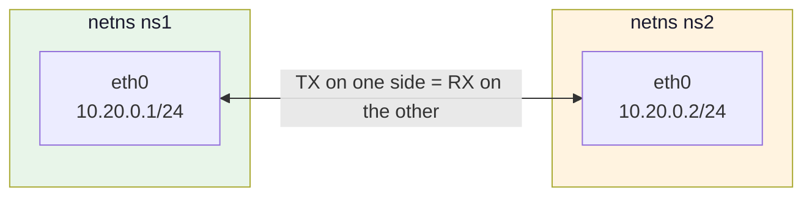
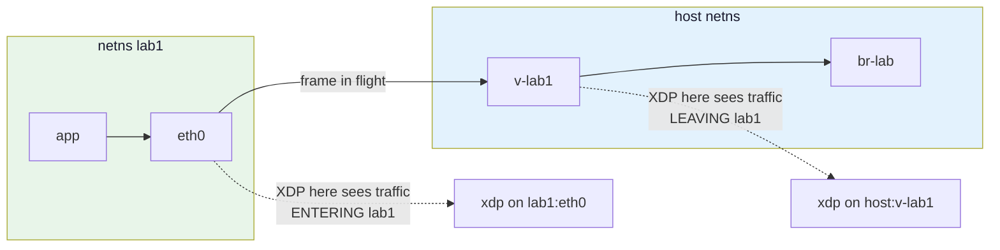

# Module 15: Network Namespaces & Virtual Devices

> **The substrate.** A pod *is* a network namespace and a CNI plugin *is* veth plumbing. This is the lab everything from Module 6 onward actually runs in.

## 📊 Visual Learning



That picture is a Kubernetes node with three pods on it, minus the branding. Build it once by hand and every later module has somewhere to run.

---

## Why This Module Exists

Every program you have written so far attached to `eth0` on your dev box. That is fine for `XDP_PASS`, and useless for anything that rewrites, redirects or drops — you cannot test a load balancer without at least two endpoints, and you cannot test a policy enforcer without a boundary to enforce across.

Network namespaces give you that for free: no VMs, no containers, no cloud bill. Three namespaces on a bridge reproduce the exact topology a CNI plugin creates, on the exact same kernel objects (`veth`, `bridge`, `netns`) that Cilium and Calico manipulate in production.

**What you will have at the end:** a `setup-lab.sh` you can run before any eBPF experiment, and the diagnostic vocabulary to figure out why traffic is not flowing when it inevitably does not.

---

## What a Network Namespace Isolates

A network namespace is a kernel object holding a private copy of the entire network stack. `clone(CLONE_NEWNET)` or `unshare(CLONE_NEWNET)` creates one; a fresh namespace contains exactly one device — a *down* loopback — and nothing else.

| Isolated per-namespace | Shared with the rest of the system |
|---|---|
| Network devices (`ip link`) | Processes, PIDs, memory, CPU |
| IP addresses and routing tables | The filesystem (unless a mount ns is also used) |
| `ip rule` policy routing | User IDs, capabilities |
| ARP / neighbour table | eBPF **maps and programs** (global to the kernel) |
| netfilter (`iptables`/`nftables`) rules | The `bpf()` syscall's object namespace |
| The conntrack table | Kernel modules and `sysctl` outside `net.*` |
| `net.*` sysctls, including `ip_forward` | The `/proc` and `/sys` *mounts* — their contents follow the netns, but only if remounted (see the `/sys` trap below) |
| Sockets and port bindings | The clock, hostname (that is a UTS namespace) |

Two consequences worth writing on your wall:

1. **Every namespace can bind port 80.** Port collisions are a namespace-local concept. This is why pods do not fight over ports and why `hostNetwork: true` reintroduces the fight.
2. **eBPF maps are not namespaced.** An agent in the host namespace loads a program, attaches it to a device that lives in a pod's namespace, and shares the same map with a program attached in a third namespace. Isolation stops at the network stack; the BPF object space is global to the kernel. That is precisely what makes a single-agent-per-node design like Cilium's possible.

```bash
# Prove #1
sudo ip netns add ns1
sudo ip netns exec ns1 ip link
# 1: lo: <LOOPBACK> mtu 65536 qdisc noop state DOWN mode DEFAULT group default qlen 1000
#     link/loopback 00:00:00:00:00:00 brd 00:00:00:00:00:00

sudo ip netns exec ns1 ip addr    # just that lo, with no addresses - not even 127.0.0.1
sudo ip netns exec ns1 ip route   # nothing at all: not even a loopback route
sudo ip netns exec ns1 iptables -S # only the three default policies, separate from the host's
# -P INPUT ACCEPT
# -P FORWARD ACCEPT
# -P OUTPUT ACCEPT
```

**First failure mode of the module:** a fresh namespace's `lo` is `DOWN`. `ping 127.0.0.1` fails, and so does anything a program does to talk to itself. `ip netns exec ns1 ip link set lo up` is the fix, and it is the single most commonly forgotten line in hand-built labs.

---

## Three Ways to Refer to a Namespace

A namespace has no name in the kernel. It stays alive as long as *something* references it:

- a process whose `/proc/<pid>/ns/net` points at it,
- an open file descriptor on that path,
- a bind mount of it somewhere in the filesystem.

Drop all three and the kernel destroys it, moving any physical NICs it owned back to the initial namespace and deleting every virtual device.

### 1. `ip netns` — the bind-mount convention

```bash
sudo ip netns add ns1
ls -l /run/netns/          # ip netns add created a bind mount here
# -r--r--r-- 1 root root 0 Aug 12 09:11 ns1

sudo ip netns list
# ns1
```

`ip netns add` does two things: it creates a namespace, and it bind-mounts it onto `/run/netns/<name>` so it survives the exit of the process that created it. **`ip netns list` is just a directory listing of `/run/netns`.** Nothing more.

### 2. `/proc/<pid>/ns/net` — the real identity

```bash
readlink /proc/self/ns/net
# net:[4026531840]           <- the inode number IS the namespace identity

# Two shells in the same namespace print the same inode.
sudo ip netns exec ns1 readlink /proc/self/ns/net
# net:[4026532567]
```

Compare inodes, not names. `lsns` does this for you across the whole system:

```bash
sudo lsns -t net
#         NS TYPE NPROCS   PID USER COMMAND
# 4026531840 net     312     1 root /sbin/init
# 4026532567 net       0       -                      <- named, no process in it
# 4026532631 net       1  8891 65535 /pause           <- a Kubernetes pod sandbox
```

### 3. Container namespaces do not show up under the name you expect

This trips up everyone exactly once. Start a Docker container and look:

```bash
docker run -d --name web nginx
sudo ip netns list
# (nothing)
```

Nothing — because Docker's libnetwork keeps its bind mounts under `/var/run/docker/netns/`, not `/run/netns`, so `ip netns` never sees them.

Now do the same on a Kubernetes node running containerd:

```bash
sudo ip netns list
# cni-8f3a1c92-4d7b-11ee-9f2a-0242ac110002 (id: 3)
# cni-b21e6d40-4d7b-11ee-9f2a-0242ac110002 (id: 4)
```

Here the namespaces *are* listed. containerd's CRI plugin creates each pod sandbox namespace with `netns.NewNetNS("/var/run/netns")` — the same directory `ip netns` reads — using a random `cni-<uuid>` name. CRI-O does the same. So the real problem on a Kubernetes node is not invisibility, it is that **the names carry no pod identity**: nothing in `cni-8f3a1c92-…` tells you which pod it belongs to, and `hostNetwork: true` pods get no entry at all because they never leave the host namespace.

> ⚠️ Two caveats. If containerd is configured with `NetNSMountsUnderStateDir = true`, the mounts move to `<StateDir>/netns` and drop off `ip netns list` again. And Module 16 shows how to go the other way — from a pod name to its sandbox PID — which is the mapping you actually want.

Either way, the reliable route in is by PID, not by name.

The way in is `nsenter`, which takes a PID:

```bash
# containerd / CRI
PID=$(sudo crictl inspect --output go-template --template '{{.info.pid}}' <container-id>)
# docker
PID=$(docker inspect -f '{{.State.Pid}}' web)

sudo nsenter -t "$PID" -n ip addr
sudo nsenter -t "$PID" -n ip route
sudo nsenter -t "$PID" -n ss -tlnp
```

`-n` means "enter this PID's **net**work namespace and run the command there". The command itself is still your host's binary from your host's filesystem — which is the whole point, because the container image probably does not ship `ip`, `ss` or `tcpdump`.

If you would rather use `ip netns` tooling on a container, adopt it:

```bash
sudo ip netns attach web "$PID"   # creates the bind mount ip netns expects
sudo ip netns exec web ip addr
sudo ip netns delete web          # removes only the bind mount, not the container
```

`ip netns attach` landed in iproute2 **5.1** (early 2019), so it is present on Ubuntu 20.04+, Debian 11+, RHEL 9+ — but *not* on Ubuntu 18.04, which ships iproute2 4.15. If `ip netns attach` prints a usage error, that is why; fall back to `nsenter`.

### The `/sys` trap that separates the two

`ip netns exec` does more than `setns()`. It also unshares the **mount** namespace and re-mounts `/sys` so that `/sys/class/net` describes the target namespace. `nsenter -t PID -n` does not — it changes only the network namespace, so `/sys/class/net` still shows the *host's* devices.

```bash
sudo ip netns exec ns1 ls /sys/class/net
# lo                          <- correct, sysfs was remounted

sudo nsenter -t "$PID" -n ls /sys/class/net
# br-lab  docker0  eth0  lo    <- the HOST's devices; ip link disagrees
```

Anything that reads sysfs instead of netlink will lie to you under `nsenter`: `ethtool`, parts of `tc`, and any tool that resolves an interface by walking `/sys/class/net`. Use `nsenter -t PID -n -m` to enter the mount namespace too — at the cost of getting the container's (tool-free) filesystem.

The same remount bites in the other direction:

```bash
sudo ls /sys/fs/bpf                       # your pinned maps
sudo ip netns exec ns1 ls /sys/fs/bpf     # empty!
```

`ip netns exec` detaches `/sys` and takes the bpffs mounted at `/sys/fs/bpf` with it. If you need pinned maps inside `ip netns exec`, mount a second bpffs somewhere outside `/sys` and pin there:

```bash
sudo mkdir -p /run/bpf
sudo mount -t bpf bpf /run/bpf
```

| Tool | Changes netns | Remounts `/sys` | Bind-mounts `/etc/netns/<name>` | Works on containers |
|---|---|---|---|---|
| `ip netns exec <name>` | ✅ | ✅ | ✅ | Only after `ip netns attach` |
| `nsenter -t PID -n` | ✅ | ❌ | ❌ | ✅ |
| `nsenter -t PID -n -m` | ✅ | n/a (container's `/sys`) | ❌ | ✅ (container's filesystem) |
| `ip -n <name> <cmd>` | ✅ | ✅ | ✅ | Only after `ip netns attach` |

`ip -n ns1 addr` (short for `ip -netns ns1 addr`) is **not** a lighter-weight alternative, whatever its terseness suggests. iproute2 implements `-n` with the same `netns_switch()` that backs `ip netns exec`: `setns()`, then `unshare(CLONE_NEWNS)`, then `umount2("/sys", MNT_DETACH)` + a fresh sysfs mount, then the `/etc/netns/<name>` bind mounts. The only thing it saves is forking a second `ip`. It is the shortest way to type a namespace-local `ip` command, and it hides `/sys/fs/bpf` exactly like `ip netns exec` does.

---

## veth Pairs: The Virtual Cable

A `veth` is a pair of devices wired back to back: everything transmitted on one end is received on the other. It is the only device whose two halves can sit in *different* namespaces, which makes it the fundamental primitive of container networking.



### Build ns1 ↔ ns2 by hand

```bash
sudo ip netns add ns1
sudo ip netns add ns2

# Create the pair. Both ends land in the current (host) namespace, DOWN.
sudo ip link add veth-a type veth peer name veth-b

# Move each end into its namespace. This FLUSHES addresses and forces the
# device DOWN - configure AFTER the move, never before.
sudo ip link set veth-a netns ns1
sudo ip link set veth-b netns ns2

# Rename to eth0 inside each namespace (a device must be DOWN to be renamed).
sudo ip -n ns1 link set veth-a name eth0
sudo ip -n ns2 link set veth-b name eth0

# Address, bring up, and do not forget loopback.
sudo ip -n ns1 addr add 10.20.0.1/24 dev eth0
sudo ip -n ns1 link set eth0 up
sudo ip -n ns1 link set lo up

sudo ip -n ns2 addr add 10.20.0.2/24 dev eth0
sudo ip -n ns2 link set eth0 up
sudo ip -n ns2 link set lo up

# Test
sudo ip netns exec ns1 ping -c2 10.20.0.2
```

Notice there is no bridge, no routing and no `ip_forward` here. Both ends are in the same `/24`, so this is pure L2: ARP resolves across the cable and frames flow.

### The failure modes you will actually hit

| Symptom | Cause | Diagnosis |
|---|---|---|
| `Network is unreachable` | The device is `DOWN`, or you addressed it before moving it | `ip -n ns1 addr show eth0` — no address, or `state DOWN` |
| `Destination Host Unreachable` | The *peer* is down; ARP gets no reply | `ip -n ns1 neigh` shows `FAILED` or `INCOMPLETE` |
| Ping to self fails | `lo` still `DOWN` | `ip -n ns1 link show lo` |
| Works one way only | An address or route is missing on the return side | `ip -n ns2 route get 10.20.0.1` |
| Device vanished | A namespace was deleted; a veth dies with its peer | `ip -br link show type veth` |

`ip neigh` is the highest-yield command on this list. A `veth` failure is almost always an ARP failure, and ARP failure is almost always "the other end is not up".

### Finding the other end of a cable

This is how you map a container's `eth0` to a device on the host — the exact lookup a CNI debugging session starts with.

```bash
# ip already annotates the peer's ifindex with @ifN
sudo ip -n ns1 link show eth0
# 2: eth0@if9: <BROADCAST,MULTICAST,UP,LOWER_UP> ...

# The authoritative source: iflink is the peer's ifindex.
sudo ip netns exec ns1 cat /sys/class/net/eth0/iflink
# 9

# Now find ifindex 9 in the host namespace.
ip link show | grep '^9:'
# 9: v-lab1@if2: <BROADCAST,MULTICAST,UP,LOWER_UP> ... master br-lab ...
```

Same recipe for a real pod, using `nsenter` — but remember the `/sys` trap above: `nsenter -t PID -n cat /sys/class/net/eth0/iflink` reads the **host's** sysfs. Add `-m`, or read it via netlink instead:

```bash
sudo nsenter -t "$PID" -n ip -o link show eth0 | sed -n 's/.*@if\([0-9]*\).*/\1/p'
```

---

## The Linux Bridge: A Software Switch

Two namespaces need a cable. Three or more need a switch. `bridge` is a real learning L2 switch implemented in the kernel: it keeps a forwarding database (FDB) of MAC-to-port mappings, floods unknown destinations, and ages entries out.

```bash
sudo ip link add br-lab type bridge
sudo ip addr add 10.10.0.1/24 dev br-lab   # gives the HOST an address on the segment
sudo ip link set br-lab up

for i in 1 2 3; do
  sudo ip netns add lab$i
  # Create the pair with the peer already named eth0 IN the target namespace,
  # which sidesteps three "eth0"s colliding in the host namespace.
  sudo ip link add v-lab$i type veth peer name eth0 netns lab$i
  sudo ip link set v-lab$i master br-lab
  sudo ip link set v-lab$i up

  sudo ip -n lab$i link set lo up
  sudo ip -n lab$i addr add 10.10.0.1$i/24 dev eth0
  sudo ip -n lab$i link set eth0 up
  sudo ip -n lab$i route add default via 10.10.0.1
done

sudo ip netns exec lab1 ping -c2 10.10.0.12
```

Two subtleties in that loop:

- **Adding an IP to `br-lab` is what makes the host a participant.** Without it the bridge is a pure switch the host cannot talk to, and `route add default via 10.10.0.1` inside the namespaces has no target.
- **A bridge port must not have an IP.** Do not put an address on `v-lab1`. Once enslaved (`master br-lab`), the device is a switch port; the kernel hands its received frames to the bridge before the IP stack sees them.

### Reading the switch

```bash
# Which devices are ports of which bridge
bridge link show
# 9: v-lab1@if2: <...> master br-lab state forwarding priority 32 cost 2

# The forwarding database - learned MAC to port
bridge fdb show br br-lab
# 5e:9c:1a:33:2f:01 dev v-lab1 master br-lab permanent    <- the port's own MAC
# 5e:9c:1a:33:2f:01 dev v-lab1 vlan 1 master br-lab permanent
# 3a:11:0d:77:be:c2 dev v-lab2 master br-lab              <- LEARNED from traffic
# 33:33:00:00:00:01 dev v-lab3 self permanent             <- multicast

# Watch learning happen
sudo ip netns exec lab1 ping -c1 10.10.0.13
bridge fdb show br br-lab | grep -v permanent
```

`permanent` entries are the ports' own addresses, installed at enslavement. Everything else was **learned** from a source MAC in a received frame and will age out (`bridge -s fdb show` prints the age). If a namespace's MAC never appears, its frames are never reaching the bridge — check that the host-side veth is `up` and enslaved.

### The `bridge-nf-call-iptables` surprise

Here is the failure that eats an afternoon. You build the bridge above, `ping` between namespaces, and get nothing — even though `bridge fdb show` proves the frames arrive.

```bash
sudo ip netns exec lab1 ping -c2 10.10.0.12
# 2 packets transmitted, 0 received, 100% packet loss
```

The cause is `br_netfilter`. When that module is loaded, **bridged frames are pushed through the IPv4 netfilter hooks** — `PREROUTING`, `FORWARD`, `POSTROUTING` — even though no routing is happening. If Docker is installed, it has set the `FORWARD` chain's policy to `DROP`, and your L2 traffic dies in an L3 firewall.

```bash
# Is the module loaded? The sysctl only EXISTS once it is.
lsmod | grep br_netfilter
sudo sysctl net.bridge.bridge-nf-call-iptables
# net.bridge.bridge-nf-call-iptables = 1

# The smoking gun: FORWARD counters climbing on a DROP rule while you ping.
sudo iptables -vnL FORWARD
# Chain FORWARD (policy DROP 4 packets, 336 bytes)
```

Two fixes, and the choice matters:

```bash
# (a) Lab-local: let bridged frames bypass iptables entirely.
sudo modprobe br_netfilter
sudo sysctl -w net.bridge.bridge-nf-call-iptables=0

# (b) Production-shaped: keep the hook on, and explicitly permit the bridge.
sudo iptables -I FORWARD -i br-lab -j ACCEPT
sudo iptables -I FORWARD -o br-lab -j ACCEPT
```

Prefer **(b)** if you also want internet access from the namespaces (next section), and understand that **Kubernetes requires `bridge-nf-call-iptables=1`** — kube-proxy's iptables mode depends on bridged pod traffic traversing netfilter, which is why every kubeadm preflight check tests for it. Setting it to `0` on a node breaks Services.

One more consequence: with `br_netfilter` loaded, conntrack tracks bridged flows too. On a busy bridge that is a real contributor to `nf_conntrack: table full, dropping packet` in `dmesg`.

On nftables-based distros, the equivalent look is:

```bash
sudo nft list chain ip filter FORWARD
sudo nft -a list ruleset | grep -A5 'chain forward'
```

---

## Reaching the Internet

The namespaces can now talk to each other and to the host. They cannot reach anything beyond it, because 10.10.0.0/24 is private and the upstream router has never heard of it. The fix is the same masquerade-plus-forwarding pair you built in **[Module 2: NAT & Routing](./02-nat-and-routing.md)** — refer there for *why* `MASQUERADE` differs from `SNAT`, how conntrack rewrites the reply, and what the POSTROUTING hook does. Here is only the namespace-specific wiring:

```bash
# Find the uplink by looking for the "dev" keyword, not by field position:
# a default route without a "via" (point-to-point, WireGuard, some clouds)
# shifts every field left by two.
UPLINK=$(ip -o route show default | awk '{for (i=1;i<NF;i++) if ($i=="dev") {print $(i+1); exit}}')

# ip_forward is a PER-NAMESPACE sysctl. This one enables routing in the HOST
# namespace, which is where br-lab and $UPLINK both live.
sudo sysctl -w net.ipv4.ip_forward=1

sudo iptables -t nat -A POSTROUTING -s 10.10.0.0/24 ! -o br-lab -j MASQUERADE
sudo iptables -I FORWARD -i br-lab -o "$UPLINK" -j ACCEPT
sudo iptables -I FORWARD -i "$UPLINK" -o br-lab -m conntrack --ctstate RELATED,ESTABLISHED -j ACCEPT

sudo ip netns exec lab1 ping -c2 1.1.1.1
```

The `! -o br-lab` guard keeps namespace-to-namespace traffic out of NAT; without it, lab1→lab2 traffic gets source-rewritten to the bridge address for no reason and your packet captures become fiction.

### DNS inside a namespace

`ping 1.1.1.1` works but `ping example.com` says `Temporary failure in name resolution`, because the namespace inherited `/etc/resolv.conf` pointing at a resolver it cannot reach (commonly `127.0.0.53`, systemd-resolved, which is namespace-local and not running there).

`ip netns exec` bind-mounts `/etc/netns/<name>/*` over `/etc/*`:

```bash
sudo mkdir -p /etc/netns/lab1
echo 'nameserver 1.1.1.1' | sudo tee /etc/netns/lab1/resolv.conf
sudo ip netns exec lab1 getent hosts example.com
```

**`nsenter` does not do this** — it never touches mounts. Under `nsenter` you get the host's `/etc/resolv.conf` regardless.

---

## The Rest of the Virtual Device Zoo

| Device | What it is | Namespace-crossing | Typical use |
|---|---|---|---|
| `veth` | Back-to-back pair | ✅ (one end moves) | Container/pod cable — the CNI primitive |
| `bridge` | Learning L2 switch | ❌ | Node-local pod switching, `docker0`, `cni0` |
| `dummy` | Black-hole device that keeps addresses | ❌ | Holding a VIP, anycast/ECMP source |
| `macvlan` | Extra MAC on a parent NIC | ✅ | Give a container a real LAN address |
| `ipvlan` | Extra IP sharing the parent's MAC | ✅ | Same, where extra MACs are forbidden |
| `vxlan` | L2-over-UDP tunnel | ❌ (usually bridged) | Cross-node overlay (Flannel, Calico VXLAN) |
| `ipip` / `gre` | L3 tunnel | ❌ | Cross-node routing overlays |

### `dummy` — the VIP holder

```bash
sudo ip link add dum0 type dummy
sudo ip addr add 10.99.0.1/32 dev dum0
sudo ip link set dum0 up
ip route get 10.99.0.1
# local 10.99.0.1 dev lo src 10.99.0.1
```

A `dummy` device always accepts and always drops. Give it a `/32` and the host owns that IP, will answer ARP for it via the normal rules, and can bind sockets to it — with no cable to fall over. This is how you park the VIP that the Module 11 XDP load balancer answers for, and how anycast setups give BGP something stable to advertise.

### `macvlan` — a second MAC on the wire

```bash
sudo ip link add mvl0 link eth0 type macvlan mode bridge
sudo ip link set mvl0 netns ns1
sudo ip -n ns1 addr add 192.168.1.90/24 dev mvl0
sudo ip -n ns1 link set mvl0 up
```

The namespace now appears on your physical LAN with its own MAC and its own DHCP-able address. No NAT, no bridge, near-native throughput.

Three ways it bites:

1. **The parent host cannot talk to its own macvlan children.** Frames from `eth0` to `mvl0` never leave the NIC, so the hairpin does not happen. The workaround is to create a *second* macvlan on the host and route to the children through that.
2. **Cloud NICs reject unknown source MACs.** On EC2, Azure and most virtualized NICs, frames with an unregistered source MAC are dropped by the hypervisor. macvlan simply does not work there.
3. **Wi-Fi does not do multiple MACs.** 802.11 stations are single-MAC; macvlan on `wlan0` fails silently.

Modes: `bridge` (children talk to each other — what you want), `private` (children isolated), `vepa` (everything goes out to the switch and back, needs 802.1Qbg hairpinning), `passthru` (one child owns the NIC).

### `ipvlan` — one MAC, many IPs

```bash
sudo ip link add ipv0 link eth0 type ipvlan mode l2
sudo ip link set ipv0 netns ns1
sudo ip -n ns1 addr add 192.168.1.91/24 dev ipv0
sudo ip -n ns1 link set ipv0 up
```

`ipvlan` shares the parent's MAC and demultiplexes by IP, which fixes failure modes 2 and 3 above and avoids putting the NIC in promiscuous mode. The price: because everything shares one MAC, DHCP client-identifier collisions are common (use `ipvlan` with static addressing or a DHCP client configured to use a client-ID), and `mode l2` children still cannot reach the parent host directly. `mode l3` routes instead of switching — no ARP/broadcast at all, which means you must install routes on the upstream router yourself.

### `vxlan` — the overlay

VXLAN wraps an entire Ethernet frame in UDP so two bridges on different machines behave like one L2 segment. This is Flannel's `vxlan` backend and Calico's VXLAN mode.

```bash
# On node A (192.168.1.10), pointing at node B
sudo ip link add vx0 type vxlan id 42 local 192.168.1.10 remote 192.168.1.11 \
     dstport 4789 dev eth0
sudo ip link set vx0 mtu 1450
sudo ip link set vx0 master br-lab
sudo ip link set vx0 up

# Peer state (for multicast-less, FDB-driven setups)
bridge fdb show dev vx0
```

**The MTU is not optional.** VXLAN adds 50 bytes to every frame on IPv4 (20 outer IP + 8 UDP + 8 VXLAN + 14 inner Ethernet). On a 1500-byte underlay the overlay MTU is 1450, and every device on the overlay — including the `eth0` inside each namespace — must agree.

The failure this causes is the nastiest in this module because it does not look like a network failure:

```bash
# Small things work perfectly
ping -c2 10.10.0.12
curl -s http://10.10.0.12/health     # fine

# Large things hang forever
curl -s http://10.10.0.12/big-file   # stalls after the first few KB
```

TCP established fine (small SYN/ACK), then the first full-size segment exceeded the tunnel MTU, the tunnel could not fragment it, and the ICMP "fragmentation needed" that should have triggered Path MTU Discovery got eaten by a firewall. Diagnose with a do-not-fragment probe:

```bash
# 1472 = 1500 - 20 (IP) - 8 (ICMP). Should succeed on the underlay.
ping -M do -s 1472 -c1 192.168.1.11
# 1422 = 1450 - 28. Should succeed across the overlay.
sudo ip netns exec lab1 ping -M do -s 1422 -c1 10.10.0.12
# 1472 across the overlay should FAIL with "Frag needed and DF set (mtu = 1450)"
sudo ip netns exec lab1 ping -M do -s 1472 -c1 10.10.0.12
```

If the last one hangs instead of reporting the MTU, PMTUD is blackholed and you must set the MTU explicitly everywhere.

---

## Driving It from Go

`ip` is a netlink client. So is your agent. Two libraries do the work:

- `github.com/vishvananda/netlink` — link/addr/route/qdisc manipulation
- `github.com/vishvananda/netns` — namespace handles and `setns()`

### The `runtime.LockOSThread` requirement

`setns(2)` changes the network namespace of **the calling thread**, not the process. Go goroutines are multiplexed over an arbitrary pool of OS threads and can be rescheduled onto a different one at almost any function call. So:

```go
// BROKEN. Do not do this.
ns, _ := netns.GetFromName("lab1")
netns.Set(ns)                    // this thread is now in lab1
link, _ := netlink.LinkByName("eth0")  // ...possibly on a DIFFERENT thread. Which
                                       // eth0 did you just get? Nobody knows.
```

Worse, the thread you switched is returned to the runtime's pool still inside `lab1`, so unrelated goroutines start doing namespace-local work in the wrong namespace, minutes later, non-deterministically.

The correct shape pins the goroutine to its thread and always restores:

```go
package main

import (
	"fmt"
	"runtime"

	"github.com/vishvananda/netns"
)

// createNamed is the Go equivalent of `ip netns add <name>`, without leaving
// the calling goroutine's thread stranded in the new namespace.
func createNamed(name string) (netns.NsHandle, error) {
	runtime.LockOSThread()

	orig, err := netns.Get()
	if err != nil {
		runtime.UnlockOSThread()
		return netns.None(), fmt.Errorf("get current netns: %w", err)
	}
	defer orig.Close()

	// NewNamed creates the namespace, bind-mounts it under /run/netns,
	// AND makes it current for this thread.
	h, err := netns.NewNamed(name)
	if err != nil {
		_ = netns.Set(orig)
		runtime.UnlockOSThread()
		return netns.None(), fmt.Errorf("create netns %q: %w", name, err)
	}

	if err := netns.Set(orig); err != nil {
		// Deliberately do NOT unlock. A thread stuck in the wrong namespace
		// must never go back into the runtime's pool; leaving it locked means
		// it dies with this goroutine instead of poisoning someone else's work.
		h.Close()
		return netns.None(), fmt.Errorf("restore netns: %w", err)
	}

	runtime.UnlockOSThread()
	return h, nil
}
```

### The better pattern: never switch at all

`netlink.NewHandleAt` opens a netlink socket **in** the target namespace and keeps talking to it from your unmodified thread. No `setns`, no locking, no restore path to get wrong. This is what you should reach for by default.

```go
package main

import (
	"fmt"
	"net"

	"github.com/vishvananda/netlink"
	"github.com/vishvananda/netns"
)

// wireNamespace creates a veth pair, moves one end into nsName, renames it to
// ifName, addresses it, and enslaves the host end to a bridge.
func wireNamespace(nsName, hostIf, ifName, cidr, gw, bridgeName string) error {
	nsh, err := netns.GetFromName(nsName)
	if err != nil {
		return fmt.Errorf("open netns %q: %w", nsName, err)
	}
	defer nsh.Close()

	// 1. Create the pair in the current (host) namespace.
	veth := &netlink.Veth{
		LinkAttrs: netlink.LinkAttrs{Name: hostIf, MTU: 1500},
		PeerName:  hostIf + "-peer",
	}
	if err := netlink.LinkAdd(veth); err != nil {
		return fmt.Errorf("create veth %s: %w", hostIf, err)
	}

	// 2. Move the peer end. int(nsh) works because NsHandle IS a file descriptor.
	peer, err := netlink.LinkByName(veth.PeerName)
	if err != nil {
		netlink.LinkDel(veth)
		return fmt.Errorf("lookup peer: %w", err)
	}
	if err := netlink.LinkSetNsFd(peer, int(nsh)); err != nil {
		netlink.LinkDel(veth)
		return fmt.Errorf("move peer into %s: %w", nsName, err)
	}

	// 3. Everything from here happens over a netlink socket bound to nsName.
	h, err := netlink.NewHandleAt(nsh)
	if err != nil {
		return fmt.Errorf("netlink handle in %s: %w", nsName, err)
	}
	defer h.Close()

	inNs, err := h.LinkByName(veth.PeerName)
	if err != nil {
		return fmt.Errorf("find moved link: %w", err)
	}
	// Renaming requires the device to be DOWN - it is, because moving it
	// between namespaces flushed its config and brought it down.
	if err := h.LinkSetName(inNs, ifName); err != nil {
		return fmt.Errorf("rename to %s: %w", ifName, err)
	}
	// The cached Link still carries the old name; re-resolve it.
	if inNs, err = h.LinkByName(ifName); err != nil {
		return fmt.Errorf("re-resolve %s: %w", ifName, err)
	}

	addr, err := netlink.ParseAddr(cidr)
	if err != nil {
		return fmt.Errorf("parse %q: %w", cidr, err)
	}
	if err := h.AddrAdd(inNs, addr); err != nil {
		return fmt.Errorf("add %s: %w", cidr, err)
	}
	if err := h.LinkSetUp(inNs); err != nil {
		return fmt.Errorf("set %s up: %w", ifName, err)
	}

	// The loopback line everyone forgets.
	lo, err := h.LinkByName("lo")
	if err != nil {
		return fmt.Errorf("find lo: %w", err)
	}
	if err := h.LinkSetUp(lo); err != nil {
		return fmt.Errorf("set lo up: %w", err)
	}

	// Default route inside the namespace: Dst == nil means 0.0.0.0/0.
	if err := h.RouteAdd(&netlink.Route{
		LinkIndex: inNs.Attrs().Index,
		Gw:        net.ParseIP(gw),
	}); err != nil {
		return fmt.Errorf("add default via %s: %w", gw, err)
	}

	// 4. Host side: enslave to the bridge and bring it up.
	br, err := netlink.LinkByName(bridgeName)
	if err != nil {
		return fmt.Errorf("find bridge %s: %w", bridgeName, err)
	}
	if err := netlink.LinkSetMaster(veth, br); err != nil {
		return fmt.Errorf("enslave %s to %s: %w", hostIf, bridgeName, err)
	}
	return netlink.LinkSetUp(veth)
}
```

Order matters and the compiler will not help you:

1. Create the pair **before** moving either end.
2. Move **before** configuring — the move wipes addresses and forces the link down.
3. Rename **before** bringing up — a running device cannot be renamed.
4. Enslave to the bridge **before or after** `up`, but never give a bridge port an IP.

Steps 1 and 2 can be collapsed. `netlink.Veth` carries a `PeerNamespace interface{}` field that accepts `netlink.NsFd(int)` or `netlink.NsPid(int)`, which is the library's equivalent of `ip link add v-lab1 type veth peer name eth0 netns lab1`:

```go
veth := &netlink.Veth{
	LinkAttrs:     netlink.LinkAttrs{Name: hostIf, MTU: 1500},
	PeerName:      ifName,                    // already "eth0" - no rename needed
	PeerNamespace: netlink.NsFd(int(nsh)),    // born in the target namespace
}
if err := netlink.LinkAdd(veth); err != nil { /* ... */ }
```

The two-step version above is spelled out because it is the shape you will read in most CNI code, and because it is the one that teaches you why order matters.

### When you really must be inside the namespace

Some operations have no netlink equivalent: opening a socket, reading `/proc/sys/net/...`, running a `BPF_PROG_TYPE_SOCKET_FILTER` attach. For those, use `containernetworking/plugins/pkg/ns`, which is the CNI project's hardened wrapper around the lock-and-restore dance:

```go
import (
	"github.com/containernetworking/plugins/pkg/ns"
	"github.com/vishvananda/netlink"
)

// Runs the closure on a thread that is inside the container's namespace,
// and restores the original namespace afterwards.
err := ns.WithNetNSPath("/proc/4242/ns/net", func(_ ns.NetNS) error {
	link, err := netlink.LinkByName("eth0")
	if err != nil {
		return err
	}
	return netlink.LinkSetUp(link)
})
```

`ns.GetNS(path)` returns a reusable `ns.NetNS` whose `Do(func(ns.NetNS) error) error` method does the same thing; `Set()` exists but the package documentation itself warns against it without `runtime.LockOSThread`. Module 17 builds a full CNI plugin on top of this; the [cilium/ebpf loader patterns from Module 14](./14-go-development.md) slot in wherever you need to attach a program to one of these devices.

---

## The Reusable Lab

Save this as `setup-lab.sh`. Every subsequent experiment in this course assumes `sudo ./setup-lab.sh up` has run.

```bash
#!/usr/bin/env bash
# setup-lab.sh - three namespaces on a bridge, with internet access.
#
#   sudo ./setup-lab.sh up
#   sudo ./setup-lab.sh status
#   sudo ./setup-lab.sh down
#
set -euo pipefail

BRIDGE=br-lab
SUBNET=10.10.0
PREFIX=24
GATEWAY="${SUBNET}.1"
NAMESPACES=(lab1 lab2 lab3)
UPLINK="${UPLINK:-$(ip -o route show default 2>/dev/null | awk '{for (i=1;i<NF;i++) if ($i=="dev") {print $(i+1); exit}}')}"

require_root() { [[ $EUID -eq 0 ]] || { echo "run with sudo" >&2; exit 1; }; }
host_if() { echo "v-$1"; }                     # lab1 -> v-lab1
ns_ip()   { echo "${SUBNET}.1${1#lab}"; }      # lab1 -> 10.10.0.11

up() {
  require_root
  [[ -n "$UPLINK" ]] || { echo "no default route; set UPLINK=<iface>" >&2; exit 1; }

  ip link add "$BRIDGE" type bridge
  ip addr add "${GATEWAY}/${PREFIX}" dev "$BRIDGE"
  ip link set "$BRIDGE" up

  for ns in "${NAMESPACES[@]}"; do
    hif=$(host_if "$ns")
    ip netns add "$ns"
    ip link add "$hif" type veth peer name eth0 netns "$ns"
    ip link set "$hif" master "$BRIDGE"
    ip link set "$hif" up

    # xdp-tutorial's testenv disables VLAN offloads on both ends of the pair
    # before attaching XDP; harmless otherwise, so do it unconditionally.
    ethtool -K "$hif" rxvlan off txvlan off >/dev/null 2>&1 || true
    ip netns exec "$ns" ethtool -K eth0 rxvlan off txvlan off >/dev/null 2>&1 || true

    ip -n "$ns" link set lo up
    ip -n "$ns" addr add "$(ns_ip "$ns")/${PREFIX}" dev eth0
    ip -n "$ns" link set eth0 up
    ip -n "$ns" route add default via "$GATEWAY"

    mkdir -p "/etc/netns/${ns}"
    echo "nameserver 1.1.1.1" > "/etc/netns/${ns}/resolv.conf"
  done

  # Routing + NAT for the lab subnet. See Module 2 for what MASQUERADE does.
  sysctl -qw net.ipv4.ip_forward=1
  iptables -t nat -C POSTROUTING -s "${SUBNET}.0/${PREFIX}" ! -o "$BRIDGE" -j MASQUERADE 2>/dev/null \
    || iptables -t nat -A POSTROUTING -s "${SUBNET}.0/${PREFIX}" ! -o "$BRIDGE" -j MASQUERADE
  # Explicit accepts, so the lab survives br_netfilter + a DROP FORWARD policy.
  iptables -C FORWARD -i "$BRIDGE" -j ACCEPT 2>/dev/null || iptables -I FORWARD -i "$BRIDGE" -j ACCEPT
  iptables -C FORWARD -o "$BRIDGE" -j ACCEPT 2>/dev/null || iptables -I FORWARD -o "$BRIDGE" -j ACCEPT

  echo "lab up: ${NAMESPACES[*]} on ${BRIDGE} (${SUBNET}.0/${PREFIX}) via ${UPLINK}"
}

down() {
  require_root
  for ns in "${NAMESPACES[@]}"; do
    # Deleting the namespace destroys eth0, which destroys its veth peer too.
    ip netns delete "$ns" 2>/dev/null || true
    rm -rf "/etc/netns/${ns}"
  done
  ip link delete "$BRIDGE" 2>/dev/null || true
  iptables -t nat -D POSTROUTING -s "${SUBNET}.0/${PREFIX}" ! -o "$BRIDGE" -j MASQUERADE 2>/dev/null || true
  iptables -D FORWARD -i "$BRIDGE" -j ACCEPT 2>/dev/null || true
  iptables -D FORWARD -o "$BRIDGE" -j ACCEPT 2>/dev/null || true

  # Sweep up half-created veths from a crashed run.
  for l in $(ip -br link show type veth 2>/dev/null | awk '{print $1}' | cut -d@ -f1); do
    case "$l" in v-lab*) ip link delete "$l" 2>/dev/null || true ;; esac
  done
  echo "lab down"
}

status() {
  echo "== namespaces ==";       ip netns list
  echo "== bridge ==";           ip -br addr show "$BRIDGE" 2>/dev/null || echo "(absent)"
  echo "== ports ==";            bridge link show 2>/dev/null | grep -F "$BRIDGE" || true
  echo "== fdb ==";              bridge fdb show br "$BRIDGE" 2>/dev/null | grep -v permanent || true
  for ns in "${NAMESPACES[@]}"; do
    printf '%-6s ' "$ns"
    ip netns exec "$ns" ip -br addr show eth0 2>/dev/null || echo "(absent)"
  done
}

case "${1:-}" in
  up)     up ;;
  down)   down ;;
  status) status ;;
  *) echo "usage: $0 {up|down|status}" >&2; exit 1 ;;
esac
```

Verify it end to end:

```bash
chmod +x setup-lab.sh
sudo ./setup-lab.sh up

sudo ip netns exec lab1 ping -c1 10.10.0.12       # namespace -> namespace (L2, via bridge)
sudo ip netns exec lab1 ping -c1 10.10.0.1        # namespace -> host
sudo ip netns exec lab1 ping -c1 1.1.1.1          # namespace -> internet (masquerade)
sudo ip netns exec lab1 getent hosts example.com  # DNS via /etc/netns/lab1/resolv.conf
sudo ./setup-lab.sh status
```

Run a server in one namespace and hit it from another — now you have a load-balancing target:

```bash
sudo ip netns exec lab2 python3 -m http.server 8080 &
sudo ip netns exec lab1 curl -s http://10.10.0.12:8080/ | head -3
```

---

## Attaching XDP and TC in the Lab

This is the payoff. Every attach point in Modules 6 and 11 now has a real place to live.



**Get the orientation right or nothing will make sense.** A veth end only ever *receives* what its peer *transmits*. So:

- XDP on the **host side** (`v-lab1`) fires on packets the namespace **sent** — this is your egress policy / pod-to-anywhere enforcement point.
- XDP on the **namespace side** (`lab1:eth0`) fires on packets **arriving at** the namespace — ingress filtering for that endpoint.

The related Cilium trick, `bpf_redirect_peer()` — hand a packet straight to the veth's peer and skip the second device's receive path — lives one layer up: it is a **TC** helper only (the kernel exposes it from `tc_cls_act_func_proto()`, never from `xdp_func_proto()`) and it needs Linux 5.10+. Attach it with `clsact`, not with `ip link set ... xdp`.

```bash
# Host side: everything lab1 sends
sudo ip link set dev v-lab1 xdpgeneric obj xdp_pass.o sec xdp
sudo ip link show v-lab1 | grep -o 'xdpgeneric.*'
sudo ip link set dev v-lab1 xdpgeneric off

# Namespace side: everything lab1 receives
sudo ip netns exec lab1 ip link set dev eth0 xdpgeneric obj xdp_drop.o sec xdp
sudo ip netns exec lab1 ip link show eth0
sudo ip netns exec lab1 ip link set dev eth0 xdpgeneric off

# TC, which gives you both directions on one device (Module 11)
sudo tc qdisc add dev v-lab1 clsact
sudo tc filter add dev v-lab1 ingress bpf direct-action obj tc_prog.o sec tc
sudo tc filter add dev v-lab1 egress  bpf direct-action obj tc_prog.o sec tc
sudo tc filter show dev v-lab1 ingress
sudo tc qdisc del dev v-lab1 clsact       # removes both filters
```

### veth-specific gotchas

| Issue | What you see | What to do |
|---|---|---|
| `xdp` (native) fails to attach | `Error: veth: Cannot set XDP when peer is detached`, `Error: veth: Peer MTU is too large to set XDP`, or `Error: veth: XDP expects number of rx queues not less than peer tx queues` | Native veth XDP exists since Linux 4.19, but it insists the peer is still attached, that the peer's MTU fits in a page, and that RX queues ≥ the peer's TX queues. Use `xdpgeneric` for lab work |
| Large TCP transfers vanish under native XDP | Small packets fine, bulk transfers stall | The peer is handing the XDP path a GSO super-packet. `sudo ethtool -K <peer> tso off gso off gro off` |
| VLAN-tagged frames misparsed | Offsets off by 4 bytes | `sudo ethtool -K <dev> rxvlan off txvlan off` on **both** ends (the lab script already does this) |
| Program attached, never fires | `bpf_printk` output empty | You attached to the wrong end. Re-read the orientation diagram above |
| `bpftool map dump` inside `ip netns exec` finds nothing | `/sys/fs/bpf` looks empty | `ip netns exec` remounted `/sys`. Pin to a bpffs outside `/sys`, or use `nsenter` |

Debug output goes to the shared trace pipe regardless of namespace, because tracing is not namespaced — but read it **from the host shell**:

```bash
sudo cat /sys/kernel/debug/tracing/trace_pipe
```

`ip netns exec lab1 cat /sys/kernel/debug/tracing/trace_pipe` fails with `No such file or directory`: the `/sys` remount detaches the debugfs mounted at `/sys/kernel/debug` for exactly the same reason it detaches the bpffs at `/sys/fs/bpf`.

And `bpftool net list` inside the namespace shows only that namespace's attachments, because it enumerates devices via netlink:

```bash
sudo ip netns exec lab1 bpftool net list
```

---

## Teardown and Leaked Namespaces

```bash
# Who is in there?
sudo ip netns pids lab1

# Delete. This unmounts /run/netns/lab1 and, if nothing else references the
# namespace, destroys it - taking eth0 and its veth peer with it.
sudo ip netns delete lab1
```

Deleting is a *dereference*, not a kill. If a process still has the namespace open, it survives without a name — a leak you can no longer reach with `ip netns`.

```bash
# Leaked namespaces: alive, unnamed, invisible to `ip netns list`
sudo lsns -t net
# 4026532890 net  1  31337 root  ./my-agent      <- still holding one

# Which namespace is a given PID in?
sudo ip netns identify 31337
readlink /proc/31337/ns/net

# Kill the last reference and the kernel reclaims it.
sudo kill 31337
```

Other cleanup failures and their fixes:

```bash
# "Cannot remove namespace file: Device or resource busy"
# Something is mounted inside, or the bind mount is shared. Detach it first.
sudo umount -l /run/netns/lab1 && sudo rm -f /run/netns/lab1

# Orphaned veths in the host namespace (their peer's namespace died mid-setup)
ip -br link show type veth
sudo ip link delete v-lab1

# Orphaned bridges
ip -br link show type bridge
sudo ip link delete br-lab

# A rule left behind in the nat table
sudo iptables -t nat -S POSTROUTING | grep 10.10.0.0

# Nuclear option for a scratch box
for n in $(ip netns list | awk '{print $1}'); do sudo ip netns delete "$n"; done
```

A note on `ip netns delete` and physical devices: when the last reference to a namespace goes away, physical NICs that were moved into it are **returned to the initial namespace** (usually renamed if there is a collision), while virtual devices are destroyed. If you moved a real NIC into a namespace and the namespace died, look for it back on the host under a possibly different name before assuming it is gone.

---

## Diagnostic Cheat Sheet

Work top to bottom; each line eliminates a layer. Module 7 has the broader command index — this is the namespace-specific subset.

```bash
# 0. Where am I?
readlink /proc/self/ns/net

# 1. Does the device exist and is it up, on both sides?
ip -br link show type veth
sudo ip -n lab1 link show eth0

# 2. Is there an address and a route?
sudo ip -n lab1 addr show
sudo ip -n lab1 route show
sudo ip -n lab1 route get 10.10.0.12      # what the kernel would actually do

# 3. Is L2 resolving? (this catches most veth/bridge faults)
sudo ip -n lab1 neigh

# 4. Is the bridge learning?
bridge link show
bridge fdb show br br-lab

# 5. Is netfilter eating it? (br_netfilter + a DROP policy)
sudo iptables -vnL FORWARD
sudo sysctl net.bridge.bridge-nf-call-iptables

# 6. See the frames themselves - on the HOST side of the cable
sudo tcpdump -ni v-lab1 -e
# ...or inside the namespace
sudo ip netns exec lab1 tcpdump -ni eth0

# 7. Is it a NAT problem?
sudo conntrack -L -s 10.10.0.11

# 8. Is it an MTU problem? (silent hangs on big transfers only)
sudo ip netns exec lab1 ping -M do -s 1472 -c1 10.10.0.12
```

Step 6 deserves emphasis: capturing on the **host-side veth** is the highest-signal move in container network debugging. You see exactly what the workload put on the wire, before any bridge, netfilter or eBPF processing, without needing any tooling inside the container.

---

## Key Takeaways

| Concept | Remember |
|---|---|
| **Namespace identity** | The inode in `/proc/<pid>/ns/net`, not a name. `ip netns list` only lists `/run/netns` |
| **Container namespaces** | Docker hides them under `/var/run/docker/netns`; containerd/CRI-O bind-mount them into `/run/netns` as `cni-<uuid>`, so they *do* list — but the name carries no pod identity. Go in by PID: `nsenter -t PID -n`, or `ip netns attach` |
| **`ip netns exec` vs `nsenter`** | `ip netns exec` **and `ip -n`** remount `/sys` and bind-mount `/etc/netns/<name>` — which hides `/sys/fs/bpf` and `/sys/kernel/debug`. `nsenter` touches no mounts at all |
| **veth** | TX on one end = RX on the other. Move first, configure second, rename while down |
| **Loopback** | A new namespace's `lo` is DOWN. Bring it up or nothing local works |
| **Bridge ports** | Never give a bridge port an IP; put the IP on the bridge itself |
| **`br_netfilter`** | Makes bridged frames traverse `FORWARD`. Docker's DROP policy then kills L2 traffic. K8s needs it =1 |
| **Masquerade** | Per-namespace `ip_forward` + POSTROUTING NAT, guarded with `! -o <bridge>` (Module 2) |
| **macvlan vs ipvlan** | macvlan = own MAC (dies on cloud NICs and Wi-Fi); ipvlan = shared MAC, no promiscuous mode |
| **VXLAN** | 50 bytes of overhead → MTU 1450. Wrong MTU = small packets fine, big transfers hang |
| **Go + setns** | `setns` is per-thread. `runtime.LockOSThread` + restore, or better, `netlink.NewHandleAt` |
| **eBPF is not namespaced** | Maps and programs are global; only the attachment point is namespace-local |
| **XDP orientation** | Host-side veth sees what the namespace **sent**; namespace-side sees what it **received** |
| **Teardown** | Deleting a namespace is a dereference. Leaks live on in `lsns -t net` |

---

## Next Module

→ [16-kubernetes-networking.md](./16-kubernetes-networking.md): the pod network model, ClusterIP, kube-proxy and the datapath built on exactly these primitives

Bring the lab with you: **[Module 6](./06-ebpf-fundamentals.md)** and **[Module 11](./11-ebpf-networking-guide.md)** both become hands-on once `setup-lab.sh up` is running, and **[Module 7](./07-quick-reference.md)** carries the condensed command list.

---

## Further Reading

- [network_namespaces(7)](https://man7.org/linux/man-pages/man7/network_namespaces.7.html) — the authoritative description of what is isolated
- [ip-netns(8)](https://man7.org/linux/man-pages/man8/ip-netns.8.html) — including the `/etc/netns/<name>` and `ip netns attach` behaviour
- [nsenter(1)](https://man7.org/linux/man-pages/man1/nsenter.1.html)
- [bridge(8)](https://man7.org/linux/man-pages/man8/bridge.8.html) — FDB and port inspection
- [Kernel docs: Ethernet bridging](https://docs.kernel.org/networking/bridge.html)
- [Kernel docs: VXLAN](https://docs.kernel.org/networking/vxlan.html)
- [Introduction to Linux interfaces for virtual networking](https://developers.redhat.com/articles/2026/04/03/introduction-to-linux-interfaces-for-virtual-networking) — Red Hat's device-by-device tour
- [vishvananda/netlink](https://pkg.go.dev/github.com/vishvananda/netlink) and [vishvananda/netns](https://pkg.go.dev/github.com/vishvananda/netns)
- [containernetworking/plugins — pkg/ns](https://pkg.go.dev/github.com/containernetworking/plugins/pkg/ns) — the CNI project's namespace helper
- [xdp-tutorial testenv](https://github.com/xdp-project/xdp-tutorial/tree/main/testenv) — the reference veth-based XDP test harness
- [Cilium: eBPF Datapath](https://docs.cilium.io/en/stable/network/ebpf/) — how the veth/bridge story ends in production
