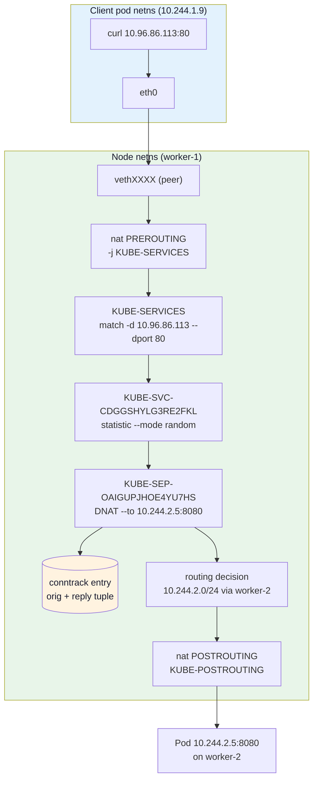
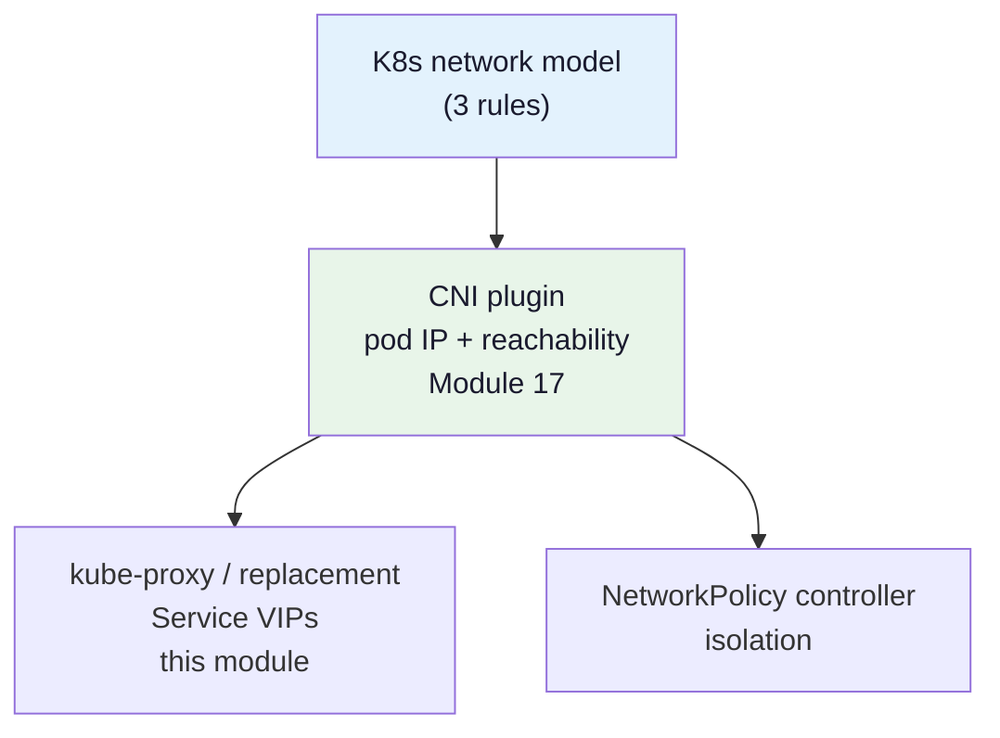
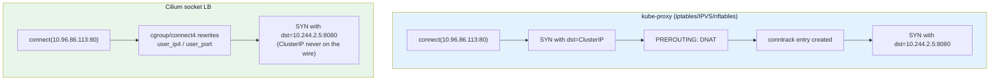
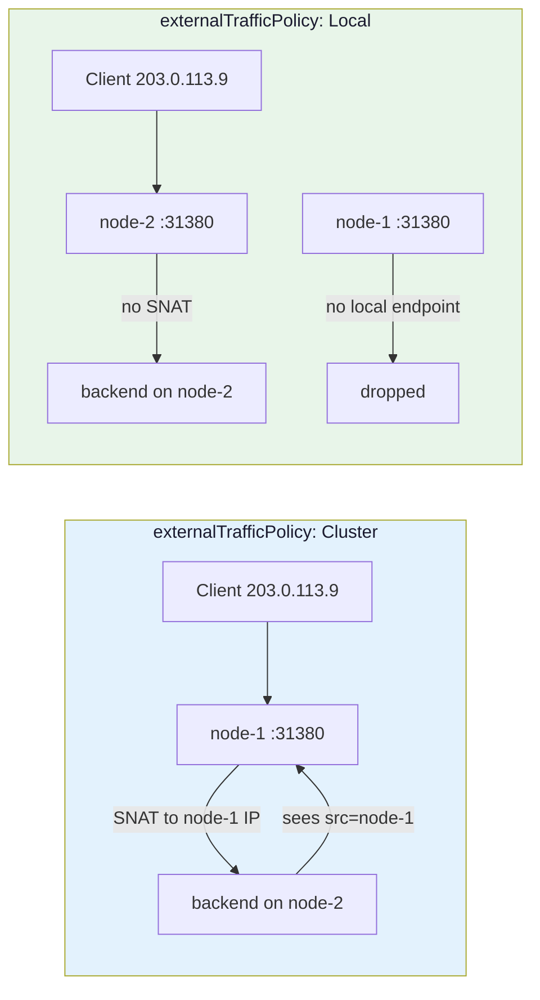

# Module 16: Kubernetes Networking

> **Roadmap Reference:** Phase 5 — Kubernetes Networking & CNI
> **Prerequisite:** [Module 15: Network Namespaces & Virtual Devices](./15-network-namespaces-and-virtual-devices.md) — this module assumes you can already build a veth pair, move one end into a namespace, and read `ip netns` output.

You can write an XDP load balancer. Now answer this: a process inside a pod runs `curl http://10.96.86.113`, an address that appears on **no interface anywhere in the cluster**, and the request is served by one of three pods scattered across three machines. Which lines of which packet-processing rule set made that happen, and what would you look at when it stops working?

This module answers that literally — by reading the actual rules kube-proxy writes, in the order the kernel evaluates them.

---

## 📊 Visual Learning



Two things in that picture surprise people every time:

1. **None of the kube-proxy rules live in the pod's namespace.** The pod's netns has a default route and nothing else. Every service rule is in the *node's* namespace, evaluated after the packet crosses the veth.
2. **The ClusterIP never appears as a destination on the wire beyond that first hop.** DNAT rewrites it in `PREROUTING`, before the routing decision. `tcpdump` on the backend never sees `10.96.86.113`.

---

## The Three Rules of the Kubernetes Network Model

Kubernetes does not implement networking. It specifies a contract and delegates the implementation to a CNI plugin. The contract is short:

| # | Rule | What it forbids |
|---|------|-----------------|
| 1 | Every pod gets its own cluster-unique IP | Port-mapping schemes; two pods sharing a host port space |
| 2 | Pods can reach all other pods on any node **without NAT** | Overlay implementations that SNAT pod-to-pod traffic |
| 3 | Agents on a node (kubelet, node daemons) can reach all pods on that node | Isolating pods from the node they run on |

A fourth property is implied by rule 2 and is the one people actually depend on: **a pod sees the same IP for itself that other pods see for it.** `ip addr` inside the pod and `kubectl get pod -o wide` must agree. If your CNI plugin SNATs pod-to-pod traffic, applications that do peer discovery by reporting their own address break in ways that look like application bugs.

Notice what the contract does *not* say:

- Nothing about Services. Services are a Kubernetes feature layered on top, implemented by kube-proxy (or a replacement), not by the CNI plugin.
- Nothing about how packets reach another node. Route, encapsulate, use BGP — the contract does not care.
- Nothing about isolation. Flat reachability is the **default**; NetworkPolicy is opt-in subtraction on top.



---

## A Pod Is a Network Namespace

[Module 15](./15-network-namespaces-and-virtual-devices.md) built this by hand. A pod is the same thing, created by the container runtime instead of by you: one netns per pod (the "sandbox"), shared by every container in the pod, wired to the node with a veth pair.

That is why containers in a pod reach each other on `localhost`, and why two containers in the same pod cannot both bind port 8080.

### Mapping pod → netns → host veth

`ip netns list` is not the way in. containerd and CRI-O both *do* bind-mount each sandbox namespace into `/var/run/netns`, but under a runtime-generated name — `cni-4f9c1e2a-…` — that carries no pod identity, and `hostNetwork` pods get no entry at all. The mapping from pod to namespace lives in the runtime, so work from the sandbox PID instead. Run this on the node (in kind, `docker exec -it kind-worker bash` first):

```bash
# 1. Find the pod sandbox
crictl pods --name web --no-trunc
# POD ID       CREATED        STATE  NAME             NAMESPACE  ATTEMPT  RUNTIME
# 0d2f1a9c...  3 minutes ago  Ready  web-6f8d9-4kx7z  default    0        (default)

# 2. Sandbox PID -> netns
crictl inspectp -o json 0d2f1a9c... | jq -r '.info.pid'
# 41827
# kind's node image ships no jq. Same number, no dependencies -- crictl
# renders the same document jq would parse:
#   crictl inspectp -o go-template --template '{{.info.pid}}' 0d2f1a9c...

ls -l /proc/41827/ns/net
# lrwxrwxrwx 1 root root 0 ... /proc/41827/ns/net -> 'net:[4026532567]'

# 3. Look inside without ip netns
nsenter -t 41827 -n ip -br addr
# lo               UNKNOWN        127.0.0.1/8
# eth0@if12        UP             10.244.1.4/24

# 4. "@if12" is the peer's ifindex IN THE NODE namespace
ip link | grep '^12:'
# 12: veth9f3a21@if2: <BROADCAST,MULTICAST,UP,LOWER_UP> mtu 1500 ... master cni0
```

`eth0@if12` inside the pod plus `12: vethXXXX@if2` on the node is the veth pair. That `if12` is your handle on the pod from the node side — it is where you attach a TC program to filter one specific pod's traffic, and it is what a CNI plugin creates in [Module 17](./17-cni-plugin-development.md).

If you prefer `ip netns`, adopt the namespace explicitly. Module 15 covers both forms; `ip netns attach` (iproute2 ≥ 5.1) is the tidy one:

```bash
ip netns attach web-pod 41827        # creates the bind mount ip netns expects
# fallback on older iproute2:
#   mkdir -p /var/run/netns && ln -sfT /proc/41827/ns/net /var/run/netns/web-pod

ip netns exec web-pod ip route show
# default via 10.244.1.1 dev eth0
# 10.244.1.0/24 dev eth0 proto kernel scope link src 10.244.1.4

ip netns delete web-pod   # removes only the bind mount, not the pod
```

Look hard at that route table. **There are no service rules in it.** The pod's entire view of the cluster is "default gateway, that way".

---

## Cross-Node Pod Traffic: Native Routing vs Overlay

Rule 2 says pod-to-pod works without NAT. There are exactly two ways to deliver on that.

### Native routing

Each node owns a pod CIDR (`kubectl get node -o jsonpath='{.items[*].spec.podCIDR}'`). Something has to teach the rest of the network that `10.244.2.0/24` lives behind worker-2 — kernel routes installed by an agent on a flat L2 segment, BGP (Calico, Cilium BGP control plane), or the cloud's own route table (AWS VPC CNI, GKE routes).

```bash
# On worker-1, native routing:
ip route
# 10.244.1.0/24 dev cni0 proto kernel scope link src 10.244.1.1
# 10.244.2.0/24 via 172.18.0.4 dev eth0        <-- worker-2's node IP
# 10.244.3.0/24 via 172.18.0.5 dev eth0
```

Full MTU, no encapsulation, packets readable by every middlebox on the path. The cost is that the underlay must accept traffic sourced from pod IPs — which cloud VPCs and anti-spoofing switch configs frequently do not.

### Overlay

Wrap the pod packet in an outer header addressed node-to-node: VXLAN (UDP/8472), Geneve (UDP/6081), or IPIP (protocol 4). The underlay only ever sees node IPs.

```bash
ip route
# 10.244.2.0/24 via 10.244.2.0 dev flannel.1 onlink
ip -d link show flannel.1
# vxlan id 1 local 172.18.0.3 dev eth0 srcport 0 0 dstport 8472 nolearning
```

### The MTU trap

| Encapsulation | Overhead | Pod MTU on a 1500 underlay |
|---------------|----------|----------------------------|
| Native routing | 0 | 1500 |
| IPIP | 20 | 1480 |
| VXLAN | 50 | 1450 |
| VXLAN + IPsec/WireGuard | 50 + ~60 | ~1390 |

If the pod's `eth0` MTU is left at 1500 over a VXLAN underlay, you get the single most confusing failure in Kubernetes networking: **the TCP handshake succeeds, small requests work, and any response over ~1450 bytes hangs forever.** The oversized encapsulated frame is dropped by the underlay, and the ICMP "fragmentation needed" that Path MTU Discovery relies on is either not generated or filtered, so the sender retransmits the same too-big segment until it times out.

Diagnose it from inside the pod, not from the node:

```bash
# Largest payload that fits: MTU - 28 (20 IP + 8 ICMP)
kubectl exec -it web-0 -- ping -M do -s 1422 10.244.2.5   # works  -> 1450 MTU
kubectl exec -it web-0 -- ping -M do -s 1472 10.244.2.5   # fails  -> not 1500

kubectl exec -it web-0 -- ip link show eth0             # what the CNI actually set
kubectl exec -it web-0 -- tracepath -n 10.244.2.5       # reports the pinch point
```

The fix belongs in the CNI configuration, and Module 17 shows where it goes. The lesson here is diagnostic: **"works for small responses, hangs for large ones" is always MTU, never the application.**

---

## ClusterIP: A VIP That Exists Nowhere

```bash
kubectl get svc web
# NAME   TYPE        CLUSTER-IP     EXTERNAL-IP   PORT(S)   AGE
# web    ClusterIP   10.96.86.113   <none>        80/TCP    3m
```

Now go looking for that address:

```bash
# On every node:
ip -br addr | grep 10.96.        # nothing
ip route get 10.96.86.113
# 10.96.86.113 via 172.18.0.1 dev eth0 src 172.18.0.3 uid 0
```

The routing table has no idea what a ClusterIP is; it falls through to the default route. The address is real only inside the NAT rule set — a match key, not an endpoint. Consequences worth internalising:

- **`ping <ClusterIP>` fails, and that is correct.** kube-proxy's rules match `-p tcp` or `-p udp`. An ICMP echo matches nothing, is not DNAT'd, and gets routed to the default gateway, which drops it. Never use ping to test a Service.
- **`telnet <ClusterIP> 80` from a node works** because the same `KUBE-SERVICES` chain is also reached from `OUTPUT`.
- **In IPVS mode this is not true** — there, the ClusterIP *is* bound, to a dummy device called `kube-ipvs0`. Same abstraction, visibly different implementation.

### EndpointSlice is the source of truth

The Service says *what* to match. EndpointSlices say *where to send it*, and they are what kube-proxy watches:

```bash
kubectl get endpointslices -l kubernetes.io/service-name=web -o yaml
```

Abridged — the real output is a `List` with these objects under `items:`:

```yaml
apiVersion: discovery.k8s.io/v1
kind: EndpointSlice
addressType: IPv4
metadata:
  name: web-4kx7z
  labels:
    kubernetes.io/service-name: web
endpoints:
- addresses: ["10.244.1.4"]
  conditions: { ready: true, serving: true, terminating: false }
  nodeName: kind-worker
- addresses: ["10.244.2.5"]
  conditions: { ready: true, serving: true, terminating: false }
  nodeName: kind-worker2
- addresses: ["10.244.3.6"]
  conditions: { ready: true, serving: true, terminating: false }
  nodeName: kind-worker3
ports:
- name: http
  port: 8080
  protocol: TCP
```

Three conditions, not one, and the distinction matters when you write a control plane:

| Condition | Meaning | kube-proxy behaviour |
|-----------|---------|----------------------|
| `ready` | Passing readiness probes and not terminating | Included in the normal backend set |
| `serving` | Can still handle requests, **even while terminating** | Used only when no `ready` endpoints remain |
| `terminating` | Pod has a deletion timestamp | Excluded from new traffic, drained gracefully |

The older `Endpoints` object packs every backend into one resource — 1000 pods means a single object rewritten and pushed to every node on every pod change (and beyond 1000 addresses the API server simply truncates it and annotates the object as over-capacity). EndpointSlice caps each slice at 100 endpoints by default, so a change touches one small object. **The `Endpoints` API is deprecated as of Kubernetes v1.33** — the API server now returns a deprecation warning on reads and writes — so anything you build should watch `discovery.k8s.io/v1`.

Reading it from Go — this is the input side of the agent you will build later:

```go
package main

import (
	"context"
	"fmt"

	discoveryv1 "k8s.io/api/discovery/v1"
	metav1 "k8s.io/apimachinery/pkg/apis/meta/v1"
	"k8s.io/client-go/kubernetes"
	"k8s.io/client-go/tools/clientcmd"
)

func main() {
	cfg, err := clientcmd.BuildConfigFromFlags("", clientcmd.RecommendedHomeFile)
	if err != nil {
		panic(err)
	}
	cs, err := kubernetes.NewForConfig(cfg)
	if err != nil {
		panic(err)
	}

	slices, err := cs.DiscoveryV1().EndpointSlices("default").List(
		context.TODO(),
		metav1.ListOptions{LabelSelector: discoveryv1.LabelServiceName + "=web"},
	)
	if err != nil {
		panic(err)
	}

	for _, s := range slices.Items {
		if s.AddressType != discoveryv1.AddressTypeIPv4 {
			continue
		}
		for _, ep := range s.Endpoints {
			// Every one of these is a pointer, so deref only after a nil check.
			ready := ep.Conditions.Ready != nil && *ep.Conditions.Ready
			node := "<unset>"
			if ep.NodeName != nil {
				node = *ep.NodeName
			}
			for _, addr := range ep.Addresses {
				for _, p := range s.Ports {
					if p.Port == nil {
						continue // nil means "not restricted"; used by headless Services
					}
					fmt.Printf("%s:%d ready=%v node=%s\n",
						addr, *p.Port, ready, node)
				}
			}
		}
	}
}
```

Every field here is a pointer for a reason: `nil` means "unset/unknown", which is not the same as `false`. Treating `Conditions.Ready == nil` as not-ready will silently blackhole a Service.

---

## Hop by Hop Through kube-proxy's iptables Rules

This is the centrepiece. Everything above was setup.

Our example: Service `default/web`, port name `http`, ClusterIP `10.96.86.113:80`, targetPort `8080`, three ready endpoints on `10.244.1.4`, `10.244.2.5`, `10.244.3.6`. Cluster pod CIDR `10.244.0.0/16`.

### Getting the real rules

```bash
docker exec -it kind-worker bash          # kind: the "node" is a container

iptables-save -t nat > /tmp/nat.rules
grep -c '^-A' /tmp/nat.rules              # rule count; watch this grow with the cluster
grep '10.96.86.113' /tmp/nat.rules        # find our service's entry point
```

> **Failure mode — `iptables-save` prints an empty ruleset.** There are two iptables binaries on modern distros: the legacy `xtables` one and the `nf_tables`-backed one. If kube-proxy programmed one backend and you dumped the other, you see nothing and conclude kube-proxy is broken. Check which you are running with `iptables -V` — it prints `(nf_tables)` or `(legacy)` — and try `iptables-legacy-save -t nat` / `iptables-nft-save -t nat` before believing an empty dump.

### Hop 1 — the entry points

```
*nat
-A PREROUTING -m comment --comment "kubernetes service portals" -j KUBE-SERVICES
-A OUTPUT -m comment --comment "kubernetes service portals" -j KUBE-SERVICES
-A POSTROUTING -m comment --comment "kubernetes postrouting rules" -j KUBE-POSTROUTING
```

Two entry points, because there are two kinds of client:

- A **pod** talking to a Service. Its packet arrives on the node's veth from another namespace, so it is *forwarded* traffic and hits `PREROUTING`.
- A **host-network process** (kubelet, a `hostNetwork: true` pod, you on an SSH session) talking to a Service. Its packet is locally generated and never touches `PREROUTING`, so `OUTPUT` catches it.

Both are in the `nat` table, so — exactly as [Module 3](./03-connection-tracking.md) established — **these chains are traversed only for the first packet of a connection.** Hold that thought; the whole load-balancing scheme depends on it.

> On nodes where pods hang off a Linux bridge, `net.bridge.bridge-nf-call-iptables=1` is what makes bridged frames traverse these chains at all. Module 15 covers the sysctl; kubeadm's preflight check enforces it. With it at `0`, pod→Service works from the node and silently fails from pods.

### Hop 2 — KUBE-SERVICES dispatches by destination

```
-A KUBE-SERVICES -d 10.96.86.113/32 -p tcp -m comment --comment "default/web:http cluster IP" -m tcp --dport 80 -j KUBE-SVC-CDGGSHYLG3RE2FKL
-A KUBE-SERVICES -d 10.96.0.10/32   -p udp -m comment --comment "kube-system/kube-dns:dns cluster IP" -m udp --dport 53 -j KUBE-SVC-TCOU7JCQXEZGVUNU
-A KUBE-SERVICES -m comment --comment "kubernetes service nodeports; NOTE: this must be the last rule in this chain" -m addrtype --dst-type LOCAL -j KUBE-NODEPORTS
```

One rule per **service port** — a Service with three ports produces three rules. This chain is a linear scan: the kernel evaluates rules top to bottom until one matches. That is the origin of iptables mode's scaling problem, and we will quantify it shortly.

The chain names are not random. kube-proxy derives them:

```go
// Verbatim from pkg/proxy/iptables/proxier.go (imports: crypto/sha256, encoding/base32).
// 16 characters because an iptables chain name must be <= 28 chars.
func portProtoHash(servicePortName string, protocol string) string {
	hash := sha256.Sum256([]byte(servicePortName + protocol))
	encoded := base32.StdEncoding.EncodeToString(hash[:])
	return encoded[:16]
}

// servicePortName is "<namespace>/<name>:<portName>", protocol is lowercase.
//   portProtoHash("default/web:http", "tcp")          -> "CDGGSHYLG3RE2FKL"
//   portProtoHash("kube-system/kube-dns:dns", "udp")  -> "TCOU7JCQXEZGVUNU"
//
// KUBE-SVC-<hash>  cluster-policy dispatch
// KUBE-SVL-<hash>  local-policy dispatch  (externalTrafficPolicy/internalTrafficPolicy: Local)
// KUBE-EXT-<hash>  external destinations  (NodePort, LoadBalancer, externalIPs)
// KUBE-SEP-<hash>  one per endpoint; hashes servicePortName+protocol+"IP:port"
```

That is why `KUBE-SVC-TCOU7JCQXEZGVUNU` appears on every Kubernetes cluster you have ever touched — it is the first 16 base32 characters of `sha256("kube-system/kube-dns:dns" + "udp")`, and that input is the same everywhere. It is also why **an SEP chain name changes when a pod IP changes**: the endpoint address is part of the hash. Content-addressed names let kube-proxy diff its desired state against the live ruleset cheaply.

### Hop 3 — KUBE-SVC-XXXX picks a backend

```
-A KUBE-SVC-CDGGSHYLG3RE2FKL ! -s 10.244.0.0/16 -d 10.96.86.113/32 -p tcp -m comment --comment "default/web:http cluster IP" -m tcp --dport 80 -j KUBE-MARK-MASQ
-A KUBE-SVC-CDGGSHYLG3RE2FKL -m comment --comment "default/web:http -> 10.244.1.4:8080" -m statistic --mode random --probability 0.33333333349 -j KUBE-SEP-LOQZ6LJZSXX5P3TW
-A KUBE-SVC-CDGGSHYLG3RE2FKL -m comment --comment "default/web:http -> 10.244.2.5:8080" -m statistic --mode random --probability 0.50000000000 -j KUBE-SEP-OAIGUPJHOE4YU7HS
-A KUBE-SVC-CDGGSHYLG3RE2FKL -m comment --comment "default/web:http -> 10.244.3.6:8080" -j KUBE-SEP-KKB4FOGWHVA4OUML
```

Rule 1 is bookkeeping: traffic to the ClusterIP that did **not** originate inside the pod CIDR came from off-cluster, so its reply would never find its way back through this node. Mark it for masquerade. (The `! -s 10.244.0.0/16` test exists only because kube-proxy was told the cluster CIDR; that is what `--cluster-cidr` is for.)

Rules 2–4 are the load balancer. Look at the probabilities: **0.333…, 0.5, then nothing.** Not 0.333 three times.

### Why the probabilities are 1/n, 1/(n−1), … , 1

Because iptables rules are evaluated **sequentially, and a rule is only reached if every rule before it failed to match**. The `--probability` on rule *k* is a *conditional* probability — the chance of picking backend *k* **given** that backends 1…k−1 were already skipped.

| Rule | Target | Reached with probability | `--probability` | Selected with probability |
|------|--------|--------------------------|-----------------|---------------------------|
| 2 | SEP-A (10.244.1.4) | 1 | 1/3 | 1 × 1/3 = **1/3** |
| 3 | SEP-B (10.244.2.5) | 2/3 | 1/2 | 2/3 × 1/2 = **1/3** |
| 4 | SEP-C (10.244.3.6) | 1/3 | *(unconditional)* | 1/3 × 1 = **1/3** |

The general form: if rule *k* of *n* carries probability p<sub>k</sub> = 1/(n−k+1), then

```
P(select k) = p_k * Π_{i<k} (1 - p_i)
            = 1/(n-k+1) * Π_{i=1}^{k-1} (n-i)/(n-i+1)
            = 1/(n-k+1) * (n-k+1)/n            <- the product telescopes
            = 1/n
```

Uniform, for every backend, in exactly *n* rules. The last rule needs no `--probability` at all — by then the remaining probability mass is exactly 1/n, so an unconditional jump is correct and, crucially, **guarantees a match**.

**What happens if you naively use 1/n everywhere?** 1/3, then (2/3)(1/3) = 2/9, then (4/9)(1/3) = 4/27. That is 19/27 of traffic distributed and **8/27 falling off the end of the chain** with no DNAT applied. Those packets return to `KUBE-SERVICES`, finish `PREROUTING` still addressed to `10.96.86.113`, get routed to the default gateway, and vanish. About 30% of connections to your Service would time out. The conditional-probability chain is not an optimisation; it is what makes the scheme correct.

Here is kube-proxy generating it, verbatim in spirit:

```go
// pkg/proxy/iptables/proxier.go
func computeProbability(n int) string {
	return fmt.Sprintf("%0.10f", 1.0/float64(n))
}

// ...writing the load-balancing rules:
numEndpoints := len(endpoints)
for i, ep := range endpoints {
	args := []string{"-A", string(svcChain), "-m", "comment", "--comment", comment}
	if i < numEndpoints-1 {
		args = append(args, "-m", "statistic", "--mode", "random",
			"--probability", proxier.probability(numEndpoints-i)) // 1/(n-i)
	}
	// The final (or only) rule is a guaranteed match.
	natRules.Write(args, "-j", string(ep.ChainName))
}
```

### Why `iptables-save` prints 0.33333333349

kube-proxy emits `0.3333333333` (ten decimals). The dump reads back `0.33333333349`. Neither is a typo. `xt_statistic` stores the probability as a 32-bit fixed-point fraction scaled by 2³¹, so userspace rounds on the way in and un-scales on the way out:

```
in:   lround(0.3333333333 × 2^31) = 715827883
out:  715827883 / 2^31            = 0.33333333348...  -> printed with %.11f
```

The granularity is 1/2147483648. For each packet the match draws a fresh 31-bit random number and matches when it falls below the stored value. Two consequences:

- The selection is **per packet, not per connection**. It only behaves like per-connection load balancing because conntrack short-circuits the nat table after the first packet.
- With small numbers of connections the distribution looks lumpy. Ten curls landing 6/2/2 across three backends is ordinary sampling noise, not a bug. Do not go hunting.

### The tie back to Module 4

You have already written this exact pattern by hand. From [Module 4](./04-iptables-mastery.md), the multi-WAN splitter:

```bash
# 70% of NEW connections to ISP1...
iptables -t mangle -A PREROUTING -i $LAN_IF -m conntrack --ctstate NEW \
    -m statistic --mode random --probability 0.70 -j MARK --set-mark 1

# ...and everything that fell through gets ISP2 (the unconditional "last rule")
iptables -t mangle -A PREROUTING -i $LAN_IF -m conntrack --ctstate NEW \
    -m mark --mark 0 -j MARK --set-mark 2
```

Same structure: n−1 probabilistic rules plus one unconditional catch-all. Same match module. Same reason the last rule carries no probability. With two buckets, 1/(n−k+1) for k=1 is 1/2 — and 0.70 is just the weighted version of it.

The one real difference is **connection stickiness**. Module 4 needed `CONNMARK --save-mark` / `--restore-mark` to keep a flow on one ISP, because a *mark* is per-packet state that the kernel does not remember. kube-proxy needs no such thing, because the thing it is choosing — a DNAT translation — *is* conntrack state, and the kernel replays it automatically. You got persistence for free by choosing a NAT target instead of a mark.

### Hop 4 — KUBE-SEP-XXXX does the translation

```
-A KUBE-SEP-OAIGUPJHOE4YU7HS -s 10.244.2.5/32 -m comment --comment "default/web:http" -j KUBE-MARK-MASQ
-A KUBE-SEP-OAIGUPJHOE4YU7HS -p tcp -m comment --comment "default/web:http" -m tcp -j DNAT --to-destination 10.244.2.5:8080
```

Rule 2 is the payload: destination `10.96.86.113:80` becomes `10.244.2.5:8080`. Note that both the address **and** the port change — that is `targetPort` being applied.

Rule 1 is the **hairpin** rule, and it is subtle. If the pod that sent this request *is* `10.244.2.5` — a pod reaching its own Service and being load-balanced back to itself — then after DNAT the packet has source `10.244.2.5` and destination `10.244.2.5`. It would be delivered, and the reply would be generated locally with source and destination swapped, arriving at the application from an address it never sent to. TCP rejects it. Masquerading rewrites the source to the node IP so the reply has somewhere sane to go. Every SEP chain carries a hairpin rule keyed on its own endpoint IP.

### Hop 5 — conntrack takes over

`DNAT` is a terminating target. `PREROUTING` ends, the routing decision runs against the *new* destination, and the packet is forwarded to worker-2. Meanwhile the kernel has committed a conntrack entry:

```bash
conntrack -E -p tcp --dport 80
```

```
[NEW] tcp 6 120 SYN_SENT  src=10.244.1.9 dst=10.96.86.113 sport=45678 dport=80 \
      [UNREPLIED] src=10.244.2.5 dst=10.244.1.9 sport=8080 dport=45678
[UPDATE] tcp 6 60 SYN_RECV src=10.244.1.9 dst=10.96.86.113 sport=45678 dport=80 \
      src=10.244.2.5 dst=10.244.1.9 sport=8080 dport=45678
[UPDATE] tcp 6 86400 ESTABLISHED ... [ASSURED]
```

Read the two tuples. The **original** tuple is what the client sent (`→ 10.96.86.113:80`). The **reply** tuple is what the kernel expects back, and its source is `10.244.2.5:8080` — *that is the backend that was chosen*. This is the single most useful diagnostic in this whole module: `conntrack -L -d <ClusterIP>` tells you which backend every live connection went to, without touching the application.

Every subsequent packet in this flow matches the conntrack entry, gets the same translation replayed, and **never re-enters `KUBE-SVC`**. The `--mode random` roll happened once.

### Hop 6 — KUBE-POSTROUTING and the masquerade mark

```
-A KUBE-MARK-MASQ -j MARK --or-mark 0x4000
-A KUBE-POSTROUTING -m mark ! --mark 0x4000/0x4000 -j RETURN
-A KUBE-POSTROUTING -j MARK --xor-mark 0x4000
-A KUBE-POSTROUTING -m comment --comment "kubernetes service traffic requiring SNAT" -j MASQUERADE --random-fully
```

A two-phase design: earlier chains *decide* (set bit `0x4000`) and `POSTROUTING` *acts*. Unmarked packets `RETURN` immediately, which is the common case and keeps the hot path short. The `--xor-mark` clears the bit before masquerading so a packet re-entering the stack is not masqueraded twice.

`--random-fully` randomises source-port selection during SNAT. Without it, parallel connections from the same source can race for the same translated port; one loses and its packet is dropped. This is half of the classic "DNS takes exactly 5 seconds" bug we come back to below.

### Scaling: what this costs

Count the rules we walked: 1 in `KUBE-SERVICES`, 1 masquerade + *n* probability rules in `KUBE-SVC`, and 2 per `KUBE-SEP` chain. That is **2 + 3n `nat` rules per service port**.

| Cluster size | Approx. `nat` rules | Consequence |
|--------------|---------------------|-------------|
| 100 services × 3 endpoints | ~1,100 | Unnoticeable |
| 1,000 services × 10 endpoints | ~32,000 | First-packet latency measurably up |
| 5,000 services × 10 endpoints | ~160,000 | kube-proxy resync takes seconds |
| 10,000 services × 10 endpoints | ~320,000 | Resyncs take minutes; endpoint changes propagate late |

Two separate costs, often confused:

1. **Per-packet:** `KUBE-SERVICES` is a linear scan, so matching is O(number of service ports) — but only for the first packet of a connection. Established flows pay nothing.
2. **Per-change:** kube-proxy must reconcile the ruleset. Since v1.28 it only rewrites chains whose Service or EndpointSlice actually changed, which removed most of the pain, but the full periodic resync still scales with the total.

Watch it directly:

```bash
kubectl -n kube-system port-forward ds/kube-proxy 10249:10249 &
curl -s localhost:10249/metrics | grep -E \
  'kubeproxy_sync_proxy_rules_duration_seconds_(sum|count)|kubeproxy_sync_proxy_rules_last_timestamp_seconds'
```

(kube-proxy binds its metrics endpoint to `127.0.0.1:10249` by default. `port-forward` still reaches it: kubelet dials `localhost` *inside the target pod's own network namespace*, which is exactly why a 127.0.0.1-bound port is reachable this way and never through a Service. For kube-proxy that namespace is the node's anyway, since it runs with `hostNetwork: true`.)

If `kubeproxy_sync_proxy_rules_duration_seconds` climbs into whole seconds, endpoint changes are landing late and you will see traffic sent to terminated pods during rollouts. That is the signal to move to nftables or eBPF mode — not a vague dislike of iptables.

### Diagnosing the four failures you will actually hit

**"Connection refused, immediately."** The Service has zero ready endpoints. kube-proxy does not write a `KUBE-SVC` chain at all; it writes a REJECT into the **filter** table instead — which is why you get an instant refusal rather than a timeout.

```bash
iptables-save -t filter | grep 10.96.86.113
# -A KUBE-SERVICES -d 10.96.86.113/32 -p tcp -m comment --comment "default/web:http has no endpoints" \
#    -m tcp --dport 80 -j REJECT --reject-with icmp-port-unreachable

kubectl get endpointslices -l kubernetes.io/service-name=web
kubectl get pods -l app=web -o wide     # readiness probe failing? selector typo?
```
Nine times in ten the Service's `spec.selector` does not match the pod labels.

**"Connection times out."** The rules exist and the packet was DNAT'd, but the backend is unreachable. Confirm the DNAT happened, then chase the pod network:
```bash
conntrack -L -d 10.96.86.113          # is there a reply tuple? which backend?
ip route get 10.244.2.5               # does this node know how to reach it?
```
If conntrack shows `[UNREPLIED]`, the translation worked and the problem is downstream: cross-node routing, MTU, or NetworkPolicy.

**"Rule counters look far too low for the traffic."** Expected. `nat`-table counters count *connections*, not packets, because conntrack bypasses the chain after the first packet. A service moving gigabytes over ten long-lived connections shows a packet count of ten. Use these counters to count new connections, never throughput.
```bash
iptables -t nat -L KUBE-SVC-CDGGSHYLG3RE2FKL -v -n
```

**"A UDP service keeps hitting a pod that was deleted."** UDP has no close, so a conntrack entry created before the pod died keeps replaying a DNAT to a dead address until it expires (30s idle by default). kube-proxy explicitly flushes stale conntrack entries when UDP endpoints disappear; if you are writing your own datapath, you must too.
```bash
conntrack -D --orig-dst 10.96.86.113 -p udp
```

---

## IPVS Mode

IPVS moves backend selection out of a linear rule scan and into an in-kernel hash table.

```bash
# In the kube-proxy pod / on the node:
ipvsadm -Ln
# TCP  10.96.86.113:80 rr
#   -> 10.244.1.4:8080   Masq  1  0  0
#   -> 10.244.2.5:8080   Masq  1  0  0
#   -> 10.244.3.6:8080   Masq  1  0  0

ip -br addr show kube-ipvs0     # every ClusterIP is bound to this dummy device
```

| Aspect | iptables mode | IPVS mode |
|--------|---------------|-----------|
| Backend lookup | Linear chain scan | Hash table, O(1) |
| Rules per service port | 2 + 3×endpoints | 1 virtual server + n real servers |
| Scheduling | Random only | `rr`, `wrr`, `lc`, `wlc`, `sh`, `dh`, `sed`, `nq`, `mh` |
| ClusterIP visible on an interface | No | Yes (`kube-ipvs0`) |
| Still needs iptables | — | Yes: masquerade + a handful of ipsets |
| Conntrack | Yes | Yes |

It still needs iptables for masquerading and for matching aggregated destination sets, but it uses **ipsets** (`KUBE-CLUSTER-IP`, `KUBE-LOOP-BACK`, `KUBE-NODE-PORT-TCP`) so the number of iptables rules stays constant regardless of Service count.

> **Status:** IPVS mode is **deprecated as of Kubernetes v1.35**. kube-proxy logs the deprecation at startup and posts an `IPVSDeprecation` warning Event on the Node: *"The ipvs proxier has been deprecated and will be disabled by default in Kubernetes 1.40 and removed in Kubernetes 1.43. Migrate to the 'nftables' proxier instead."* Do not choose it for new clusters. The recommended replacement for large clusters on Linux is nftables mode. Learn IPVS because you will inherit clusters running it, and because `ipvsadm -Ln --stats` is an excellent debugging surface — not because you should deploy it.

---

## nftables Mode

nftables mode reached **GA in Kubernetes v1.33** and is the recommended kube-proxy mode on modern Linux nodes. iptables remains the default for compatibility.

```bash
# Enable per-cluster
kube-proxy --proxy-mode nftables
# or in the KubeProxyConfiguration: mode: nftables

nft list table ip kube-proxy
```

Everything lives in a single table `kube-proxy` in the `ip` (and `ip6`) family. Chain names are readable rather than opaque: `service-<HASH8>-<ns>/<name>/<proto>/<portName>`, where the 8-character base32 SHA-256 prefix exists to keep names unique if the readable part has to be truncated, and to keep chains that differ in a single digit visually distinguishable. Our example service comes out as:

```
chain services {
  ip daddr . meta l4proto . th dport vmap @service-ips
  fib daddr type local ip daddr != 127.0.0.0/8 meta l4proto . th dport vmap @service-nodeports
}

chain service-SUSTUHLJ-default/web/tcp/http {
  ip daddr 10.96.86.113 tcp dport 80 ip saddr != 10.244.0.0/16 jump mark-for-masquerade
  numgen random mod 3 vmap {
    0 : goto endpoint-S6J4REDL-default/web/tcp/http__10.244.1.4/8080,
    1 : goto endpoint-3XXNECN6-default/web/tcp/http__10.244.2.5/8080,
    2 : goto endpoint-45F3EY6H-default/web/tcp/http__10.244.3.6/8080
  }
}

chain endpoint-3XXNECN6-default/web/tcp/http__10.244.2.5/8080 {
  ip saddr 10.244.2.5 jump mark-for-masquerade
  meta l4proto tcp dnat to 10.244.2.5:8080
}
```

The two masquerade rules are the same two you met in iptables mode — the off-cluster-source rule and the hairpin rule — just spelled `jump mark-for-masquerade` instead of `-j KUBE-MARK-MASQ`.

Compare that with the iptables chain we walked. Same semantics, completely different shape:

| | iptables mode | nftables mode |
|---|---------------|---------------|
| Backend selection | n−1 conditional `--probability` rules | one `numgen random mod n vmap` |
| Cost per selection | O(n) rule evaluations | O(1) map lookup |
| Probability arithmetic | 1/n, 1/(n−1), … | none — `mod n` is already uniform |
| Service dispatch | Linear scan of `KUBE-SERVICES` | Verdict map keyed on `(daddr, proto, dport)` |
| Rule updates | Rewrite affected chains | Incremental, transactional |

The conditional-probability trick you just learned exists **only because iptables lacks a way to say "pick one of n"**. nftables has `numgen`, so the whole construction evaporates. That is worth remembering: most of the cleverness in iptables-era Kubernetes is working around one missing primitive.

---

## eBPF Mode: Cilium's Socket Load Balancer

All three modes above translate the packet. Cilium's `kubeProxyReplacement` does something more aggressive: it translates the **socket**, before a packet exists at all.



[Module 13](./13-socket-programming.md) introduced the `cgroup/connect4` hook. This is what it is for in production:

```c
// Illustrative: the shape of Cilium's socket LB. vmlinux.h supplies
// struct bpf_sock_addr, BPF_MAP_TYPE_HASH and IPPROTO_TCP (all types and
// enums); bpf_helpers.h supplies SEC/__uint/__type and the helper
// prototypes, because vmlinux.h carries no macros and no prototypes.
// No byte-order helpers are needed here: every value stays in network
// byte order from the map to the socket, so bpf_endian.h is not included.
#include "vmlinux.h"
#include <bpf/bpf_helpers.h>

struct lb4_key {
    __be32 address;     /* ClusterIP, network byte order */
    __be16 dport;       /* service port, network byte order */
    __u16  backend_slot;
};

struct lb4_backend {
    __be32 address;
    __be16 port;
    __u16  pad;
};

struct {
    __uint(type, BPF_MAP_TYPE_HASH);
    __uint(max_entries, 65536);
    __type(key, struct lb4_key);
    __type(value, struct lb4_backend);
} lb4_services SEC(".maps");

SEC("cgroup/connect4")
int sock4_connect(struct bpf_sock_addr *ctx)
{
    if (ctx->protocol != IPPROTO_TCP)
        return 1;                       /* 1 = allow connect() unchanged */

    struct lb4_key key = {
        .address      = ctx->user_ip4,  /* already network byte order */
        .dport        = (__u16)ctx->user_port,
        .backend_slot = 0,
    };

    struct lb4_backend *be = bpf_map_lookup_elem(&lb4_services, &key);
    if (!be)
        return 1;                       /* not a service VIP: leave it alone */

    /* user_ip4 and user_port are 32-bit fields holding network-byte-order
       values; the kernel reads the low 16 bits of user_port. */
    ctx->user_ip4  = be->address;
    ctx->user_port = be->port;
    return 1;
}

char LICENSE[] SEC("license") = "GPL";
```

Two things this simplification skips. Returning `0` here would reject the `connect()` with `EPERM` instead of rewriting it — which is exactly how socket-level policy enforcement works, and why it surfaces to the application as a `connect()` error rather than a dropped packet. And `backend_slot` is pinned to `0` above, which only works for a single backend: real Cilium stores the backend *count* at slot 0 and the backends at slots `1..count`, then draws a random slot for each `connect()`. That is where the load balancing actually happens — the same choice kube-proxy makes with `--probability`, moved into a map lookup.

What changes operationally:

| | kube-proxy | Cilium socket LB |
|---|-----------|------------------|
| Where translation happens | Per packet, in `PREROUTING` | Once, in `connect()` |
| Conntrack entry for the VIP | Yes | **No** — the kernel only ever sees pod→backend |
| Packet on the pod's `eth0` | dst = ClusterIP | dst = **backend IP** |
| `getpeername()` returns | ClusterIP | backend IP, unless `cgroup/getpeername4` restores the VIP |
| Backend count cost | O(n) rules or O(1) hash | O(1) map lookup |
| Applies to | Everything on the node | Everything under the attached cgroup v2 hierarchy |

That third row is the diagnostic tell, and it is the thing that confuses people migrating to Cilium: **you `tcpdump` inside the pod expecting to see the ClusterIP, and it is simply not there.** Nothing is broken. The rewrite happened above the network stack.

```bash
# Confirm the replacement is active
kubectl -n kube-system exec ds/cilium -- cilium-dbg status --verbose | grep -A6 KubeProxyReplacement
# (older releases name the binary `cilium` rather than `cilium-dbg`)

# The service table and its BPF backing map
kubectl -n kube-system exec ds/cilium -- cilium-dbg service list
kubectl -n kube-system exec ds/cilium -- cilium-dbg bpf lb list

# From the node: see the cgroup attachments directly
bpftool cgroup tree /sys/fs/cgroup | grep -E 'connect4|sendmsg4|getpeername4'
```

Related hooks in the same family, all real: `cgroup/sendmsg4` and `cgroup/recvmsg4` for unconnected UDP (DNS, notably), `cgroup/getpeername4` (kernel 5.8+) so `getpeername()` still reports the VIP, and `cgroup/post_bind4`. Node-external traffic that never traverses a socket on this node — NodePort from outside — still needs a per-packet path, which Cilium implements in XDP/TC.

---

## NodePort and ExternalTrafficPolicy

NodePort opens the same port on **every** node, whether or not that node runs a backend:

```
-A KUBE-SERVICES -m comment --comment "kubernetes service nodeports; NOTE: this must be the last rule in this chain" -m addrtype --dst-type LOCAL -j KUBE-NODEPORTS
-A KUBE-NODEPORTS -p tcp -m comment --comment "default/web:http" -m tcp --dport 31380 -j KUBE-EXT-CDGGSHYLG3RE2FKL
-A KUBE-EXT-CDGGSHYLG3RE2FKL -m comment --comment "masquerade traffic for default/web:http external destinations" -j KUBE-MARK-MASQ
-A KUBE-EXT-CDGGSHYLG3RE2FKL -j KUBE-SVC-CDGGSHYLG3RE2FKL
```

The `--dst-type LOCAL` guard means only traffic addressed to one of the node's own IPs is considered — and the comment insisting this be the last rule is load-bearing: it must not shadow ClusterIP matches.

Note the unconditional `KUBE-MARK-MASQ` in the `KUBE-EXT` chain. That is `externalTrafficPolicy: Cluster` (the default) and it is where the client IP dies.

### Cluster vs Local



| | `Cluster` (default) | `Local` |
|---|---------------------|---------|
| Client source IP | Lost (SNAT to node IP) | **Preserved** |
| Extra network hop | Possible | Never |
| Traffic spread | Even across all backends | Proportional to backends *per node* |
| Nodes without a backend | Forward to another node | **Blackhole the traffic** |
| Dispatch chain | `KUBE-SVC-XXXX` | `KUBE-SVL-XXXX` (local endpoints only) |
| Needs LB health checking | No | Yes — `healthCheckNodePort` |

`Local` is why `healthCheckNodePort` exists. Kubernetes allocates a port (30000–32767) that serves HTTP on every node, returning 200 with a count of local endpoints and 503 when there are none. Your external load balancer must probe it and stop sending to nodes that answer 503. **A `Local` Service behind a load balancer that health-checks the service port instead of `healthCheckNodePort` will blackhole a fraction of traffic equal to the fraction of nodes without a backend** — an intermittent failure that scales with cluster size.

```bash
kubectl get svc web -o jsonpath='{.spec.healthCheckNodePort}{"\n"}'
curl -s http://<node-ip>:<healthCheckNodePort>/healthz
# {
#   "service": { "namespace": "default", "name": "web" },
#   "localEndpoints": 2,
#   "serviceProxyHealthy": true
# }
```

`localEndpoints: 0` is the 503 case. Note the second condition: kube-proxy also answers 503 when *it* is unhealthy, even with local endpoints present.

`internalTrafficPolicy: Local` is the same idea for cluster-internal traffic: only route to backends on the calling node, and fail if there are none. Useful for node-local daemons; a foot-gun for ordinary Services. For "prefer close but still fall back", use `spec.trafficDistribution` instead.

---

## CoreDNS and the `ndots:5` Amplification

Every pod gets a resolver configuration written by kubelet:

```bash
kubectl exec -it web-0 -- cat /etc/resolv.conf
```
```
search default.svc.cluster.local svc.cluster.local cluster.local
nameserver 10.96.0.10
options ndots:5
```

`ndots:5` tells glibc: *if a name contains fewer than 5 dots, try the search domains first.* That makes short in-cluster names work — `web` resolves via `web.default.svc.cluster.local`, and `web.other-ns` via `web.other-ns.svc.cluster.local`. It also means:

```
$ curl https://api.github.com    # "api.github.com" has 2 dots -> search list first
  api.github.com.default.svc.cluster.local   NXDOMAIN
  api.github.com.svc.cluster.local           NXDOMAIN
  api.github.com.cluster.local               NXDOMAIN
  api.github.com                             -> 140.82.121.6
```

Four queries — and glibc issues **A and AAAA in parallel**, so eight packets to CoreDNS for one external hostname. In a cluster doing heavy outbound HTTP this is the single largest source of DNS load, and it shows up as CoreDNS CPU saturation that looks unrelated to anything you changed.

```bash
kubectl exec -it web-0 -- sh -c 'time nslookup api.github.com'
kubectl -n kube-system logs -l k8s-app=kube-dns --tail=50   # after enabling the `log` plugin
```

Three fixes, in order of preference:

```yaml
# 1. Fully qualify with a trailing dot (0 extra queries). Free.
#    https://api.github.com.  -- ndots is skipped entirely for absolute names.

# 2. Lower ndots per workload. In-cluster names then need more qualification.
spec:
  dnsConfig:
    options:
      - name: ndots
        value: "2"

# 3. NodeLocal DNSCache: a DaemonSet caching resolver on 169.254.20.10,
#    which also removes the SNAT hop for DNS entirely.
```

### The 5-second DNS timeout

The classic symptom: DNS resolution that *works* but takes exactly 5.00 seconds, intermittently, under load. Five seconds is glibc's resolver retry timeout, so this is a **lost packet**, not a slow server.

The cause is a race in conntrack. glibc sends the A and AAAA queries from the *same* socket at nearly the same instant, so the two UDP datagrams share a 5-tuple and hit netfilter on different CPUs simultaneously. Neither has a conntrack entry yet, so both are treated as `NEW`, both run the NAT chains, and both try to insert. One insert loses the race and its packet is silently dropped. The resolver waits out its 5-second timeout and retries.

There are actually two distinct races wearing the same symptom, which is why the mitigations look unrelated: the **DNAT insert clash** on the way to the CoreDNS ClusterIP, and — when the traffic is also masqueraded — a **SNAT source-port allocation collision**, where both packets are assigned the same translated port and one is dropped at insert time.

| Mitigation | Mechanism |
|------------|-----------|
| `--random-fully` on MASQUERADE | Removes the source-port allocation collision (kube-proxy always sets it) |
| Kernel ≥ 5.0 (the netfilter conntrack/NAT clash-resolution fixes) | Removes the DNAT-side insert race |
| `options single-request-reopen` in `dnsConfig` | A and AAAA use separate sockets, so no simultaneous insert |
| NodeLocal DNSCache | DNS never gets SNAT'd at all — the fix that actually eliminates the class |

If you see exactly-5-second latencies anywhere in a cluster, check DNS before anything else. Details and the full history are in [kubernetes/kubernetes#56903](https://github.com/kubernetes/kubernetes/issues/56903).

---

## Ingress vs Gateway API

Services stop at L4. HTTP routing needs another layer.

**Ingress** put everything — hostnames, paths, TLS, and every implementation-specific knob — into one object that every team edits. Because the spec covers so little, real usage is annotation soup: `nginx.ingress.kubernetes.io/rewrite-target`, `alb.ingress.kubernetes.io/...`. Those annotations are neither portable nor validated. **The Ingress API is feature-frozen**; it still works and is not going away, but nothing new lands there.

**Gateway API** splits the object along organisational lines and made `GatewayClass`, `Gateway` and `HTTPRoute` GA at `v1` in October 2023. `GRPCRoute` followed in Gateway API v1.1; `TCPRoute`, `UDPRoute` and `TLSRoute` are still `v1alpha2` and ship only in the experimental channel, so check the channel before you rely on one.

| Resource | Scope | Owned by | Answers |
|----------|-------|----------|---------|
| `GatewayClass` | Cluster | Infrastructure provider | Which controller implements this? |
| `Gateway` | Namespace | Cluster operator | Which ports/protocols/certs are exposed, and which namespaces may attach? |
| `HTTPRoute` / `GRPCRoute` / `TCPRoute` | Namespace | Application developer | Which requests go to which Service? |
| `ReferenceGrant` | Namespace | Namespace owner | May a route in namespace A target a Service in namespace B? |

```yaml
apiVersion: gateway.networking.k8s.io/v1
kind: Gateway
metadata:
  name: prod-gateway
  namespace: infra
spec:
  gatewayClassName: cilium
  listeners:
    - name: https
      protocol: HTTPS
      port: 443
      tls:
        certificateRefs:
          - name: prod-tls
      allowedRoutes:
        namespaces:
          from: Selector
          selector:
            matchLabels: { gateway-access: "true" }
---
apiVersion: gateway.networking.k8s.io/v1
kind: HTTPRoute
metadata:
  name: web
  namespace: shop
spec:
  parentRefs:
    - name: prod-gateway
      namespace: infra
  hostnames: ["shop.example.com"]
  rules:
    - matches:
        - path: { type: PathPrefix, value: /api }
      backendRefs:
        - name: web
          port: 80
          weight: 90
        - name: web-canary
          port: 80
          weight: 10
```

Two things Ingress could never express portably are right there in the spec: **weighted traffic splitting** (`weight: 90`/`10` — canary deploys without an annotation dialect) and **explicit cross-namespace authorisation** (`allowedRoutes`, plus `ReferenceGrant` on the target side).

The authorisation is genuinely two-sided, and that trips people up on first contact. The route above attaches only if namespace `shop` carries the label `gateway-access: "true"` — the Gateway owner's decision. `ReferenceGrant` is the mirror-image control: it is what the *target* namespace publishes to allow a `backendRef` from somewhere else. Attaching a route to a Gateway and pointing a `backendRef` at a Service in another namespace are two separate permissions.

Underneath, a Gateway is still a Service. `kubectl get svc` in the gateway's namespace shows a LoadBalancer or NodePort, and everything you learned about `externalTrafficPolicy` applies unchanged.

---

## Lab: Trace a curl to a ClusterIP, End to End

### Build the cluster

```yaml
# kind-3node.yaml
kind: Cluster
apiVersion: kind.x-k8s.io/v1alpha4
networking:
  podSubnet: "10.244.0.0/16"
  serviceSubnet: "10.96.0.0/16"
  kubeProxyMode: "iptables"
nodes:
  - role: control-plane
  - role: worker
  - role: worker
```

```bash
kind create cluster --name netlab --config kind-3node.yaml
kubectl get nodes -o wide
```

### Deploy a Service with three backends

`nginx-unprivileged` listens on 8080, so the `port: 80` → `targetPort: 8080` rewrite is visible in the DNAT rule.

```bash
kubectl create deployment web --image=nginxinc/nginx-unprivileged:alpine --replicas=3
kubectl expose deployment web --port=80 --target-port=8080
kubectl get pods -l app=web -o wide
kubectl get svc web
```

> `kubectl expose` creates a single **unnamed** port, so the string kube-proxy hashes is `"default/web:"` (note the trailing colon) rather than `"default/web:http"`. Your chain names will not match the ones printed earlier in this module: you will get `KUBE-SVC-BIJGBSD4RZCCZX5R`, because `portProtoHash("default/web:", "tcp") == "BIJGBSD4RZCCZX5R"`. Feed your own values through `portProtoHash` to confirm any of the others.

### Step 1 — Prove the ClusterIP is fictional

```bash
SVC=$(kubectl get svc web -o jsonpath='{.spec.clusterIP}')
docker exec netlab-worker ip -br addr | grep "$SVC" || echo "not on any interface (expected)"
docker exec netlab-worker ip route get "$SVC"
kubectl run probe --rm -it --image=nicolaka/netshoot --restart=Never -- ping -c2 "$SVC" || true
# ping fails: no rule matches ICMP. This is correct behaviour.
```

### Step 2 — Read your own rules

```bash
docker exec -it netlab-worker bash      # everything in this block runs on the node

SVC=<paste the ClusterIP>
iptables-save -t nat | grep -F "$SVC"                     # -> the KUBE-SVC chain name
SVC_CHAIN=$(iptables-save -t nat | grep -F "$SVC" | grep -o 'KUBE-SVC-[A-Z2-7]*' | head -1)
iptables -t nat -L "$SVC_CHAIN" -n -v --line-numbers      # the probability chain
for c in $(iptables-save -t nat | grep -- "-A $SVC_CHAIN " | grep -o 'KUBE-SEP-[A-Z2-7]*' | sort -u); do
  echo "== $c"; iptables -t nat -L "$c" -n
done
```

(`[A-Z2-7]` is exactly the base32 alphabet those 16-character hashes are drawn from. `0`, `1`, `8` and `9` never appear in one.)

Confirm on your own output: n−1 rules carry `--probability`, the last does not, and the values are 1/n, 1/(n−1), … Add a replica (`kubectl scale deployment web --replicas=4`) and re-read the chain — all the probabilities change, because they are relative.

### Step 3 — Watch conntrack choose

```bash
# Terminal A, on the node:
conntrack -E -p tcp --dport 80

# Terminal B:
kubectl run c1 --rm -it --image=nicolaka/netshoot --restart=Never -- curl -s -o /dev/null -w '%{http_code}\n' http://$SVC
```

In the `[NEW]` event, read the **reply tuple's source** — that is the backend the probability chain picked. Run it ten times and tally; you should see a rough three-way split, lumpy at small samples.

### Step 4 — Confirm the ClusterIP is gone from the wire

```bash
# On a node hosting a backend pod (kind's node image ships neither jq nor
# tcpdump, so install one and work around the other):
docker exec -it netlab-worker bash
apt-get update && apt-get install -y tcpdump

POD=$(crictl pods --name web -q | head -1)
PID=$(crictl inspectp -o go-template --template '{{.info.pid}}' "$POD")
nsenter -t "$PID" -n tcpdump -nn -i eth0 'tcp port 8080'
```

The backend sees `10.244.x.y → 10.244.a.b:8080`. The ClusterIP appears nowhere. DNAT happened before the routing decision, on the sending node.

### Step 5 — Break it deliberately

`kubectl` lines run on your workstation; `iptables-save` and `conntrack` lines run in the `docker exec -it netlab-worker bash` shell. Keep both open side by side.

```bash
# (a) Remove the endpoints and watch REJECT appear
kubectl patch svc web -p '{"spec":{"selector":{"app":"nope"}}}'          # workstation
iptables-save -t filter | grep -F "$SVC"   # node: REJECT --reject-with icmp-port-unreachable
iptables-save -t nat    | grep -F "$SVC"   # node: nothing -- no KUBE-SVC chain is written at all
kubectl run c2 --rm -it --image=nicolaka/netshoot --restart=Never -- curl -sv --max-time 5 http://$SVC
# "Connection refused" immediately -- the signature of zero endpoints.
kubectl patch svc web -p '{"spec":{"selector":{"app":"web"}}}'           # workstation

# (b) Blackhole a backend and watch existing connections survive while new ones re-roll
kubectl delete pod <one-web-pod>                                         # workstation
conntrack -L -d "$SVC"                     # node: old entries still point at the dead pod

# (c) Compare NodePort policies
kubectl patch svc web -p '{"spec":{"type":"NodePort","externalTrafficPolicy":"Local"}}'
iptables-save -t nat | grep KUBE-SVL       # node: local-only dispatch chain appears
kubectl get svc web -o jsonpath='{.spec.healthCheckNodePort}{"\n"}'      # workstation
```

### Teardown

```bash
kind delete cluster --name netlab
```

---

## Key Takeaways

| Concept | Remember |
|---------|----------|
| **Network model** | Three rules: pod IP, no NAT pod-to-pod, node reaches its pods. Services are *not* part of it. |
| **Pod = netns** | Same veth plumbing as Module 15. No service rules exist inside the pod's namespace. |
| **ClusterIP** | A match key in a NAT table, on no interface (except IPVS's `kube-ipvs0`). `ping` never works. |
| **EndpointSlice** | The source of truth kube-proxy watches. `ready` / `serving` / `terminating` are three different things. `Endpoints` is deprecated as of v1.33. |
| **KUBE-SERVICES** | Linear dispatch by `(daddr, proto, dport)`. One rule per service port. |
| **KUBE-SVC-XXXX** | The probability chain — the load balancer itself. |
| **1/n, 1/(n−1), … , 1** | Conditional probabilities: rule *k* is only reached if 1…k−1 missed. The product telescopes to a uniform 1/n. Equal probabilities would drop (1−1/n)ⁿ of connections off the end. |
| **`--probability 0.33333333349`** | 2³¹ fixed point, not a bug. Per **packet**, not per connection. |
| **KUBE-SEP-XXXX** | Hairpin masquerade + the actual `DNAT --to-destination`. Name hashes the endpoint IP, so it changes when the pod does. |
| **conntrack** | Does all the work after packet one, and gives you persistence for free — the thing Module 4 needed `CONNMARK` for. `conntrack -L -d <ClusterIP>` names the chosen backend. |
| **nat counters** | Count connections, never packets. |
| **IPVS** | O(1) hash + real schedulers, but **deprecated in v1.35**. |
| **nftables** | GA in v1.33. `numgen random mod n vmap` replaces the whole probability construction. |
| **Cilium socket LB** | `cgroup/connect4` rewrites the destination before a packet exists. No conntrack entry for the VIP, and the ClusterIP never appears in a pod-side `tcpdump`. |
| **ExternalTrafficPolicy** | `Cluster` = SNAT, no client IP. `Local` = client IP preserved, but blackholes nodes without a backend unless the LB probes `healthCheckNodePort`. |
| **`ndots:5`** | Up to 8 DNS packets per external hostname. Trailing dot, `dnsConfig`, or NodeLocal DNSCache. |
| **Exactly 5.000s latency** | Always DNS, always a dropped packet, never a slow server. |
| **MTU** | Handshake fine + large responses hang = encapsulation overhead. Test with `ping -M do -s` **inside the pod**. |

---

## Next Module

→ [17-cni-plugin-development.md](./17-cni-plugin-development.md): build the CNI plugin that creates the veth, assigns the pod IP, and makes rule 2 of the network model true.

← Back to the [module index](../README.md)

---

## Further Reading

- [Kubernetes: Cluster Networking](https://kubernetes.io/docs/concepts/cluster-administration/networking/) — the network model, stated normatively
- [Kubernetes: Service](https://kubernetes.io/docs/concepts/services-networking/service/)
- [Kubernetes: Virtual IPs and Service Proxies](https://kubernetes.io/docs/reference/networking/virtual-ips/) — the canonical description of every kube-proxy mode
- [Kubernetes: EndpointSlices](https://kubernetes.io/docs/concepts/services-networking/endpoint-slices/)
- [kube-proxy iptables `proxier.go`](https://github.com/kubernetes/kubernetes/blob/master/pkg/proxy/iptables/proxier.go) — read `computeProbability` and `writeServiceToEndpointRules` for yourself
- [kube-proxy nftables `proxier.go`](https://github.com/kubernetes/kubernetes/blob/master/pkg/proxy/nftables/proxier.go) — `writeServiceToEndpointRules` and `servicePortChainNameBase` produce the chains shown above
- [NFTables mode for kube-proxy](https://kubernetes.io/blog/2025/02/28/nftables-kube-proxy/)
- [KEP-3866: nftables kube-proxy backend](https://github.com/kubernetes/enhancements/tree/master/keps/sig-network/3866-nftables-proxy)
- [Kubernetes v1.33: Continuing the transition from Endpoints to EndpointSlices](https://kubernetes.io/blog/2025/04/24/endpoints-deprecation/)
- [Cilium: kube-proxy replacement](https://docs.cilium.io/en/stable/network/kubernetes/kubeproxy-free/)
- [Cilium: eBPF datapath](https://docs.cilium.io/en/stable/network/ebpf/)
- [kubernetes/kubernetes#56903 — DNS intermittent delays of 5s](https://github.com/kubernetes/kubernetes/issues/56903)
- [Gateway API](https://gateway-api.sigs.k8s.io/)
- [kind: Configuration](https://kind.sigs.k8s.io/docs/user/configuration/)
