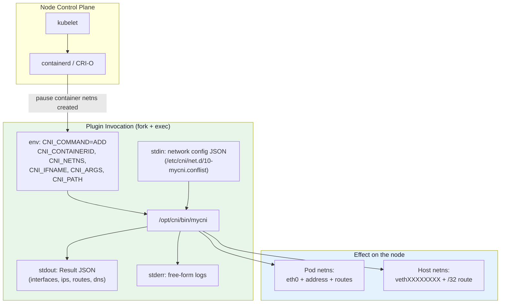
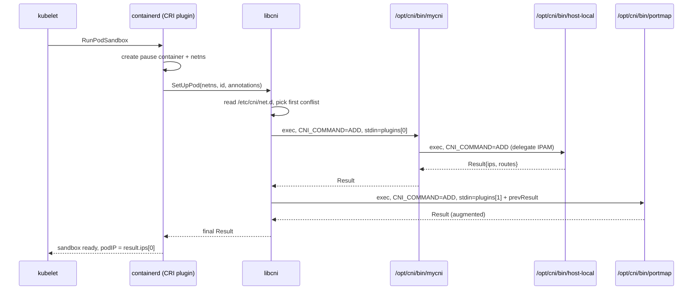
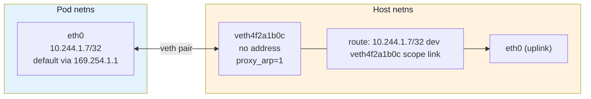
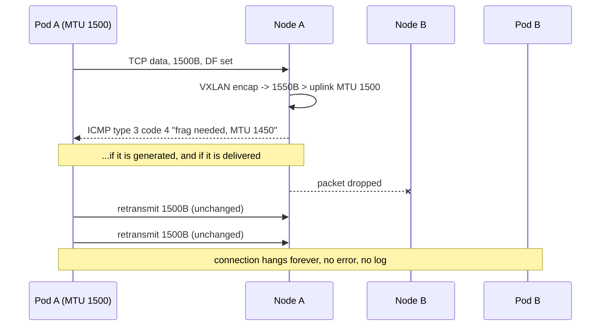
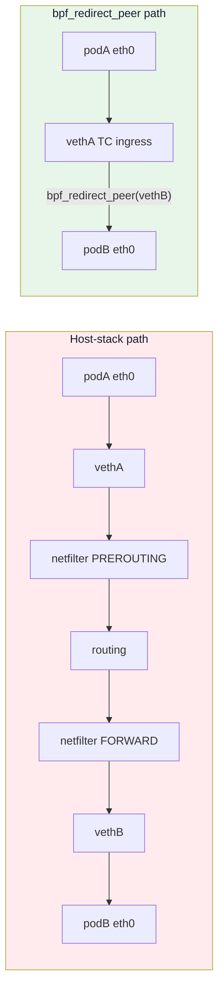

# Module 17: CNI Plugin Development

> **The capstone: an executable that turns an empty network namespace into a Pod**

## 📊 Visual Learning



---

## Why This Module Exists

A CNI plugin is the smallest possible piece of software that a Kubernetes cluster genuinely cannot run without. Everything you built in the previous modules — namespaces and veth pairs from [Module 15](./15-network-namespaces-and-virtual-devices.md), the pod/Service model from [Module 16](./16-kubernetes-networking.md), XDP and TC programs from [Module 11](./11-ebpf-networking-guide.md) — converges here. Cilium, Calico and flannel are, at their narrowest point, a ~600-line binary in `/opt/cni/bin` plus an agent that keeps the datapath in sync.

The plugin itself is deliberately boring. The interesting parts are the three things that make CNI plugins fail in production:

1. **Teardown is not the inverse of setup.** `DEL` gets called on containers that never had an `ADD` succeed, and it gets called multiple times. Any error you return blocks pod deletion forever.
2. **IPAM leaks.** Address allocation lives on disk; a node reboot in the wrong moment strands addresses that nothing will ever reclaim.
3. **MTU.** Get it wrong by 50 bytes and you get a cluster where `curl` to a small endpoint works, `kubectl exec` works, DNS works — and any response over ~1400 bytes hangs forever with no log line anywhere.

We cover all three.

---

## Part 1 — The CNI Contract

### It's Just an Executable

There is no daemon, no gRPC, no socket. The container runtime does `fork()` + `exec()` on a file in a directory, hands it JSON on stdin and environment variables, and reads JSON back from stdout. That is the entire API surface.

```bash
# The plugin binary directory (default; configurable per runtime)
ls -l /opt/cni/bin/
# -rwxr-xr-x 1 root root 4014080 bridge
# -rwxr-xr-x 1 root root 3707912 host-local
# -rwxr-xr-x 1 root root 4407160 portmap
# -rwxr-xr-x 1 root root 4272264 loopback

# The network configuration directory
ls -l /etc/cni/net.d/
# -rw-r--r-- 1 root root 682 10-mycni.conflist
```

You can invoke a plugin by hand, and you should — it is by far the fastest debugging loop:

```bash
# Create a namespace to act as our "pod"
sudo ip netns add testpod

cat <<'EOF' > /tmp/mycni.conf
{
  "cniVersion": "1.0.0",
  "name": "mynet",
  "type": "mycni",
  "mtu": 1450,
  "ipam": {
    "type": "host-local",
    "dataDir": "/var/lib/cni/networks",
    "ranges": [[{ "subnet": "10.244.1.0/24" }]],
    "routes": [{ "dst": "0.0.0.0/0" }]
  }
}
EOF

sudo CNI_COMMAND=ADD \
     CNI_CONTAINERID=deadbeef00000000 \
     CNI_NETNS=/var/run/netns/testpod \
     CNI_IFNAME=eth0 \
     CNI_PATH=/opt/cni/bin \
     /opt/cni/bin/mycni < /tmp/mycni.conf
```

`ip netns add` creates the bind mount under `/var/run/netns/`, which is why `CNI_NETNS` can be a path there. Container runtimes instead pass `/proc/<pid>/ns/net` for the pause container — same object, different path. This is the distinction [Module 15](./15-network-namespaces-and-virtual-devices.md) drew between `ip netns` namespaces and container namespaces, and it is why your plugin must never call `ip netns exec`: it must open the path it was given.

### Environment Variables

| Variable | Required for | Meaning |
|----------|--------------|---------|
| `CNI_COMMAND` | all | `ADD`, `DEL`, `CHECK`, `GC`, `STATUS`, `VERSION` |
| `CNI_CONTAINERID` | ADD, DEL, CHECK | Opaque, runtime-assigned, unique while the container lives |
| `CNI_NETNS` | ADD, CHECK (optional on DEL) | Path to the network namespace file |
| `CNI_IFNAME` | ADD, DEL, CHECK | Interface name to create **inside** the namespace (`eth0`) |
| `CNI_ARGS` | optional | `K=V;K=V` — kubelet passes `K8S_POD_NAME`, `K8S_POD_NAMESPACE`, `K8S_POD_UID`, `K8S_POD_INFRA_CONTAINER_ID` |
| `CNI_PATH` | required for `GC`, optional elsewhere | `:`-separated list of directories to search for delegate plugins |

Two of these are traps:

- **`CNI_NETNS` may be empty on `DEL`.** If the runtime already destroyed the namespace, it calls `DEL` anyway so you can release the IP. Your `DEL` must handle "no namespace to clean up" as a success, not an error.
- **`CNI_CONTAINERID` is not the pod UID.** It changes if the sandbox is recreated. Key your IPAM reservations on it, but key anything that must survive a sandbox restart on `K8S_POD_UID` from `CNI_ARGS`.

### The Result

On success the plugin prints a Result document to stdout and exits 0. Anything else on stdout corrupts the parse — **use stderr for logging, always**.

```json
{
  "cniVersion": "1.1.0",
  "interfaces": [
    { "name": "veth4f2a1b0c", "mac": "9a:3d:11:02:8c:41" },
    { "name": "eth0", "mac": "aa:11:22:33:44:55", "sandbox": "/var/run/netns/testpod", "mtu": 1450 }
  ],
  "ips": [
    { "interface": 1, "address": "10.244.1.7/32", "gateway": "169.254.1.1" }
  ],
  "routes": [
    { "dst": "0.0.0.0/0", "gw": "169.254.1.1" }
  ],
  "dns": {}
}
```

`"interface": 1` is an **index into the `interfaces` array**, not an ifindex. Getting this wrong is the single most common bug in a first plugin: `ipam.ConfigureIface` validates that `interfaces[*ipc.Interface].Name` equals the interface it is configuring and returns `invalid interface index` when it does not.

The `sandbox` field must be set only on interfaces that live inside the container namespace. Host-side veths leave it empty.

`mtu` on an interface is a **1.1.0 addition**. This example is therefore a 1.1.0 Result; if the config asks for `0.4.0` or `1.0.0` there is nowhere in the Result to report the MTU, and the down-conversion simply loses it.

### Errors

On failure, print an error document and exit non-zero:

```json
{
  "cniVersion": "1.0.0",
  "code": 11,
  "msg": "failed to allocate IP",
  "details": "no free addresses in range 10.244.1.0/24"
}
```

| Code | Name | When |
|------|------|------|
| 1 | `ErrIncompatibleCNIVersion` | Config asks for a version you don't implement |
| 2 | `ErrUnsupportedField` | A field you must honour but don't understand |
| 3 | `ErrUnknownContainer` | `CHECK`/`GC` on something you have no record of |
| 4 | `ErrInvalidEnvironmentVariables` | Missing `CNI_NETNS`, bad `CNI_IFNAME`, … |
| 5 | `ErrIOFailure` | Filesystem or netlink failure |
| 6 | `ErrDecodingFailure` | stdin isn't valid JSON |
| 7 | `ErrInvalidNetworkConfig` | JSON is valid but semantically wrong |
| 8 | `ErrInvalidNetNS` | `CNI_NETNS` does not point at a usable network namespace |
| 11 | `ErrTryAgainLater` | **Transient.** The runtime will retry. |

Code 11 matters more than the others. A pod stuck in `ContainerCreating` with `failed to allocate IP` retries and eventually succeeds if you return 11; if you return 7 the runtime treats it as a permanent misconfiguration.

### Version Negotiation

`CNI_COMMAND=VERSION` must print what you support:

```bash
$ echo '{"cniVersion":"1.1.0"}' | CNI_COMMAND=VERSION /opt/cni/bin/mycni
{"cniVersion":"1.1.0","supportedVersions":["0.3.0","0.3.1","0.4.0","1.0.0","1.1.0"]}
```

The `cniVersion` here is `current.ImplementedSpecVersion` — the newest Result format the linked library can produce (`1.1.0` in `cni` v1.3.0). `supportedVersions` is exactly the list you passed to `version.PluginSupports`.

The rule the `skel` package enforces for you: the **config's** `cniVersion` decides the format of the Result you print, not the newest version you support. If the config says `0.3.1`, you must emit an 0.3.x Result. `types.PrintResult(result, conf.CNIVersion)` does the down-conversion; hand-rolled `json.Marshal(result)` does not, and produces a Result the runtime silently misreads.

---

## Part 2 — Who Calls the Plugin



kubelet does **not** exec the plugin. Since dockershim was removed, kubelet only knows the CRI API; the runtime owns `/opt/cni/bin` and `/etc/cni/net.d`.

```toml
# /etc/containerd/config.toml  (containerd 1.x)
[plugins."io.containerd.grpc.v1.cri".cni]
  bin_dir = "/opt/cni/bin"
  conf_dir = "/etc/cni/net.d"
  max_conf_num = 1
```

containerd 2.x moves this to `[plugins."io.containerd.cri.v1.runtime".cni]` with the same keys. Either way, **`conf_dir` is sorted lexically and (with `max_conf_num = 1`) the first file wins** — a leftover `05-cilium.conflist` shadows your `10-mycni.conflist`. Worse, a file that does not parse is not skipped: containerd's loader aborts the whole directory scan and reports zero networks, so one stray unparseable file leaves the node with *no* CNI at all. When a plugin fails to install correctly you get:

```
Warning  FailedCreatePodSandBox  kubelet  Failed to create pod sandbox:
  rpc error: code = Unknown desc = failed to setup network for sandbox "...":
  plugin type="mycni" failed (add): ...
```

or, when no config file parses at all:

```
Warning  NetworkNotReady  kubelet  network is not ready:
  container runtime network not ready: NetworkReady=false
  reason:NetworkPluginNotReady message:Network plugin returns error: cni plugin not initialized
```

The second message means "I found nothing usable in `conf_dir`", not "your plugin crashed". Distinguishing them saves an hour.

### Chaining

A `.conflist` is an ordered list. Each plugin after the first receives the accumulated Result under the top-level `prevResult` key, and is expected to pass it through (possibly augmented). On `DEL`, plugins are invoked in **reverse order**.

```json
{
  "cniVersion": "1.0.0",
  "name": "mynet",
  "plugins": [
    {
      "type": "mycni",
      "mtu": 1450,
      "ipam": { "type": "host-local", "ranges": [[{"subnet": "10.244.1.0/24"}]] }
    },
    { "type": "portmap", "capabilities": { "portMappings": true } },
    { "type": "bandwidth", "capabilities": { "bandwidth": true } }
  ]
}
```

Note that `ipam` is **not** chaining. IPAM is a *delegate*: your plugin execs it directly, mid-`cmdAdd`, and the runtime never sees it. Chained plugins are peers; delegates are children.

### The Fast Debug Loop: `cnitool`

```bash
go install github.com/containernetworking/cni/cnitool@latest

sudo ip netns add testpod
sudo CNI_PATH=/opt/cni/bin NETCONFPATH=/etc/cni/net.d \
     ~/go/bin/cnitool add mynet /var/run/netns/testpod

sudo ip netns exec testpod ip addr
sudo ip netns exec testpod ip route

sudo CNI_PATH=/opt/cni/bin NETCONFPATH=/etc/cni/net.d \
     ~/go/bin/cnitool del mynet /var/run/netns/testpod
sudo ip netns del testpod
```

`cnitool` drives the same `libcni` that containerd uses, including chaining and version negotiation. Every bug you can reproduce here is a bug you did not have to reproduce inside a cluster.

---

## Part 3 — A Real Plugin in Go

We build a **ptp-style** plugin: one veth pair per pod, no bridge, a `/32` address inside the pod, and a link-scoped fake gateway. This is what Calico and Cilium do, and it is strictly simpler than a bridge because there is no L2 domain to reason about.



The pod's default route points at `169.254.1.1`, an address that exists nowhere. The host answers ARP for it because `proxy_arp` is enabled on the host-side veth, so the pod resolves the fake gateway to the host veth's MAC and the host routes normally from there. No bridge, no subnet on the host side, nothing to renumber when the node CIDR changes.

### Module Setup

```bash
mkdir -p mycni && cd mycni
go mod init example.com/mycni
go get github.com/containernetworking/cni@v1.3.0
go get github.com/containernetworking/plugins@v1.9.1
go get github.com/vishvananda/netlink@v1.3.1
go get github.com/cilium/ebpf@v0.22.0     # only needed for Part 6
```

```go
// go.mod
module example.com/mycni

// plugins v1.9.1 declares `go 1.24.2` and cilium/ebpf v0.22.0 declares
// `go 1.25.0`; the main module must be at least as new or the build fails
// with "module ... requires go >= 1.25.0".
go 1.25.0

require (
	github.com/cilium/ebpf v0.22.0
	github.com/containernetworking/cni v1.3.0
	github.com/containernetworking/plugins v1.9.1
	github.com/vishvananda/netlink v1.3.1
)
```

### main.go

```go
package main

import (
	"encoding/json"
	"errors"
	"fmt"
	"net"
	"os"
	"runtime"

	"github.com/containernetworking/cni/pkg/skel"
	"github.com/containernetworking/cni/pkg/types"
	current "github.com/containernetworking/cni/pkg/types/100"
	"github.com/containernetworking/cni/pkg/version"
	"github.com/containernetworking/plugins/pkg/ip"
	"github.com/containernetworking/plugins/pkg/ipam"
	"github.com/containernetworking/plugins/pkg/ns"
	bv "github.com/containernetworking/plugins/pkg/utils/buildversion"
	"github.com/containernetworking/plugins/pkg/utils/sysctl"
	"github.com/vishvananda/netlink"
)

func init() {
	// MANDATORY. ns.Do()/netns.Set() change the network namespace of the
	// *current OS thread*. If the Go runtime migrates this goroutine to
	// another thread mid-flight, half your netlink calls land in the pod
	// namespace and half in the host namespace - non-deterministically.
	// Locking main() to the thread group leader makes that impossible.
	runtime.LockOSThread()
}

// PluginConf is our config; it embeds the standard fields (cniVersion, name,
// type, ipam, dns, prevResult) and adds our own.
//
// In cni v1.3.0 the canonical name of the embedded type is types.PluginConf;
// types.NetConf is now an alias kept for compatibility, so the promoted field
// is still spelled conf.NetConf. Both names refer to the same struct.
type PluginConf struct {
	types.NetConf

	MTU int `json:"mtu"`
}

// The link-local address the pod uses as its next hop. It is never assigned
// to any interface; the host answers ARP for it via proxy_arp.
var fakeGW = net.IPv4(169, 254, 1, 1)

func loadConf(stdin []byte) (*PluginConf, error) {
	conf := &PluginConf{}
	if err := json.Unmarshal(stdin, conf); err != nil {
		return nil, fmt.Errorf("failed to parse network configuration: %w", err)
	}
	if conf.MTU <= 0 {
		conf.MTU = 1500
	}
	// Parse prevResult if we are not the first plugin in a chain.
	if err := version.ParsePrevResult(&conf.NetConf); err != nil {
		return nil, fmt.Errorf("could not parse prevResult: %w", err)
	}
	return conf, nil
}

func main() {
	skel.PluginMainFuncs(
		skel.CNIFuncs{
			Add:   cmdAdd,
			Del:   cmdDel,
			Check: cmdCheck,
		},
		version.PluginSupports("0.3.0", "0.3.1", "0.4.0", "1.0.0", "1.1.0"),
		bv.BuildString("mycni"),
	)
}
```

`version.PluginSupports(...)` is the explicit form of `version.All`. Prefer it: it documents what you actually tested, and adding a version you have never emitted is how you ship a plugin that produces a Result no runtime can read.

### cmdAdd

```go
// NOTE the NAMED result: `err`. The deferred IPAM rollback below reads it
// after every return, so every failure path must flow through this one
// variable. With an unnamed result, `return someOtherError` would leave the
// deferred closure looking at a stale nil and the address would leak.
func cmdAdd(args *skel.CmdArgs) (err error) {
	conf, err := loadConf(args.StdinData)
	if err != nil {
		return err
	}
	if args.Netns == "" {
		return types.NewError(types.ErrInvalidEnvironmentVariables,
			"CNI_NETNS is required for ADD", "")
	}

	// 1. Delegate address allocation to the IPAM plugin named in the config.
	var r types.Result
	r, err = ipam.ExecAdd(conf.IPAM.Type, args.StdinData)
	if err != nil {
		return err
	}
	// If anything below fails we MUST hand the address back, or the range
	// bleeds one IP per failed pod creation until it is exhausted.
	defer func() {
		if err != nil {
			_ = ipam.ExecDel(conf.IPAM.Type, args.StdinData)
		}
	}()

	var ipamResult *current.Result
	ipamResult, err = current.NewResultFromResult(r)
	if err != nil {
		return err
	}
	if len(ipamResult.IPs) == 0 {
		err = errors.New("IPAM plugin returned no IP configuration")
		return err
	}

	var netns ns.NetNS
	netns, err = ns.GetNS(args.Netns)
	if err != nil {
		return fmt.Errorf("failed to open netns %q: %w", args.Netns, err)
	}
	defer netns.Close()

	// 2. Create the veth pair. SetupVethWithName runs *inside* the container
	//    netns and moves the host end out to hostNS. Passing "" for the host
	//    name lets the library pick a random one (vethXXXXXXXX), which avoids
	//    ifname collisions between pods with similar container IDs. Cilium's
	//    lxcXXXXXXXX names come from passing an explicit second argument.
	var hostIface, contIface net.Interface
	err = netns.Do(func(hostNS ns.NetNS) error {
		var derr error
		hostIface, contIface, derr = ip.SetupVethWithName(
			args.IfName, "", conf.MTU, "", hostNS)
		if derr != nil {
			return derr
		}
		return configureContainerSide(args.IfName, ipamResult)
	})
	if err != nil {
		return err
	}

	// 3. Host side: /32 route to the pod out of its veth, plus proxy_arp so
	//    the pod can resolve 169.254.1.1.
	if err = configureHostSide(hostIface.Name, conf.MTU, ipamResult); err != nil {
		return err
	}

	// 4. Build the Result. Order matters: index 0 = host, index 1 = container,
	//    and every IPConfig.Interface must point at the container entry.
	result := &current.Result{
		CNIVersion: current.ImplementedSpecVersion,
		Interfaces: []*current.Interface{
			{Name: hostIface.Name, Mac: hostIface.HardwareAddr.String()},
			{
				Name:    contIface.Name,
				Mac:     contIface.HardwareAddr.String(),
				Sandbox: netns.Path(),
				Mtu:     conf.MTU,
			},
		},
		DNS: conf.DNS,
	}
	for _, ipc := range ipamResult.IPs {
		ipc.Interface = current.Int(1) // index into result.Interfaces
		ipc.Gateway = fakeGW
		result.IPs = append(result.IPs, ipc)
	}
	result.Routes = []*types.Route{
		{Dst: net.IPNet{IP: net.IPv4zero, Mask: net.CIDRMask(0, 32)}, GW: fakeGW},
	}

	// Assign, don't shadow: a failed PrintResult must also roll back IPAM.
	err = types.PrintResult(result, conf.CNIVersion)
	return err
}
```

The `defer` on the named result `err` is not stylistic. `ipam.ExecAdd` has already written a reservation file to disk by the time it returns; every return after that point that does not funnel through `err` is a permanent leak.

Two ways to break it, both common:

- `return fmt.Errorf(...)` with a fresh error while `err` is still `nil` — the deferred closure sees `nil` and skips the rollback. That is why every failure above assigns to `err` first (`if err = configureHostSide(...); err != nil`).
- A `:=` in a **nested block** — `if x, err := f(); err != nil { return err }` declares a *new* `err` inside the `if`, so the outer one never changes. (A `:=` at the top level of the function body is safe: with at least one new variable on the left, `err` is assigned, not redeclared. That is why `conf, err := loadConf(...)` is fine.)

Using a named result closes the first hole; discipline about nested blocks is the only thing that closes the second. This is the bug in most hand-written plugins.

### Configuring the two sides

```go
func configureContainerSide(ifName string, res *current.Result) error {
	link, err := netlink.LinkByName(ifName)
	if err != nil {
		return fmt.Errorf("failed to look up %q in container netns: %w", ifName, err)
	}

	for _, ipc := range res.IPs {
		if ipc.Address.IP.To4() == nil {
			continue // IPv6 left as an exercise
		}
		// /32: the pod is alone on its "subnet". No on-link neighbours,
		// so every packet goes to the gateway and the host decides.
		addr := &netlink.Addr{IPNet: &net.IPNet{
			IP:   ipc.Address.IP,
			Mask: net.CIDRMask(32, 32),
		}}
		if err := netlink.AddrAdd(link, addr); err != nil {
			return fmt.Errorf("failed to add %s to %s: %w", addr, ifName, err)
		}
	}

	if err := netlink.LinkSetUp(link); err != nil {
		return fmt.Errorf("failed to set %s up: %w", ifName, err)
	}

	// route to the fake gateway itself, scope link, no gw
	gwNet := &net.IPNet{IP: fakeGW, Mask: net.CIDRMask(32, 32)}
	if err := netlink.RouteAdd(&netlink.Route{
		LinkIndex: link.Attrs().Index,
		Dst:       gwNet,
		Scope:     netlink.SCOPE_LINK,
	}); err != nil {
		return fmt.Errorf("failed to add gateway route: %w", err)
	}

	// default via the fake gateway
	if err := netlink.RouteAdd(&netlink.Route{
		LinkIndex: link.Attrs().Index,
		Dst:       &net.IPNet{IP: net.IPv4zero, Mask: net.CIDRMask(0, 32)},
		Gw:        fakeGW,
	}); err != nil {
		return fmt.Errorf("failed to add default route: %w", err)
	}
	return nil
}

func configureHostSide(hostVeth string, mtu int, res *current.Result) error {
	link, err := netlink.LinkByName(hostVeth)
	if err != nil {
		return fmt.Errorf("failed to look up host veth %q: %w", hostVeth, err)
	}
	// SetupVethWithName already applied the MTU to both ends; this is
	// belt-and-braces, and it is the line to keep in your head when you get
	// to Part 5 — the HOST end has to be sized too, not just the pod end.
	if err := netlink.LinkSetMTU(link, mtu); err != nil {
		return fmt.Errorf("failed to set MTU on %s: %w", hostVeth, err)
	}

	// Answer ARP for 169.254.1.1 (and for anything else the pod asks about).
	if _, err := sysctl.Sysctl(
		fmt.Sprintf("net/ipv4/conf/%s/proxy_arp", hostVeth), "1"); err != nil {
		return fmt.Errorf("failed to enable proxy_arp on %s: %w", hostVeth, err)
	}
	// The host must be willing to route between the veth and the uplink.
	if _, err := sysctl.Sysctl("net/ipv4/ip_forward", "1"); err != nil {
		return fmt.Errorf("failed to enable ip_forward: %w", err)
	}

	for _, ipc := range res.IPs {
		if ipc.Address.IP.To4() == nil {
			continue
		}
		route := &netlink.Route{
			LinkIndex: link.Attrs().Index,
			Dst:       &net.IPNet{IP: ipc.Address.IP, Mask: net.CIDRMask(32, 32)},
			Scope:     netlink.SCOPE_LINK,
		}
		if err := netlink.RouteAdd(route); err != nil {
			return fmt.Errorf("failed to add host route to %s: %w",
				ipc.Address.IP, err)
		}
	}
	return nil
}
```

`ipam.ConfigureIface(args.IfName, ipamResult)` does roughly what `configureContainerSide` does, using the address masks and routes the IPAM plugin returned verbatim. Use it when your pods should sit on a shared subnet with a real gateway (the bridge model). We do it by hand because the `/32` + fake-gateway model deliberately *ignores* the mask host-local hands us.

### cmdDel — where plugins actually break

```go
func cmdDel(args *skel.CmdArgs) error {
	conf, err := loadConf(args.StdinData)
	if err != nil {
		return err
	}

	// Release the address first. host-local's DEL is a no-op if the
	// reservation is already gone, so this is safe to repeat.
	if err := ipam.ExecDel(conf.IPAM.Type, args.StdinData); err != nil {
		return err
	}

	// The runtime is allowed to call DEL with no namespace - it may already
	// have torn it down. The veth died with it; there is nothing to do.
	if args.Netns == "" {
		return nil
	}

	var podIPs []*net.IPNet
	err = ns.WithNetNSPath(args.Netns, func(_ ns.NetNS) error {
		var derr error
		podIPs, derr = ip.DelLinkByNameAddr(args.IfName)
		if derr != nil && errors.Is(derr, ip.ErrLinkNotFound) {
			return nil // already deleted; DEL is called more than once
		}
		return derr
	})
	if err != nil {
		// The namespace file is gone. Same conclusion: nothing to clean up.
		var nsErr ns.NSPathNotExistErr
		if errors.As(err, &nsErr) {
			return nil
		}
		return err
	}

	// Deleting the veth removes the /32 route automatically (the kernel
	// drops routes whose device disappears), so there is nothing else here.
	// Log to STDERR - stdout belongs to the Result document.
	fmt.Fprintf(os.Stderr, "mycni: released %s (%v)\n", args.ContainerID, podIPs)
	return nil
}
```

Three separate "this is already gone" cases, all of which must return `nil`:

| Situation | Detect with | Why it happens |
|-----------|-------------|----------------|
| No namespace passed | `args.Netns == ""` | Runtime tore the sandbox down first |
| Namespace path vanished | `ns.NSPathNotExistErr` | Node rebooted; kubelet replays DEL on startup |
| Interface not in namespace | `ip.ErrLinkNotFound` | DEL is retried; CNI DEL is *specified* as idempotent |

If you return an error for any of these, the pod stays in `Terminating` and `kubectl delete pod --force` becomes the operational workaround for your plugin. The CNI spec is explicit:

> `DEL` command invocations are always considered best-effort — plugins should always complete a `DEL` action without error to the fullest extent possible, even if some resources or state are missing. […] Plugins MUST accept multiple `DEL` calls for the same (`CNI_CONTAINERID`, `CNI_IFNAME`) pair, and return success if the interface in question, or any modifications added, are missing.

### cmdCheck

```go
func cmdCheck(args *skel.CmdArgs) error {
	conf, err := loadConf(args.StdinData)
	if err != nil {
		return err
	}
	if conf.PrevResult == nil {
		return types.NewError(types.ErrInvalidNetworkConfig,
			"CHECK requires prevResult", "")
	}
	if err := ipam.ExecCheck(conf.IPAM.Type, args.StdinData); err != nil {
		return err
	}

	return ns.WithNetNSPath(args.Netns, func(_ ns.NetNS) error {
		link, err := netlink.LinkByName(args.IfName)
		if err != nil {
			return types.NewError(types.ErrUnknownContainer,
				fmt.Sprintf("%s not found in %s", args.IfName, args.Netns),
				err.Error())
		}
		if link.Attrs().MTU != conf.MTU {
			return fmt.Errorf("MTU drift on %s: have %d, want %d",
				args.IfName, link.Attrs().MTU, conf.MTU)
		}
		return nil
	})
}
```

`CHECK` is optional in the spec and most runtimes never call it — but it is the cheapest place to catch MTU drift, and you can drive it from `cnitool check` in CI.

### Build and install

```bash
CGO_ENABLED=0 GOOS=linux go build -o mycni .
sudo install -m 0755 mycni /opt/cni/bin/mycni
```

`CGO_ENABLED=0` matters: the plugin runs on the host, but you will ship it inside a distroless or Alpine-based DaemonSet image and `install` it onto the node. A dynamically linked binary that works in your container will fail on the node with `no such file or directory` — which is the kernel reporting a missing loader, not a missing plugin, and reads exactly like a path bug.

---

## Part 4 — IPAM, Done Properly

### host-local: the on-disk store

`host-local` is a delegate plugin with a filesystem database. There is no daemon, no lock service, no coordination between nodes:

```bash
sudo tree /var/lib/cni/networks/
# /var/lib/cni/networks/
# └── mynet
#     ├── 10.244.1.2
#     ├── 10.244.1.7
#     ├── last_reserved_ip.0
#     └── lock

sudo cat /var/lib/cni/networks/mynet/10.244.1.7
# deadbeef00000000
# eth0
```

One file per allocated address, named by the address, containing the container ID and the interface name. `last_reserved_ip.0` is a round-robin cursor so a freed address is not immediately reused (which would confuse conntrack entries and any peer still holding the old mapping). `lock` is flock'd for the duration of an allocation, which is what makes concurrent pod creation on one node safe.

Configuration:

```json
{
  "ipam": {
    "type": "host-local",
    "dataDir": "/var/lib/cni/networks",
    "ranges": [
      [{ "subnet": "10.244.1.0/24", "rangeStart": "10.244.1.10", "rangeEnd": "10.244.1.250", "gateway": "10.244.1.1" }]
    ],
    "routes": [{ "dst": "0.0.0.0/0" }]
  }
}
```

The double array in `ranges` is not a typo: the outer array is a list of *range sets* (one address is allocated per set — that is how you get dual-stack), the inner array is a list of ranges within a set.

### The leak, and how to recover from it

Reservations are files. Nothing garbage-collects them. The failure sequence:

1. Node reboots, or kubelet is SIGKILLed, mid-pod-teardown.
2. `cmdDel` never runs for some pods.
3. `/var/lib/cni/networks/mynet/` survives on disk.
4. Those addresses are now reserved for containers that no longer exist.

Symptom, once a `/24` has churned through 244 pods:

```
Failed to create pod sandbox: plugin type="mycni" failed (add):
  failed to allocate for range 0: no IP addresses available in range set
```

Diagnosing it:

```bash
# How many addresses does IPAM think are in use?
sudo ls /var/lib/cni/networks/mynet | grep -c '^10\.'

# How many pods actually exist on this node?
sudo crictl pods --state Ready -q | wc -l

# Which reservations point at container IDs that no longer exist?
for f in /var/lib/cni/networks/mynet/10.*; do
  id=$(sudo head -n1 "$f")
  sudo crictl inspectp "$id" >/dev/null 2>&1 || echo "stale: $(basename "$f") -> $id"
done
```

Two ways to fix it properly:

**(a) Reconcile at agent startup.** Your DaemonSet starts before any pod is scheduled onto the node. At that moment, the set of live sandboxes is authoritative, and any reservation not backed by a live sandbox is garbage. This is mark-and-sweep, the same pattern [Module 19](./19-control-plane-agent-patterns.md) applies to BPF maps: never flush, always diff.

**(b) Implement `GC`.** CNI 1.1 added `CNI_COMMAND=GC`, where the runtime passes the full list of still-valid `{containerID, ifname}` attachments in the config under `cni.dev/valid-attachments`. `types.PluginConf.ValidAttachments` (a `[]types.GCAttachment`) carries it. Anything not in that list is yours to reclaim, and the spec requires you to forward the `GC` call to your delegates as well, so your `cmdGC` must exec the IPAM plugin with the same stdin. Wire it up with `skel.CNIFuncs{GC: cmdGC}`. Note that `GC` is *not* a substitute for `DEL` — the spec says so explicitly — and runtime support is still thin, so implement (a) regardless.

> **Never** just `rm -rf /var/lib/cni/networks/*` on a running node. You will hand out addresses that live pods are still using, and the resulting duplicate-IP behaviour (intermittent RST, ARP flapping, traffic for pod A arriving at pod B) is far harder to diagnose than the exhaustion you were fixing.

### node-CIDR allocation: where the subnet comes from

`host-local` allocates *within* a subnet. Something has to decide which subnet each node owns.

In Kubernetes, kube-controller-manager does it when started with `--allocate-node-cidrs=true --cluster-cidr=10.244.0.0/16 --node-cidr-mask-size=24`. It writes the result onto the Node object:

```bash
kubectl get nodes -o custom-columns=NAME:.metadata.name,CIDR:.spec.podCIDR
# NAME                 CIDR
# kind-control-plane   10.244.0.0/24
# kind-worker          10.244.1.0/24
# kind-worker2         10.244.2.0/24
```

Your node agent reads that and templates the CNI config. This is exactly what flannel does — it writes `/run/flannel/subnet.env` and the `flannel` CNI plugin reads it — and what kindnet does inline.

```go
// In the DaemonSet agent, not in the plugin binary.
node, err := clientset.CoreV1().Nodes().Get(ctx, nodeName, metav1.GetOptions{})
if err != nil {
	return err
}
podCIDR := node.Spec.PodCIDR // "10.244.1.0/24"
if podCIDR == "" {
	return fmt.Errorf("node %s has no podCIDR; is --allocate-node-cidrs set?", nodeName)
}
// render /etc/cni/net.d/10-mycni.conflist with this subnet, then write it
// atomically: write to a temp file in the same directory and os.Rename().
```

Write the config file **atomically**. containerd watches `conf_dir` with inotify and will happily read a half-written file, cache the parse failure, and leave the node `NetworkPluginNotReady` until you touch the file again.

| Approach | Who allocates | Pros | Cons |
|----------|---------------|------|------|
| `host-local` + node podCIDR | kube-controller-manager per node, host-local per pod | Simple, no cross-node coordination, survives agent restart | Fixed /24 per node caps pod density; wastes address space |
| CRD-backed pool (Cilium `CiliumNode`, Calico IPAM) | Cluster-wide operator, blocks of addresses leased to nodes | Elastic, dense, supports pod IP pools per namespace | Requires a control plane; allocation can block on API server |
| Cloud-native (AWS VPC CNI, Azure CNI) | Cloud IPAM; pods get real VPC addresses | No overlay, no MTU loss, security groups apply per pod | Address exhaustion is a *VPC* problem; ENI limits cap density |

---

## Part 5 — Cross-Node Datapath, and the MTU Trap

Pod-to-pod on the same node already works: two `/32` routes on the host and `ip_forward=1`. Cross-node needs the packet to reach the other node's host stack.

### Variant A — Native routing

If nodes are L2-adjacent (same subnet, no cloud router in between), every node just needs a route to every other node's pod CIDR:

```bash
# On kind-worker, for kind-worker2's pods
sudo ip route add 10.244.2.0/24 via 172.18.0.4 dev eth0
```

Zero encapsulation, zero MTU loss, and `tcpdump` shows pod addresses on the wire. Cilium calls this "native routing", Calico calls it the unencapsulated mode. The cost: something outside the cluster must know that `10.244.2.0/24` lives behind `172.18.0.4`. On bare metal that's BGP; on a cloud it's a VPC route table entry per node (and the per-table route limit is a real cluster-size ceiling).

Your agent programs these from the Node list:

```go
for _, n := range nodes {
	if n.Name == myNodeName || n.Spec.PodCIDR == "" {
		continue
	}
	_, dst, err := net.ParseCIDR(n.Spec.PodCIDR)
	if err != nil {
		continue
	}
	nodeIP := internalIP(&n) // from n.Status.Addresses
	route := &netlink.Route{Dst: dst, Gw: nodeIP}
	if err := netlink.RouteReplace(route); err != nil { // Replace, not Add
		log.Printf("route %s via %s: %v", dst, nodeIP, err)
	}
}
```

`RouteReplace` rather than `RouteAdd`: `RouteAdd` returns `EEXIST` on the second reconcile pass, and a reconcile loop that errors on "already correct" is a reconcile loop that never converges.

### Variant B — Overlay (VXLAN)

When nodes are not L2-adjacent, encapsulate. Pod packets get wrapped in UDP between node addresses; the underlay only ever sees node-to-node traffic.

```bash
sudo ip link add vxlan0 type vxlan id 42 dstport 4789 dev eth0 nolearning
sudo ip link set vxlan0 up
sudo ip route add 10.244.2.0/24 dev vxlan0
# The agent programs the forwarding database: "pod CIDR of node2 lives behind
# node2's underlay address"
sudo bridge fdb append 00:00:00:00:00:00 dev vxlan0 dst 172.18.0.4
```

### The MTU arithmetic

This is the part that bites everyone.

| Encapsulation | Bytes added | Pod MTU on a 1500-byte underlay |
|---------------|-------------|--------------------------------|
| None (native routing) | 0 | 1500 |
| IPIP (IPv4-in-IPv4) | 20 | 1480 |
| VXLAN over IPv4 | 50 (20 IP + 8 UDP + 8 VXLAN + 14 inner Ethernet) | 1450 |
| VXLAN over IPv6 | 70 | 1430 |
| Geneve over IPv4 | 50 + options | ≤ 1450 |
| WireGuard | 80 | 1420 |
| VXLAN + WireGuard | 130 | 1370 |

The WireGuard row uses 80, which is what `wg-quick` and Cilium both assume. The IPv4 wire cost is actually 60 (20 IP + 8 UDP + 16 WG header + 16 Poly1305 tag); 80 is the IPv6-safe figure, and picking the larger number costs you 20 bytes of payload and saves you an outage.

If the underlay is itself 9000 (jumbo frames) or 1450 (some cloud VPC peering, AWS jumbo-off paths), every number shifts. **Never hard-code 1450.** Read the uplink MTU at agent startup and subtract:

```go
uplink, err := netlink.LinkByName(uplinkName)
if err != nil {
	return err
}
podMTU := uplink.Attrs().MTU - encapOverhead // e.g. 1500 - 50
```

### The PMTUD blackhole

Here is the failure you will actually hit. Suppose the pod MTU is left at 1500 but the path only carries 1450 after encapsulation.



Why it survives all your smoke tests:

- `ping` sends 84-byte packets. Fine.
- DNS over UDP is under 512 bytes. Fine.
- The TCP handshake is 3 tiny packets. **Connection establishes.**
- `curl http://svc/healthz` returns 20 bytes. Fine.
- The first response body over ~1400 bytes hangs, forever, with a 200-less socket and no error anywhere.

And why PMTUD does not save you: the ICMP "fragmentation needed" has to get back to the *pod*, not the node. Cloud security groups routinely drop ICMP; hosts with `net.ipv4.icmp_ratelimit` under load drop it; a `-j DROP` catch-all in `INPUT` drops it. When it does not arrive, the sender never learns the real MTU. That is a **PMTUD blackhole**, and it is indistinguishable from an application hang until you measure.

### Diagnosing it in under two minutes

```bash
# From inside a pod. -M do sets DF so the packet is never fragmented.
# -s is the PAYLOAD size; add 28 (20 IP + 8 ICMP) for the wire size.
kubectl exec -it podA -- ping -M do -s 1472 -c 2 <podB-ip>   # 1500 on the wire
#
# Outcome A - "ping: local error: message too long, mtu=1450"
#   The local interface already knows it is smaller. Healthy: the sender
#   is told immediately and TCP will size its segments correctly.
#
# Outcome B - "2 packets transmitted, 0 received, 100% packet loss"
#   Nothing came back and nothing complained. THIS is the blackhole.

kubectl exec -it podA -- ping -M do -s 1422 -c 2 <podB-ip>   # 1450 on the wire
# 2 packets transmitted, 2 received     <- so the real path MTU is 1450

# Binary-search the boundary, then compare to what you configured:
kubectl exec -it podA -- ip link show eth0 | grep mtu
# 2: eth0@if97: <BROADCAST,MULTICAST,UP,LOWER_UP> mtu 1500   <- wrong

# Is anyone even sending the ICMP?
sudo tcpdump -ni any 'icmp and icmp[icmptype] == 3 and icmp[icmpcode] == 4'

# What does the host think the path MTU is?
ip route get 10.244.2.7
tracepath -n 10.244.2.7
```

The signature to memorise: **small packets fine, large packets silently gone, TCP connects then hangs.** That is always MTU until proven otherwise.

### Fixing it — in three places, not one

```bash
# 1. Pod side: set "mtu" in the CNI config so every new pod gets it.
#    (Existing pods must be recreated; you cannot fix them in place.)
#    "mtu": 1450

# 2. Host side: the host-veth MTU too. If the pod is 1450 but the host veth is
#    1500, the HOST -> POD direction is still oversized. Our
#    configureHostSide() does this with netlink.LinkSetMTU.
ip link show veth4f2a1b0c | grep mtu

# 3. Belt and braces for TCP: clamp MSS to the path MTU on forwarded SYNs.
sudo iptables -t mangle -A FORWARD -p tcp --tcp-flags SYN,RST SYN \
     -j TCPMSS --clamp-mss-to-pmtu
```

MSS clamping rewrites the MSS option in the SYN so both endpoints negotiate a segment size that fits, without depending on ICMP at all. It only helps TCP — UDP (QUIC, some gRPC transports, DNS over UDP with large EDNS0 buffers) still needs the MTU to be right. Set the MTU correctly *and* clamp.

---

## Part 6 — Replacing the Bridge with eBPF

Everything so far routes through the host stack: pod → veth → host `FORWARD` chain → netfilter → routing → veth → pod. That is a few microseconds of softirq work and a full conntrack lookup per packet — small in absolute terms, large next to the ~1 µs the packet spends doing anything useful. Cilium's headline optimisation is skipping all of it.



`bpf_redirect_peer()` (kernel **5.10+**) moves the packet from the ingress of one veth directly to the ingress of another veth's *peer*, crossing the namespace boundary without going through the CPU backlog queue. `bpf_redirect_neigh()` (also 5.10+) handles the other direction — it hands the packet to the neighbour subsystem so the kernel fills in the L2 header for the uplink's next hop.

### The datapath program

```c
// cni.bpf.c - attached to TC ingress of every host-side veth.
// TC ingress on the host-side veth == packets the POD sent.
#include "vmlinux.h"
#include <bpf/bpf_helpers.h>
#include <bpf/bpf_endian.h>

// vmlinux.h gives you the kernel types (struct ethhdr, struct iphdr) but none
// of the UAPI macros - define them. (offsetof() is the exception: libbpf's
// bpf_helpers.h defines its own CO-RE-safe version.)
#define ETH_P_IP    0x0800
#define ETH_HLEN    14
#define ETH_ALEN    6
#define TC_ACT_OK   0
#define TC_ACT_SHOT 2

struct endpoint {
    __u32 ifindex;          /* host-side veth ifindex of the destination pod */
    __u8  pod_mac[ETH_ALEN];  /* MAC of eth0 inside that pod */
    __u8  host_mac[ETH_ALEN]; /* MAC of its host-side veth (acts as gateway) */
};

/* podIP -> where that pod lives. Written by the agent (Module 19). */
struct {
    __uint(type, BPF_MAP_TYPE_HASH);
    __uint(max_entries, 65536);
    __type(key, __be32);
    __type(value, struct endpoint);
} endpoints SEC(".maps");

/* index 0 = uplink ifindex, for off-node traffic */
struct {
    __uint(type, BPF_MAP_TYPE_ARRAY);
    __uint(max_entries, 1);
    __type(key, __u32);
    __type(value, __u32);
} config SEC(".maps");

SEC("tc")
int from_container(struct __sk_buff *skb)
{
    void *data     = (void *)(long)skb->data;
    void *data_end = (void *)(long)skb->data_end;

    struct ethhdr *eth = data;
    if ((void *)(eth + 1) > data_end)
        return TC_ACT_OK;
    if (eth->h_proto != bpf_htons(ETH_P_IP))
        return TC_ACT_OK;               /* ARP, IPv6: let the stack handle it */

    struct iphdr *ip = (void *)(eth + 1);
    if ((void *)(ip + 1) > data_end)
        return TC_ACT_OK;
    if (ip->ihl < 5)                    /* malformed header length */
        return TC_ACT_SHOT;
    if ((void *)ip + ip->ihl * 4 > data_end)
        return TC_ACT_OK;               /* options run past the end */

    __be32 daddr = ip->daddr;           /* copy: map keys want stack memory */
    struct endpoint *ep = bpf_map_lookup_elem(&endpoints, &daddr);
    if (ep) {
        /* Same node. This is a routed hop, so behave like a router:
           decrement TTL and rewrite L2 before handing the frame over. */
        __u8 ttl = ip->ttl;
        if (ttl <= 1)
            return TC_ACT_OK;           /* let the stack send ICMP TTL exceeded */

        /* bpf_l3_csum_replace() accepts a size of 0, 2 or 4 - never 1 - so
           patch the whole 16-bit word holding {ttl, protocol}. */
        __u16 old_word = bpf_htons(((__u16)ttl << 8)       | ip->protocol);
        __u16 new_word = bpf_htons(((__u16)(ttl - 1) << 8) | ip->protocol);

        ip->ttl = ttl - 1;
        /* The receiving pod drops anything not addressed to its own MAC. */
        __builtin_memcpy(eth->h_dest,   ep->pod_mac,  ETH_ALEN);
        __builtin_memcpy(eth->h_source, ep->host_mac, ETH_ALEN);

        /* NOTE: the verifier classes this helper as one that can change
           packet data, so it invalidates `data`, `data_end`, `eth` and `ip`.
           Do all packet writes first and never touch those pointers again
           after this call (re-read skb->data and re-bounds-check if you
           must). */
        if (bpf_l3_csum_replace(skb, ETH_HLEN + offsetof(struct iphdr, check),
                                old_word, new_word, 2) < 0)
            return TC_ACT_SHOT;

        /* ifindex of the *host-side* veth; the packet is delivered to its
           peer's ingress, i.e. eth0 inside the destination pod. */
        return bpf_redirect_peer(ep->ifindex, 0);
    }

    /* Off-node: hand it to the uplink, letting the kernel resolve L2.
       NOTE: this path skips the routing layer, so nothing decrements the TTL
       for you either. A complete implementation repeats the TTL/checksum
       block above before redirecting. */
    __u32 zero = 0;
    __u32 *uplink = bpf_map_lookup_elem(&config, &zero);
    if (!uplink || *uplink == 0)
        return TC_ACT_OK;               /* fall back to the host stack */

    return bpf_redirect_neigh(*uplink, NULL, 0, 0);
}

char LICENSE[] SEC("license") = "GPL";
```

Four things worth staring at:

- **The MAC rewrite is mandatory.** `bpf_redirect_peer` does not touch the frame. Delivered as-is, the destination pod sees a destination MAC that is not its own, classifies the frame as `PACKET_OTHERHOST`, and drops it. The symptom is a 100% silent drop that `tcpdump` inside the pod *does* show (tcpdump sees `PACKET_OTHERHOST` frames) — which is a wonderfully clear diagnostic once you know to look.
- **TTL must decrement.** You replaced a routing hop, so you inherited its obligations. Skipping it makes `traceroute` lie and lets routing loops between two of your own programs run forever. This applies to the `bpf_redirect_neigh` path too — the code above deliberately leaves that gap for you to close.
- **`bpf_l3_csum_replace` invalidates packet pointers.** It is on the kernel's `bpf_helper_changes_pkt_data()` list, so the verifier marks `data`, `data_end`, `eth` and `ip` as unusable the moment it returns. Reorder the MAC copy after the checksum call and you get an `invalid mem access 'scalar'` on a pointer that was provably valid two lines earlier. If you must touch the packet again, re-read `skb->data`/`skb->data_end` and redo the bounds checks.
- **`ip->ihl < 5` is checked before `ip->ihl * 4` is used.** The verifier will not catch a bogus `ihl` for you; the earlier bounds check only proved the fixed 20 bytes are present. This is the same rule Modules 6 and 11 apply.

### Attaching from the CNI binary

The plugin process exits as soon as it prints the Result. **An eBPF link held only by an fd dies with the process** — you attach the program, the binary exits, the program detaches, and pod networking silently reverts to the host stack. You must pin.

```go
import (
	"github.com/cilium/ebpf"
	"github.com/cilium/ebpf/link"
)

// The agent compiled and pinned the program once at startup:
//   /sys/fs/bpf/mycni/from_container
// The plugin only attaches it to this pod's veth.
func attachDatapath(hostVeth string) error {
	prog, err := ebpf.LoadPinnedProgram("/sys/fs/bpf/mycni/from_container", nil)
	if err != nil {
		return fmt.Errorf("load pinned program: %w", err)
	}
	defer prog.Close()

	iface, err := net.InterfaceByName(hostVeth)
	if err != nil {
		return err
	}

	l, err := link.AttachTCX(link.TCXOptions{
		Interface: iface.Index,
		Program:   prog,
		Attach:    ebpf.AttachTCXIngress,
	})
	if err != nil {
		return fmt.Errorf("attach tcx to %s: %w", hostVeth, err)
	}
	defer l.Close()

	// Pin the LINK, not just the program. Without this the attachment is
	// released when this process exits and the pod loses its datapath.
	// (The directory must already exist on bpffs - the agent creates
	// /sys/fs/bpf/mycni/links once at startup.)
	return l.Pin("/sys/fs/bpf/mycni/links/" + hostVeth)
}
```

`link.AttachTCX` needs kernel **6.6+** (the `tcx` hook). On older kernels use the `clsact` qdisc:

```bash
sudo tc qdisc add dev veth4f2a1b0c clsact
sudo tc filter add dev veth4f2a1b0c ingress bpf direct-action \
     object-pinned /sys/fs/bpf/mycni/from_container
sudo tc filter show dev veth4f2a1b0c ingress
```

A `clsact` filter is owned by the qdisc, not by a file descriptor, so it survives the process exiting on its own — and it is removed automatically when the veth is deleted, which is exactly what `cmdDel` wants. TCX links must be explicitly unpinned in `cmdDel`:

```go
_ = os.Remove("/sys/fs/bpf/mycni/links/" + hostVeth)
```

Filling the `endpoints` map is the agent's job, not the plugin's — the plugin knows only about the pod it is creating, while the map needs every pod on the node. [Module 19](./19-control-plane-agent-patterns.md) covers that reconciliation, including the mark-and-sweep pattern that keeps the map correct across agent restarts. The plugin's contribution is to write its own entry (or hand the details to the agent over a Unix socket) before returning.

---

## Part 7 — Lab: Ship It Into a kind Cluster

### 1. A cluster with no CNI

```yaml
# kind-nocni.yaml
kind: Cluster
apiVersion: kind.x-k8s.io/v1alpha4
networking:
  disableDefaultCNI: true
  podSubnet: "10.244.0.0/16"
nodes:
  - role: control-plane
  - role: worker
  - role: worker
```

```bash
kind create cluster --name cni-lab --config kind-nocni.yaml

kubectl get nodes
# NAME                    STATUS     ROLES           AGE   VERSION
# cni-lab-control-plane   NotReady   control-plane   40s   v1.31.x

kubectl -n kube-system get pods
# coredns-...   0/1   Pending   0   40s
```

`NotReady` and `Pending` CoreDNS is **expected and correct** — the node is telling you it has no network plugin. That is your starting state.

### 2. Install the plugin on each node

The kind node image already ships the delegates we reference — confirm before you start, because a missing `host-local` produces the same `failed to find plugin` message as a missing `mycni`:

```bash
docker exec cni-lab-worker ls /opt/cni/bin
# host-local  loopback  portmap  ptp  ...
```

```bash
# Build for the NODE's architecture, not your laptop's. On Apple Silicon the
# kind nodes are arm64 and an amd64 binary fails with "exec format error".
ARCH=$(docker exec cni-lab-control-plane uname -m | sed 's/x86_64/amd64/;s/aarch64/arm64/')
CGO_ENABLED=0 GOOS=linux GOARCH="$ARCH" go build -o mycni .

for n in $(kind get nodes --name cni-lab); do
  docker cp ./mycni "$n":/opt/cni/bin/mycni
  docker exec "$n" chmod 0755 /opt/cni/bin/mycni

  CIDR=$(kubectl get node "$n" -o jsonpath='{.spec.podCIDR}')
  echo "$n -> $CIDR"

  docker exec -i "$n" tee /etc/cni/net.d/10-mycni.conflist >/dev/null <<EOF
{
  "cniVersion": "1.0.0",
  "name": "mynet",
  "plugins": [
    {
      "type": "mycni",
      "mtu": 1500,
      "ipam": {
        "type": "host-local",
        "dataDir": "/var/lib/cni/networks",
        "ranges": [[{ "subnet": "$CIDR" }]],
        "routes": [{ "dst": "0.0.0.0/0" }]
      }
    },
    { "type": "portmap", "capabilities": { "portMappings": true } }
  ]
}
EOF
done
```

kind nodes sit on a Docker bridge network, so they are L2-adjacent and native routing works with MTU 1500 and no encapsulation. Now add the cross-node routes (the job your agent would do):

```bash
for n in $(kind get nodes --name cni-lab); do
  for m in $(kind get nodes --name cni-lab); do
    [ "$n" = "$m" ] && continue
    CIDR=$(kubectl get node "$m" -o jsonpath='{.spec.podCIDR}')
    IP=$(docker inspect -f '{{.NetworkSettings.Networks.kind.IPAddress}}' "$m")
    docker exec "$n" ip route replace "$CIDR" via "$IP" dev eth0
  done
done
```

### 3. Prove it works

```bash
kubectl get nodes          # all Ready within ~10s
kubectl -n kube-system get pods -o wide   # coredns gets an IP

kubectl create deployment web --image=nginx --replicas=4
kubectl expose deployment web --port=80
kubectl run probe --image=nicolaka/netshoot --restart=Never -- sleep 3600

# Same node and cross-node pod-to-pod
kubectl get pods -o wide
kubectl exec probe -- curl -s -o /dev/null -w '%{http_code}\n' http://<podIP>

# Pod to ClusterIP - this exercises kube-proxy, not your plugin.
# If it fails while pod-to-pod works, re-read Module 16.
kubectl exec probe -- curl -s -o /dev/null -w '%{http_code}\n' http://web

# DNS
kubectl exec probe -- nslookup web.default.svc.cluster.local
```

Inspect what your plugin built:

```bash
docker exec cni-lab-worker ip -d link show type veth
docker exec cni-lab-worker ip route | grep 10.244
docker exec cni-lab-worker ls /var/lib/cni/networks/mynet/

# NOTE: `docker exec` does not start a shell, so globs and brace expansion are
# NOT expanded unless you ask for one explicitly.
docker exec cni-lab-worker sh -c 'cat /proc/sys/net/ipv4/conf/veth*/proxy_arp'
```

### 4. Break it deliberately

| Break | Command | What you should observe | The tell |
|-------|---------|-------------------------|----------|
Brace expansion, globs and redirection need a shell, so anything using them goes through `bash -c` inside the node — `docker exec` on its own does not start one.

| Break | Command | What you should observe | The tell |
|-------|---------|-------------------------|----------|
| Wrong MTU | Set `"mtu": 1400` in the conflist, recreate pods, then `docker exec cni-lab-worker bash -c 'ip link set veth* mtu 1500'` on the host end | `curl` to a small page works, a large one hangs | `ping -M do -s 1472` fails in one direction only |
| Blackhole | `docker exec cni-lab-worker iptables -A FORWARD -p icmp --icmp-type fragmentation-needed -j DROP`, with pod MTU 1500 on a 1400 path | TCP connects, first big response hangs forever | `tcpdump 'icmp[icmptype]==3'` shows nothing arriving |
| IPAM leak | `docker exec cni-lab-worker bash -c 'touch /var/lib/cni/networks/mynet/10.244.1.{10..250}'` | New pods stick in `ContainerCreating` | `no IP addresses available in range set` |
| Non-idempotent DEL | Return an error from `cmdDel` when the link is missing | Pods stick in `Terminating` | `kubectl describe pod` shows repeated DEL failures |
| Missing route | `docker exec cni-lab-worker ip route del 10.244.2.0/24` | Same-node pod-to-pod fine, cross-node dead | `tcpdump` on the sending node shows SYNs leaving with no reply |
| Missing `proxy_arp` | `docker exec cni-lab-worker bash -c 'echo 0 > /proc/sys/net/ipv4/conf/vethXXXXXXXX/proxy_arp'` | That pod cannot reach **anything** — every destination goes via the fake gateway | `ip neigh` inside the pod shows `169.254.1.1 ... FAILED` |

Reading the plugin's own logs — remember, stderr:

```bash
# containerd relays plugin stderr into its journal
docker exec cni-lab-worker journalctl -u containerd --no-pager -n 100 | grep -i mycni

# and the sandbox events
kubectl describe pod probe | sed -n '/Events:/,$p'
```

### 5. Tear down

```bash
kind delete cluster --name cni-lab
```

---

## Common Failure Modes

| Symptom | Root cause | Fix |
|---------|-----------|-----|
| `Network plugin returns error: cni plugin not initialized` | No parseable file in `conf_dir` — including the case where *another* file in that directory is malformed | Check JSON validity of **every** file in `conf_dir`; check yours sorts first; write atomically |
| `failed to find plugin "mycni" in path [/opt/cni/bin]` | Binary missing, not executable, or wrong arch | `chmod 0755`; build with `GOOS=linux GOARCH=<node arch>` |
| Plugin runs but Result is rejected | `json.Marshal` instead of `types.PrintResult(result, conf.CNIVersion)` | Always down-convert to the config's version |
| `invalid interface index` | `IPConfig.Interface` points at the host veth, or is nil | Point it at the container entry with `current.Int(1)` |
| Random netns corruption on the host | Missing `runtime.LockOSThread()` in `init()` | Add it; never do netns work off the main thread |
| IP range exhausts over days | Missing `ipam.ExecDel` on an error path in `cmdAdd` | Deferred rollback keyed on the **named result** `err`; never return an error you did not assign to it |
| Pods stuck `Terminating` | `cmdDel` errors on already-absent resources | Return nil for `ErrLinkNotFound`, `NSPathNotExistErr`, empty `Netns` |
| Datapath works during `cmdAdd`, gone after | eBPF link fd closed when the plugin exited | Pin the link, or use `clsact` |
| Large transfers hang, small ones fine | MTU mismatch / PMTUD blackhole | Set MTU on both veth ends; clamp MSS |
| Duplicate pod IPs after node reboot | `rm -rf /var/lib/cni/networks` on a live node | Mark-and-sweep against live sandboxes instead |

---

## Key Takeaways

| Concept | Remember |
|---------|----------|
| **The contract** | fork+exec, stdin JSON, stdout Result, stderr logs, env vars for the rest |
| **stdout is sacred** | One stray `fmt.Println` corrupts every pod creation on the node |
| **Version negotiation** | Emit the Result in the *config's* `cniVersion`, via `types.PrintResult` |
| **`runtime.LockOSThread()`** | In `init()`, always. Namespaces are per-thread, goroutines are not |
| **DEL is idempotent** | Empty netns, missing netns, missing link — all return `nil` |
| **IPAM is a delegate** | `ipam.ExecAdd` on the way in, `ipam.ExecDel` on every failure path |
| **Leaks are on disk** | `/var/lib/cni/networks/<net>/<ip>`; reconcile against live sandboxes |
| **Subnet vs address** | kube-controller-manager gives the node a `podCIDR`; host-local carves it up |
| **MTU** | underlay MTU minus encap overhead, on *both* veth ends, plus MSS clamping |
| **PMTUD blackhole** | Small packets fine + large packets vanish = MTU, every time |
| **`bpf_redirect_peer`** | 5.10+, TC ingress only, rewrite the destination MAC or the pod drops it |
| **Pin your links** | The plugin exits immediately; an unpinned link takes the datapath with it |

---

## Next Module

→ [18-network-policy-enforcement.md](./18-network-policy-enforcement.md): identity-based policy, and why
IP-keyed policy breaks the moment one of the addresses you just handed out gets recycled

← Back to the [module index](../README.md)

---

## Further Reading

- [CNI Specification](https://www.cni.dev/docs/spec/) — the whole contract, ~15 pages, worth reading end to end
- [CNI SPEC.md on GitHub](https://github.com/containernetworking/cni/blob/main/SPEC.md) — the same document, versioned with the code
- [cni.dev: Spec upgrade notes](https://www.cni.dev/docs/spec-upgrades/) — what changed in 0.4.0 → 1.0.0 → 1.1.0
- [containernetworking/plugins](https://github.com/containernetworking/plugins) — read `plugins/main/ptp/ptp.go` next; it is the plugin this module is modelled on
- [pkg/skel on pkg.go.dev](https://pkg.go.dev/github.com/containernetworking/cni/pkg/skel) — `CmdArgs`, `CNIFuncs`, `PluginMainFuncs`
- [host-local IPAM reference](https://www.cni.dev/plugins/current/ipam/host-local/) — every config key, including `ranges` and `dataDir`
- [cnitool](https://www.cni.dev/docs/cnitool/) — drive plugins without a cluster
- [Kubernetes: Network Plugins](https://kubernetes.io/docs/concepts/extend-kubernetes/compute-storage-net/network-plugins/)
- [Kubernetes: Cluster Networking](https://kubernetes.io/docs/concepts/cluster-administration/networking/)
- [kind: Configuration](https://kind.sigs.k8s.io/docs/user/configuration/) — `disableDefaultCNI`, `podSubnet`
- [Cilium: Routing modes](https://docs.cilium.io/en/stable/network/concepts/routing/) — native vs. tunnel, and the MTU consequences
- [Cilium: Life of a Packet](https://docs.cilium.io/en/stable/network/ebpf/lifeofapacket/) — where `bpf_redirect_peer` sits in a real datapath
- [Cilium BPF datapath source](https://github.com/cilium/cilium/tree/main/bpf) — `bpf_lxc.c` is the production version of Part 6
- [bpf-helpers(7)](https://man7.org/linux/man-pages/man7/bpf-helpers.7.html) — authoritative signatures for `bpf_redirect_peer`, `bpf_redirect_neigh`, `bpf_l3_csum_replace`
- [Cloudflare: Path MTU Discovery in practice](https://blog.cloudflare.com/path-mtu-discovery-in-practice/) — the blackhole, in detail
- [Calico eBPF dataplane](https://www.tigera.io/blog/introducing-the-calico-ebpf-dataplane/) — a second implementation to compare against
