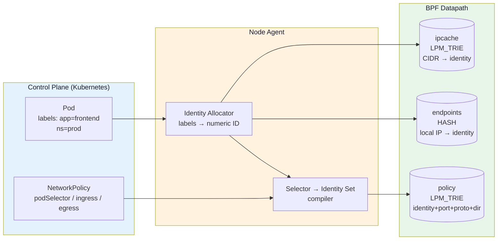
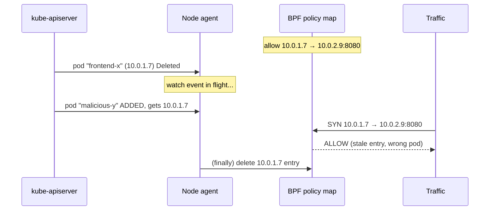
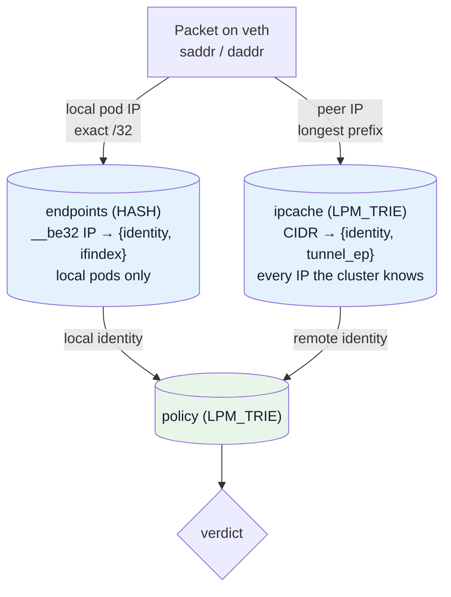
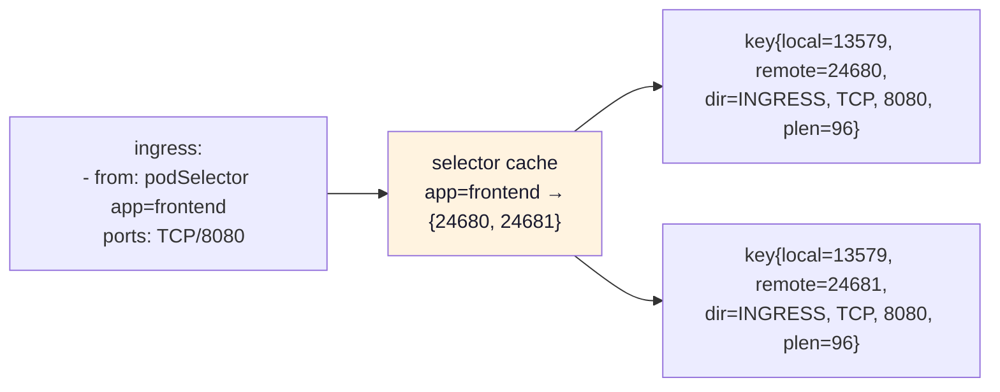
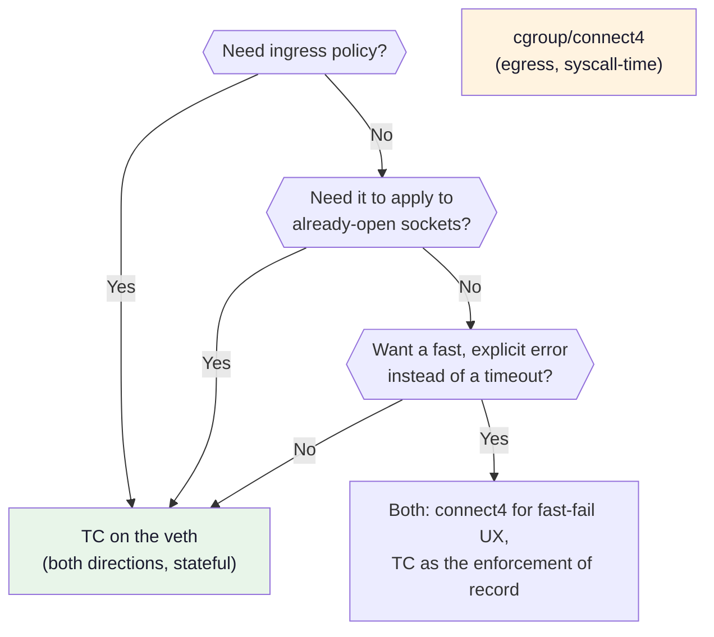
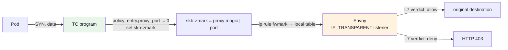

# Module 18: Network Policy Enforcement

> **Prerequisites:** Module 09 (maps), Module 11 (XDP/TC hooks), Module 13 (cgroup BPF), Module 16 (Kubernetes networking)

Everything up to here has taught you to move packets. This module is about **refusing** to move
them, correctly, in a cluster where the addresses change underneath you every few seconds.

The single idea to take away: **a pod's IP address is not its identity.** A policy engine keyed on
IP addresses is not a slow policy engine, it is a *wrong* one — it will start allowing traffic it was
told to deny, silently, as soon as the scheduler recycles an address. Cilium's answer is a numeric
**security identity** derived from labels, and almost every design decision in its datapath follows
from that one substitution.

---

## 📊 Visual Learning



---

## Errata for Modules 12 and 13

Two earlier snippets in this course are **illustrative sketches, not designs to copy**:

| Where | What is wrong | Read instead |
|-------|---------------|--------------|
| `12-ebpf-security.md` → "Network Policy Enforcement" | `struct policy_key` is keyed on raw `src_ip`/`dst_ip`. This is the IP-keyed model this module exists to replace. | [Why IP-Keyed Policy Is the Wrong Model](#why-ip-keyed-policy-is-the-wrong-model) |
| `13-socket-programming.md` → "Kubernetes Network Policy" | Calls `get_cgroup_identity()`. **No such kernel helper or library function exists.** Identity has to be looked up from a map you populate yourself. | [Where Identity Comes From at Enforcement Time](#where-identity-comes-from-at-enforcement-time) |

Both are fine as "here is the shape of a policy lookup". Neither survives contact with a real cluster.

---

## The NetworkPolicy Object, Read Literally

Before implementing an enforcer you have to know exactly what the object means. Most production
incidents with NetworkPolicy come from misreading the semantics, not from a datapath bug.

```yaml
apiVersion: networking.k8s.io/v1
kind: NetworkPolicy
metadata:
  name: frontend-to-backend
  namespace: prod
spec:
  podSelector:
    matchLabels:
      app: backend          # WHICH pods this policy applies to (always in this namespace)
  policyTypes:
    - Ingress               # naming a type turns on default-deny for that direction
  ingress:
    - from:
        - podSelector:
            matchLabels:
              app: frontend # same namespace as the policy
        - namespaceSelector:
            matchLabels:
              kubernetes.io/metadata.name: monitoring
          podSelector:
            matchLabels:
              app: prometheus   # AND: prometheus pods IN the monitoring namespace
        - ipBlock:
            cidr: 10.20.0.0/16
            except:
              - 10.20.5.0/24
      ports:
        - protocol: TCP
          port: 8080
          endPort: 8090       # port range, GA since Kubernetes 1.25
```

Five rules that people get wrong:

1. **Default is allow.** A pod is unrestricted until *some* policy selects it. The moment one
   policy names it under `policyTypes: [Ingress]`, that pod becomes default-deny for ingress —
   including from traffic that a completely different policy was previously allowing implicitly.
2. **Policies are additive and unordered.** There is no `deny` and no priority. The result is the
   union of every `from`/`to` block across every policy that selects the pod. You can never write a
   rule that subtracts from another rule. (`ipBlock.except` is the only subtraction, and only inside
   its own CIDR.)
3. **Elements of a `from` list are OR'd; keys inside one element are AND'd.** The two YAML fragments
   below mean completely different things:

   ```yaml
   # A: pods labelled app=frontend in namespace "monitoring"  (AND)
   from:
     - namespaceSelector: {matchLabels: {kubernetes.io/metadata.name: monitoring}}
       podSelector:       {matchLabels: {app: frontend}}

   # B: ANY pod in "monitoring", OR any app=frontend pod in THIS namespace  (OR)
   from:
     - namespaceSelector: {matchLabels: {kubernetes.io/metadata.name: monitoring}}
     - podSelector:       {matchLabels: {app: frontend}}
   ```

   The difference is one `-`. B is one of the most common accidental cluster-wide holes.
4. **`podSelector: {}` means "every pod in this namespace"**, and `namespaceSelector: {}` means
   "every namespace". They are the deny-all and allow-all building blocks. Watch the neighbouring
   trap: `ingress: []` (no rules) denies everything, while `ingress: [{}]` — *one* rule with neither
   `from` nor `ports` — allows everything, because "empty or missing `from`" is specified to match
   all sources. One pair of braces is the difference between default-deny and allow-all. (A peer
   entry that is itself empty, `from: [{}]`, is rejected by API validation — it must name a
   `podSelector`, a `namespaceSelector`, or an `ipBlock`.)
5. **`ipBlock` is for off-cluster addresses.** Whether an `ipBlock` also matches an in-cluster pod IP
   is not portable across CNIs, and after a Service DNAT the address the policy sees is the *backend
   pod IP*, not the ClusterIP. Never write policy against a ClusterIP.

### The deny-all / allow-list pair

```yaml
---
apiVersion: networking.k8s.io/v1
kind: NetworkPolicy
metadata: {name: default-deny-all, namespace: prod}
spec:
  podSelector: {}
  policyTypes: [Ingress, Egress]
---
apiVersion: networking.k8s.io/v1
kind: NetworkPolicy
metadata: {name: allow-dns, namespace: prod}
spec:
  podSelector: {}
  policyTypes: [Egress]
  egress:
    - to:
        - namespaceSelector: {matchLabels: {kubernetes.io/metadata.name: kube-system}}
          podSelector:       {matchLabels: {k8s-app: kube-dns}}
      ports:
        - {protocol: UDP, port: 53}
        - {protocol: TCP, port: 53}
```

> **The failure you will hit first.** Apply `default-deny-all` without `allow-dns` and every pod in
> the namespace stops resolving names. The symptom is not "policy blocked me" — it is a 5-second
> hang followed by `dial tcp: lookup backend.prod.svc.cluster.local: i/o timeout`, because the
> resolver silently walks the whole `ndots:5` search path (Module 16) and every attempt is dropped.
> Egress default-deny breaks DNS before it breaks anything you were thinking about.

---

## Why IP-Keyed Policy Is the Wrong Model

Take the naive map from Module 12:

```c
/* teaching/12-ebpf-security.md - DO NOT BUILD ON THIS */
struct policy_key {
    __be32 src_ip;
    __be32 dst_ip;
    __be16 dst_port;
    __u8   protocol;
};
```

To express "frontend may talk to backend on 8080" with F frontend pods and B backend pods you must
install **F × B** entries. Now run the numbers a real cluster produces:

| Cluster shape | IP-keyed entries | Identity-keyed entries |
|---------------|------------------|------------------------|
| 20 frontend → 20 backend, 1 port | 400 | 1 |
| 200 → 200, 3 ports | 120,000 | 3 |
| Deployment rollout replaces 200 pods | 120,000 deletes + 120,000 inserts | 0 |

The scale problem is annoying. The correctness problem is fatal:



Kubernetes recycles pod IPs aggressively — a CIDR of /24 per node and a busy CronJob namespace will
reuse an address within seconds. Between the delete event and the map update, *any* pod that lands on
that address inherits the departed pod's permissions. There is no ordering guarantee that saves you:
the address is assigned by IPAM (Module 17) before your agent has processed the deletion.

**Every IP-keyed policy engine has a race window in which it grants the wrong pod access, and the
window is exactly as long as your control-plane latency.**

Compare to identity-keyed: the new pod has different labels, so it resolves to a different identity,
so it does not match the rule at all — even if your agent has not processed a single event yet, the
worst case is that the new pod's IP is *absent* from the ipcache and therefore falls back to a
reserved identity that no rule allows. The failure mode flips from **fail-open** to **fail-closed**.

---

## Security Identity: The Fix

A **security identity** is a small integer that stands for *a set of security-relevant labels*, not
for an address.

```
labels: {k8s:io.kubernetes.pod.namespace=prod, k8s:app=backend, k8s:tier=data}
                              ↓ (cluster-wide allocator)
                        identity 24680
```

Properties that make this work:

- **Cluster-scoped and content-addressed.** Every pod anywhere in the cluster with that exact label
  set gets 24680. Allocation is a `CiliumIdentity` CRD (or a kvstore entry) so all nodes agree.
- **Stable across rescheduling.** Delete the pod, let it come back on another node with a new IP —
  same labels, same identity, and the policy map is *not touched*.
- **Independent of pod count.** 200 replicas share one identity. Rule count is O(selectors), not
  O(pods).
- **Reused for non-pod peers.** Nodes, the outside world, and CIDR blocks all get identities too, so
  the datapath has exactly one lookup shape.

### Reserved identities

Values 1–255 are reserved; cluster-allocated identities start at 256
(`MinimalNumericIdentity` in `pkg/identity/numericidentity.go`).

| ID | Name | Meaning |
|----|------|---------|
| 0 | `unknown` | Never allocated — see the wildcard note below |
| 1 | `host` | The local node itself (kubelet health checks land here) |
| 2 | `world` | Anything outside the cluster |
| 3 | `unmanaged` | An endpoint the agent has not taken ownership of |
| 4 | `health` | The node's `cilium-health` endpoint |
| 5 | `init` | Endpoint exists but its labels have not arrived yet |
| 6 | `remote-node` | Any other node in this or a connected cluster |
| 7 | `kube-apiserver` | Nodes hosting apiserver backends |
| 8 | `ingress` | Source address used by Ingress proxies |
| 9 / 10 | `world-ipv4` / `world-ipv6` | Family-split `world`, when both stacks are on |
| ≥256 | allocated | One per distinct label set |

Identity **0 is deliberately never handed out**, because the datapath reuses it as the *wildcard*
("any identity") in the policy map. If an ipcache lookup could ever legitimately return 0, every
"allow from anywhere" rule would also match unclassified traffic. Guard that invariant.

> **Production footgun — identity explosion.** If you feed *all* pod labels into the allocator, the
> `pod-template-hash` label gives every ReplicaSet revision a brand-new identity, and every rollout
> permanently grows the identity space and the policy maps. Cilium filters high-cardinality labels
> (`pod-template-hash`, `controller-revision-hash`, annotations, …) out of identity computation by
> default; if you build your own allocator, build the same filter on day one, not after you have
> 40,000 identities.

---

## Where Identity Comes From at Enforcement Time

The datapath has a packet, not a label set. It needs two identities per packet — local and remote —
and it must get both in a few tens of nanoseconds. Two maps do this.



- **`endpoints`** (`cilium_lxc`) — a plain hash of the IPs this node owns. A miss means "not my
  endpoint, don't enforce", which is how the program stays out of the way of host traffic.
- **`ipcache`** (`cilium_ipcache_v2`, an `LPM_TRIE`) — every pod IP in the cluster as a /32, every
  node IP, plus CIDR entries created by `ipBlock` rules, plus a `0.0.0.0/0 → world` catch-all.

That catch-all is load-bearing. Because a `/0` entry always exists, **the ipcache never misses**, so
the datapath never has to invent an identity for an unknown address, and identity 0 stays free to
mean "wildcard" in the policy map. Seed it at agent start-up.

The real value struct (`pkg/maps/ipcache/ipcache.go`) also carries the tunnel endpoint, which is how
the same lookup that classifies a peer also tells you which node to encapsulate towards.

> **Cross-node ingress.** Ingress policy is enforced on the *destination* node, which needs the
> *source* identity. Rather than trust a reverse ipcache lookup on every node, Cilium carries the
> source identity inside the tunnel header (the VXLAN VNI, or a Geneve option). With native routing
> and no tunnel there is no such channel, which is why the ipcache must be fully synced everywhere
> in that mode — a node that has not yet learned a remote pod's /32 will classify it as `world` and
> deny it. "Works from node A, denied from node B, same pods" is almost always ipcache skew.

---

## The Policy Map

### Layout

The key is `(local identity, remote identity, direction, protocol, port)` and the map is an
`LPM_TRIE` so that "any port" and "any protocol" fall out of the prefix length instead of costing
extra lookups.

```c
/* policy.bpf.c */
#include "vmlinux.h"          /* types + enums (BPF_F_NO_PREALLOC, IPPROTO_*) but NO macros */
#include <bpf/bpf_helpers.h>
#include <bpf/bpf_endian.h>   /* bpf_htons/bpf_ntohs - libc htons() does not exist for -target bpf */

/* Macros vmlinux.h does NOT give you - TC_ACT_* live in <linux/pkt_cls.h>,
   ETH_P_IP in <linux/if_ether.h>, both as #defines. */
#define TC_ACT_OK    0
#define TC_ACT_SHOT  2
#define ETH_P_IP     0x0800

#define DIR_INGRESS  0        /* traffic entering the local endpoint */
#define DIR_EGRESS   1        /* traffic leaving the local endpoint  */

#define WILDCARD_IDENTITY 0   /* identity 0 is never allocated - see Module text */
#define IDENTITY_WORLD    2

/* --- key data layout, in memory order ---------------------------------
   [ local_id : 32 ][ remote_id : 32 ][ dir : 8 ][ proto : 8 ][ dport : 16 ]
     bits 0-31        bits 32-63        64-71      72-79        80-95
   LPM compares the data bytes MSB-first, so a shorter prefix wildcards a
   SUFFIX of the key. That is why dport is last: it is the thing we most
   often want to wildcard.                                              */
#define PREFIX_ID_DIR    72   /* proto + port wildcarded */
#define PREFIX_ID_PROTO  80   /* port wildcarded         */
#define PREFIX_FULL      96   /* fully specified         */

struct policy_key {
    __u32 prefixlen;          /* MUST be the first field of an LPM_TRIE key */
    __u32 local_id;
    __u32 remote_id;
    __u8  dir;
    __u8  proto;
    __be16 dport;             /* network byte order: the datapath fills it straight
                                 from tcp->dest, so userspace must write the same
                                 bytes. It is also the only order in which a partial
                                 prefix over the port could ever mean anything. */
};                            /* 4 + 12 = 16 bytes, no padding */

struct policy_entry {
    __be16 proxy_port;        /* 0 = no L7 redirect */
    __u8   deny;              /* explicit deny (CiliumNetworkPolicy only; K8s NP has no deny) */
    __u8   pad;
    __u32  pad2;              /* the __u64 below forces 8-byte alignment; spell the
                                 padding out so the Go mirror is provably 24 bytes */
    __u64  packets;
    __u64  bytes;
};                            /* 24 bytes, no implicit padding */

struct {
    __uint(type, BPF_MAP_TYPE_LPM_TRIE);
    __uint(max_entries, 16384);
    __type(key, struct policy_key);
    __type(value, struct policy_entry);
    __uint(map_flags, BPF_F_NO_PREALLOC);   /* mandatory for LPM_TRIE */
} policy SEC(".maps");
```

> **First thing that will bite you:** an `LPM_TRIE` created without `BPF_F_NO_PREALLOC` fails at
> load time with `EINVAL` and a message that says nothing about prealloc. The general LPM trie
> mechanics — key layout, `prefixlen` counting *data* bits only, and why the data must be
> big-endian — are covered in [Module 09](./09-ebpf-maps-mastery.md); this module only uses them.

Note what the prefix trick can and cannot do. It wildcards a *suffix*, so `PREFIX_ID_DIR` gives you
"this identity pair, any protocol, any port" for free. It **cannot** wildcard `remote_id`, because
`dir`/`proto`/`dport` sit after it. "Allow from anyone on 8080" therefore needs a *second* lookup
with `remote_id = 0`. Real Cilium does exactly this — a specific lookup, then a wildcard-identity
fallback.

### How selectors compile into entries



The agent keeps a **selector cache**: label selector → the set of identities currently matching it.
When a new identity is allocated, the cache tells you which selectors it joins, and you insert one
map entry per (selector-member × affected local endpoint × port). When a *pod* appears with an
existing identity, **zero** map writes are needed — only an ipcache /32.

Rule translation, in full:

| NetworkPolicy fragment | Policy map entry |
|------------------------|------------------|
| `from: [podSelector app=frontend]`, no `ports` | `remote=<each id>`, `prefixlen=72` (any proto/port) |
| `ports: [{TCP, 8080}]` | `remote=<id>, proto=6, dport=htons(8080)`, `prefixlen=96` |
| `ports: [{TCP}]` (no `port:`) | `remote=<id>, proto=6`, `prefixlen=80` |
| `policyTypes: [Ingress]` with no `ingress:` rules | *no entries* — default deny |
| `ingress: [{}]` — one rule, no `from`, no `ports` | `remote=0` (wildcard), `prefixlen=72` — a rule with an empty `from` matches **all** sources |
| `from: [{podSelector: {}}]` | one entry per identity in *this namespace* — **not** a wildcard |
| `ipBlock: {cidr: 10.20.0.0/16}` | ipcache `10.20.0.0/16 → <new CIDR identity>`, then a normal entry |
| `endPort: 8090` | one entry per port in the range (a 16-bit LPM prefix only expresses power-of-two aligned ranges) |

### Datapath lookup

```c
static __always_inline struct policy_entry *
policy_lookup(__u32 local_id, __u32 remote_id, __u8 dir, __u8 proto, __be16 dport)
{
    struct policy_key key = {
        .prefixlen = PREFIX_FULL,   /* lookups are ALWAYS fully specified */
        .local_id  = local_id,
        .remote_id = remote_id,
        .dir       = dir,
        .proto     = proto,
        .dport     = dport,
    };

    /* 1. most specific: this exact peer identity */
    struct policy_entry *e = bpf_map_lookup_elem(&policy, &key);
    if (e)
        return e;

    /* 2. fallback: rules that allow ANY identity. LPM cannot wildcard a
     *    field in the middle of the key, so this needs its own lookup. */
    key.remote_id = WILDCARD_IDENTITY;
    return bpf_map_lookup_elem(&policy, &key);
}
```

Two trie descents per packet, constant regardless of cluster size. Contrast with the IP-keyed
version, whose *map* stays O(1) but whose *control plane* has to rewrite 120,000 entries on a
rollout while traffic is flowing.

### Writing entries from Go

```go
package policy

import (
	"encoding/binary"
	"fmt"

	"github.com/cilium/ebpf"
)

const (
	prefixIDDir   = 72
	prefixIDProto = 80
	prefixFull    = 96

	dirIngress = 0
	dirEgress  = 1
)

// Field order and sizes must mirror `struct policy_key` byte for byte:
// cilium/ebpf marshals Go structs with NATIVE endianness and no reordering.
type policyKey struct {
	PrefixLen uint32
	LocalID   uint32
	RemoteID  uint32
	Dir       uint8
	Proto     uint8
	DestPort  uint16 // network byte order - see htons below
}

// 24 bytes, matching `struct policy_entry`. cilium/ebpf marshals with
// binary.Write, which does NOT insert alignment padding - so the C struct's
// padding before `packets` has to be written out here as a blank field, or the
// value is 20 bytes and every Update fails with a value-size error.
type policyEntry struct {
	ProxyPort uint16
	Deny      uint8
	_         uint8
	_         uint32
	Packets   uint64
	Bytes     uint64
}

// The datapath fills DestPort from tcp->dest, which is already network byte
// order, so the key we write has to contain those same bytes. The struct is
// marshalled with native endianness, so build the value from big-endian bytes
// and hand it back as a native uint16.
func htons(v uint16) uint16 {
	var b [2]byte
	binary.BigEndian.PutUint16(b[:], v)
	return binary.NativeEndian.Uint16(b[:]) // Go 1.21+
}

// AllowTCPPort installs "localID may talk to remoteID on tcp/port, in dir".
// Pass remoteID = 0 for "from any identity".
func AllowTCPPort(m *ebpf.Map, localID, remoteID uint32, dir uint8, port uint16) error {
	k := policyKey{
		PrefixLen: prefixFull,
		LocalID:   localID,
		RemoteID:  remoteID,
		Dir:       dir,
		Proto:     6, // IPPROTO_TCP
		DestPort:  htons(port),
	}
	if err := m.Update(&k, &policyEntry{}, ebpf.UpdateAny); err != nil {
		// ENOSPC here means the trie is full and the rule is NOT enforced.
		// (LPM_TRIE reports a full map as ENOSPC; hash maps use E2BIG for the
		// same condition - do not test for only one of them.)
		// Never log-and-continue on this one.
		return fmt.Errorf("install policy %d->%d tcp/%d: %w", remoteID, localID, port, err)
	}
	return nil
}

// AllowAllPorts is the same rule with proto and port wildcarded by prefix length.
// Proto/DestPort are left zero - see the note below on why that matters.
func AllowAllPorts(m *ebpf.Map, localID, remoteID uint32, dir uint8) error {
	k := policyKey{PrefixLen: prefixIDDir, LocalID: localID, RemoteID: remoteID, Dir: dir}
	return m.Update(&k, &policyEntry{}, ebpf.UpdateAny)
}

// Open the map the datapath already pinned, rather than creating a second copy.
// (`bpftool prog loadall ... pinmaps /sys/fs/bpf/policy_maps` put it there.)
func openPolicyMap() (*ebpf.Map, error) {
	return ebpf.LoadPinnedMap("/sys/fs/bpf/policy_maps/policy", nil)
}
```

> **Zero the wildcarded bytes.** Matching only ever looks at the first `prefixlen` bits, so garbage
> in the tail does not change verdicts — but the kernel copies the *entire* key data into the trie
> node and hands it back verbatim to `bpf_map_get_next_key` and `bpftool map dump`. Leave junk there
> and every dump becomes unreadable, and any userspace bookkeeping that hashes the raw key bytes
> (such as the mark-and-sweep reconciler in Module 19) will disagree with itself between restarts.
> Zero the struct, then fill only the fields inside the prefix.

---

## Enforcement Point 1: TC on the veth

The pod's veth pair has one end in the pod netns and one on the host (Module 15). Attach to the
**host side** and the directions invert, which trips up everyone once:

| Attach point (host-side veth) | Packet is | Enforce |
|-------------------------------|-----------|---------|
| TC **ingress** | leaving the pod ("from-container") | the pod's **egress** policy |
| TC **egress** | entering the pod ("to-container") | the pod's **ingress** policy |

```c
struct endpoint_info {
    __u32 identity;
    __u32 ifindex;
};

struct {
    __uint(type, BPF_MAP_TYPE_HASH);
    __uint(max_entries, 65536);
    __type(key, __be32);              /* local pod IPv4 */
    __type(value, struct endpoint_info);
} endpoints SEC(".maps");

struct ipcache_key {
    __u32  prefixlen;                 /* bits of `addr` that are significant */
    __be32 addr;                      /* network byte order == big-endian in memory */
};

struct remote_endpoint_info {
    __u32  identity;
    __be32 tunnel_endpoint;           /* 0 = directly routed */
};

struct {
    __uint(type, BPF_MAP_TYPE_LPM_TRIE);
    __uint(max_entries, 512000);
    __type(key, struct ipcache_key);
    __type(value, struct remote_endpoint_info);
    __uint(map_flags, BPF_F_NO_PREALLOC);
} ipcache SEC(".maps");

struct drop_event {
    __u64 timestamp;
    __be32 saddr;
    __be32 daddr;
    __u32 src_identity;
    __u32 dst_identity;
    __be16 dport;
    __u8  proto;
    __u8  dir;
    __u32 pad;      /* the __u64 forces 8-byte alignment; make the tail padding
                       explicit so the Go struct is provably the same 32 bytes */
};

struct {
    __uint(type, BPF_MAP_TYPE_RINGBUF);
    __uint(max_entries, 1 << 20);     /* 1 MiB; kernel 5.8+ */
} policy_drops SEC(".maps");

/* Parsed 5-tuple; filled only after every bounds check has passed. */
struct tuple {
    __be32 saddr;
    __be32 daddr;
    __be16 dport;
    __u8   proto;
};

static __always_inline int parse_ipv4(struct __sk_buff *skb, struct tuple *t)
{
    void *data     = (void *)(long)skb->data;
    void *data_end = (void *)(long)skb->data_end;

    struct ethhdr *eth = data;
    if ((void *)(eth + 1) > data_end)
        return -1;
    if (eth->h_proto != bpf_htons(ETH_P_IP))
        return -1;                                  /* IPv6/ARP: out of scope here.
                                                       See the fail-open warning below. */

    struct iphdr *ip = (void *)(eth + 1);
    if ((void *)(ip + 1) > data_end)
        return -1;

    /* Variable IP header length. Using sizeof(struct iphdr) here would parse
       the first option bytes as a TCP header on any packet with options. */
    __u32 ihl = ip->ihl * 4;
    if (ihl < sizeof(*ip))
        return -1;
    void *l4 = (void *)ip + ihl;
    if (l4 > data_end)
        return -1;

    t->saddr = ip->saddr;
    t->daddr = ip->daddr;
    t->proto = ip->protocol;
    t->dport = 0;                                   /* ICMP & friends: port 0 */

    if (ip->protocol == IPPROTO_TCP) {
        struct tcphdr *tcp = l4;
        if ((void *)(tcp + 1) > data_end)
            return -1;
        t->dport = tcp->dest;                       /* already network order */
    } else if (ip->protocol == IPPROTO_UDP) {
        struct udphdr *udp = l4;
        if ((void *)(udp + 1) > data_end)
            return -1;
        t->dport = udp->dest;
    }
    return 0;
}

static __always_inline __u32 ipcache_lookup(__be32 addr)
{
    struct ipcache_key key = { .prefixlen = 32, .addr = addr };
    struct remote_endpoint_info *info = bpf_map_lookup_elem(&ipcache, &key);

    /* Cannot happen if the agent seeded 0.0.0.0/0 -> world. Fail closed anyway:
       returning WILDCARD_IDENTITY here would match every "allow any" rule. */
    return info ? info->identity : IDENTITY_WORLD;
}

static __always_inline void notify_drop(const struct tuple *t, __u32 src_id,
                                        __u32 dst_id, __u8 dir)
{
    struct drop_event *e = bpf_ringbuf_reserve(&policy_drops, sizeof(*e), 0);
    if (!e)
        return;                                     /* buffer full: lose the event, not the verdict */
    e->timestamp    = bpf_ktime_get_ns();
    e->saddr        = t->saddr;
    e->daddr        = t->daddr;
    e->dport        = t->dport;
    e->proto        = t->proto;
    e->dir          = dir;
    e->src_identity = src_id;
    e->dst_identity = dst_id;
    e->pad          = 0;    /* reserved ringbuf memory is NOT zeroed - it still holds
                               bytes from a previous event. Set every field, padding
                               included, or you leak them to userspace. */
    bpf_ringbuf_submit(e, 0);
}

static __always_inline int enforce(struct __sk_buff *skb, __u8 dir)
{
    struct tuple t = {};
    if (parse_ipv4(skb, &t) < 0)
        return TC_ACT_OK;

    /* The local endpoint is the pod on this veth: source on egress, dest on ingress. */
    __be32 local_ip  = (dir == DIR_EGRESS) ? t.saddr : t.daddr;
    __be32 remote_ip = (dir == DIR_EGRESS) ? t.daddr : t.saddr;

    struct endpoint_info *ep = bpf_map_lookup_elem(&endpoints, &local_ip);
    if (!ep)
        return TC_ACT_OK;                           /* not an endpoint we manage */

    __u32 remote_id = ipcache_lookup(remote_ip);

    struct policy_entry *e =
        policy_lookup(ep->identity, remote_id, dir, t.proto, t.dport);

    if (!e || e->deny) {
        notify_drop(&t, (dir == DIR_EGRESS) ? ep->identity : remote_id,
                        (dir == DIR_EGRESS) ? remote_id    : ep->identity, dir);
        return TC_ACT_SHOT;
    }

    __sync_fetch_and_add(&e->packets, 1);
    __sync_fetch_and_add(&e->bytes, skb->len);

    /* e->proxy_port != 0 -> L7 redirect; see the proxy section below. */
    return TC_ACT_OK;
}

SEC("tc")
int from_container(struct __sk_buff *skb) { return enforce(skb, DIR_EGRESS); }

SEC("tc")
int to_container(struct __sk_buff *skb)   { return enforce(skb, DIR_INGRESS); }

char LICENSE[] SEC("license") = "GPL";
```

> **This program is IPv4-only, and that is a hole, not a simplification.** `parse_ipv4()` returns
> `-1` for anything that is not `ETH_P_IP`, and `enforce()` turns that into `TC_ACT_OK`. On a
> dual-stack cluster every IPv6 flow is therefore *allowed*, whatever the policy says. Ship an
> `ETH_P_IPV6` parser alongside it, or make the fallthrough `TC_ACT_SHOT` for IPv6 specifically and
> keep `TC_ACT_OK` only for ARP and the other control traffic the stack needs. "Deny is enforced on
> v4 and skipped on v6" is one of the ways a policy engine passes review and still fails.

Attaching it (`lxc1234` is the host-side veth of the pod):

```bash
# Both programs live in SEC("tc"), so `tc ... obj policy.bpf.o sec tc` is ambiguous -
# iproute2 would silently take the first one for both hooks. Load once, pin by
# function name, then attach the pins.
sudo bpftool prog loadall policy.bpf.o /sys/fs/bpf/policy pinmaps /sys/fs/bpf/policy_maps
ls /sys/fs/bpf/policy/          # from_container  to_container
ls /sys/fs/bpf/policy_maps/     # endpoints  ipcache  policy  policy_drops

# clsact gives you both an ingress and an egress hook on one qdisc
sudo tc qdisc add dev lxc1234 clsact
sudo tc filter add dev lxc1234 ingress bpf da pinned /sys/fs/bpf/policy/from_container
sudo tc filter add dev lxc1234 egress  bpf da pinned /sys/fs/bpf/policy/to_container

sudo tc filter show dev lxc1234 ingress
sudo bpftool net list                       # every netdev attachment, in one place
```

> `da` (`direct-action`) is not optional. Without it the program's return value is interpreted as a
> classid, `TC_ACT_SHOT` (2) is read as "class 0:2", and **nothing is ever dropped** — your policy
> silently becomes allow-all. If your enforcer is passing traffic it should block and `bpf_printk`
> shows the drop path executing, check for `da` in `tc filter show` output first.

On kernel 6.6+, prefer `link.AttachTCX` from `cilium/ebpf`: it gives you a real link fd (so the
program is cleaned up when your agent dies), ordered multi-program attachment, and no qdisc to
manage.

### Stateful return traffic

The program above evaluates every packet independently, so a policy that allows `frontend → backend
:8080` on egress will drop the **reply** on the frontend's ingress path unless a matching ingress
rule exists. Real enforcers consult a conntrack map first and allow anything in an established
flow — that is the same LRU conntrack table from Module 11, keyed on the 5-tuple, checked before the
policy lookup and skipping it on a hit. Policy is evaluated **once per connection**, on the first
packet. Leave that out and you have built a stateless firewall from 1998.

---

## Enforcement Point 2: `cgroup/connect4`

The other place to enforce is at the socket, before a packet exists at all. Module 13 covers the
mechanics of `cgroup/connect4`; here is what changes when you use it for *policy*.

```c
/* sock_policy.bpf.c - shares policy.h with the TC program above:
   the `policy` and `ipcache` map definitions, policy_lookup() and
   ipcache_lookup() are exactly the same objects. */
#include "vmlinux.h"
#include <bpf/bpf_helpers.h>
#include <bpf/bpf_endian.h>
#include "policy.h"

/* Pod == network namespace. The netns cookie is a stable per-netns u64 that the
   agent can map to the pod's identity when it plumbs the veth. This is what
   the phantom `get_cgroup_identity()` in Module 13 should have been. */
struct {
    __uint(type, BPF_MAP_TYPE_HASH);
    __uint(max_entries, 65536);
    __type(key, __u64);        /* netns cookie */
    __type(value, __u32);      /* security identity */
} netns_identity SEC(".maps");

SEC("cgroup/connect4")
int policy_connect4(struct bpf_sock_addr *ctx)
{
    if (ctx->protocol != IPPROTO_TCP)
        return 1;                                   /* only TCP connect() reaches here usefully */

    __u64 cookie = bpf_get_netns_cookie(ctx);       /* cgroup sock_addr support: 5.7+ */
    __u32 *local_id = bpf_map_lookup_elem(&netns_identity, &cookie);
    if (!local_id)
        return 1;                                   /* not a managed pod - do not enforce */

    /* The verifier only permits a 4-byte access to user_port; read the whole
       word, then narrow. The port is already in network byte order. */
    volatile __u32 uport = ctx->user_port;
    __be16 dport = (__be16)uport;

    __u32 remote_id = ipcache_lookup(ctx->user_ip4);

    struct policy_entry *e =
        policy_lookup(*local_id, remote_id, DIR_EGRESS, IPPROTO_TCP, dport);

    if (!e || e->deny)
        return 0;    /* connect() returns -EPERM to the application */

    return 1;
}

char LICENSE[] SEC("license") = "GPL";
```

```bash
# The cgroup v2 unified hierarchy is the attach target. Attaching at the ROOT
# cgroup catches every process on the node - that is why the program bails out
# on a netns_identity miss instead of enforcing.
sudo bpftool prog load sock_policy.bpf.o /sys/fs/bpf/policy_connect4 \
     map name policy pinned /sys/fs/bpf/policy_maps/policy \
     map name ipcache pinned /sys/fs/bpf/policy_maps/ipcache
sudo bpftool cgroup attach /sys/fs/cgroup connect4 pinned /sys/fs/bpf/policy_connect4
sudo bpftool cgroup show /sys/fs/cgroup
```

The `map name ... pinned ...` arguments are what make this program share the *same* policy and
ipcache maps as the TC datapath instead of creating private second copies. Forget them and the
socket hook enforces against empty maps, and *which way it fails depends on timing*: until the agent
populates `netns_identity`, every lookup misses, the program returns 1, and nothing is enforced at
all (**fail-open**); the moment the agent fills `netns_identity` in but the policy map is still the
private empty copy, `!e` fires for every `connect()` from a managed pod and the pod cannot reach
anything (**fail-closed**). Neither state announces itself — check with `bpftool prog show pinned
/sys/fs/bpf/policy_connect4` that the `map_ids` it lists are the same ids as the TC programs'.

`netns_identity` itself is created fresh by this load and is *not* pinned by the command above. Pin
it (add `pinmaps <dir>`) or resolve it by id, or the agent has nothing to write pod identities into
and the hook is inert.

### The part that changes your debugging life

**A socket-level denial is an error return, not a dropped packet.** Returning `0` from
`cgroup/connect4` makes the kernel fail the `connect(2)` syscall with `EPERM`. Nothing is ever put on
the wire.

```
# TC drop (packet-level)                      # connect4 deny (socket-level)
$ curl http://backend:8080                    $ curl http://backend:8080
curl: (28) Connection timed out after         curl: (7) Failed to connect to backend
       5000 milliseconds                             port 8080: Operation not permitted
                                              
$ tcpdump -i eth0 -nn 'port 8080'             $ tcpdump -i eth0 -nn 'port 8080'
10.0.1.7.51234 > 10.0.2.9.8080: Flags [S]     (nothing. not one packet.)
10.0.1.7.51234 > 10.0.2.9.8080: Flags [S]
10.0.1.7.51234 > 10.0.2.9.8080: Flags [S]
```

That difference drives real triage decisions:

| | TC / XDP drop | `cgroup/connect4` deny |
|---|---|---|
| Application sees | timeout after SYN retries (~2 min for TCP default) | immediate `EPERM` ("operation not permitted") |
| Go error string | `dial tcp 10.0.2.9:8080: i/o timeout` | `dial tcp 10.0.2.9:8080: connect: operation not permitted` |
| `tcpdump` inside the pod | SYN, SYN, SYN | **nothing** |
| Retries | client retransmits, load stays on the network | none — fails once, fast |
| Where you look first | drop notifications, `tc filter show`, conntrack | `strace -e connect`, `bpftool cgroup show` |

The "nothing in tcpdump" signature is the tell. If an application reports a connection failure and
you cannot find the SYN anywhere — not in the pod, not on the veth, not on the node — stop looking
for a drop and start looking for a cgroup program. Conversely, `EPERM` from a connect is *never* a
network problem; no amount of routing debugging will explain it.

### What socket-level enforcement cannot do

| Limitation | Consequence |
|------------|-------------|
| Egress only, and only for connected sockets | No ingress policy at all. You still need TC. |
| Fires once, at `connect()` | Policy changes do not affect sockets that are already open. A pod keeps its connection after you delete the allowing policy. |
| `connect4` misses unconnected UDP | You must also attach `cgroup/sendmsg4` or UDP sendto() bypasses policy entirely. |
| Raw sockets and ICMP never call `connect()` | `ping` is unaffected. A `CAP_NET_RAW` pod bypasses socket policy completely. |
| Sees the address the *application* asked for | With socket-LB (Module 16) the ClusterIP is rewritten here too — ordering between the LB program and the policy program decides whether you match VIP or backend. |

**Choose based on what you need**, not on which is faster:



Cilium's own choice is instructive: it runs `cgroup/connect4` for **service load balancing**, and
enforces **policy at TC**. The socket hook is where you cheaply rewrite a destination; the veth is
where you can actually see both directions.

---

## CIDR Policy and the ipcache

`ipBlock` is the one place where policy is genuinely address-based — the peer is outside the cluster
and has no labels. The trick is to keep the policy map identity-keyed anyway by minting an identity
for the CIDR:

```
ipBlock: 10.20.0.0/16   →  allocate node-local identity 16777472  (has the 1<<24 scope bit)
                        →  ipcache: 10.20.0.0/16 → 16777472
                        →  policy:  {local, remote=16777472, INGRESS, TCP, 8080}
```

Now the fast path is unchanged: one LPM lookup in the ipcache turns the address into an identity,
and the policy lookup is the same two probes as always. CIDR identities carry the local-scope bit
(`1 << 24`) because they only need to be meaningful on the node that created them.

`except:` blocks become more-specific ipcache entries pointing at `world`:

```
10.20.0.0/16  → identity 16777472   (allowed)
10.20.5.0/24  → identity 2 (world)  (longer prefix wins → not allowed)
0.0.0.0/0     → identity 2 (world)  (the mandatory catch-all)
```

Longest-prefix-match does the subtraction for you, which is exactly why the ipcache is an
`LPM_TRIE` and not a hash. See [Module 09](./09-ebpf-maps-mastery.md) for the trie's key mechanics;
the only policy-specific rule is that overlapping `ipBlock`s from *different* NetworkPolicies must
be merged into one identity per distinct prefix before insertion — two policies both allowing
`10.20.0.0/16` must not race each other into the same ipcache slot with different identities.

---

## L7 Policy: the Proxy Redirect

A rule like "GET /public is allowed, everything else is not" cannot be answered by a map lookup —
you have to parse HTTP, and HTTP spans TCP segments. The datapath's job is therefore not to *decide*
but to *divert*.



The mechanism, step by step:

1. The L3/L4 policy entry for that identity pair carries a non-zero `proxy_port`.
2. The TC program stamps `skb->mark` with a magic value plus the proxy port instead of returning
   `TC_ACT_OK` straight through.
3. A routing rule matching that mark sends the packet to a local table whose route is `local`, so the
   host delivers it to a listening socket even though the destination IP is not the host's.
4. The proxy listens with `IP_TRANSPARENT`, so it sees the original destination and can forward on
   behalf of the client.
5. The proxy applies the L7 rules and either forwards or synthesises a 403.

```bash
# The routing half of the trick (values are illustrative)
ip rule  add fwmark 0x200/0xf00 pref 9 lookup 2005
ip route add local 0.0.0.0/0 dev lo table 2005
```

Two consequences worth stating plainly:

- **L7 policy costs a userspace round trip.** Every byte of a proxied connection leaves the kernel
  and comes back. Applying an L7 rule to a high-throughput path is a deliberate latency decision.
- **An L7 deny is an HTTP 403, not a drop.** The connection succeeds; only the request fails. If
  your alerting keys on connection failures it will not see L7 denials at all.

---

## Drop Observability

An enforcer you cannot debug is an outage generator. The ring buffer from the datapath above feeds a
reader that turns raw drops into something a human can act on.

```go
package main

import (
	"bytes"
	"encoding/binary"
	"errors"
	"fmt"
	"log"
	"net/netip"

	"github.com/cilium/ebpf/ringbuf"
)

type dropEvent struct {
	Timestamp   uint64
	Saddr       [4]byte
	Daddr       [4]byte
	SrcIdentity uint32
	DstIdentity uint32
	Dport       uint16 // network byte order
	Proto       uint8
	Dir         uint8
	_           uint32 // must mirror the C struct's tail padding exactly
}

func watchDrops(rb *ringbuf.Reader, names map[uint32]string) {
	for {
		rec, err := rb.Read()
		if err != nil {
			if errors.Is(err, ringbuf.ErrClosed) {
				return
			}
			log.Printf("ringbuf read: %v", err)
			continue
		}

		var e dropEvent
		// NativeEndian, not LittleEndian: the kernel wrote the struct with the
		// host's byte order, and that host is not always x86.
		if err := binary.Read(bytes.NewReader(rec.RawSample), binary.NativeEndian, &e); err != nil {
			continue
		}

		dir := "ingress"
		if e.Dir == 1 {
			dir = "egress"
		}

		// The identity is the point: print WHO was denied, not just which address.
		fmt.Printf("DENIED %s %s (%s) -> %s:%d (%s) proto=%d\n",
			dir,
			netip.AddrFrom4(e.Saddr), identityName(names, e.SrcIdentity),
			netip.AddrFrom4(e.Daddr), ntohs(e.Dport), identityName(names, e.DstIdentity),
			e.Proto)
	}
}

// names is the agent's identity -> label-string cache, pre-seeded with the
// reserved identities (0 unknown, 1 host, 2 world, 6 remote-node, ...).
func identityName(names map[uint32]string, id uint32) string {
	if n, ok := names[id]; ok {
		return n
	}
	return fmt.Sprintf("identity=%d", id)
}

func ntohs(v uint16) uint16 {
	var b [2]byte
	binary.NativeEndian.PutUint16(b[:], v) // Go 1.21+
	return binary.BigEndian.Uint16(b[:])
}
```

Output that names the identities is the difference between a five-minute fix and an afternoon:

```
DENIED egress 10.0.1.7 (k8s:prod/app=frontend) -> 10.0.9.4:53 (k8s:kube-system/k8s-app=kube-dns) proto=17
```

That line tells you immediately that you forgot the DNS egress rule. `10.0.1.7 -> 10.0.9.4:53
DROPPED` would not have.

The equivalent in a real Cilium cluster:

```bash
# Live drop stream from one node's datapath
kubectl -n kube-system exec ds/cilium -- cilium-dbg monitor --type drop

# Cluster-wide, with pod names and the policy verdict
hubble observe --verdict DROPPED --namespace prod --follow

# "Why was this denied?" - shows which rules apply to an endpoint
kubectl -n kube-system exec ds/cilium -- cilium-dbg endpoint get <endpoint-id>
```

---

## 🧪 Lab: Prove the Identity Survives and the IP Does Not

This is the experiment that makes the whole module concrete. ~20 minutes.

### 1. Cluster with a policy-capable CNI

```bash
cat > kind-cilium.yaml <<'EOF'
kind: Cluster
apiVersion: kind.x-k8s.io/v1alpha4
nodes:
  - role: control-plane
  - role: worker
networking:
  disableDefaultCNI: true       # kindnet has no NetworkPolicy support
EOF

kind create cluster --name policy-lab --config kind-cilium.yaml
cilium install                  # leaves kube-proxy in place; policy does not need to replace it
cilium status --wait
```

### 2. Workloads and a deny-all + allow pair

```bash
kubectl create ns prod
# `kubectl create deployment` already stamps app=backend on the pod template
kubectl -n prod create deployment backend --image=nginx --replicas=2
kubectl -n prod expose deployment backend --port=80
kubectl -n prod run frontend --image=nicolaka/netshoot \
    --labels=app=frontend --command -- sleep infinity
kubectl -n prod rollout status deployment/backend
kubectl -n prod wait --for=condition=Ready pod/frontend

# Baseline: works, because nothing selects these pods yet
kubectl -n prod exec frontend -- curl -s -m 3 -o /dev/null -w '%{http_code}\n' backend
```

```bash
kubectl apply -f - <<'EOF'
apiVersion: networking.k8s.io/v1
kind: NetworkPolicy
metadata: {name: deny-all, namespace: prod}
spec:
  podSelector: {}
  policyTypes: [Ingress, Egress]
---
apiVersion: networking.k8s.io/v1
kind: NetworkPolicy
metadata: {name: frontend-to-backend, namespace: prod}
spec:
  podSelector: {matchLabels: {app: backend}}
  policyTypes: [Ingress]
  ingress:
    - from: [{podSelector: {matchLabels: {app: frontend}}}]
      ports: [{protocol: TCP, port: 80}]
EOF
```

`curl backend` now **fails** — and the reason is the lesson: `deny-all` also turned on egress
default-deny for the frontend, so DNS is gone. Add the DNS rule from earlier in this module, plus
egress to backend, and it works again. Do this step by hand; the muscle memory is worth it.

### 3. Read the identity and the map

```bash
CILIUM=$(kubectl -n kube-system get pod -l k8s-app=cilium \
  -o jsonpath='{.items[0].metadata.name}')

# labels -> identity
kubectl -n kube-system exec $CILIUM -- cilium-dbg identity list | grep -E 'app=(frontend|backend)'

# endpoints on this node, with their identity and the pod IP
kubectl -n kube-system exec $CILIUM -- cilium-dbg endpoint list

# the compiled policy map for one endpoint - entries are keyed by IDENTITY
kubectl -n kube-system exec $CILIUM -- cilium-dbg bpf policy get <endpoint-id>

# address -> identity
kubectl -n kube-system exec $CILIUM -- cilium-dbg bpf ipcache list | head
```

Record two numbers: the backend's **identity** and the backend pod's **IP**.

### 4. Reschedule and re-read

```bash
kubectl -n prod delete pod -l app=backend        # new pods, new IPs
kubectl -n prod rollout status deployment/backend

kubectl -n kube-system exec $CILIUM -- cilium-dbg identity list | grep 'app=backend'
kubectl -n kube-system exec $CILIUM -- cilium-dbg bpf policy get <endpoint-id>
kubectl -n kube-system exec $CILIUM -- cilium-dbg bpf ipcache list | grep <new-pod-ip>
```

What you should see:

| | Before | After |
|---|--------|-------|
| Pod IP | `10.244.1.42` | `10.244.1.57` |
| ipcache `/32` entry | `10.244.1.42 → 24680` | `10.244.1.57 → 24680` (old one gone) |
| Identity | `24680` | `24680` — **unchanged** |
| Policy map entries | `remote=24680, TCP/80` | **byte-for-byte identical** |
| Connectivity | works | works, with zero policy-map writes |

Now do the inverse and watch the identity move instead of the address:

```bash
kubectl -n prod label pod -l app=frontend app=attacker --overwrite
kubectl -n prod exec frontend -- curl -s -m 3 backend   # now denied
```

Same pod, same IP, same open netns — denied, because its labels changed and therefore its identity
did. **That is the whole point of the model**, and no IP-keyed enforcer can express it.

### 5. Look at the raw map

```bash
# Names are truncated to 15 chars by the kernel (BPF_OBJ_NAME_LEN is 16),
# so "cilium_policy_v3_00123" appears as "cilium_policy_v". List and match by id.
kubectl -n kube-system exec $CILIUM -- bpftool map show | grep -i policy
kubectl -n kube-system exec $CILIUM -- bpftool map dump id <id>
```

The map name has changed across releases (`cilium_policy_…`, then `cilium_policy_v2_…`, now
`cilium_policy_v3_…`) and the value struct has grown fields. **Never hardcode either in tooling** —
enumerate with `bpftool map show` and match on the id.

---

## Failure Modes You Will Actually Hit

| Symptom | Cause | Diagnosis |
|---------|-------|-----------|
| Everything breaks right after the first policy | Default-deny egress killed DNS | `hubble observe --verdict DROPPED --port 53`; add the kube-dns egress rule |
| Enforcer passes traffic it should drop | `tc filter` attached without `direct-action` | `tc filter show dev X ingress` — look for `da` |
| Policy allows a pod that was deleted | IP-keyed rules + address recycling | You built the wrong model. Re-read this module. |
| Works from node A, denied from node B | ipcache not fully synced; remote pod classified as `world` | `cilium-dbg bpf ipcache list \| grep <pod-ip>` on both nodes |
| App gets `operation not permitted`, no packets anywhere | `cgroup/connect4` deny | `bpftool cgroup show /sys/fs/cgroup`; `strace -f -e trace=connect` |
| App hangs 2 minutes then times out | TC/XDP drop | drop ring buffer / `cilium-dbg monitor --type drop` |
| Policy change has no effect on one connection | Socket-level policy is evaluated at `connect()` only | Restart the client, or enforce at TC where every packet is seen |
| Reply traffic dropped although the request was allowed | No conntrack lookup before the policy lookup | Add the established-flow short circuit |
| `bpf_map_update_elem` returns `ENOSPC` | Policy map `max_entries` exceeded, silently unenforced rules (a hash map would say `E2BIG`) | `bpftool map show`; alert on `used/max` ratio, never let it fail quietly |
| LPM map fails to load with `EINVAL` | Missing `BPF_F_NO_PREALLOC` | Add the flag; the error message will not tell you |
| Rules match the wrong port | `dport` written in host byte order | The datapath keys on `tcp->dest`, which is network order; the userspace writer must produce the identical bytes. `htons()` on the Go side, `__be16` on both |
| Identity count grows every deploy | `pod-template-hash` fed into identity computation | Filter high-cardinality labels before allocating |
| Two policies allowing the same CIDR fight | Duplicate ipcache entries for one prefix | Merge prefixes to one identity in the agent before insertion |

---

## Key Takeaways

| Concept | Remember |
|---------|----------|
| **IP ≠ identity** | Pod IPs are recycled within seconds. IP-keyed policy fails **open** during the race window. |
| **Security identity** | A cluster-wide integer per distinct label set. Stable across reschedules, O(selectors) not O(pods). |
| **Reserved 0–255** | `0` never allocated (it is the policy wildcard), `1` host, `2` world, `6` remote-node; allocation starts at 256. |
| **Two maps feed the lookup** | `endpoints` (local IP → identity, hash) and `ipcache` (CIDR → identity, LPM trie with a mandatory `0.0.0.0/0`). |
| **Policy map key** | `(local id, remote id, direction, proto, port)` in an LPM trie; prefix length wildcards the *suffix*, so a wildcard identity needs a second lookup. |
| **NetworkPolicy semantics** | Additive, unordered, no deny, default-allow until selected — and selecting a pod for egress breaks its DNS. |
| **TC on the veth** | Both directions, stateful with conntrack, drops are silent → client sees a timeout. Ingress on the host veth = pod egress. |
| **`cgroup/connect4`** | Egress only, once per `connect()`, denial surfaces as **`EPERM`** with **no packet on the wire** — a completely different debugging signature. |
| **CIDR / `ipBlock`** | Mint an identity per prefix and put the prefix in the ipcache; longest-prefix-match implements `except`. |
| **L7** | The datapath diverts (mark + `ip rule` + `IP_TRANSPARENT`), the proxy decides. A deny is a 403, not a drop. |
| **Observability** | Emit *identities*, not just addresses, on every drop. Anything less is unactionable. |

---

## Next Module

→ [19-control-plane-agent-patterns.md](./19-control-plane-agent-patterns.md): driving these maps from
real cluster state — informers, reconciliation, map lifecycle across agent restarts

← Back to the [module index](../README.md)

---

## Further Reading

- [Kubernetes: Network Policies](https://kubernetes.io/docs/concepts/services-networking/network-policies/) — the normative semantics
- [NetworkPolicy API reference](https://kubernetes.io/docs/reference/generated/kubernetes-api/v1.34/#networkpolicy-v1-networking-k8s-io)
- [Cilium: Security Identities](https://docs.cilium.io/en/stable/internals/security-identities/)
- [Cilium: Policy Enforcement Modes and Language](https://docs.cilium.io/en/stable/security/policy/)
- [Cilium: Policy caveats](https://docs.cilium.io/en/stable/security/policy/caveats/) — read before promising anything to a security team
- [Cilium: eBPF maps and their default limits](https://docs.cilium.io/en/stable/network/ebpf/maps/) — what `max_entries` actually is for `cilium_policy_v3_*` and `cilium_ipcache_v2`
- [Cilium: Layer 7 (HTTP) policy](https://docs.cilium.io/en/stable/security/http/)
- [Cilium: Kubernetes NetworkPolicy support](https://docs.cilium.io/en/stable/network/kubernetes/policy/)
- [`bpf/lib/policy.h` — the real lookup ladder](https://github.com/cilium/cilium/blob/main/bpf/lib/policy.h)
- [`pkg/maps/policymap/policymap.go` — the real key/value structs](https://github.com/cilium/cilium/blob/main/pkg/maps/policymap/policymap.go)
- [`bpf/bpf_lxc.c` — the from-container / to-container datapath](https://github.com/cilium/cilium/blob/main/bpf/bpf_lxc.c)
- [Kernel docs: LPM trie map](https://docs.kernel.org/bpf/map_lpm_trie.html)
- [`cilium-dbg bpf policy get`](https://docs.cilium.io/en/stable/cmdref/cilium-dbg_bpf_policy_get/)
- [Hubble observability](https://docs.cilium.io/en/stable/observability/hubble/)
- [Network Policy Editor](https://networkpolicy.io/) — visualise a policy before applying it
- [`connect(2)`](https://man7.org/linux/man-pages/man2/connect.2.html) — where `EPERM` is documented
