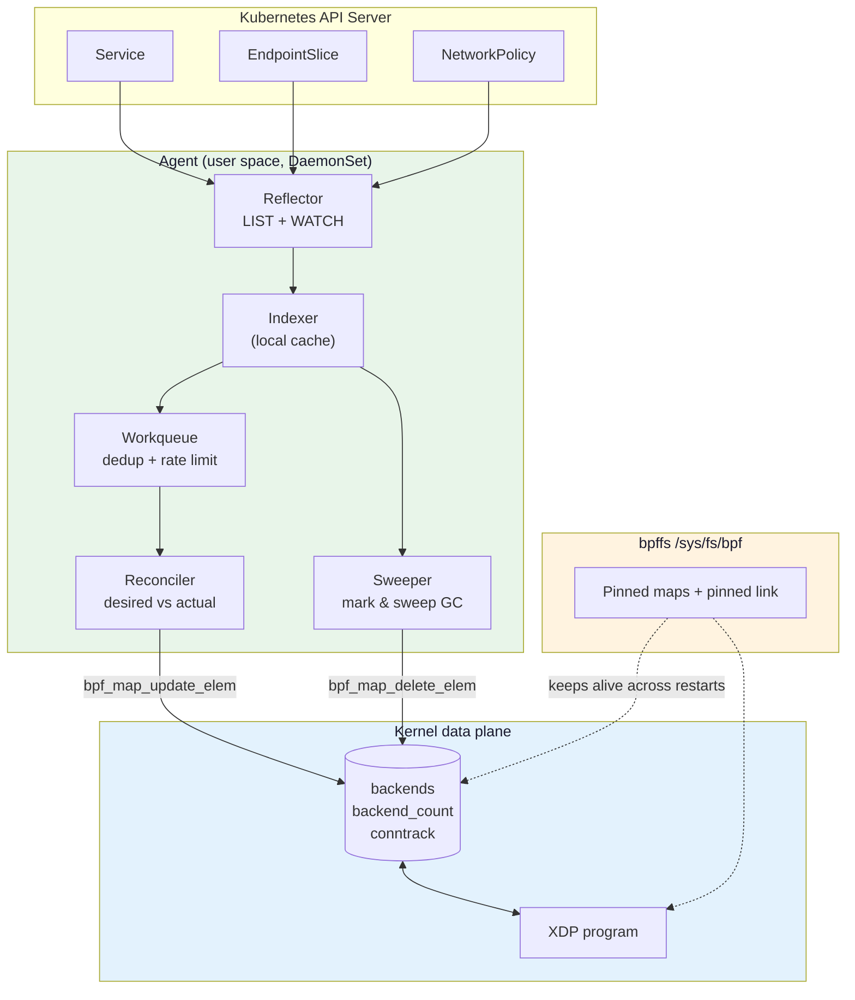
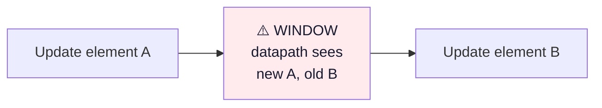
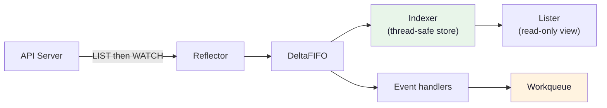
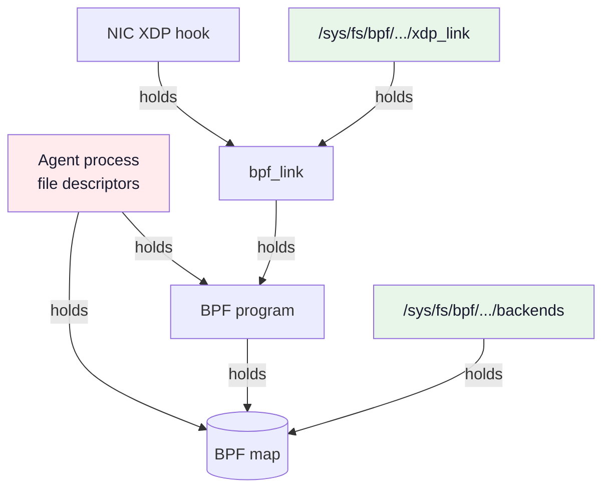
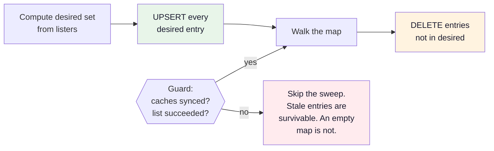
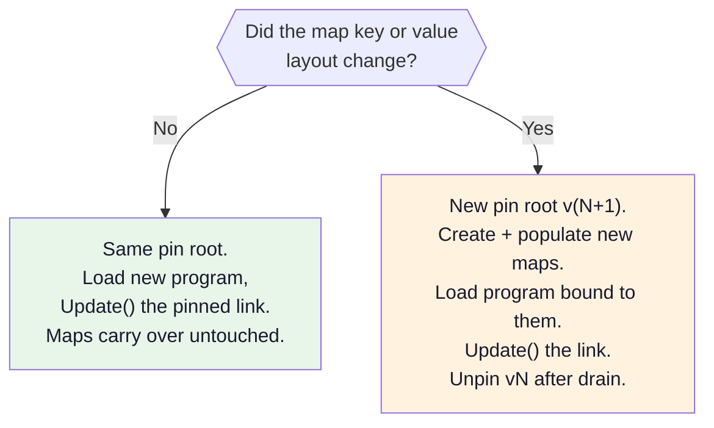

# Module 19: Control Plane Agent Patterns

> **The BPF map is the API between your control plane and your data plane. Everything else is plumbing.**

Modules 6–14 taught you to write a data plane. Every example ended the same way: load, attach, `select {}`, exit. That is a demo, not an agent. A real agent — Cilium's `cilium-agent`, Katran's controller, Calico's `felix` — runs for months, watches the Kubernetes API, and continuously rewrites BPF maps *underneath a running data plane that must never stop forwarding*.

This module is about that gap. It builds directly on [Module 14: Go Development with cilium/ebpf](./14-go-development.md) and drives the load balancer from [Module 11](./11-ebpf-networking-guide.md).

---

## 📊 Visual Learning



---

## 1. The BPF Map Is the API

Stop thinking of a BPF map as "a place to stash some data". Think of it as a **published interface with a schema, an owner, and a compatibility contract** — the same way you would think about a gRPC service definition.

| Property | What it means for a map |
|----------|-------------------------|
| **Schema** | The exact byte layout of key and value, including C padding and byte order. Both sides must agree or nothing works. |
| **Owner** | Exactly one writer. Two agents writing the same map is a split brain with no locking. |
| **Atomicity** | Per-element only. There is no transaction across elements, and no transaction across maps. |
| **Lifetime** | Tied to the last reference (fd, program, or bpffs pin) — *not* to your process. |
| **Failure mode** | A malformed write is not a crash; it is silently wrong forwarding. |

### The atomicity boundary you must design around



Every multi-element change has a window. Packets arrive in that window. **Your job is to order the writes so that every intermediate state is still a state the data plane can survive.** That principle — derived in §4 into a hard rule — is the single most useful idea in this module.

### Hash update is safe; array update can tear

This surprises people:

- `BPF_MAP_TYPE_HASH`: an update allocates a new element and swaps it in under a bucket lock. A concurrent lookup returns either the whole old value or the whole new value. Never a mixture.
- `BPF_MAP_TYPE_ARRAY`: an update is a plain `memcpy` into the existing slot. There is no lock. A concurrent `bpf_map_lookup_elem()` in XDP **can read a half-updated value** if the value is larger than a machine word.

```c
/* Value larger than 8 bytes in an ARRAY map: the datapath can observe
 * ip from the new backend and mac from the old one. */
struct backend { __be32 ip; __u8 mac[6]; __u16 weight; };  /* 12 bytes */
```

Three ways out, in increasing order of cost:

1. Use a `HASH` map instead of an `ARRAY` for anything wider than 8 bytes that changes at runtime.
2. Double-buffer: two array slots plus a one-word "active index" that you flip last. The single-word flip is atomic.
3. Embed a `struct bpf_spin_lock` in the value and take it on both sides. Correct, but it serialises the fast path — rarely worth it in a forwarding hot path.

> **Diagnosis tip:** intermittent, un-reproducible misforwarding that disappears when you stop the agent is almost always a torn array read or a write-ordering window. It is never "the verifier".

### Getting the schema byte-exact

Module 11's key looks harmless:

```c
struct vip_key {
    __be32 ip;        /* offset 0 */
    __be16 port;      /* offset 4 */
    __u8   protocol;  /* offset 6 */
};                    /* sizeof == 8, NOT 7 - one byte of tail padding */
```

> **The padding byte is part of the key.** The kernel hashes and compares all 8 bytes it was told the key is. A C initialiser such as `struct vip_key vip = { .ip = ..., .port = ..., .protocol = ... };` only guarantees the *members* are set — the value of the padding is unspecified. Zero the whole object first (`__builtin_memset(&vip, 0, sizeof(vip));`, then assign the fields) so that the datapath's key bytes match the ones user space wrote. Otherwise you get a lookup that misses for a reason `bpftool map dump` makes look impossible.

The naive Go mirror is wrong twice over:

```go
// ❌ BROKEN: marshals to 7 bytes (package binary does not insert C padding),
// and stores the IP in host byte order.
type vipKey struct {
    IP    uint32
    Port  uint16
    Proto uint8
}
```

The first bug is loud — cilium/ebpf refuses the call before it reaches the kernel: `main.vipKey doesn't marshal to 8 bytes`. The second is silent: the map takes the write, and the VIP simply never matches, because the datapath compares against `ip->daddr`, which is network byte order in memory.

```go
// ✅ CORRECT: 8 bytes, and the address bytes go to the kernel verbatim.
type vipKey struct {
    IP    [4]byte // network byte order, written as-is
    Port  [2]byte // network byte order, written as-is
    Proto uint8
    _     [1]byte // matches the C tail padding
}

func vipKeyFor(addr netip.Addr, port uint16, proto uint8) (vipKey, error) {
    if !addr.Is4() {
        return vipKey{}, fmt.Errorf("only IPv4 VIPs supported: %s", addr)
    }
    k := vipKey{IP: addr.As4(), Proto: proto}
    binary.BigEndian.PutUint16(k.Port[:], port)
    return k, nil
}
```

Using `[4]byte`/`[2]byte` rather than integers removes the byte-order question entirely, on any host architecture. `bpf2go -type vip_key` will generate a struct with the padding right for you, but it emits `Ip uint32` — **byte order is still your problem.**

---

## 2. client-go Essentials

### What an informer actually is



- A **reflector** does one `LIST` to seed the cache, then a long-running `WATCH` for deltas. On watch failure it retries with backoff and re-`LIST`s.
- The **indexer** is an in-memory copy of the objects. It is the only thing you read on the hot path.
- A **lister** is a typed, read-only accessor over the indexer. `lister.Get()` never touches the network.
- The **workqueue** deduplicates keys, rate-limits retries, and guarantees a given key is not processed by two workers at once.

Three things people get wrong:

| Misconception | Reality |
|---------------|---------|
| "Resync re-lists from the API server" | No. Resync replays the *existing cache* through `UpdateFunc` with `oldObj == newObj`. It is a safety net against a dropped write, not a refresh. |
| "I should act on the event payload" | No. Enqueue the *key*, then re-read desired state from the lister. Edge-triggered handling loses events; level-triggered reconciliation cannot. |
| "`DeleteFunc` always gives me the object" | It may give you a `cache.DeletedFinalStateUnknown` tombstone if the watch missed the delete. |

### Wiring it up (real signatures)

```go
package main

// Imports only for this section. Later sections add os, path/filepath,
// net/http, sync/atomic, github.com/cilium/ebpf, .../ebpf/link and
// golang.org/x/sys/unix.
import (
	"bytes"
	"context"
	"encoding/binary"
	"errors"
	"fmt"
	"log/slog"
	"net/netip"
	"sort"
	"sync"
	"time"

	corev1 "k8s.io/api/core/v1"
	discoveryv1 "k8s.io/api/discovery/v1"
	apierrors "k8s.io/apimachinery/pkg/api/errors"
	"k8s.io/apimachinery/pkg/labels"
	"k8s.io/client-go/informers"
	"k8s.io/client-go/kubernetes"
	corelisters "k8s.io/client-go/listers/core/v1"
	discoverylisters "k8s.io/client-go/listers/discovery/v1"
	"k8s.io/client-go/rest"
	"k8s.io/client-go/tools/cache"
	"k8s.io/client-go/tools/clientcmd"
	"k8s.io/client-go/util/workqueue"
)

type Agent struct {
	client      kubernetes.Interface // only for the apiserver heartbeat (§6)
	svcLister   corelisters.ServiceLister
	sliceLister discoverylisters.EndpointSliceLister
	svcSynced   cache.InformerSynced
	sliceSynced cache.InformerSynced

	// Keys are "<namespace>/<service-name>".
	queue workqueue.TypedRateLimitingInterface[string]

	dp *Datapath // owns the pinned BPF maps (§4)
}

// kubeconfig is empty in production (the agent runs as a pod) and set from a
// flag when you run the agent on the host, as the lab in §9 does.
func NewAgent(dp *Datapath, kubeconfig string) (*Agent, informers.SharedInformerFactory, error) {
	cfg, err := rest.InClusterConfig()
	if errors.Is(err, rest.ErrNotInCluster) && kubeconfig != "" {
		cfg, err = clientcmd.BuildConfigFromFlags("", kubeconfig)
	}
	if err != nil {
		return nil, nil, fmt.Errorf("client config: %w", err)
	}
	// A per-node agent should not hammer the apiserver on a large cluster.
	cfg.QPS, cfg.Burst = 20, 40

	client, err := kubernetes.NewForConfig(cfg)
	if err != nil {
		return nil, nil, fmt.Errorf("clientset: %w", err)
	}

	factory := informers.NewSharedInformerFactory(client, 10*time.Minute)
	svcInf := factory.Core().V1().Services()
	sliceInf := factory.Discovery().V1().EndpointSlices()

	a := &Agent{
		client:      client,
		svcLister:   svcInf.Lister(),
		sliceLister: sliceInf.Lister(),
		svcSynced:   svcInf.Informer().HasSynced,
		sliceSynced: sliceInf.Informer().HasSynced,
		queue: workqueue.NewTypedRateLimitingQueue[string](
			workqueue.DefaultTypedControllerRateLimiter[string](),
		),
		dp: dp,
	}

	// AddEventHandler returns (registration, error) since client-go v0.26.
	// Ignoring the error hides a handler that was never installed.
	if _, err := svcInf.Informer().AddEventHandler(cache.ResourceEventHandlerFuncs{
		AddFunc:    a.enqueueService,
		UpdateFunc: func(_, newObj interface{}) { a.enqueueService(newObj) },
		DeleteFunc: a.enqueueService,
	}); err != nil {
		return nil, nil, fmt.Errorf("service handler: %w", err)
	}

	if _, err := sliceInf.Informer().AddEventHandler(cache.ResourceEventHandlerFuncs{
		AddFunc:    a.enqueueSlice,
		UpdateFunc: func(_, newObj interface{}) { a.enqueueSlice(newObj) },
		DeleteFunc: a.enqueueSlice,
	}); err != nil {
		return nil, nil, fmt.Errorf("endpointslice handler: %w", err)
	}

	return a, factory, nil
}
```

> **`workqueue.NewTypedRateLimitingQueue[T]` and `DefaultTypedControllerRateLimiter[T]` landed in client-go v0.31.** On v0.30 and older, only the untyped `workqueue.NewRateLimitingQueue(workqueue.DefaultControllerRateLimiter())` exists. It is still there in v0.31+, now deprecated and redefined as `type RateLimitingInterface TypedRateLimitingInterface[any]` — a defined type over the generic one, not a separate implementation, so the two forms interoperate.

### Enqueueing: map the event back to the reconcile unit

An EndpointSlice is not the thing you reconcile — the Service is. Slices carry their owner in a well-known label.

```go
func (a *Agent) enqueueService(obj interface{}) {
	// Handles the DeletedFinalStateUnknown tombstone for you.
	key, err := cache.DeletionHandlingMetaNamespaceKeyFunc(obj)
	if err != nil {
		slog.Error("cannot derive key", "err", err)
		return
	}
	a.queue.Add(key)
}

func (a *Agent) enqueueSlice(obj interface{}) {
	if tombstone, ok := obj.(cache.DeletedFinalStateUnknown); ok {
		obj = tombstone.Obj
	}
	slice, ok := obj.(*discoveryv1.EndpointSlice)
	if !ok {
		slog.Warn("unexpected object on endpointslice handler", "type", fmt.Sprintf("%T", obj))
		return
	}
	// discoveryv1.LabelServiceName == "kubernetes.io/service-name"
	name := slice.Labels[discoveryv1.LabelServiceName]
	if name == "" {
		return // orphan slice, or one managed by a custom controller
	}
	a.queue.Add(slice.Namespace + "/" + name)
}
```

### The run loop

```go
func (a *Agent) Run(ctx context.Context, factory informers.SharedInformerFactory, workers int) error {
	defer a.queue.ShutDown()

	factory.Start(ctx.Done())

	// Nothing below this line may delete anything from a BPF map.
	if !cache.WaitForCacheSync(ctx.Done(), a.svcSynced, a.sliceSynced) {
		return errors.New("caches failed to sync")
	}
	slog.Info("informer caches synced")

	// A completed initial LIST is proof of contact with the apiserver: seed
	// the staleness clock (§6) so /readyz is not 503 until the first heartbeat.
	lastSuccessfulSync.Store(time.Now().Unix())

	// No seeding loop is needed here: the reflector's initial LIST delivers
	// every existing object through AddFunc, so the queue already holds a key
	// for every Service in the cluster. On a restart that is exactly what
	// re-derives the whole world before the sweeper is allowed to delete.

	for i := 0; i < workers; i++ {
		go a.runWorker(ctx)
	}
	go a.runSweeper(ctx)   // §4
	go a.heartbeat(ctx)    // §6 - the staleness clock behind /readyz

	<-ctx.Done()
	return nil
}

func (a *Agent) runWorker(ctx context.Context) {
	for a.processNext(ctx) {
	}
}

func (a *Agent) processNext(ctx context.Context) bool {
	key, shutdown := a.queue.Get()
	if shutdown {
		return false
	}
	defer a.queue.Done(key)

	start := time.Now()
	err := a.reconcile(ctx, key)
	reconcileDuration.Observe(time.Since(start).Seconds())

	if err == nil {
		a.queue.Forget(key)
		return true
	}
	slog.Error("reconcile failed",
		"key", key, "err", err, "requeues", a.queue.NumRequeues(key))
	reconcileErrors.Inc()
	a.queue.AddRateLimited(key)
	return true
}
```

`Get` / `Done` / `Forget` is not optional ceremony. Skipping `Done` leaks the key's "in progress" marker and the queue will never process that key again. Skipping `Forget` on success leaves the exponential backoff counter climbing, so a key that failed once is slow forever.

---

## 3. Projecting Cluster State onto Maps

### Service + EndpointSlices → backend set

```go
type backend struct {
	IP     [4]byte // network byte order
	MAC    [6]byte
	Weight uint16
} // 12 bytes: matches struct backend { __be32 ip; __u8 mac[6]; __u16 weight; }

const maxBackends = 64 // must equal MAX_BACKENDS in the C program

type vipState struct {
	Key      vipKey
	Backends []backend
}

func (a *Agent) reconcile(ctx context.Context, key string) error {
	ns, name, err := cache.SplitMetaNamespaceKey(key)
	if err != nil {
		// A malformed key can never become valid, so returning an error here
		// would only requeue it forever. Drop it instead: nil means "done".
		slog.Error("dropping malformed workqueue key", "key", key, "err", err)
		return nil
	}

	svc, err := a.svcLister.Services(ns).Get(name)
	switch {
	case apierrors.IsNotFound(err):
		return a.dp.RemoveVIPsFor(ns, name)
	case err != nil:
		return err
	}

	// Headless Services have no VIP to program.
	if svc.Spec.ClusterIP == "" || svc.Spec.ClusterIP == corev1.ClusterIPNone {
		return a.dp.RemoveVIPsFor(ns, name)
	}

	sel := labels.SelectorFromSet(labels.Set{discoveryv1.LabelServiceName: name})
	slices, err := a.sliceLister.EndpointSlices(ns).List(sel)
	if err != nil {
		return err
	}

	desired, err := project(svc, slices)
	if err != nil {
		return err
	}
	return a.dp.Apply(ns, name, desired)
}
```

The projection itself:

```go
// protoFor decides which Service ports this datapath is willing to program.
// The writer (project) and the sweeper (§4) MUST both go through it: if they
// disagree about which ports are programmable, the sweeper deletes entries the
// writer just wrote, or spares entries it should have reaped.
func protoFor(p corev1.Protocol) (uint8, bool) {
	switch p {
	case corev1.ProtocolTCP, "": // the apiserver defaults an empty protocol to TCP
		return 6, true // IPPROTO_TCP
	case corev1.ProtocolUDP:
		return 17, true // IPPROTO_UDP
	default:
		return 0, false // SCTP: not handled by this datapath
	}
}

func project(svc *corev1.Service, slices []*discoveryv1.EndpointSlice) ([]vipState, error) {
	clusterIP, err := netip.ParseAddr(svc.Spec.ClusterIP)
	if err != nil {
		return nil, fmt.Errorf("bad ClusterIP %q: %w", svc.Spec.ClusterIP, err)
	}

	var out []vipState
	for _, sp := range svc.Spec.Ports {
		proto, ok := protoFor(sp.Protocol)
		if !ok {
			continue
		}

		vk, err := vipKeyFor(clusterIP, uint16(sp.Port), proto)
		if err != nil {
			return nil, err
		}

		var bes []backend
		for _, slice := range slices {
			if slice.AddressType != discoveryv1.AddressTypeIPv4 {
				continue
			}
			// Match the Service port to the slice port by name: that is what
			// proves this slice serves *this* Service port.
			var target int32 = -1
			for _, p := range slice.Ports {
				if p.Port == nil {
					continue // nil == "all ports", not modelled here
				}
				pname := ""
				if p.Name != nil {
					pname = *p.Name
				}
				if pname == sp.Name {
					target = *p.Port
					break
				}
			}
			if target < 0 {
				continue
			}
			// Module 11's datapath rewrites L3 only - it never touches the L4
			// destination port - so the endpoint has to be listening on the same
			// port as the VIP. Port translation arrives with DSR in Module 20.
			if target != sp.Port {
				slog.Warn("skipping slice: endpoint port differs from service port",
					"service", svc.Namespace+"/"+svc.Name,
					"service_port", sp.Port, "endpoint_port", target)
				continue
			}

			for _, ep := range slice.Endpoints {
				// Ready is the only condition that means "send new traffic here".
				// Serving && Terminating means "finish existing flows, no new ones"
				// - see the drain protocol in Module 20.
				if ep.Conditions.Ready == nil || !*ep.Conditions.Ready {
					continue
				}
				for _, addr := range ep.Addresses {
					a, err := netip.ParseAddr(addr)
					if err != nil || !a.Is4() {
						continue
					}
					// MAC deliberately left zero here. XDP_TX puts this frame
					// back on the wire, so the agent must fill it from the
					// neighbour table (netlink.NeighList) or resolve it once
					// per backend before writing the map - a zero destination
					// MAC is a black hole.
					bes = append(bes, backend{IP: a.As4(), Weight: 1})
				}
			}
		}

		// ⚠️ DETERMINISM. The datapath picks `hash % count` into this array.
		// If the array order changes between reconciles, every live flow that
		// misses conntrack rehashes to a different backend. The lister's
		// List() walks the indexer's internal Go map, so the slice order it
		// hands you is randomised call to call. Sort explicitly.
		sort.Slice(bes, func(i, j int) bool {
			return bytes.Compare(bes[i].IP[:], bes[j].IP[:]) < 0
		})

		out = append(out, vipState{Key: vk, Backends: bes})
	}
	return out, nil
}
```

That sort is not cosmetic. Without it, an unrelated pod restart in a *different* Service can reshuffle this Service's array on the next resync and break established connections. Modulo hashing is fragile even with stable ordering — [Module 20](./20-production-load-balancer-datapath.md) replaces it with a Maglev table for exactly this reason.

### The same shape, for policy

Policy projection has an identical skeleton and a different value type: watch `NetworkPolicy` + `Pod`, resolve selectors to **security identities** (not pod IPs), and write `(identity, port, proto, direction)` tuples into the policy map. [Module 18](./18-network-policy-enforcement.md) covers why identity rather than IP. The control-plane machinery — informer, workqueue, level-triggered reconcile, mark and sweep — is byte for byte what you see here.

---

## 4. Map Lifecycle Across Restarts

**This is the part that separates an agent from a demo.** Your agent will be restarted: rolling upgrade, OOM kill, node reboot, a `kubectl delete pod`. Traffic does not stop while that happens.

### The reference graph



Kernel objects are refcounted. When your process exits, every fd it held is closed. What survives is whatever else still holds a reference:

| Pinned? | Agent exits | Result |
|---------|-------------|--------|
| Nothing pinned | fds closed, link refcount → 0 | **Program detaches. XDP hook empty. Traffic falls back to the stack.** |
| Map pinned, link not | Map survives on its pin; link freed, so the program detaches and is freed with it | You kept the data and lost the data plane |
| Map + link pinned | Both survive | **Packets keep being forwarded with zero user space running** |

That third row is the goal. A correctly built agent can be `kill -9`'d and the load balancer keeps balancing.

### Pinning maps: let the loader do it

Declare the pin intent in C:

```c
#include "vmlinux.h"
#include <bpf/bpf_helpers.h>   /* defines enum libbpf_pin_type { LIBBPF_PIN_NONE,
                                  LIBBPF_PIN_BY_NAME } - vmlinux.h carries kernel
                                  types, not macros or libbpf enums */

#define MAX_BACKENDS 64       /* same value as Module 11's lb.bpf.c */

/* struct vip_key and struct backend are exactly Module 11's definitions;
 * only the `pinning` field below is new. */

struct {
    __uint(type, BPF_MAP_TYPE_HASH);
    __uint(max_entries, 256);
    __type(key, struct vip_key);
    __type(value, struct backend[MAX_BACKENDS]);
    __uint(pinning, LIBBPF_PIN_BY_NAME);
} backends SEC(".maps");

struct {
    __uint(type, BPF_MAP_TYPE_HASH);
    __uint(max_entries, 256);
    __type(key, struct vip_key);
    __type(value, __u32);
    __uint(pinning, LIBBPF_PIN_BY_NAME);
} backend_count SEC(".maps");
```

And give cilium/ebpf a pin root:

```go
// Versioned pin root. The version changes only when the map SCHEMA changes.
const pinRoot = "/sys/fs/bpf/lbagent/v1"

func loadDatapath() (*lbObjects, error) {
	if err := os.MkdirAll(pinRoot, 0o755); err != nil {
		return nil, fmt.Errorf("creating pin root (is bpffs mounted at /sys/fs/bpf?): %w", err)
	}

	objs := &lbObjects{}
	err := loadLbObjects(objs, &ebpf.CollectionOptions{
		Maps: ebpf.MapOptions{PinPath: pinRoot},
		// Optional: cilium/ebpf already retries a failed load with
		// LogLevelBranch, so you only need this to see the log of a program
		// that loads *successfully*. It costs a log buffer on every load.
		Programs: ebpf.ProgramOptions{
			LogLevel: ebpf.LogLevelBranch,
		},
	})

	var ve *ebpf.VerifierError
	if errors.As(err, &ve) {
		return nil, fmt.Errorf("verifier rejected program:\n%+v", ve)
	}
	if errors.Is(err, ebpf.ErrMapIncompatible) {
		// A pinned map with this name exists but its type/key size/value size/
		// max_entries/flags differ from the spec you just compiled.
		return nil, fmt.Errorf(
			"pinned map schema mismatch under %s - bump the pin root version "+
				"instead of deleting live pins: %w", pinRoot, err)
	}
	if err != nil {
		return nil, err
	}
	return objs, nil
}
```

`PinByName` gives you **adopt-or-create** for free: if `/sys/fs/bpf/lbagent/v1/backends` already exists and is compatible, the loader reuses it; if not, it creates and pins it. That one flag is the whole "survive a restart with your data" mechanism.

`/sys/fs/bpf` exists whether or not bpffs is mounted — the kernel creates it as an empty sysfs mount point (`sysfs_create_mount_point(fs_kobj, "bpf")` in `kernel/bpf/inode.c`). Nothing can be created inside it until a real bpffs is mounted over it, so `MkdirAll` fails with `operation not permitted` rather than anything mentioning BPF; hence the hint in the error text above. If the pin root does live somewhere writable but not bpffs, the loader is the one that catches it, with `… is not on a bpf filesystem`.

When the schema *does* change, you get `ErrMapIncompatible`. The tempting fix is `rm -rf /sys/fs/bpf/lbagent`. **Do not.** That is the outage. Bump `v1` → `v2` (see §5).

### Pinning the link: never leave the hook empty

Everything below needs `bpf_link` for XDP, which landed in **kernel 5.9** (link pinning itself in 5.7). On anything older `link.AttachXDP` fails with `ErrNotSupported` and you are back to the netlink attach that `ip link set dev … xdp` performs — which has no fd, no pin, and no atomic replace. The course baseline of 5.10+ covers this.

```go
func attachOrAdopt(prog *ebpf.Program, ifindex int) (link.Link, error) {
	linkPin := filepath.Join(pinRoot, "xdp_link")

	l, err := link.LoadPinnedLink(linkPin, nil)
	if err == nil {
		// A previous agent left this program attached and forwarding.
		// Update() swaps the program in place - the hook is never empty,
		// not even for a microsecond.
		if err := l.Update(prog); err != nil {
			l.Close()
			return nil, fmt.Errorf("swapping program on pinned link: %w", err)
		}
		slog.Info("adopted pinned XDP link", "pin", linkPin)
		return l, nil
	}
	// The syscall errno (ENOENT) satisfies errors.Is(err, os.ErrNotExist), so
	// this one check covers "no pin yet". Any other error - EPERM, wrong
	// object type, not a bpffs - is a real failure: fail instead of guessing
	// that a fresh attach is what was wanted.
	if !errors.Is(err, os.ErrNotExist) {
		return nil, fmt.Errorf("loading pinned link %s: %w", linkPin, err)
	}

	l, err = link.AttachXDP(link.XDPOptions{Program: prog, Interface: ifindex})
	if err != nil {
		return nil, fmt.Errorf("attaching XDP: %w", err)
	}
	if err := l.Pin(linkPin); err != nil {
		l.Close()
		return nil, fmt.Errorf("pinning link: %w", err)
	}
	return l, nil
}
```

> **Shutdown rule:** call `Close()`, never `Unpin()` or `Detach()`. From the `link.Link` contract: *"The link will be broken unless it has been successfully pinned."* Closing a pinned link releases your fd and leaves the program attached — which is exactly what you want. `defer l.Unpin()` in `main()` is a one-line way to turn every rolling upgrade into a packet loss event.

### Never flush. Mark and sweep.

The obvious way to make a map match desired state is to empty it and refill it:

```go
// ❌ NEVER DO THIS IN A LIVE AGENT
iter := backends.Iterate()
for iter.Next(&k, &v) { backends.Delete(k) }
for _, d := range desired { backends.Put(d.Key, d.Value) }
```

Between those loops the map is empty. On a busy node that is tens of thousands of dropped or misrouted packets, once per reconcile. And in Module 11's datapath, a VIP present in `backends` with no `backend_count` entry returns `XDP_DROP` — so a partial refill is worse than useless.

The correct pattern is **mark and sweep**, borrowed straight from garbage collectors:



The map is never smaller than the intersection of old and new state. There is no window in which a live VIP is missing.

### Write ordering, derived from the datapath's return codes

Read Module 11's XDP program and write down what it does for each combination:

| `backends` | `backend_count` | Datapath behaviour |
|------------|-----------------|--------------------|
| absent | anything | `XDP_PASS` — "not a VIP", packet goes to the stack. **Safe.** |
| present | absent or 0 | `XDP_DROP` for every packet that misses conntrack, i.e. every new flow. **Unsafe.** |
| present | `n` | picks `hash % n` from the array; that slot must hold a real backend (`ip != 0`) or it is another `XDP_DROP` |

That gives one invariant:

> **At every instant, every index the datapath can compute must address a populated slot.**

Which mechanically produces the ordering rules:

| Transition | Order | Intermediate state | Safe? |
|-----------|-------|--------------------|-------|
| **Create VIP** | `backend_count` first, then `backends` | count present, backends absent → `XDP_PASS` | ✅ |
| **Delete VIP** | `backends` first, then `backend_count` | backends absent → `XDP_PASS` | ✅ |
| **Grow** (n > prev) | `backends` first, then `backend_count` | old count indexes into the new, larger array | ✅ |
| **Shrink** (n < prev) | `backend_count` first, then `backends` | new smaller count indexes into the old array | ✅ |

Two rules fall out, and they are not the same rule:

1. **The entry that gates the lookup — here `backends` — is written last on create and deleted first on delete.** While it is absent the VIP is not a VIP and packets take the stack, which is the cheapest safe state available.
2. **While both entries exist, grow the array before raising the count, and lower the count before shrinking the array.** That half *is* the familiar one: add the referenced object before the referrer, remove the referrer before the referenced, exactly like a row and the foreign key that points at it. `backend_count` is the referrer here — it is the entry that promises *n* slots of `backends` are valid.

Note what this means for the code: a create with three backends is a **create**, not a grow. Getting that wrong — treating "count went 0 → 3" as a grow and writing `backends` first — opens a `XDP_DROP` window on every brand-new Service, which looks exactly like a CNI bug and is not one.

```go
type Datapath struct {
	backends *ebpf.Map // vipKey -> [maxBackends]backend
	counts   *ebpf.Map // vipKey -> uint32

	mu    sync.Mutex
	owner map[vipKey]string // vipKey -> "ns/name", for RemoveVIPsFor
}

func NewDatapath(objs *lbObjects) *Datapath {
	return &Datapath{
		backends: objs.Backends,
		counts:   objs.BackendCount,
		owner:    make(map[vipKey]string), // a nil map panics on the first write
	}
}

func (d *Datapath) Apply(ns, name string, states []vipState) error {
	d.mu.Lock()
	defer d.mu.Unlock()

	for _, s := range states {
		n := len(s.Backends)

		// An empty backend set is a DELETE, not "count = 0". Writing count 0
		// would leave `backends` present with a zero count, which is the
		// XDP_DROP row of the table above. Removing the VIP entirely puts the
		// datapath back on the XDP_PASS row, the cheapest safe state. Order is
		// the same as any delete: the gate entry (`backends`) goes first.
		if n == 0 {
			if err := d.remove(s.Key); err != nil {
				return err
			}
			slog.Info("removing VIP with no ready endpoints",
				"service", ns+"/"+name, "order", "delete")
			continue
		}

		if n > maxBackends {
			slog.Warn("truncating backend list",
				"service", ns+"/"+name, "have", n, "max", maxBackends)
			n = maxBackends
			backendsTruncated.Inc()
		}

		var arr [maxBackends]backend
		copy(arr[:n], s.Backends[:n])

		var prev uint32
		exists := true
		if err := d.counts.Lookup(s.Key, &prev); err != nil {
			if !errors.Is(err, ebpf.ErrKeyNotExist) {
				return fmt.Errorf("reading backend_count: %w", err)
			}
			exists = false
		}

		// GROW is the only transition that writes `backends` first: the old,
		// smaller count still indexes safely into the new, larger array.
		//
		// CREATE must not - backends present with no count is XDP_DROP,
		// while count present with no backends is XDP_PASS.
		// SHRINK must not - the new, smaller count indexes safely into the
		// old, larger array.
		growing := exists && uint32(n) > prev

		if growing {
			if err := d.put(d.backends, s.Key, arr); err != nil {
				return err
			}
			if err := d.put(d.counts, s.Key, uint32(n)); err != nil {
				return err
			}
		} else {
			if err := d.put(d.counts, s.Key, uint32(n)); err != nil {
				return err
			}
			if err := d.put(d.backends, s.Key, arr); err != nil {
				return err
			}
		}
		d.owner[s.Key] = ns + "/" + name
	}
	return nil
}

// RemoveVIPsFor drops every VIP this Service owns.
//
// d.owner is in-memory, so a freshly restarted agent does not know who owns
// the pinned entries it just adopted. That is fine: the sweeper (below) is
// the backstop that catches anything this path misses.
func (d *Datapath) RemoveVIPsFor(ns, name string) error {
	d.mu.Lock()
	defer d.mu.Unlock()

	owner := ns + "/" + name
	for k, o := range d.owner {
		if o != owner {
			continue
		}
		if err := d.remove(k); err != nil {
			return err
		}
	}
	return nil
}

// remove deletes one VIP. Deletion order is the mirror of creation order: the
// entry that gates the lookup (`backends`) goes first, so the intermediate
// state is "not a VIP" ⇒ XDP_PASS, never "VIP with no count" ⇒ XDP_DROP.
// The caller must hold d.mu.
func (d *Datapath) remove(k vipKey) error {
	if err := d.backends.Delete(k); err != nil &&
		!errors.Is(err, ebpf.ErrKeyNotExist) {
		return fmt.Errorf("deleting backends entry: %w", err)
	}
	if err := d.counts.Delete(k); err != nil &&
		!errors.Is(err, ebpf.ErrKeyNotExist) {
		return fmt.Errorf("deleting backend_count entry: %w", err)
	}
	delete(d.owner, k)
	return nil
}

func (d *Datapath) put(m *ebpf.Map, k, v any) error {
	err := m.Put(k, v)
	if errors.Is(err, unix.E2BIG) {
		// Hash map is at max_entries. This is a capacity bug, not a transient
		// one - retrying forever will not help. Alert on it.
		mapFullErrors.Inc()
		return fmt.Errorf("map full (max_entries reached): %w", err)
	}
	return err
}
```

### The sweeper

```go
func (a *Agent) runSweeper(ctx context.Context) {
	t := time.NewTicker(30 * time.Second)
	defer t.Stop()
	for {
		select {
		case <-ctx.Done():
			return
		case <-t.C:
			if err := a.sweep(); err != nil {
				slog.Error("sweep failed", "err", err)
			}
		}
	}
}

func (a *Agent) sweep() error {
	// GUARD 1: never sweep against an unsynced cache. An unsynced lister
	// returns an empty list, and an empty desired set deletes every VIP
	// on the node. This single check is the difference between a rolling
	// restart and a cluster-wide outage.
	if !a.svcSynced() || !a.sliceSynced() {
		sweepsSkipped.WithLabelValues("cache_not_synced").Inc()
		return nil
	}

	svcs, err := a.svcLister.List(labels.Everything())
	if err != nil {
		// GUARD 2: a failed list is not "nothing is desired".
		sweepsSkipped.WithLabelValues("list_failed").Inc()
		return err
	}

	desired := map[vipKey]struct{}{}
	for _, svc := range svcs {
		if svc.Spec.ClusterIP == "" || svc.Spec.ClusterIP == corev1.ClusterIPNone {
			continue
		}
		ip, err := netip.ParseAddr(svc.Spec.ClusterIP)
		if err != nil {
			continue
		}
		for _, sp := range svc.Spec.Ports {
			// Same helper as the writer - see the comment on protoFor (§3).
			proto, ok := protoFor(sp.Protocol)
			if !ok {
				continue
			}
			if k, err := vipKeyFor(ip, uint16(sp.Port), proto); err == nil {
				desired[k] = struct{}{}
			}
		}
	}

	return a.dp.Sweep(desired)
}

func (d *Datapath) Sweep(desired map[vipKey]struct{}) error {
	d.mu.Lock()
	defer d.mu.Unlock()

	var (
		key   vipKey
		value [maxBackends]backend
		stale []vipKey
	)

	// ⚠️ Collect first, delete second. Deleting the current key while walking
	// a HASH map with bpf_map_get_next_key can make the walk restart from the
	// beginning or skip entries - you get an infinite loop or a partial sweep.
	iter := d.backends.Iterate()
	for iter.Next(&key, &value) {
		if _, ok := desired[key]; !ok {
			stale = append(stale, key)
		}
	}
	if err := iter.Err(); err != nil {
		// A partial walk is not evidence that anything is stale.
		return fmt.Errorf("iterating backends: %w", err)
	}

	for _, k := range stale {
		// Same removal order as every other delete: gate entry first.
		if err := d.remove(k); err != nil {
			return err
		}
		sweptEntries.Inc()
		slog.Info("swept stale VIP", "vip", k)
	}
	return nil
}
```

This sweeper walks `backends` and deletes the matching `backend_count` entry alongside it. An entry that exists *only* in `backend_count` — a create that died between the two writes — is invisible to it. Such an entry is harmless to forwarding (`backends` absent ⇒ `XDP_PASS`), but it still occupies a slot, so a complete sweeper walks both maps and reconciles each against the same desired set.

> **Scaling note.** Listing every Service on every sweep is fine at a few thousand entries and wasteful at a million. The alternative is a **generation stamp**: keep a `gen uint64` in the agent, stamp `d.seen[key] = gen` on every successful upsert, bump `gen` after a complete reconcile pass, and sweep everything whose stamp is older. Same invariant, bounded memory, but you must be certain the pass really was complete before bumping — which is why the full-world sweep is the better default.

### Conntrack is state your agent did not write

The `conntrack` LRU map from Module 11 outlives the agent too, and it contains `struct backend` values by copy. After a restart, entries can point at backends that no longer exist. Three options:

| Approach | Cost | When |
|----------|------|------|
| Leave it — LRU evicts naturally | Free; some flows blackhole until they time out | Short conntrack timeouts |
| Store a backend *index* + a generation, validate on lookup | One extra map lookup per packet | Correct, cheap enough for most |
| Sweep conntrack against the live backend set | Expensive full walk of a 1M-entry map | Periodic, low frequency |

Whatever you pick, do it deliberately. "The agent restarted and some connections hung" is nearly always an un-swept conntrack map.

---

## 5. Upgrading Without Dropping Connections

Two kinds of change, two completely different procedures.



### Logic-only change

The common case. Nothing to do beyond §4: the new agent adopts the pinned maps, loads the new program, and calls `l.Update(prog)` on the adopted link. The swap is atomic from the NIC's point of view — one packet runs the old program, the next runs the new one, and no packet runs neither.

### Schema change

`v1` and `v2` coexist for the duration of the upgrade:

```
/sys/fs/bpf/lbagent/v1/backends        <- old agent, old program still attached
/sys/fs/bpf/lbagent/v1/backend_count
/sys/fs/bpf/lbagent/v1/xdp_link
/sys/fs/bpf/lbagent/v2/backends        <- new agent creates and fills these
/sys/fs/bpf/lbagent/v2/backend_count
```

Sequence:

1. New agent starts, creates and pins `v2` maps.
2. New agent syncs its informers and populates `v2` **completely**. Nothing is attached to it yet — this is free.
3. New agent adopts `v1/xdp_link` and calls `Update()` with the program bound to the `v2` maps. Forwarding switches over atomically.
4. New agent calls `l.Pin("…/v2/xdp_link")`. cilium/ebpf `renameat2`s an existing pin rather than creating a second one, so this *moves* the pin — the link is never unpinned, not even briefly.
5. After a drain interval longer than your longest conntrack timeout, `rm /sys/fs/bpf/lbagent/v1/*`.

Step 2 before step 3 is the whole trick: **the new data structure is fully live before anything points at it.** Same rule as §4, one level up.

Record the schema version in the map itself so a human with `bpftool` can tell what they are looking at:

```c
struct {
    __uint(type, BPF_MAP_TYPE_ARRAY);
    __uint(max_entries, 1);
    __type(key, __u32);
    __type(value, __u32);
    __uint(pinning, LIBBPF_PIN_BY_NAME);
} schema_version SEC(".maps");
```

```bash
# What schema is actually loaded on this node right now?
sudo bpftool map dump pinned /sys/fs/bpf/lbagent/v1/schema_version
```

---

## 6. Failure Modes You Will Actually Hit

| Symptom | Cause | Diagnose | Fix |
|---------|-------|----------|-----|
| All VIPs vanish seconds after agent start | Swept against an unsynced lister | `sweptEntries` spikes right after start; `sweepsSkipped` is 0 | Gate the sweeper on `WaitForCacheSync` **and** `HasSynced` at sweep time |
| VIP programmed but never matches | Byte order or padding mismatch in the key | `bpftool map dump` shows the key bytes reversed vs `tcpdump` | Use `[4]byte`/`[2]byte` fields (§1) |
| `update: argument list too long` | `unix.E2BIG` — hash map at `max_entries` | `bpftool map show pinned <path>`, compare entries to max | Size for peak, alert on utilisation > 80% |
| Agent restarts, traffic stops for ~2s | Link not pinned, or `Unpin()` on shutdown | `bpftool net list` shows no XDP prog during the gap | Pin the link; `Close()` only |
| `loading objects: ... ErrMapIncompatible` | Pinned map from an older schema | `bpftool map show pinned <path>` shows the old key/value size | Bump the pin root version — **do not `rm` live pins** |
| Program loads in CI, rejected on one node | Older kernel, missing helper or verifier limit | Print the `*ebpf.VerifierError` in full | Canary a single node; load new program **before** detaching old |
| `permission denied` at load | Missing `CAP_BPF`/`CAP_NET_ADMIN`, or `RLIMIT_MEMLOCK` exhausted on a kernel older than 5.11 | `getpcaps 1` inside the pod; `ulimit -l` | Add capabilities to the DaemonSet (§7); on < 5.11 also `rlimit.RemoveMemlock()` plus `CAP_SYS_RESOURCE` |
| `operation not permitted` creating the pin root under `/sys/fs/bpf` | bpffs not mounted — the path is still the kernel's empty sysfs mount point, and sysfs takes no `mkdir` | `mount \| grep bpf` on the host; `stat -f -c %T /sys/fs/bpf` | Mount bpffs on the host; hostPath it in |
| Pins vanish when the pod restarts, no error anywhere | bpffs mounted *inside* the container instead of the host | `findmnt /sys/fs/bpf` on the host vs in the pod | Host mount + `hostPath`, never a container-private mount |
| Maps drift from cluster state, no errors logged | Event handler registration error ignored | `AddEventHandler`'s second return value discarded | Check it |

### API server unreachable

This is where agents kill clusters. When the watch breaks, the informer keeps serving its **last known good** cache and retries with backoff. Your reconcile loop keeps running against slightly stale data — which is fine. Forwarding with 5-minute-old endpoints is vastly better than not forwarding.

The rules:

```go
// Unix seconds of the last confirmed contact with the API server.
var lastSuccessfulSync atomic.Int64

// A lister never returns an error - it reads a local cache - and a quiet
// cluster produces no events, so neither the reconcile loop nor the sweeper
// can tell "nothing changed" from "we have been cut off for an hour". The
// staleness clock therefore needs something that actually touches the
// apiserver. A periodic GET of /healthz is what production agents use.
func (a *Agent) heartbeat(ctx context.Context) {
	t := time.NewTicker(30 * time.Second)
	defer t.Stop()
	for {
		select {
		case <-ctx.Done():
			return
		case <-t.C:
			reqCtx, cancel := context.WithTimeout(ctx, 10*time.Second)
			err := a.client.Discovery().RESTClient().
				Get().AbsPath("/healthz").Do(reqCtx).Error()
			cancel()
			if err != nil {
				slog.Warn("apiserver heartbeat failed", "err", err)
				continue
			}
			now := time.Now().Unix()
			lastSuccessfulSync.Store(now)
			lastSyncTimestamp.Set(float64(now))
		}
	}
}

// /healthz -> "the process is alive" (liveness; restarting may help).
// /readyz  -> "the process is doing its job" (readiness; restarting will not).
func (a *Agent) readyz(w http.ResponseWriter, _ *http.Request) {
	age := time.Since(time.Unix(lastSuccessfulSync.Load(), 0))
	switch {
	case !a.svcSynced() || !a.sliceSynced():
		http.Error(w, "caches not synced", http.StatusServiceUnavailable)
	case age > 5*time.Minute:
		// Report unready so alerting fires and, just as importantly, so a
		// DaemonSet rollout counts this pod as unavailable and stops marching
		// on to the next node. Do NOT flush maps. Do NOT exit. Keep forwarding.
		http.Error(w, "state stale: "+age.String(), http.StatusServiceUnavailable)
	default:
		w.WriteHeader(http.StatusOK)
	}
}
```

1. Stale desired state → **do nothing**, never delete.
2. `WaitForCacheSync` returning false at startup → fail loudly, before touching any map.
3. `factory.WaitForCacheSync(stopCh)` returns `map[reflect.Type]bool` — check **every** entry, not just that the call returned.
4. Never `os.Exit` on an API error while the data plane is healthy. Your process is not the data plane; it can be absent for hours and packets keep flowing.
5. Do not put `/readyz` on the liveness probe. An agent that is unready because the apiserver is unreachable does not need restarting — restarting it throws away a warm cache and makes things worse.

---

## 7. Packaging: DaemonSet, Capabilities, bpffs

```yaml
apiVersion: apps/v1
kind: DaemonSet
metadata:
  name: lbagent
  namespace: kube-system
spec:
  selector:
    matchLabels: { app: lbagent }
  updateStrategy:
    type: RollingUpdate
    rollingUpdate:
      maxUnavailable: 1
  template:
    metadata:
      labels: { app: lbagent }
    spec:
      serviceAccountName: lbagent
      # The agent programs the host's NICs and must reach the apiserver even
      # before any CNI is working.
      hostNetwork: true
      dnsPolicy: ClusterFirstWithHostNet
      priorityClassName: system-node-critical
      terminationGracePeriodSeconds: 10
      tolerations:
        - operator: Exists
      containers:
        - name: agent
          image: example.com/lbagent:v1.4.0
          securityContext:
            privileged: false
            capabilities:
              drop: ["ALL"]
              add:
                - BPF          # bpf() syscall (kernel 5.8+)
                - PERFMON      # verifier relaxations, perf/ringbuf readers
                - NET_ADMIN    # attach XDP/TC, netlink
                # - SYS_ADMIN  # only needed on kernels older than 5.8,
                #              # where CAP_BPF does not exist
          volumeMounts:
            - name: bpffs
              mountPath: /sys/fs/bpf
              mountPropagation: HostToContainer
          ports:
            - { name: metrics, containerPort: 9090 }
          livenessProbe:
            httpGet: { path: /healthz, port: 9090 }
            failureThreshold: 6
          readinessProbe:
            httpGet: { path: /readyz, port: 9090 }
      volumes:
        - name: bpffs
          hostPath:
            path: /sys/fs/bpf
            type: Directory
```

Notes that matter:

- **bpffs must be mounted on the host, not inside the pod.** If the container mounts it privately, your pins die with the container and the whole of §4 stops working. Most distributions mount it already; verify with `mount | grep bpf`. If it is missing, mount it on the node — `mount -t bpf bpf /sys/fs/bpf` — and add a `systemd` unit or an `/etc/fstab` entry so it survives reboot. `mountPropagation: HostToContainer` makes a later host mount visible to a running pod.
- **`hostPath.type: Directory` only asserts that the path exists**, not that bpffs is mounted there. `/sys/fs/bpf` exists on every kernel with BPF compiled in (§4), so this check passes on a node where nobody ever ran `mount -t bpf`, and the pod starts. The real verification belongs in the agent: `statfs` the pin root and compare `f_type` against `BPF_FS_MAGIC` (`0xcafe4a11`) at startup, and exit non-zero with a message a human can act on.
- **Capabilities, not `privileged: true`.** `CAP_BPF` split out of `CAP_SYS_ADMIN` in kernel 5.8; on 5.10+ (this course's recommended baseline — see [Module 07](./07-quick-reference.md#kernel-requirements)) `BPF + PERFMON + NET_ADMIN` is sufficient. Older kernels need `SYS_ADMIN`.
- **Kernels older than 5.11 charge map memory to `RLIMIT_MEMLOCK`.** The course baseline of 5.10 is one of them, and the default limit is small enough that Module 11's 1M-entry conntrack map fails to create with `permission denied`. Call `rlimit.RemoveMemlock()` (`github.com/cilium/ebpf/rlimit`) once at startup, before the loader runs. It raises the limit to infinity, which needs `CAP_SYS_RESOURCE` in the list above on those kernels. On 5.11+ map memory is accounted to the cgroup memory controller instead: the call detects that and does nothing, and `CAP_SYS_RESOURCE` is not needed.
- **No `preStop` hook that unpins anything.** Termination should close fds and stop. See the shutdown rule in §4.

RBAC is read-only — an agent that can write to the API is an agent that can be turned into a cluster-wide attack:

```yaml
apiVersion: v1
kind: ServiceAccount
metadata: { name: lbagent, namespace: kube-system }
---
apiVersion: rbac.authorization.k8s.io/v1
kind: ClusterRole
metadata: { name: lbagent }
rules:
  - apiGroups: [""]
    resources: ["services", "pods", "namespaces"]
    verbs: ["get", "list", "watch"]
  - apiGroups: ["discovery.k8s.io"]
    resources: ["endpointslices"]
    verbs: ["get", "list", "watch"]
  - apiGroups: ["networking.k8s.io"]
    resources: ["networkpolicies"]
    verbs: ["get", "list", "watch"]
---
apiVersion: rbac.authorization.k8s.io/v1
kind: ClusterRoleBinding
metadata: { name: lbagent }
roleRef:
  apiGroup: rbac.authorization.k8s.io
  kind: ClusterRole
  name: lbagent
subjects:
  - kind: ServiceAccount
    name: lbagent
    namespace: kube-system
```

---

## 8. Observability

An agent you cannot see into is an agent you cannot debug at 3am. Instrument three layers: the **queue**, the **reconcile**, and the **maps**.

| Metric | Type | Why it exists |
|--------|------|---------------|
| `lbagent_reconcile_duration_seconds` | Histogram | A reconcile that walks a big map gets slow before it gets wrong |
| `lbagent_reconcile_errors_total` | Counter | Paired with workqueue backoff, tells you if a key is stuck |
| `lbagent_workqueue_depth` | Gauge | Sustained depth > 0 means you cannot keep up with churn |
| `lbagent_last_sync_timestamp_seconds` | Gauge | The staleness clock behind `/readyz` |
| `lbagent_swept_entries_total` | Counter | **The outage detector.** A spike means the desired set collapsed |
| `lbagent_sweeps_skipped_total{reason}` | CounterVec | Proves the guards in §4 are firing rather than silently absent |
| `lbagent_map_entries{map}` / `lbagent_map_max_entries{map}` | GaugeVec | Catch `E2BIG` before it happens |
| `lbagent_map_full_errors_total` | Counter | `E2BIG` already happened |
| `lbagent_backends_truncated_total` | Counter | A Service outgrew `MAX_BACKENDS` and is silently under-balanced |
| `lbagent_datapath_packets` | **Gauge** | The BPF map already holds a running total, so mirror it with `Set()`. `Counter.Add()` would re-add the whole total every scrape — see [Module 14](./14-go-development.md#prometheus-metrics) |

Counting entries is the one that trips people up: **there is no O(1) size query for a BPF map.** You have to walk it, so do it on a slow ticker and never inside `reconcile`.

```go
func collectMapStats(name string, m *ebpf.Map) {
	mapMaxEntries.WithLabelValues(name).Set(float64(m.MaxEntries()))

	// Unmarshalling into []byte works whatever the key and value layout is,
	// so one helper covers every map. Typed destinations would make this
	// function specific to a single map's schema.
	var key, value []byte
	var n float64

	iter := m.Iterate()
	for iter.Next(&key, &value) {
		n++
	}
	if err := iter.Err(); err != nil {
		// A partial walk would under-report; publish nothing rather than a lie.
		slog.Warn("counting map entries", "map", name, "err", err)
		return
	}
	mapEntries.WithLabelValues(name).Set(n)
}
```

Three alerts pay for themselves:

| Alert | Expression sketch | Why |
|-------|-------------------|-----|
| Runaway sweeper | `rate(lbagent_swept_entries_total[5m]) > 10` | A healthy cluster sweeps a handful of entries. A flood means the desired set collapsed. |
| Map near capacity | `lbagent_map_entries / lbagent_map_max_entries > 0.8` | `E2BIG` is silent data loss otherwise. |
| Stale state | `time() - lbagent_last_sync_timestamp_seconds > 300` | The watch is broken and nobody noticed. |

Structured logging, with the fields you will actually grep for:

```go
slog.SetDefault(slog.New(slog.NewJSONHandler(os.Stdout, &slog.HandlerOptions{
	Level: slog.LevelInfo,
})))

slog.Info("vip programmed",
	"service", ns+"/"+name,
	"vip", clusterIP.String(),
	"port", port,
	"backends", len(bes),
	"prev_backends", prev,
	"order", "grow", // which branch of the ordering table ran
)
```

Log the *decision*, not just the outcome. When someone asks "why did connections to `frontend` reset at 02:14", `"order":"delete","backends":0` in the log tells you the agent saw an empty EndpointSlice and withdrew the VIP — and the question becomes a Kubernetes question, not a BPF one.

---

## 9. Lab: Keep the Module 11 Load Balancer in Sync

**Goal:** run the Module 11 XDP load balancer, drive its `backends` / `backend_count` maps from a real Service, then kill and restart the agent while traffic flows.

### Setup

```bash
# 1. bpffs on the host (usually already mounted)
mount | grep -q 'type bpf' || sudo mount -t bpf bpf /sys/fs/bpf
sudo mkdir -p /sys/fs/bpf/lbagent/v1

# 2. An interface to attach XDP to. A veth pair in the host namespace is
#    enough for the lab and cannot break your real networking.
sudo ip link add veth-lab type veth peer name veth-lab-peer
sudo ip link set veth-lab up
sudo ip link set veth-lab-peer up

# 3. A kind cluster, so the agent has real Services to watch
kind create cluster --name lblab

# 4. Something to balance
kubectl create deployment echo --image=ealen/echo-server --replicas=3
kubectl expose deployment echo --port=80 --target-port=80

kubectl get endpointslices -l kubernetes.io/service-name=echo -o yaml
```

### Run and verify

```bash
# Build (Module 14's bpf2go workflow)
go generate ./... && go build -o lbagent .

# Run outside the cluster, so pass a kubeconfig: NewAgent falls back to it
# when rest.InClusterConfig() reports ErrNotInCluster (§2).
sudo ./lbagent -iface veth-lab -kubeconfig ~/.kube/config

# In another shell: what did it actually write?
sudo bpftool map show pinned /sys/fs/bpf/lbagent/v1/backends
sudo bpftool map dump pinned /sys/fs/bpf/lbagent/v1/backend_count
sudo bpftool net list                 # XDP program attached?
sudo bpftool link show                # the pinned link
```

### The experiments that teach the module

| # | Do this | Expect | What it proves |
|---|---------|--------|----------------|
| 1 | `kubectl scale deployment echo --replicas=5` | `backend_count` goes 3 → 5; `backends` written first | The grow ordering rule |
| 2 | `kubectl scale deployment echo --replicas=1` | `backend_count` goes 5 → 1 **before** `backends` is rewritten | The shrink ordering rule |
| 2b | `kubectl create deployment echo2 --image=ealen/echo-server && kubectl expose deployment echo2 --port=80 --target-port=80` | The new VIP's `backend_count` appears **before** its `backends` entry | The create ordering rule — a create is not a grow |
| 2c | `kubectl scale deployment echo --replicas=0` | Both entries **disappear** — `bpftool map dump` shows no key for the VIP — rather than `backend_count` going to 0 | An empty backend set is a delete, not a count of zero: absent is `XDP_PASS`, count 0 is `XDP_DROP` |
| 3 | `sudo kill -9 $(pgrep lbagent)` while `hping3`/`curl` runs in a loop | **Zero** dropped packets; `bpftool net list` still shows the program | Pinned link + pinned maps survive the process |
| 4 | Restart the agent | Log shows `adopted pinned XDP link`; map contents unchanged | Adopt-or-create |
| 5 | Stop the agent, `kubectl delete svc echo`, restart the agent | After cache sync the sweeper removes the orphaned VIP; `lbagent_swept_entries_total` increments by exactly the port count | Mark and sweep reconciles missed events |
| 6 | Block the apiserver — kind publishes it on a random host port, so read it first: `PORT=$(kubectl config view --minify -o jsonpath='{.clusters[0].cluster.server}' \| awk -F: '{print $NF}')` then `sudo iptables -I OUTPUT -p tcp --dport "$PORT" -j DROP`; wait 5 min | Watch-failure backoff in the logs; the lister keeps serving the last-known-good cache, so the sweeper's desired set is unchanged and **deletes nothing**; `/readyz` eventually returns 503 while traffic keeps flowing | Degrade, never destroy |
| 6b | Now `kubectl scale deployment echo --replicas=5` while the apiserver is still blocked | Maps do not change — the agent cannot know. Unblock, and the next watch re-LIST reconciles it | Stale beats wrong |
| 7 | Change `struct vip_key` (add a field), rebuild, restart | Load fails with `ErrMapIncompatible` and a message telling you to bump the pin root | Schema is a contract |

Experiment 6 is the one to sit with. Break the control plane and watch the data plane keep working. That property — not throughput, not verifier tricks — is what makes an agent production-grade.

---

## Key Takeaways

| Concept | Remember |
|---------|----------|
| **The map is the API** | Schema, single owner, per-element atomicity, lifetime independent of your process |
| **Schema is byte-exact** | C padding and network byte order; use `[4]byte`/`[2]byte` and let the compiler stop lying to you |
| **Array updates can tear** | `HASH` updates swap atomically; `ARRAY` updates `memcpy` in place with no lock |
| **Level-triggered, not edge-triggered** | Enqueue the key, re-read desired state from the lister, diff against the map |
| **Resync ≠ re-list** | Resync replays the cache; a real re-LIST only happens when the watch breaks |
| **Pin the map *and* the link** | Only then does `kill -9` leave the data plane forwarding |
| **`Close()`, never `Unpin()`** | Unpinning on shutdown converts every rolling upgrade into packet loss |
| **Never flush, always sweep** | Upsert desired, then delete the un-desired; the map is never empty |
| **Collect then delete** | Deleting during a `HASH` map walk can loop or skip |
| **Ordering invariant** | Gate entry (`backends`) written last on create, deleted first on delete; while both exist, add the referenced before the referrer and remove the referrer before the referenced |
| **Zero endpoints is a delete** | Publishing `count = 0` is the `XDP_DROP` state; withdrawing the VIP is the `XDP_PASS` state |
| **Guard the sweeper** | Unsynced cache or failed list ⇒ skip the sweep. Stale is survivable; empty is an outage |
| **Schema change ⇒ new pin root** | Populate `v2` fully, then `link.Update()`, then drop `v1` |
| **Degrade, never destroy** | API server down means keep the last known good state and report unready |
| **Capabilities, not privileged** | `BPF + PERFMON + NET_ADMIN` on 5.8+; host-mounted bpffs |

---

## Next Module

→ [20-production-load-balancer-datapath.md](./20-production-load-balancer-datapath.md): Maglev hashing, DSR and IPIP/GUE encapsulation, health checking and the drain protocol, conntrack at scale, AF_XDP

← Back to the [module index](../README.md)

---

## Further Reading

- [Kubernetes controller conventions (SIG API Machinery)](https://github.com/kubernetes/community/blob/master/contributors/devel/sig-api-machinery/controllers.md) — the canonical write-up of informer + workqueue + level-triggered reconcile
- [kubernetes/sample-controller](https://github.com/kubernetes/sample-controller) — a complete, minimal, correct controller to read end to end
- [pkg.go.dev: k8s.io/client-go/tools/cache](https://pkg.go.dev/k8s.io/client-go/tools/cache) — informer, lister and `ResourceEventHandler` signatures
- [pkg.go.dev: k8s.io/client-go/util/workqueue](https://pkg.go.dev/k8s.io/client-go/util/workqueue) — typed rate-limiting queue API
- [EndpointSlices](https://kubernetes.io/docs/concepts/services-networking/endpoint-slices/) — including `Ready` / `Serving` / `Terminating` semantics
- [ebpf-go: the loader and pinning](https://github.com/cilium/ebpf/blob/main/docs/ebpf/concepts/loader.md)
- [ebpf-go: object lifecycle](https://github.com/cilium/ebpf/blob/main/docs/ebpf/concepts/object-lifecycle.md) — refcounts, pins, and what survives your process
- [cilium/ebpf examples](https://github.com/cilium/ebpf/tree/main/examples)
- [BPF hash map internals](https://docs.kernel.org/bpf/map_hash.html) — where the per-bucket locking guarantee comes from
- [BPF Design Q&A](https://docs.kernel.org/bpf/bpf_design_QA.html)
- [Cilium: kube-proxy replacement](https://docs.cilium.io/en/stable/network/kubernetes/kubeproxy-free/) — the production version of this module's agent
- [Cilium datapath packages](https://github.com/cilium/cilium/tree/main/pkg/datapath) — real map lifecycle and restore-on-restart code
- [Prometheus metric and label naming](https://prometheus.io/docs/practices/naming/)
- [capabilities(7)](https://man7.org/linux/man-pages/man7/capabilities.7.html) — `CAP_BPF`, `CAP_PERFMON`, `CAP_NET_ADMIN`
