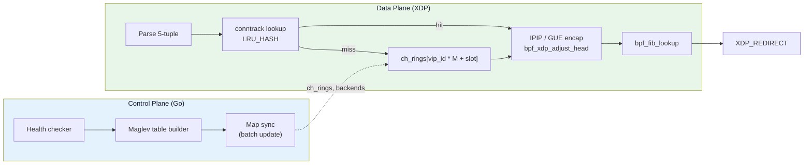
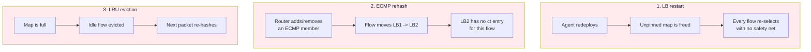
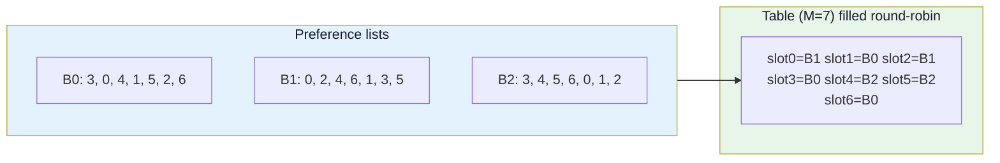
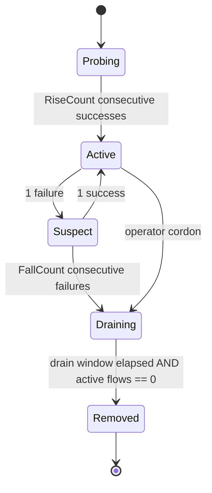
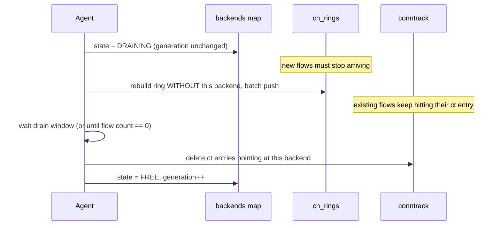
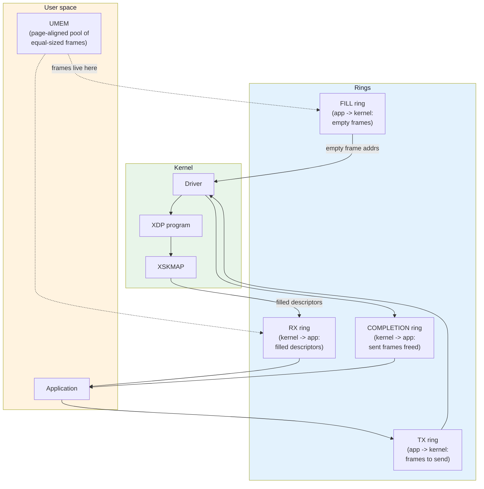

# Module 20: Production Load Balancer Datapath

> **The capstone: turning Module 11's load balancer into something you would actually run**

## 📊 Visual Learning




---

## Why Module 11's Load Balancer Falls Over

[Module 11](./11-ebpf-networking-guide.md) selects a backend with `hash % live_backend_count`. That is correct in the sense that it never indexes past the end of the array. It is also the single worst thing you can do to a fleet of long-lived connections, and it is worth being precise about *how* bad.

### The exact number

Take `N` backends, compacted into a dense array. A flow with hash `h` lands on index `h % N`. Now one backend dies, the array is compacted to `N-1` entries, and the same flow lands on index `h % (N-1)`.

`N` and `N-1` are coprime, so by the Chinese Remainder Theorem the pair `(h % N, h % (N-1))` is uniformly distributed over all `N × (N-1)` combinations. For each of the `N-1` surviving old indices there is exactly **one** value of `h % (N-1)` that maps back to the same backend. So:

```
P(flow keeps its backend) = (N - 1) / (N × (N - 1)) = 1/N
```

**Removing one of N backends remaps `(N-1)/N` of all flows.** Not the `1/N` you would hope for — its complement, which gets *worse* as the fleet grows.

| Backends | Flows remapped by `hash % N` | Flows remapped, ideal | Excess breakage |
|----------|------------------------------|-----------------------|-----------------|
| 3 | 66.7% | 33.3% | 2× |
| 5 | 80.0% | 20.0% | 4× |
| 10 | **90.0%** | 10.0% | 9× |
| 16 | 93.8% | 6.3% | 15× |
| 64 | 98.4% | 1.6% | 63× |

Verify it yourself — this is not a simulation artefact, the answer is exactly `1 - 1/N` for every choice of which backend you remove:

```go
// disruption_test.go - run with: go test -run TestModuloDisruption -v
package lb

import (
    "math"
    "testing"
)

func TestModuloDisruption(t *testing.T) {
    for _, n := range []int{3, 5, 10, 16, 64} {
        for removed := 0; removed < n; removed++ {
            kept, total := 0, n*(n-1)
            for h := 0; h < total; h++ { // one full CRT period
                old := h % n
                if old == removed {
                    continue // this flow breaks no matter what
                }
                j := h % (n - 1)
                nw := j
                if j >= removed {
                    nw = j + 1
                }
                if nw == old {
                    kept++
                }
            }
            got := float64(kept) / float64(total)
            if math.Abs(got-1/float64(n)) > 1e-9 {
                t.Fatalf("n=%d removed=%d: kept %.4f, want %.4f", n, removed, got, 1/float64(n))
            }
        }
    }
}
```

Adding a backend is just as bad: going from `N` to `N+1` keeps `1/(N+1)` of flows.

### "But I have a conntrack map"

Module 11 does have an `LRU_HASH` conntrack map, and for a single load balancer that never restarts, it does hide the problem — every established flow keeps hitting its cached entry and never re-hashes. Three things break that assumption, and all three happen in production:



Case 1 deserves a precise statement, because the obvious version of it is wrong. `hash % N` is deterministic: a restart that rebuilds a *byte-identical* backend array re-selects the same backend for every flow, and losing conntrack costs you nothing. The trap is that `hash % N` depends on the array's **length and order**, and neither is stable across a restart — the agent re-lists `EndpointSlice`s in a different order, one backend happens to be failing its first health check when the agent comes up, or the list was built by ranging over a Go map ([Module 19](./19-control-plane-agent-patterns.md)). Any of those turns the restart into the `(N-1)/N` case above, at exactly the moment the conntrack safety net is gone.

Case 2 is the one people miss. In a real deployment you do not have *one* load balancer; you have a rack of them behind an anycast VIP, and the upstream router picks one by ECMP hash. Conntrack is **per-node state**. The moment a link flaps, an LB is drained, or a router recomputes its ECMP group, a live flow arrives at a node that has never seen it. That node has to choose a backend *from scratch* and get **the same answer the other node got**.

> **This is the real requirement.** Consistent hashing is not primarily about surviving backend churn on one box. It is the *stateless agreement protocol* between load balancers that have never talked to each other. Conntrack is an optimisation layered on top; it can never be the correctness mechanism.

---

## Maglev Hashing

Maglev (Google, NSDI 2016) replaces "hash then modulo" with "hash into a big precomputed lookup table". The datapath becomes one array read:

```
slot     = hash(5-tuple) % M          // M is a prime, e.g. 65537
backend  = ch_rings[vip_id * M + slot]
```

All the intelligence lives in how `ch_rings` is *built*. The construction gives two properties at once:

1. **Balance** — every backend gets within ~1% of an equal share of slots when `M > 100 × N`.
2. **Near-minimal disruption** — removing a backend frees *that backend's* slots and perturbs only a small number of others. "Near", not "minimal": the excess over the ideal `1/N` is real and measured further down.

### The algorithm, precisely

Each backend `i` gets a *preference list*: a permutation of all `M` slots, generated from two independent hashes of its name.

```
offset[i]         = h1(name[i]) mod M
skip[i]           = (h2(name[i]) mod (M - 1)) + 1
permutation[i][j] = (offset[i] + j * skip[i]) mod M
```

Two details that people get wrong and that quietly destroy the balance property:

- **`skip` must be in `[1, M-1]`, never 0.** That is why it is `mod (M-1)` **+ 1** and not `mod M`. A `skip` of 0 makes the entire permutation a single repeated slot.
- **`M` must be prime.** Because `gcd(skip, M) = 1` for every `skip` in `[1, M-1]` when `M` is prime, `(offset + j*skip) mod M` visits all `M` slots exactly once as `j` runs `0..M-1`. Pick a non-prime `M` and a backend whose `skip` shares a factor `d` with `M` only ever visits `M/d` slots — it can bid on a fraction of the table, and once those `M/d` slots are all taken the populate loop **hangs**, because it is searching a cycle with no free slot in it. This is not a subtle imbalance; it is an infinite loop in your control plane. 65537, 16381, 65521 and 131071 are all prime; 65536 and 16384 are not.

Then `populate` runs round-robin: each backend, in turn, walks down its preference list and claims the first slot nobody has taken yet.



Walk that by hand once — it is the whole algorithm. Round 1: B0 claims 3, B1 claims 0, B2 wants 3 (taken) so it claims 4. Round 2: B0 wants 0 then 4 (both taken) and claims 1, B1 claims 2, B2 claims 5. Round 3: B0 wants 5 then 2 (taken) and claims 6 — seven slots filled, split 3/2/2.

### Building it in Go

Two rules make this correct across a fleet, and both are easy to violate in Go specifically:

- **Sort the backend list.** Never iterate a Go `map` to build the table — map iteration order is randomised per run, so two LB nodes would produce different tables from an identical backend set.
- **Use a deterministic hash.** `hash/maphash` is seeded randomly per process. `hash/fnv` (or a vendored murmur3) is deterministic across processes, hosts and restarts. This is not a style preference; a random seed means node A and node B disagree about every flow.

```go
package maglev

import (
    "hash/fnv"
    "sort"
)

// Table size must be prime and comfortably larger than 100x the backend count.
// 65537 is what Katran uses; Cilium defaults to 16381 to save memory per VIP.
const M = 65537

// Backend is identified by a stable string ("10.0.1.7:8080"). The identity must
// NOT change when the backend is rescheduled to a different slot index, or the
// whole table shifts.
type Backend struct {
    Name string
    // ID is the index into the BPF `backends` array. Index 0 is RESERVED and
    // never allocated: an unpopulated ARRAY slot reads back as 0, so a real
    // backend at index 0 would be indistinguishable from "ring not built yet".
    // Allocate IDs from 1.
    ID uint32
}

func hash1(s string) uint64 {
    h := fnv.New64a()
    h.Write([]byte(s))
    return h.Sum64()
}

func hash2(s string) uint64 {
    h := fnv.New64a()
    h.Write([]byte("maglev-skip\x00"))
    h.Write([]byte(s))
    return h.Sum64()
}

// Build returns an M-entry table of backend IDs.
func Build(backends []Backend) []uint32 {
    n := len(backends)
    table := make([]uint32, M)
    if n == 0 {
        return table // all zeros == "no backends", because ID 0 is reserved
    }

    // Deterministic order is mandatory.
    sorted := append([]Backend(nil), backends...)
    sort.Slice(sorted, func(i, j int) bool { return sorted[i].Name < sorted[j].Name })

    offset := make([]uint64, n)
    skip := make([]uint64, n)
    next := make([]uint64, n) // how far down its preference list backend i has walked

    for i, b := range sorted {
        offset[i] = hash1(b.Name) % M
        skip[i] = (hash2(b.Name) % (M - 1)) + 1 // never 0
    }

    entry := make([]int32, M)
    for i := range entry {
        entry[i] = -1
    }

    filled := 0
    for {
        for i := 0; i < n; i++ {
            // candidate = permutation[i][next[i]]
            c := (offset[i] + next[i]*skip[i]) % M
            for entry[c] >= 0 {
                next[i]++
                c = (offset[i] + next[i]*skip[i]) % M
            }
            entry[c] = int32(i)
            next[i]++
            filled++
            if filled == M {
                for slot, bi := range entry {
                    table[slot] = sorted[bi].ID
                }
                return table
            }
        }
    }
}
```

The inner `for entry[c] >= 0` loop terminates **only because `M` is prime**: that is what makes `j → (offset + j*skip) mod M` a bijection over all `M` slots, so a backend can never exhaust its list while a free slot remains, and the outer loop stops the moment the table is full. If you ever make `M` configurable, validate primality at startup rather than discovering it as a wedged goroutine.

**Cost check.** `Build` is O(M) amortised but the constant matters: at `M = 65537` with 100 backends it runs in a couple of milliseconds. That is fine for a health-check-driven rebuild every few seconds. It is *not* fine to rebuild it per API-server event — debounce, as in [Module 19](./19-control-plane-agent-patterns.md).

### Measuring the disruption you actually get

Maglev is *near*-minimal, not minimal. Measure it rather than trusting the paper:

```go
func disruption(before, after []uint32) float64 {
    changed := 0
    for i := range before {
        if before[i] != after[i] {
            changed++
        }
    }
    return float64(changed) / float64(len(before))
}
```

Measured with the implementation above at `M = 65537`, backends named `10.0.1.1:8080` … `10.0.1.N:8080`, averaged over each choice of which backend is removed:

| Backends | Slots changed when 1 is removed | Spread over which one | Theoretical minimum | Share spread (min–max) |
|----------|--------------------------------|-----------------------|---------------------|------------------------|
| 4 | 25.08% | 25.05% – 25.13% | 25.00% | 25.000% – 25.001% |
| 10 | 10.23% | 10.20% – 10.27% | 10.00% | 9.999% – 10.000% |
| 64 | 2.04% | 1.98% – 2.14% | 1.56% | 1.562% – 1.564% |

Read the *ratio*, not the absolute number. The overshoot over the theoretical minimum grows as `N` grows relative to `M`: 0.3% overshoot at N=4, 2% at N=10, **31%** at N=64 (2.04% vs 1.56%), and 6× at N=655 — which is exactly `M/100`, where each backend holds only ~100 slots and the round-robin refill perturbs a large fraction of its neighbours' claims. `M > 100 × N` keeps the *balance* within ~1%; it does **not** keep disruption near-minimal. If you care about disruption, size `M` at 1000× your backend count or larger.

Compare the 10.23% at N=10 against the **90%** you measured for `hash % N`. Maglev is near-minimal, not minimal — that small excess is exactly why Katran and Cilium still keep a conntrack map. Consistent hashing bounds the damage; conntrack removes what remains for flows this node has already seen.

### Pushing the table into a BPF array

```c
/* lb.bpf.c - map definitions */
#include "vmlinux.h"
#include <bpf/bpf_helpers.h>
#include <bpf/bpf_endian.h>

/* vmlinux.h carries TYPES and ENUMS (struct iphdr, struct bpf_fib_lookup,
 * IPPROTO_IPIP, XDP_TX, BPF_FIB_LKUP_RET_*) but NOT MACROS. ETH_P_IP, IP_DF
 * and AF_INET are plain #defines in kernel headers with no BTF representation,
 * so they must be declared by hand. Forgetting this gives you "use of
 * undeclared identifier 'ETH_P_IP'" - and the fix is NOT to #include
 * <linux/if_ether.h>, which conflicts with vmlinux.h's type definitions. */
#define ETH_P_IP    0x0800
#define IP_DF       0x4000
#define AF_INET     2

#define MAGLEV_M     65537
#define MAX_VIPS     16
#define MAX_BACKENDS 512

struct vip_key {
    __be32 vip;
    __be16 port;
    __u8   proto;
    __u8   pad;      /* explicit: hash map keys are compared byte-for-byte,
                      * and uninitialised padding means a permanent miss */
};

struct vip_meta {
    __u32 vip_id;    /* 0 .. MAX_VIPS-1, selects a slice of ch_rings */
    __u32 flags;     /* DSR mode: 0 = DNAT, 1 = L2, 2 = IPIP, 3 = GUE */
};

#define BE_FREE     0
#define BE_ACTIVE   1
#define BE_DRAINING 2

/* Layout is pinned deliberately - see the Go mirror below.
 *   0..3   ip
 *   4..9   mac
 *   10     state
 *   11     pad
 *   12..15 generation   (naturally aligned, no implicit hole)
 * sizeof == 16, alignof == 4. */
struct backend {
    __be32 ip;
    __u8   mac[6];      /* only used in L2 DSR mode */
    __u8   state;
    __u8   pad;
    __u32  generation;  /* bumped every time this slot is reused */
};

struct {
    __uint(type, BPF_MAP_TYPE_HASH);
    __uint(max_entries, 256);
    __type(key, struct vip_key);
    __type(value, struct vip_meta);
} vips SEC(".maps");

/* Flat Maglev table: MAX_VIPS contiguous rings of MAGLEV_M entries each.
 * 16 * 65537 * 4 B = 4.2 MB. Katran's defaults (512 VIPs, M=65537) come to
 * 134 MB, which is why Cilium's default M is 16381. */
struct {
    __uint(type, BPF_MAP_TYPE_ARRAY);
    __uint(max_entries, MAX_VIPS * MAGLEV_M);
    __type(key, __u32);
    __type(value, __u32);   /* backend id */
} ch_rings SEC(".maps");

/* Index 0 is reserved and always left BE_FREE, so a zero read out of ch_rings
 * unambiguously means "this VIP's ring has not been built". */
struct {
    __uint(type, BPF_MAP_TYPE_ARRAY);
    __uint(max_entries, MAX_BACKENDS);
    __type(key, __u32);
    __type(value, struct backend);
} backends SEC(".maps");

char LICENSE[] SEC("license") = "GPL";
```

### The Go mirror of `struct backend`

Any Go type that mirrors a BPF map value has to reproduce the C layout **byte for byte**, because `cilium/ebpf` marshals it with `binary.Write`-style encoding and the kernel stores the raw bytes. Go and C do not agree on padding by default, so spell it out:

```go
// Mirrors `struct backend` from lb.bpf.c: 16 bytes, 4-byte aligned.
// Every field is fixed-width and the explicit Pad byte reproduces the C hole,
// so binary.Size(backendValue{}) == 16 == C sizeof(struct backend).
type backendValue struct {
    IP         [4]byte // __be32, network order - NOT uint32
    MAC        [6]byte
    State      uint8
    Pad        uint8 // must be present; C has a byte here
    Generation uint32
}
```

Three traps in that one struct:

- **`IP` is `[4]byte`, not `uint32`.** The C field is `__be32`. Declaring it `uint32` in Go makes `binary.LittleEndian` write it host-order and every packet goes to a byte-reversed address. `net.IP.To4()` gives you the `[4]byte` directly.
- **`Pad` must exist.** Drop it and Go packs `Generation` at offset 11 while C has it at 12 — every generation comparison then fails and `ct_resolve` rejects every established flow.
- **Assert it in a test**, don't trust the reading: `if binary.Size(backendValue{}) != 16 { t.Fatal(...) }`, and compare against `objs.Backends.ValueSize()` at load time, which the kernel reports from the map's BTF.

The same discipline applies to `struct flow_key` (16 B: 4+4+2+2+1+3) and `struct ct_value` (24 B: 4+4+8+1+7) below — both carry explicit `pad` arrays for exactly this reason. Hash-map **keys** are worse than values: the kernel compares them byte for byte, so an uninitialised padding byte in a Go key struct is a permanent lookup miss, not a wrong answer.

### Batch-updating the ring

The ring is `M` entries per VIP. One `Put` per slot is 65537 syscalls; one `BatchUpdate` is one.

```go
// Push the whole ring in one syscall. BPF_MAP_UPDATE_BATCH needs kernel 5.6+;
// on older kernels fall back to a Put loop (65537 syscalls, ~50 ms - acceptable
// for a rebuild, never for the packet path).
func pushRing(m *ebpf.Map, vipID uint32, table []uint32) error {
    keys := make([]uint32, len(table))
    for i := range table {
        keys[i] = vipID*maglev.M + uint32(i)
    }
    n, err := m.BatchUpdate(keys, table, nil)
    if err != nil {
        if !errors.Is(err, ebpf.ErrNotSupported) {
            return fmt.Errorf("batch update ring %d: %w", vipID, err)
        }
        for i, k := range keys {
            if err := m.Put(k, table[i]); err != nil {
                return fmt.Errorf("put slot %d: %w", k, err)
            }
        }
        return nil
    }
    if n != len(keys) {
        return fmt.Errorf("partial ring update: %d/%d", n, len(keys))
    }
    return nil
}
```

> **Failure mode you will hit:** clearing the ring and then refilling it. Even a batch update is not atomic against the datapath — packets processed mid-update read a mix of old and new entries. Never write zeros first. If you need true atomicity, put the ring in an `ARRAY_OF_MAPS` and flip the outer pointer once the new inner map is fully populated (see [Module 09](./09-ebpf-maps-mastery.md#map-in-map)); the outer update *is* atomic.

### The datapath hash

The 5-tuple hash runs in the kernel and must be identical on every LB node — which it is, because they all run the same object file. `bpf_get_hash_recalc()` is TC-only, so in XDP compute it yourself. Use MurmurHash3's mixing steps, fully unrolled so the verifier never sees a loop:

```c
static __always_inline __u32 rotl32(__u32 x, __u32 r) {
    return (x << r) | (x >> (32 - r));
}

static __always_inline __u32 mur_mix(__u32 h, __u32 k) {
    k *= 0xcc9e2d51;
    k  = rotl32(k, 15);
    k *= 0x1b873593;
    h ^= k;
    h  = rotl32(h, 13);
    h  = h * 5 + 0xe6546b64;
    return h;
}

static __always_inline __u32 mur_final(__u32 h) {
    h ^= 12;              /* length in bytes of the mixed input */
    h ^= h >> 16;
    h *= 0x85ebca6b;
    h ^= h >> 13;
    h *= 0xc2b2ae35;
    h ^= h >> 16;
    return h;
}

struct flow_key {
    __be32 src_ip;
    __be32 dst_ip;
    __be16 src_port;
    __be16 dst_port;
    __u8   proto;
    __u8   pad[3];
};

/* Deterministic across every node running this object file. */
static __always_inline __u32 hash_flow(const struct flow_key *f) {
    __u32 h = 0x9747b28c;                       /* fixed seed */
    h = mur_mix(h, (__u32)f->src_ip);
    h = mur_mix(h, (__u32)f->dst_ip);
    h = mur_mix(h, ((__u32)f->src_port << 16) | (__u32)f->dst_port);
    return mur_final(h);
}
```

Note the hash deliberately does **not** include `proto`, even though `flow_key` carries it for the conntrack lookup. The ring you are about to index was already chosen by a `(vip, port, proto)` lookup in `vips`, so TCP and UDP traffic to the same VIP is hashing into *different* rings regardless; folding `proto` in again would only make a slot number harder to reproduce by hand when you are debugging one flow. What this does **not** buy you is TCP:443 and QUIC:443 landing on the same backend — those are two VIP entries with two rings. If you want them co-located, that is a control-plane decision: give both entries the same `vip_id` so they share one ring.

### Filling `flow_key` safely

The hash is only as good as the parse that feeds it, and the parse is where the verifier — and reality — will catch you. Two rules, both of which Module 07 states and which a lot of copy-pasted XDP code violates:

```c
/* Fills *f. Returns 0 on success, -1 meaning "XDP_PASS this to the stack". */
static __always_inline int parse_flow(struct xdp_md *ctx, struct flow_key *f) {
    void *data     = (void *)(long)ctx->data;
    void *data_end = (void *)(long)ctx->data_end;

    struct ethhdr *eth = data;
    if ((void *)(eth + 1) > data_end)
        return -1;
    if (eth->h_proto != bpf_htons(ETH_P_IP))    /* bpf_htons, never libc htons:
                                                 * htons is a userspace libc
                                                 * function with no BPF version */
        return -1;

    struct iphdr *ip = (void *)(eth + 1);
    if ((void *)(ip + 1) > data_end)
        return -1;

    /* RULE 1: the IPv4 header is VARIABLE length. sizeof(struct iphdr) is the
     * minimum, not the actual size. Options are rare but an attacker sends them
     * on purpose, and a fixed +20 then parses option bytes as a TCP header. */
    __u32 ihl_len = ip->ihl * 4;
    if (ihl_len < sizeof(struct iphdr))          /* ihl < 5 is malformed */
        return -1;

    /* RULE 2: fragments after the first have no L4 header at all. Hashing
     * garbage sends fragment 2 of a datagram to a different backend than
     * fragment 1, and the backend reassembles neither. */
    if (ip->frag_off & bpf_htons(0x1fff))        /* non-zero fragment offset */
        return -1;

    if (ip->protocol != IPPROTO_TCP && ip->protocol != IPPROTO_UDP)
        return -1;

    /* Re-derive from `ip`, and bounds-check AFTER adding the variable length. */
    void *l4 = (void *)ip + ihl_len;
    if (l4 + sizeof(struct udphdr) > data_end)   /* first 4 bytes of TCP and UDP
                                                  * are both src/dst port */
        return -1;

    struct udphdr *ports = l4;
    f->src_ip   = ip->saddr;
    f->dst_ip   = ip->daddr;
    f->src_port = ports->source;
    f->dst_port = ports->dest;
    f->proto    = ip->protocol;
    __builtin_memset(f->pad, 0, sizeof(f->pad)); /* it is a hash-map key */
    return 0;
}
```

That last line is not decoration. `flow_key` is a `HASH` key, the kernel compares keys with `memcmp` over the whole `key_size`, and `struct flow_key f;` on the BPF stack starts as whatever the previous program left there. Uninitialised padding turns every conntrack lookup into a miss — the flow still works, it just re-selects a backend on every single packet and your `S_CT_HIT` counter sits at zero. Either `__builtin_memset` the whole struct or initialise it with a designated-initialiser literal (`struct flow_key f = {};`), which zeroes padding too.

### Selection in the datapath

```c
/* Returns backend id, or -1 */
static __always_inline int pick_backend(__u32 vip_id, const struct flow_key *f) {
    __u32 slot = hash_flow(f) % MAGLEV_M;
    __u32 idx  = vip_id * MAGLEV_M + slot;

    __u32 *bid = bpf_map_lookup_elem(&ch_rings, &idx);
    if (!bid)
        return -1;                  /* vip_id out of range - ring not built */
    if (*bid == 0 || *bid >= MAX_BACKENDS)
        return -1;                  /* 0 is the reserved "unset" id */
    return (int)*bid;
}
```

`ARRAY` lookups return `NULL` for out-of-range keys, so the `!bid` check is both the bounds proof the verifier wants and the "control plane has not populated this VIP yet" case. Do not skip it. The `*bid == 0` check is the second half of that: an ARRAY slot the control plane has never written reads back as zero, which is a perfectly valid array index — without the reserved-zero convention every unbuilt ring silently sends all of its traffic to backend 0.

---

## Return Paths: SNAT, L2 DSR, IPIP, GUE

Module 11 rewrites `ip->daddr` and bounces the frame with `XDP_TX`. That is plain DNAT, and on its own it does not work: the backend sees `src = client, dst = backend`, so it answers with `src = backend`, straight to the client, and the client drops a reply that came from an address it never talked to. There are only two ways out. Either you SNAT as well — rewrite the source to the LB's own address, which makes the backend reply *to the LB* and hides the client IP — or you leave the source alone and force the return route through the LB. Either way, **every reply byte crosses the load balancer**, and that is the half of the traffic you would most like not to carry.

| | **DNAT + SNAT** | **L2 DSR** | **IPIP DSR** | **GUE DSR** |
|---|---|---|---|---|
| Return traffic via LB | Yes (all of it) | No | No | No |
| Backend sees client IP | No | Yes | Yes | Yes |
| Backend must share L2 | No | **Yes** | No | No |
| Bytes added | 0 | 0 | 20 | 32 |
| Effective MTU (1500 link) | 1500 | 1500 | **1480** | **1468** |
| ECMP/RSS entropy on tunnel | n/a | n/a | **None** | UDP sport |
| Inner checksums touched | Yes (L3+L4) | No | No | No |
| Backend setup | none | `lo` VIP + arp sysctls | ipip device | fou/gue device |

The asymmetry matters more than it looks: web traffic is typically 1:10 request:response by bytes. A DSR load balancer handles the small half. That is the entire reason Katran, IPVS-DR and Cloudflare's Unimog all do DSR.

### L2 DSR — rewrite the MAC, nothing else

Only the destination MAC changes. The IP header — including the VIP as destination — is untouched, so the backend must own the VIP locally and must not answer ARP for it.

```bash
# On each backend:
ip addr add 10.0.0.1/32 dev lo                 # the VIP, on loopback
sysctl -w net.ipv4.conf.all.arp_ignore=1       # don't reply to ARP for lo addrs
sysctl -w net.ipv4.conf.all.arp_announce=2     # use the real IP as ARP source
```

> **Failure mode:** skip `arp_ignore`/`arp_announce` and every backend answers ARP for the VIP. The upstream switch learns whichever backend replied last, traffic bypasses the load balancer entirely, and it looks like "the LB stopped receiving packets". Diagnose with `arping -I eth0 10.0.0.1` from a third host — you should get exactly one reply, from the LB.

The datapath is just Module 11 minus the IP rewrite: set `eth->h_dest` to the backend MAC, set `eth->h_source` to the LB MAC, `return XDP_TX`. The limitation is that every backend must be on the same L2 segment as the load balancer, which does not survive contact with a multi-rack cluster.

### IPIP encapsulation

Wrap the original packet, unmodified, in a new IPv4 header (`protocol = 4`, per RFC 2003). The inner IP and TCP checksums stay valid because nothing inside was touched — this is a genuine advantage over DNAT, which forces you to fix both L3 and L4 checksums.

`bpf_xdp_adjust_head(ctx, delta)` with a negative delta moves `ctx->data` **backwards** into the driver's headroom. It does **not** move the existing bytes. So after `adjust_head(-20)` the layout is:

```
before:                   [ eth(14) ][ inner IP ... ]
after adjust_head(-20):   [ 20 B new headroom ][ eth(14) ][ inner IP ... ]
what we want:             [ eth(14) ][ outer IP(20) ][ inner IP ... ]
```

You save the Ethernet header first, then rewrite it at the new front and lay the outer IP header over the old Ethernet bytes:

```c
/* Valid ONLY for a 20-byte header (ihl == 5), which is all we ever build here.
 * Never point this at a received packet: an incoming header with options has
 * ihl > 5 and the checksum must cover ip->ihl * 4 bytes, not sizeof(*ip).
 * A verifier-friendly variable-length version needs a bounded loop
 * (`#pragma unroll` over the max 15 words, with a `i < ip->ihl * 2` guard). */
static __always_inline __u16 ipv4_csum_20(struct iphdr *ip) {
    __u32 sum = 0;
    __u16 *p = (__u16 *)ip;

    #pragma unroll
    for (int i = 0; i < (int)sizeof(struct iphdr) / 2; i++)
        sum += p[i];

    /* max is 10 * 0xFFFF = 0x9FFF6, so two unconditional folds suffice */
    sum = (sum & 0xffff) + (sum >> 16);
    sum = (sum & 0xffff) + (sum >> 16);
    return (__u16)~sum;   /* already in network order: the ones'-complement
                           * sum of 16-bit words is byte-order agnostic */
}

static __always_inline int encap_ipip(struct xdp_md *ctx,
                                      __be32 outer_src, __be32 outer_dst) {
    void *data     = (void *)(long)ctx->data;
    void *data_end = (void *)(long)ctx->data_end;

    struct ethhdr *eth = data;
    if ((void *)(eth + 1) > data_end)
        return -1;

    struct iphdr *inner = (void *)(eth + 1);
    if ((void *)(inner + 1) > data_end)
        return -1;

    /* Save what we need BEFORE the pointers are invalidated */
    struct ethhdr eth_copy;
    __builtin_memcpy(&eth_copy, eth, sizeof(eth_copy));
    __u16 inner_len = bpf_ntohs(inner->tot_len);

    if (bpf_xdp_adjust_head(ctx, 0 - (int)sizeof(struct iphdr)))
        return -1;   /* -EINVAL: not enough headroom. Count it and XDP_DROP;
                      * this is never a "retry" condition. */

    /* MANDATORY: every packet pointer is stale after adjust_head */
    data     = (void *)(long)ctx->data;
    data_end = (void *)(long)ctx->data_end;
    if (data + sizeof(struct ethhdr) + sizeof(struct iphdr) > data_end)
        return -1;

    struct ethhdr *new_eth = data;
    __builtin_memcpy(new_eth, &eth_copy, sizeof(eth_copy));
    new_eth->h_proto = bpf_htons(ETH_P_IP);

    struct iphdr *outer = (void *)(new_eth + 1);
    outer->version  = 4;
    outer->ihl      = 5;
    outer->tos      = 0;
    outer->tot_len  = bpf_htons(inner_len + sizeof(struct iphdr));
    outer->id       = 0;
    outer->frag_off = bpf_htons(IP_DF);
    outer->ttl      = 64;
    outer->protocol = IPPROTO_IPIP;     /* enum from vmlinux.h, value 4 */
    outer->saddr    = outer_src;
    outer->daddr    = outer_dst;
    outer->check    = 0;
    outer->check    = ipv4_csum_20(outer);
    return 0;
}
```

> **Failure mode:** `bpf_xdp_adjust_head` returns `-EINVAL`. Both native and generic XDP give you `XDP_PACKET_HEADROOM` (256 bytes) — generic mode calls `pskb_expand_head()` to guarantee it — so 20 or 32 bytes of encapsulation is not normally tight. The helper refuses when the new `data` would cross below `data_hard_start + sizeof(struct xdp_frame)` (that ~40-byte reservation is what makes `XDP_REDIRECT` possible at all) or below `data_meta`. So the two things that actually bite are: **you called `bpf_xdp_adjust_meta()` first** and ate the headroom, or you are stacking several encapsulations. Check the return value every time — the helper failing and the program carrying on writing an outer header into the *inner* packet is a spectacular, silent corruption.

Backend side — one `external` (collect_md) ipip device decapsulates traffic from *any* LB source, so you do not need one device per load balancer:

```bash
modprobe ipip
ip link add name ipip0 type ipip external
ip link set ipip0 up
sysctl -w net.ipv4.conf.ipip0.rp_filter=0     # inner src is the client, not us
sysctl -w net.ipv4.conf.all.rp_filter=0
ip addr add 10.0.0.1/32 dev lo                # the VIP
```

> **Failure mode:** `rp_filter` left at 1. The decapsulated packet has the *client's* source IP arriving on `ipip0`, the reverse-path check fails, and the kernel drops it silently. Symptom: `tcpdump -i ipip0` shows the packets arriving and the application never sees them. Confirm it with `nstat -az TcpExtIPReversePathFilter` — the counter is in the `TcpExt` group despite being an IP counter, which is why grepping for "rpfilter" finds nothing — or turn on `sysctl -w net.ipv4.conf.all.log_martians=1` and watch `dmesg` print a `martian source` line per drop. Remember the effective value is `max(conf.all.rp_filter, conf.<dev>.rp_filter)`, so setting `all` to 0 is not enough if the device is still 1.

### GUE encapsulation

GUE (Generic UDP Encapsulation) puts the same payload behind `IP + UDP + 4-byte GUE header`. The extra 12 bytes buy you one thing that matters at scale: a **UDP source port you control**, which every router's ECMP hash and every NIC's RSS hash will use. With plain IPIP, all traffic from one LB to one backend is a single (src, dst, proto=4) tuple and pins to a single path and a single RX queue.

```c
/* Not in vmlinux.h - GUE is not a kernel uapi struct */
struct guehdr {
    __u8   ver_c_hlen;  /* Ver(2 high bits)=0 | C(1)=0 | Hlen(5 low bits)=0 */
    __u8   proto_ctype; /* IPPROTO_IPIP (4) - a whole inner IPv4 packet follows */
    __be16 flags;       /* 0 */
};

#define GUE_PORT     6080
/* Keep it signed: bpf_xdp_adjust_head() takes an int delta, and negating a
 * sizeof-derived unsigned expression is a good way to ask for a 4 GB headroom. */
#define GUE_OVERHEAD ((int)(sizeof(struct iphdr) + sizeof(struct udphdr) + \
                            sizeof(struct guehdr)))          /* 32 */

/* Prologue is encap_ipip's, verbatim: copy the Ethernet header out, read the
 * inner tot_len, bpf_xdp_adjust_head(ctx, -GUE_OVERHEAD), re-read
 * ctx->data / ctx->data_end, bounds-check eth + iphdr + udphdr + guehdr, and
 * rewrite the Ethernet header at the new front. Then: */

    struct iphdr *outer = (void *)(new_eth + 1);
    outer->version  = 4;
    outer->ihl      = 5;
    outer->tos      = 0;
    outer->tot_len  = bpf_htons(inner_len + GUE_OVERHEAD);
    outer->id       = 0;
    outer->frag_off = bpf_htons(IP_DF);
    outer->ttl      = 64;
    outer->protocol = IPPROTO_UDP;      /* NOT IPPROTO_IPIP: the inner type is
                                         * carried in the GUE header instead */
    outer->saddr    = outer_src;
    outer->daddr    = outer_dst;

    struct udphdr *udp = (void *)(outer + 1);
    /* Entropy: the same hash_flow() value that picked the slot, so every packet
     * of a flow gets the same source port and stays on one path. */
    udp->source = bpf_htons(0x8000 | (flow_hash & 0x7fff));
    udp->dest   = bpf_htons(GUE_PORT);
    udp->len    = bpf_htons(inner_len + sizeof(struct udphdr) + sizeof(struct guehdr));
    udp->check  = 0;    /* legal and normal for IPv4; NOT legal for IPv6 */

    struct guehdr *gue = (void *)(udp + 1);
    gue->ver_c_hlen  = 0;
    gue->proto_ctype = IPPROTO_IPIP;
    gue->flags       = 0;

    /* Outer IPv4 checksum LAST, once every other outer field is final. */
    outer->check = 0;
    outer->check = ipv4_csum_20(outer);
```

Backend side:

```bash
modprobe fou
# Receive-side decapsulation: strip the GUE + outer IP headers on UDP/6080
# and hand the inner IPv4 packet back to the stack. No tunnel device needed
# for the RX path, because DSR never sends anything back through the tunnel.
ip fou add port 6080 gue

sysctl -w net.ipv4.conf.all.rp_filter=0
ip addr add 10.0.0.1/32 dev lo
```

### The MTU consequence — read this twice

Encapsulation shrinks the payload the client can send end to end:

| Path MTU | IPIP inner MTU | GUE inner MTU |
|----------|----------------|---------------|
| 1500 (typical) | 1480 | 1468 |
| 1450 (VXLAN underlay) | 1430 | 1418 |
| 9000 (jumbo) | 8980 | 8968 |

The load balancer cannot fragment for you — XDP has no fragmentation path, and you set `DF` on the outer header anyway. So a 1500-byte IP packet from the client becomes a 1520-byte outer IP packet that a 1500-MTU egress link refuses.

**The symptom is the classic PMTU blackhole:** the TCP handshake works, `curl` on a small endpoint works, and then TLS ClientHello or any large POST hangs forever. Small packets get through, big ones vanish.

Detect it in the datapath rather than guessing. `bpf_fib_lookup()` performs the MTU check for you when you fill in `tot_len`:

```c
static __always_inline int route_and_send(struct xdp_md *ctx, __be32 src,
                                          __be32 dst, __u16 outer_tot_len,
                                          __u8 outer_proto) {
    /* Zero-init matters: this buffer is read AND written by the helper, and
     * leftover stack bytes in sport/dport/tos/mark change the answer.
     * sizeof(fib) is 64 and has been stable since 4.18 - every field added
     * since (tbid 6.7, mark 6.10) went into an existing union - but the kernel
     * still rejects a plen smaller than its own sizeof, so always pass
     * sizeof(fib) and never a hand-rolled constant. */
    struct bpf_fib_lookup fib = {};
    fib.family      = AF_INET;
    fib.l4_protocol = outer_proto;          /* IPPROTO_IPIP or IPPROTO_UDP -
                                             * consulted by L4-matching ip rules */
    fib.ipv4_src    = src;                  /* the outer source we just wrote;
                                             * matters if you use ip rules */
    fib.ipv4_dst    = dst;
    fib.tot_len     = outer_tot_len;        /* the XDP flavour always MTU-checks
                                             * whatever you put here; the skb
                                             * flavour only checks if it is != 0 */
    fib.ifindex     = ctx->ingress_ifindex; /* IN: ingress dev, OUT: egress dev */

    /* flags = 0 is a forwarding lookup: ifindex goes in as the device the frame
     * arrived on, and the helper overwrites it with the egress ifindex - which
     * is what we hand to bpf_redirect() below. BPF_FIB_LOOKUP_OUTPUT would pin
     * the route to the ingress device instead, defeating the whole point of
     * reaching a backend in another rack. */
    long rc = bpf_fib_lookup(ctx, &fib, sizeof(fib), 0);

    switch (rc) {
    case BPF_FIB_LKUP_RET_SUCCESS:
        break;
    case BPF_FIB_LKUP_RET_FRAG_NEEDED:
        /* fib.mtu_result (5.12+) holds the egress MTU. A production LB
         * generates an ICMP "fragmentation needed" (type 3, code 4) here.
         * Minimum viable behaviour: count it and drop, never fail silently. */
        return XDP_DROP;
    case BPF_FIB_LKUP_RET_NO_NEIGH:
        return XDP_PASS;   /* let the stack ARP for the next hop */
    default:
        return XDP_DROP;
    }

    void *data     = (void *)(long)ctx->data;
    void *data_end = (void *)(long)ctx->data_end;
    struct ethhdr *eth = data;
    if ((void *)(eth + 1) > data_end)
        return XDP_DROP;

    __builtin_memcpy(eth->h_dest,   fib.dmac, 6);
    __builtin_memcpy(eth->h_source, fib.smac, 6);

    return bpf_redirect(fib.ifindex, 0);
}
```

`bpf_fib_lookup` is the reason a DSR load balancer can send to a backend in another rack: it consults the real kernel FIB and fills in the next-hop MACs for you. Three portability notes, all of them about unions in `struct bpf_fib_lookup`:

- `mtu_result` shares a union with `tot_len`. If your `vmlinux.h` has no `mtu_result` field your kernel predates 5.12 and you get the `FRAG_NEEDED` code without the value. Because it is a union, reading `fib.mtu_result` after the call is also reading over your own `tot_len` input — do not expect `tot_len` to survive.
- `smac`/`dmac` share a union with `mark` (added 6.10, used with `BPF_FIB_LOOKUP_MARK`). Setting `fib.mark` and then reading `fib.dmac` gives you your own mark bytes as an Ethernet address. Pick one.
- The `BPF_FIB_LKUP_RET_*` enum only exists from 4.20 — the 4.18 helper returned `0` or a negative errno, so code written against the enum will not build against an older `vmlinux.h`.

Operational mitigations, in order of preference:

```bash
# 1. Clamp MSS on the way in so clients never send oversized segments
iptables -t mangle -A FORWARD -p tcp --syn -j TCPMSS --clamp-mss-to-pmtu

# 2. Or set the backend tunnel MTU explicitly and let PMTUD work
ip link set ipip0 mtu 1480

# 3. Confirm ICMP is not being firewalled - PMTUD needs type 3 code 4
tcpdump -ni eth0 'icmp[icmptype] == 3 and icmp[icmpcode] == 4'
```

> A real Katran-class load balancer also has to *forward* those ICMP messages: an ICMP "frag needed" from somewhere in the network is addressed to the **client**, not the backend, and the only way to know which backend it belongs to is to parse the quoted inner IP header out of the ICMP payload and hash *that*. If you skip this, PMTUD is broken for everyone behind your VIP.

---

## Health Checking and the Drain Protocol

A Maglev table is only as good as the backend set it was built from. Two nodes with different views of liveness build different tables and break flows — so health state changes must be *slow and consistent*, not fast and noisy.



```go
type State uint8

const (
    StateProbing State = iota
    StateActive
    StateSuspect
    StateDraining
    StateRemoved
)

// What the checker publishes; the agent debounces these and rebuilds the ring.
type Transition struct {
    Addr string
    To   State
}

type Checker struct {
    Addr       string
    Interval   time.Duration // 1s
    Timeout    time.Duration // 500ms
    RiseCount  int           // 3 consecutive OK before Active
    FallCount  int           // 3 consecutive fail before Draining
}

func (c *Checker) probe(ctx context.Context) error {
    d := net.Dialer{Timeout: c.Timeout}
    conn, err := d.DialContext(ctx, "tcp", c.Addr)
    if err != nil {
        return err
    }
    return conn.Close()
}

func (c *Checker) Run(ctx context.Context, out chan<- Transition) {
    t := time.NewTicker(c.Interval)
    defer t.Stop()

    state := StateProbing
    var ok, fail int

    // Never block forever on a slow consumer: a health checker that stops
    // probing because the agent is busy rebuilding a ring is worse than no
    // health checker, and it is invisible in metrics.
    emit := func(to State) bool {
        select {
        case out <- Transition{Addr: c.Addr, To: to}:
            return true
        case <-ctx.Done():
            return false
        }
    }

    for {
        select {
        case <-ctx.Done():
            return
        case <-t.C:
            if err := c.probe(ctx); err != nil {
                if ctx.Err() != nil {
                    return // shutting down, not a real failure
                }
                ok = 0
                fail++
                if fail >= c.FallCount && state == StateActive {
                    state = StateDraining
                    if !emit(state) {
                        return
                    }
                }
            } else {
                fail = 0
                ok++
                if ok >= c.RiseCount && state != StateActive {
                    state = StateActive
                    if !emit(state) {
                        return
                    }
                }
            }
        }
    }
}
```

`StateSuspect` in the diagram is the `0 < fail < FallCount` window; the code keeps it in the counter rather than the enum, because nothing outside the checker may act on it — no map is written until `Draining`.

Rise/fall counters are flap damping, and they are load-bearing here in a way they are not in a stateful proxy: **a single spurious health-check failure that removes a backend for one second rebuilds the ring twice and disturbs roughly `2/N` of all slots** — about 20% at `N = 10`, for a backend that was never actually down. Prefer a slow, hysteretic checker over a twitchy one.

### The drain sequence

Never delete a backend outright. The order is:



Each step exists because of a specific bug:

1. **Mark draining before rebuilding.** If you rebuild first, there is a window where the ring no longer points at the backend but the datapath's conntrack entries still do — harmless — but if you *deleted* the backend first, those conntrack entries dereference a `BE_FREE` slot and every established flow drops at once.

2. **Rebuild the ring, don't zero it.** Covered above.

3. **Bump `generation` when the slot is reused.** This is the subtle one. Backend IDs are array indices, and a busy cluster recycles them. If index 7 was `10.0.1.7` and is now `10.0.2.9`, every stale conntrack entry holding `backend_id = 7` starts silently delivering an established TCP connection to the wrong host — which shows up as unexplained RSTs, not as an error anywhere. Store the generation in the conntrack entry and compare on lookup:

```c
struct ct_value {
    __u32 backend_id;
    __u32 generation;
    __u64 last_seen;
    __u8  state;        /* CT_NEW / CT_ESTABLISHED / CT_CLOSING */
    __u8  pad[7];
};

static __always_inline struct backend *ct_resolve(struct ct_value *ct) {
    struct backend *be = bpf_map_lookup_elem(&backends, &ct->backend_id);
    if (!be)
        return NULL;
    if (be->generation != ct->generation)   /* slot was recycled */
        return NULL;
    if (be->state == BE_FREE)
        return NULL;
    return be;                              /* DRAINING is fine for existing flows */
}
```

Note that `BE_DRAINING` is *accepted* here. That is the whole point of draining: the ring no longer sends new flows there, but established ones keep working until they finish.

---

## Connection Tracking at Scale

### Sizing the LRU

```
memory ≈ max_entries × (key_size + value_size + ~64 B overhead)
```

With a 16-byte key and a 24-byte value, 4M entries is roughly 420 MB. `BPF_MAP_TYPE_LRU_HASH` **preallocates**, so that memory is committed at load time, not gradually — a load balancer that OOMs the node on startup is usually an over-sized conntrack map. Check what you actually got:

```bash
sudo bpftool map show name conntrack
# 42: lru_hash  name conntrack  flags 0x0
#     key 16B  value 24B  max_entries 4194304  memlock 436207616B
```

Size it from measured peak concurrent flows, not from peak connections per second. If you have 200k concurrent flows and a 60 s idle timeout, 1M entries is generous; 16M is a bug.

### The `BPF_F_NO_COMMON_LRU` trap

By default an `LRU_HASH` has one shared LRU list with per-CPU free lists. `BPF_F_NO_COMMON_LRU` makes the LRU list itself per-CPU — faster, but it also splits `max_entries` evenly across CPUs.

> **Failure mode:** on a 64-core box, a 1M-entry map with `BPF_F_NO_COMMON_LRU` gives each CPU only ~16k entries. If RSS hashes your traffic unevenly — and it always does — one CPU evicts live flows while `bpftool map dump | wc -l` shows the map is only a third full. Symptom: intermittent connection resets that correlate with nothing. Do not set this flag on a conntrack map unless you have measured the contention it is meant to solve.

### State-aware expiry

Module 11 relies entirely on LRU eviction, which means a finished connection occupies an entry until pressure forces it out. `bpf_timer` exists (5.15+) but is not available to XDP programs, and a user-space sweeper over a multi-million-entry map is its own problem — so expire **lazily on lookup** instead:

```c
#define CT_NEW          0
#define CT_ESTABLISHED  1
#define CT_CLOSING      2

#define CT_TIMEOUT_NEW          (10ULL  * 1000000000ULL)   /* 10s  - SYN sent */
#define CT_TIMEOUT_ESTABLISHED  (300ULL * 1000000000ULL)   /* 5m   - idle */
#define CT_TIMEOUT_CLOSING      (10ULL  * 1000000000ULL)   /* 10s  - after FIN/RST */

static __always_inline __u64 ct_timeout(__u8 state) {
    if (state == CT_ESTABLISHED)
        return CT_TIMEOUT_ESTABLISHED;
    if (state == CT_CLOSING)
        return CT_TIMEOUT_CLOSING;
    return CT_TIMEOUT_NEW;
}

/* Called on every packet with the TCP header already bounds-checked, or with
 * tcp == NULL for UDP. */
static __always_inline void ct_advance(struct ct_value *ct, struct tcphdr *tcp,
                                       __u64 now) {
    if (tcp) {
        if (tcp->rst || tcp->fin)
            ct->state = CT_CLOSING;
        else if (tcp->ack && ct->state == CT_NEW)
            ct->state = CT_ESTABLISHED;
    } else if (ct->state == CT_NEW) {
        ct->state = CT_ESTABLISHED;
    }
    ct->last_seen = now;
}

static __always_inline bool ct_expired(const struct ct_value *ct, __u64 now) {
    return (now - ct->last_seen) > ct_timeout(ct->state);
}
```

The `ct_expired` check is what makes rebalancing after a drain window actually work: a stale entry is treated as a miss and re-selected through the ring.

> **Do not** use `BPF_MAP_TYPE_LRU_PERCPU_HASH` for conntrack. It does not hand each CPU its own set of flows; it gives every key a *per-CPU copy of the value*. A flow is not pinned to a CPU — an `ethtool -L` change, an RSS key rotation, an IRQ rebalance — and the moment it moves, the lookup still succeeds but returns the copy belonging to the new CPU, which nobody ever wrote: `backend_id = 0`, `generation = 0`. The flow is silently re-selected, or worse, delivered to backend 0. Per-CPU values are for *counters*, where you sum across CPUs at read time.

### Counters, on the other hand, should be per-CPU

```c
struct {
    __uint(type, BPF_MAP_TYPE_PERCPU_ARRAY);
    __uint(max_entries, 8);
    __type(key, __u32);
    __type(value, __u64);
} lb_stats SEC(".maps");

#define S_CT_HIT      0
#define S_CT_MISS     1
#define S_NO_BACKEND  2
#define S_ENCAP_FAIL  3
#define S_FRAG_NEEDED 4
#define S_GEN_MISMATCH 5
```

`S_FRAG_NEEDED` and `S_GEN_MISMATCH` are the two counters that turn "the app is flaky" into a five-minute diagnosis. Export both.

---

## AF_XDP: When to Leave the Kernel

Everything so far stays in the kernel. AF_XDP is the escape hatch: an XDP program redirects raw frames into a shared memory region that a user-space process reads without a copy and without an `sk_buff`.



Four rings, two owners. **FILL** and **COMPLETION** belong to the UMEM (one pair per UMEM); **RX** and **TX** belong to the socket. The app hands empty frames down via FILL and gets them back via RX; it hands full frames down via TX and gets them back via COMPLETION.

The BPF side is trivial:

```c
struct {
    __uint(type, BPF_MAP_TYPE_XSKMAP);
    __uint(max_entries, 64);       /* one slot per RX queue */
    __type(key, __u32);
    __type(value, __u32);
} xsks_map SEC(".maps");

SEC("xdp")
int xdp_to_xsk(struct xdp_md *ctx) {
    __u32 q = ctx->rx_queue_index;
    /* The lower two bits of flags are the return code if the lookup misses,
     * so a queue with no socket bound falls through to the normal stack. */
    return bpf_redirect_map(&xsks_map, q, XDP_PASS);
}
```

User space uses libxdp's `xsk.h`:

```c
/* Build: cc afxdp.c $(pkg-config --cflags --libs libxdp libbpf) */
#include <xdp/xsk.h>

#define NUM_FRAMES  4096
#define FRAME_SIZE  XSK_UMEM__DEFAULT_FRAME_SIZE   /* 4096 */

struct xsk_umem *umem;
struct xsk_ring_prod fq;      /* FILL */
struct xsk_ring_cons cq;      /* COMPLETION */
struct xsk_socket *xsk;
struct xsk_ring_cons rx;
struct xsk_ring_prod tx;

void *buf;
posix_memalign(&buf, getpagesize(), NUM_FRAMES * FRAME_SIZE);
xsk_umem__create(&umem, buf, NUM_FRAMES * (__u64)FRAME_SIZE, &fq, &cq, NULL);

struct xsk_socket_config cfg = {
    .rx_size      = XSK_RING_CONS__DEFAULT_NUM_DESCS,
    .tx_size      = XSK_RING_PROD__DEFAULT_NUM_DESCS,
    .libbpf_flags = XSK_LIBBPF_FLAGS__INHIBIT_PROG_LOAD, /* we load our own */
    .xdp_flags    = XDP_FLAGS_DRV_MODE,
    .bind_flags   = XDP_USE_NEED_WAKEUP,   /* add XDP_ZEROCOPY if supported */
};
xsk_socket__create(&xsk, "eth0", /* queue_id */ 0, umem, &rx, &tx, &cfg);

/* MANDATORY with INHIBIT_PROG_LOAD. libxdp only populates the XSKMAP itself
 * when it loaded its own program; because we told it not to, nothing has put
 * this socket's fd into our xsks_map and bpf_redirect_map() will miss on every
 * packet. The symptom is a socket that binds cleanly and never receives.
 * xsks_map_fd comes from bpf_map__fd(skel->maps.xsks_map) or ebpf-go's
 * objs.XsksMap.FD(). */
xsk_socket__update_xskmap(xsk, xsks_map_fd);

/* Prime the FILL ring BEFORE any traffic arrives, or the driver has no
 * buffers to put packets in and drops every one of them. */
__u32 idx;
/* reserve() returns the number it actually reserved - 0 means the ring is full.
 * NUM_FRAMES/2 == 2048 == XSK_RING_PROD__DEFAULT_NUM_DESCS, so this fills the
 * FILL ring exactly to capacity; ask for one more and you get 0 back. */
if (xsk_ring_prod__reserve(&fq, NUM_FRAMES / 2, &idx) != NUM_FRAMES / 2)
    return -1;
for (int i = 0; i < NUM_FRAMES / 2; i++)
    *xsk_ring_prod__fill_addr(&fq, idx++) = i * (__u64)FRAME_SIZE;
xsk_ring_prod__submit(&fq, NUM_FRAMES / 2);
```

> **libbpf 1.0 removed `xsk.h`.** AF_XDP user-space support now lives in **libxdp** (part of `xdp-project/xdp-tools`). If your build fails with `fatal error: bpf/xsk.h: No such file or directory`, you are following a pre-2022 tutorial — install `libxdp-dev` and include `<xdp/xsk.h>`.

### The failure mode you will absolutely hit

An AF_XDP socket binds to **one `(ifindex, queue_id)` pair**. RSS spreads incoming traffic across all RX queues. Bind to queue 0 on a NIC with 16 queues and you see roughly 1/16 of your traffic, with no error anywhere.

```bash
ethtool -l eth0                    # how many RX queues exist
ethtool -S eth0 | grep -E 'rx_queue_[0-9]+_(packets|xdp)'   # where packets land

# Fix A: collapse to one queue (lab only - throws away multiqueue scaling)
sudo ethtool -L eth0 combined 1

# Fix B: steer just your VIP's traffic to queue 0
sudo ethtool -N eth0 flow-type tcp4 dst-ip 10.0.0.1 dst-port 80 action 0

# Fix C (production): one xsk per queue, one thread per xsk, all in the XSKMAP
```

Two more that bite:

- **Zero-copy is not automatic.** `XDP_ZEROCOPY` requires an AF_XDP zero-copy capable driver (i40e, ice, ixgbe, igc, mlx5, nfp, stmmac…) *and* native XDP mode; `veth` and most virtual devices give you copy mode only. If `bind_flags` carries neither `XDP_COPY` nor `XDP_ZEROCOPY` — which includes the `XDP_USE_NEED_WAKEUP`-only config above — the bind is "best effort": the kernel tries zero-copy, quietly falls back to `XDP_COPY`, and returns success either way. Your "zero-copy" benchmark is then memcpy-bound and nothing tells you. Set `XDP_ZEROCOPY` explicitly and treat the `EOPNOTSUPP` from `bind()` as the answer to "does this NIC support it".
- **You must recycle frames.** Every address you pull off RX has to go back on FILL, and every address off COMPLETION back to your free list. Leak them and throughput decays to zero over minutes — the classic "it's fast for the first 30 seconds" report.

### When AF_XDP is the wrong answer

| Situation | Stay in XDP | Go AF_XDP |
|-----------|-------------|-----------|
| Forward/encap/drop with map lookups | ✅ | Wasteful (extra copy, extra core) |
| Needs a TLS stack, full L7 parsing, complex state | Verifier will not allow it | ✅ |
| Needs an existing user-space library | ❌ | ✅ |
| Node also runs normal traffic on that queue | ✅ | Queue is dedicated to you |
| Team cannot afford a busy-polling core per queue | ✅ | ❌ |

A pure L4 load balancer is the canonical case for staying in the kernel: Katran does everything in XDP, not AF_XDP. Reach for AF_XDP when the *logic* does not fit the verifier, not when you want more speed — you rarely get it.

---

## Measuring It

### Confirm which mode you are actually in

The single biggest performance surprise is running in generic mode without noticing. Generic XDP runs after `sk_buff` allocation and caps out around 1–2 Mpps; native runs in the driver and does 10M+ pps per core.

```bash
ip link show eth0
# 2: eth0: <...> xdp/id:47 ...          <- native (driver) mode
# 2: eth0: <...> xdpgeneric/id:47 ...   <- generic mode, ~10x slower

sudo bpftool net show dev eth0
```

In Go, ask for what you want instead of accepting the "best effort" default:

```go
l, err := link.AttachXDP(link.XDPOptions{
    Program:   objs.XdpLb,
    Interface: iface.Index,
    Flags:     link.XDPDriverMode,   // fail loudly rather than fall back
})
if err != nil {
    log.Fatalf("native XDP attach failed (driver support?): %v", err)
}
defer l.Close()
```

### Per-program cost

```bash
# Off by default because it costs ~5-15% - turn it on only while measuring
sudo sysctl -w kernel.bpf_stats_enabled=1

sudo bpftool prog show name xdp_lb
# 47: xdp  name xdp_lb  tag a1b2c3d4e5f60718
#     run_time_ns 8412330011  run_cnt 112400000

# ns per packet = run_time_ns / run_cnt = ~75 ns
sudo sysctl -w kernel.bpf_stats_enabled=0
```

Calibrate against the budget: 10 GbE at 64-byte frames is 14.88 Mpps, i.e. **67 ns per packet per core**. If your program takes 75 ns you need two cores to hold line rate — and the fix is usually one map lookup too many, not "the code is slow".

### Generating load

```bash
# In-kernel pktgen - no extra hardware, saturates a veth or a real NIC
sudo modprobe pktgen
# Kernel source ships ready-made scripts under samples/pktgen/

# xdp-bench from xdp-tools: measures the XDP action itself
sudo xdp-bench drop eth0 -e        # per-action stats
sudo xdp-bench tx eth0

# Driver-level XDP counters (native mode only)
ethtool -S eth0 | grep -i xdp
ip -s link show eth0
```

For anything you plan to publish, use TRex or a second machine — a software generator on the same host competes with the thing you are measuring.

---

## Lab: Beat Module 11's Load Balancer

Uses the namespace topology from [Module 15](./15-network-namespaces-and-virtual-devices.md).

**Setup — one client, one LB, four backends:**

```bash
#!/usr/bin/env bash
set -euo pipefail

ip netns add client
for i in 1 2 3 4; do ip netns add be$i; done

ip link add br-lb type bridge
ip link set br-lb up

setup_ns() {  # $1=ns $2=addr
  ip link add "veth-$1" type veth peer name eth0 netns "$1"
  ip link set "veth-$1" master br-lb up
  ip -n "$1" link set eth0 up
  ip -n "$1" addr add "$2/24" dev eth0
  ip -n "$1" link set lo up
}

setup_ns client 10.10.0.100
for i in 1 2 3 4; do setup_ns be$i "10.10.0.$i"; done

# Backend side: VIP on loopback (both DSR flavours need it), ARP suppression
# (L2 DSR), and a collect_md ipip device + rp_filter off (IPIP DSR).
modprobe ipip
for i in 1 2 3 4; do
  ip netns exec be$i ip addr add 10.10.0.200/32 dev lo
  ip netns exec be$i sysctl -qw net.ipv4.conf.all.arp_ignore=1
  ip netns exec be$i sysctl -qw net.ipv4.conf.all.arp_announce=2
  ip netns exec be$i ip link add name ipip0 type ipip external
  ip netns exec be$i ip link set ipip0 up
  ip netns exec be$i sysctl -qw net.ipv4.conf.all.rp_filter=0
  ip netns exec be$i sysctl -qw net.ipv4.conf.ipip0.rp_filter=0
  ip netns exec be$i python3 -m http.server 80 --bind 10.10.0.200 &
done

ip addr add 10.10.0.254/24 dev br-lb
```

> **Attach the XDP program to `veth-client`, not to `br-lb`.** Generic XDP runs in `netif_receive_skb()`, which for a bridged frame sees `skb->dev` set to the *ingress port* — bridge forwarding happens afterwards. A program on the bridge master only ever sees traffic addressed to the bridge's own stack, so a program on `br-lb` looks like it is doing nothing. `veth-client` is the device the client's packets actually arrive on. Both `veth` and generic mode are fine here; this lab is about correctness, not pps.

**Steps:**

1. Load the Module 11 load balancer on `veth-client`, open 200 long-lived connections from `client`, record which backend each landed on.
2. `ip netns exec be3 pkill -f http.server`, and wait for the health checker to drop it. Count how many of the 200 connections got a RST. **You will see ~25%, not 75%** — Module 11's conntrack map is hiding the problem exactly as described earlier in this module. This step is the control, not the result.
3. Now remove the safety net, which is what a restart or an ECMP rehash does for free. Either restart the loader with the maps **unpinned**, or flush conntrack in place:
   ```bash
   # delete every conntrack entry, leaving the ring/backends untouched
   sudo bpftool map dump name conntrack | grep -o 'key: [0-9a-f ]*' | \
     while read -r _ k; do sudo bpftool map delete name conntrack key $k; done
   ```
   Send one more packet on each of the 200 connections and count again. **Now** you get the `(N-1)/N` number.
4. Load the Maglev + IPIP version and repeat steps 1–3.
5. Fill in the table.

| Metric | Module 11 (`hash % N`) | Module 20 (Maglev + DSR) |
|--------|------------------------|--------------------------|
| Flows broken when 1 of 4 backends dies, conntrack intact | ~25% | ~25% |
| …same, after conntrack is flushed | **~75%** | **~25%** (only be3's share) |
| Flows broken on LB restart, maps unpinned, backend set unchanged | ~100% if the backend list came back in a different order, ~0% if it didn't — and you do not control which | **~0%**: the table is rebuilt from a *sorted* list with a fixed-seed hash, so it is byte-identical |
| Flows broken on LB restart, maps **pinned** | ~0% | ~0% |
| Flows broken when a *second* LB takes over (needs the two-LB variant below) | ~100% | ~0% |
| Return bytes through the LB | 100% | 0% |
| ns/packet (`bpf_stats_enabled=1`) | baseline | +encap cost |

The third row is the one worth dwelling on: `hash % N` is *deterministic* but not *reproducible*, and the difference is the whole module. To make the last row measurable, add a second bridge port with the same program loaded and move the client's default route between them — no state is shared, so whatever the second LB computes from scratch is the answer.

**Then break it on purpose:**

```bash
# 1. Prove the MTU cliff. Small works, large hangs. (python's http.server answers
#    POST with 501, which is fine - you are watching for a hang, not a status.)
ip netns exec client curl -s -o /dev/null -w '%{http_code}\n' http://10.10.0.200/
ip netns exec client curl -s -m 10 -o /dev/null \
    --data "$(head -c 4096 /dev/zero | tr '\0' 'x')" http://10.10.0.200/

# Now lower the path MTU and watch only the second one hang. A bridge takes the
# MTU of its smallest port, so set the ports, not br-lb itself.
for i in 1 2 3 4; do ip link set veth-be$i mtu 1400; done
ip -d link show br-lb | head -2      # confirm br-lb followed to 1400

# 2. Prove the generation bug. Drain be2 to BE_FREE, add a new backend that
#    reuses index 2, and check whether stale conntrack entries still holding
#    backend_id=2 now resolve to the new host.
sudo bpftool map dump name conntrack
sudo bpftool map dump name backends

# 3. Prove rp_filter. Set it back to 1 on a backend and watch packets arrive
#    on the tunnel device but never reach the application.
ip netns exec be1 sysctl -w net.ipv4.conf.all.rp_filter=1
ip netns exec be1 tcpdump -ni ipip0 -c 5          # packets are here...
ip netns exec be1 nstat -az TcpExtIPReversePathFilter   # ...and this counts them
```

**Teardown:**

```bash
for ns in client be1 be2 be3 be4; do ip netns del $ns; done
ip link del br-lb
```

---

## Kernel Requirements

Consistent with [Module 07](./07-quick-reference.md#kernel-requirements):

| Feature | Minimum | Notes |
|---------|---------|-------|
| `bpf_xdp_adjust_head` | 4.10 | required for any encapsulation |
| `LRU_HASH` | 4.10 | conntrack |
| AF_XDP / `XSKMAP` | 4.18 | |
| `bpf_fib_lookup` | 4.18 | next-hop routing from XDP |
| `BPF_FIB_LKUP_RET_*` codes | 4.20 | 4.18 returned `0` / `-errno` instead |
| AF_XDP zero-copy | 4.20 | plus driver support |
| `kernel.bpf_stats_enabled` | 5.1 | `run_time_ns` / `run_cnt` |
| `XDP_USE_NEED_WAKEUP` | 5.4 | avoids busy-polling the kernel |
| Batch map ops | 5.6 | one syscall per ring rebuild |
| XDP `bpf_link` attach | 5.9 | what `link.AttachXDP` uses; older kernels need the netlink attach |
| `bpf_fib_lookup` `mtu_result` | 5.12 | absent field ⇒ older kernel |

Module 07 lists BTF/CO-RE at **5.2** and ring buffer at **5.8**; nothing above contradicts it. In practice, target **5.10+** — every row in this table is satisfied except `mtu_result`, and 5.10 is the oldest LTS you are likely to meet in a cluster.

---

## Key Takeaways

| Concept | Remember |
|---------|----------|
| **`hash % N`** | Removing 1 of N backends remaps **(N−1)/N** of flows — 90% at N=10 |
| **Conntrack is not the fix** | It is per-node state; it evaporates on restart and does not exist on the LB an ECMP rehash sends you to |
| **Maglev = agreement** | Its real job is making independent LB nodes pick the same backend without talking |
| **`skip` ∈ [1, M−1]** | `(h2 mod (M−1)) + 1`, never `mod M`; `M` must be **prime** |
| **Size `M` generously** | `100×N` buys balance, not low disruption: at N=64/M=65537 you get 2.04% churn against a 1.56% floor |
| **Determinism in Go** | Sort the backends, use `hash/fnv` — never map iteration order, never `hash/maphash` |
| **Never zero the ring** | Batch-update in place, or double-buffer with `ARRAY_OF_MAPS` |
| **Reserve backend id 0** | An unwritten `ARRAY` slot reads back as 0; without the convention, an unbuilt ring sends everything to backend 0 |
| **C↔Go layout** | Explicit `pad` fields on both sides; `binary.Size(goStruct{})` must equal C `sizeof` and the map's `ValueSize()` |
| **Zero your keys** | Hash-map keys are compared byte-for-byte — uninitialised padding is a permanent miss, so `struct flow_key f = {}` |
| **DSR** | Return traffic bypasses the LB — that is 90% of the bytes |
| **Encap MTU** | IPIP costs 20 B (1480), GUE 32 B (1468); symptom is "TLS hangs, ping works" |
| **After `adjust_head`** | Every packet pointer is stale — re-read `ctx->data`/`ctx->data_end` and bounds-check again |
| **`generation` counter** | Recycled backend IDs silently misdeliver established connections without it |
| **`BPF_F_NO_COMMON_LRU`** | Splits `max_entries` across CPUs — premature eviction on a half-empty map |
| **AF_XDP binds one queue** | RSS gives you 1/queues of the traffic with no error |
| **Budget** | 67 ns/packet for 14.88 Mpps on 10 GbE — measure with `bpf_stats_enabled` |

---

## Next Module

There is no Module 21 — this is the last module. The course now hands you back to the roadmap, and specifically to the project it has been building towards:

→ **[network-roadmap.md](../network-roadmap.md) — Phase 6, Option A: "L4 Load Balancer (like Cilium's)"**. Its feature list is this module's table of contents: XDP packet processing, Maglev consistent hashing, DSR, health checking, connection tracking, graceful backend addition and removal. You have the datapath for every line of it; what is left is to build the thing end to end and run it under load. [Phase 4's "XDP Load Balancer" project](../network-roadmap.md) is the smaller warm-up if you want one.

Supporting material as you build:

- **[Module 19: Control Plane Agent Patterns](./19-control-plane-agent-patterns.md)** — wire this datapath to real `EndpointSlice` state so the backend set comes from Kubernetes instead of a config file
- **[Module 17: CNI Plugin Development](./17-cni-plugin-development.md)** — combine this with pod networking and you have the shape of Cilium
- **[Module 11: eBPF Networking Guide](./11-ebpf-networking-guide.md)** — re-read it now; every shortcut in it should be visible

← Back to the [module index](../README.md)

---

## Further Reading

- [Maglev: A Fast and Reliable Software Network Load Balancer (NSDI '16)](https://www.usenix.org/conference/nsdi16/technical-sessions/presentation/eisenbud) — the source for the permutation/populate algorithm
- [Katran](https://github.com/facebookincubator/katran) — production XDP L4 LB; read [`katran/lib/bpf/balancer.bpf.c`](https://github.com/facebookincubator/katran/blob/main/katran/lib/bpf/balancer.bpf.c) and [`pckt_encap.h`](https://github.com/facebookincubator/katran/blob/main/katran/lib/bpf/pckt_encap.h) (the C++ side calls the same maps this module defines)
- [Open-sourcing Katran](https://engineering.fb.com/2018/05/22/open-source/open-sourcing-katran-a-scalable-network-load-balancer/) — the design rationale in prose
- [Cilium: kube-proxy replacement — Maglev consistent hashing](https://docs.cilium.io/en/stable/network/kubernetes/kubeproxy-free/) — table-size and DSR options as shipped
- [Unimog — Cloudflare's edge load balancer](https://blog.cloudflare.com/unimog-cloudflares-edge-load-balancer/) — same problem, different trade-offs
- [RFC 2003: IP Encapsulation within IP](https://www.rfc-editor.org/rfc/rfc2003) — IPIP header layout
- [draft-ietf-intarea-gue: Generic UDP Encapsulation](https://datatracker.ietf.org/doc/html/draft-ietf-intarea-gue-09) — GUE header and port 6080
- [LVS Direct Routing](http://www.linuxvirtualserver.org/VS-DRouting.html) — the original L2 DSR write-up, including the ARP problem
- [AF_XDP — kernel documentation](https://docs.kernel.org/networking/af_xdp.html) — UMEM, rings, zero-copy, `XDP_USE_NEED_WAKEUP`
- [xdp-project/xdp-tools](https://github.com/xdp-project/xdp-tools) — libxdp, `xdp-bench`, `xdp-loader`, `xdpdump`
- [XDP Tutorial](https://github.com/xdp-project/xdp-tutorial) — the AF_XDP and packet-rewrite lessons
- [pktgen — kernel documentation](https://docs.kernel.org/networking/pktgen.html)
- [Cilium eBPF datapath reference](https://docs.cilium.io/en/stable/bpf/)
